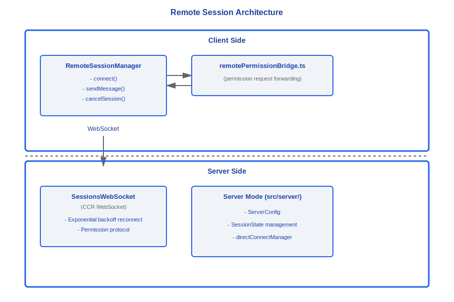
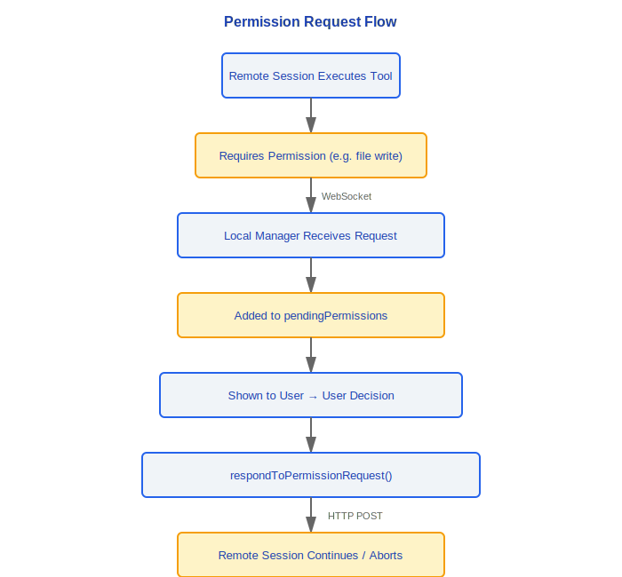
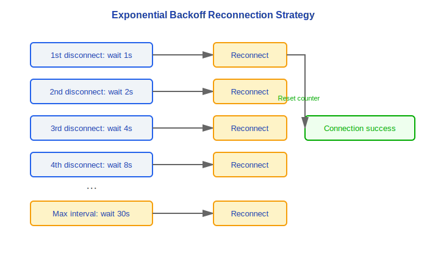
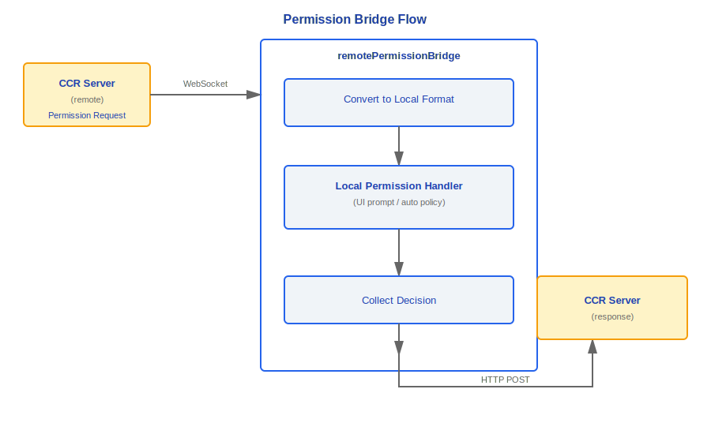
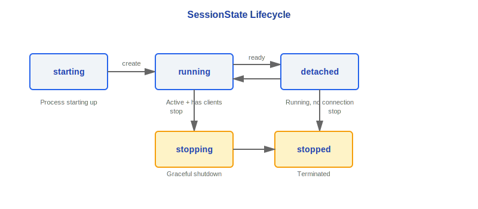

# Remote Sessions and Server Mode

> Claude Code supports remote session management and Server mode deployment. Remote sessions use WebSocket for real-time communication and permission request forwarding; Server mode allows running as a daemon to manage multiple concurrent sessions.

---

## Architecture Overview



### Design Philosophy

#### Why does CCR use WebSocket instead of HTTP polling?

Remote coding scenarios demand extremely low latency — users type commands in a local terminal and expect immediate responses from the remote agent. WebSocket's full-duplex connection delivers latency at the ~50ms level, whereas HTTP polling, even at 1-second intervals, means up to 1 second of perceived latency in the worst case. The source file `SessionsWebSocket.ts` implements a complete connection lifecycle, including exponential backoff reconnection (starting at 2s, up to 5 attempts), ping/pong heartbeat (30s interval), and differentiated handling of permanent server close codes (4003 unauthorized) versus transient close codes (4001 session not found, allowing 3 retries). These are all things that a polling model cannot handle gracefully.

#### Why a permission bridge?

Permission decisions for remote sessions **must** be confirmed by the local user — the remote agent must not be allowed to autonomously execute dangerous operations (such as file writes or command execution). The responsibility of `remotePermissionBridge.ts` is to translate permission requests from the CCR server into a format that the local permission system understands, then relay the local user's decision back. This implements a "remote execution, local authorization" security model: compute power lives in the cloud, but control always stays in the user's hands.

---

## 1. RemoteSessionManager (src/remote/)

The core manager for remote sessions, providing complete session lifecycle control.

### 1.1 Core API

```typescript
class RemoteSessionManager {
  // ─── Connection management ───
  connect(): Promise<void>
  // Establish a WebSocket connection, subscribe to session events

  disconnect(): void
  // Disconnect and clean up resources

  reconnect(): Promise<void>
  // Reconnect (automatically handles state restoration)

  isConnected(): boolean
  // Current connection state

  // ─── Message communication ───
  sendMessage(message: UserMessage): Promise<void>
  // Send a user message via HTTP POST

  // ─── Permission control ───
  respondToPermissionRequest(
    requestId: string,
    decision: PermissionDecision
  ): Promise<void>
  // Respond to a permission request from the remote session

  // ─── Session control ───
  cancelSession(): Promise<void>
  // Send an interrupt signal to cancel the ongoing operation
}
```

### 1.2 Pending Permission Request Tracking

```typescript
interface PendingPermissionRequest {
  requestId: string
  toolName: string
  params: Record<string, unknown>
  timestamp: number
}

// The manager internally maintains a queue of pending requests:
private pendingPermissions: Map<string, PendingPermissionRequest>
```

**Flow**:



---

## 2. SessionsWebSocket

WebSocket connection management based on CCR (Claude Code Remote).

### 2.1 Connection Characteristics

| Feature | Implementation |
|---------|---------------|
| Protocol | WebSocket (wss://) |
| Authentication | CCR token |
| Reconnect strategy | Exponential backoff |
| Heartbeat | Periodic ping/pong |

### 2.2 Exponential Backoff Reconnection



### 2.3 Permission Request / Response Protocol

```typescript
// Server → Client: permission request
interface PermissionRequestMessage {
  type: 'permission_request'
  requestId: string
  tool: string
  params: Record<string, unknown>
  description: string
}

// Client → Server: permission response
interface PermissionResponseMessage {
  type: 'permission_response'
  requestId: string
  decision: 'allow' | 'deny' | 'allow_always'
}
```

---

## 3. Permission Bridge (remotePermissionBridge.ts)

Bridges remote CCR permission requests to the local permission handling system.

### 3.1 Bridge Flow



### 3.2 Responsibilities

- **Forward**: Translate remote permission requests into a format the local permission system understands
- **Collect**: Wait for the local permission handler (UI prompt or automatic policy) to produce a decision
- **Reply**: Serialize the decision and send it back to the remote server

---

## 4. Server Mode (src/server/)

Server mode allows Claude Code to run as a daemon, accepting external connections via HTTP/WebSocket.

### 4.1 ServerConfig

```typescript
interface ServerConfig {
  port: number             // Listening port
  auth: AuthConfig         // Authentication configuration
  idleTimeout: number      // Idle timeout (ms); auto-stops after expiry
  maxSessions: number      // Maximum number of concurrent sessions
}
```

### 4.2 SessionState Lifecycle



| State | Description |
|-------|-------------|
| `starting` | Session process is starting up |
| `running` | Session is active with a client connected |
| `detached` | Session is running but has no client connected (background) |
| `stopping` | Graceful shutdown in progress |
| `stopped` | Session has been terminated |

### 4.3 createDirectConnectSession

```typescript
function createDirectConnectSession(
  config: SessionConfig
): ChildProcess
```

- Creates a child process via `child_process.spawn`
- Each session runs in an isolated child process
- Child processes communicate with the parent via IPC

### 4.4 directConnectManager

```typescript
const directConnectManager = {
  // Session lifecycle management
  createSession(config: SessionConfig): Promise<SessionId>
  getSession(id: SessionId): SessionInfo | null
  listSessions(): SessionInfo[]
  stopSession(id: SessionId): Promise<void>

  // Connection management
  attachClient(sessionId: SessionId, ws: WebSocket): void
  detachClient(sessionId: SessionId): void

  // Resource cleanup
  cleanup(): Promise<void>  // Stop all sessions, release ports
}
```

---

## Communication Protocol

### HTTP Endpoints (Server Mode)

| Method | Path | Description |
|--------|------|-------------|
| `POST` | `/sessions` | Create a new session |
| `GET` | `/sessions` | List all sessions |
| `GET` | `/sessions/:id` | Get session details |
| `POST` | `/sessions/:id/messages` | Send a message |
| `DELETE` | `/sessions/:id` | Stop a session |

### WebSocket Endpoint

| Path | Description |
|------|-------------|
| `/sessions/:id/ws` | Real-time event stream (assistant messages, tool calls, permission requests) |

---

## Security Considerations

| Aspect | Measure |
|--------|---------|
| Authentication | Auth token validated on every request |
| Session isolation | Each session runs in its own child process |
| Resource limits | `maxSessions` prevents resource exhaustion |
| Timeout cleanup | `idleTimeout` automatically reclaims idle sessions |
| Permission control | Remote permission requests must be confirmed locally |

---

## Engineering Practice Guide

### Setting Up a Remote Session

1. **Verify CCR service reachability**: Remote sessions depend on a CCR (Claude Code Remote) WebSocket connection; first confirm that the network can reach the CCR service endpoint (`wss://...`)
2. **Establish the WebSocket connection**: Call `RemoteSessionManager.connect()` to establish the connection and confirm that `isConnected() === true`
3. **Configure the permission bridge**: `remotePermissionBridge.ts` is responsible for forwarding remote permission requests to the local side — confirm that the bridge is correctly initialized, otherwise tool calls from the remote agent (such as file writes) will wait indefinitely for a permission response
4. **Validate the authentication token**: CCR uses a separate authentication token; confirm the token is valid and has not expired

### Debugging Connection Issues

1. **Check WebSocket state**:
   - Is the connection established? Check the return value of `isConnected()`
   - Has reconnection been triggered? Check the exponential backoff counter — starting at 1s, maximum 30s, stops after 5 consecutive failures
   - What close code was received? `4003` = unauthorized (permanent error, no reconnect); `4001` = session not found (allows 3 retries)
2. **Check heartbeat**: Confirm that the ping/pong heartbeat (30s interval) is functioning normally; a heartbeat timeout may indicate a network interruption
3. **Check the permission bridge**:
   - Are remote permission requests reaching the local side? Check whether new entries are appearing in the `pendingPermissions` Map
   - Is the local decision being sent back? Check whether `respondToPermissionRequest()` is being called
   - Is the response reaching the remote end? Check whether the HTTP POST is sent successfully

### Server Mode Deployment Steps

1. Configure `ServerConfig`: set `port`, `auth`, `idleTimeout`, and `maxSessions`
2. Start the daemon process
3. Create a session via `POST /sessions`
4. Establish a WebSocket connection via `/sessions/:id/ws` to receive the real-time event stream
5. Send user messages via `POST /sessions/:id/messages`

### Common Pitfalls

> **Remote session latency depends on network quality**: WebSocket full-duplex connection latency is approximately 50ms, but network fluctuations can increase perceived latency to the second level. On high-latency networks, users may find the agent sluggish — this is not an agent performance problem but a network transmission delay. Consider displaying a connection quality indicator in the UI.

> **Permission decisions require local user confirmation**: When the remote agent performs a dangerous operation (file write, command execution), the permission request is forwarded via WebSocket to the local side and waits for the user to confirm. If no one is attending locally, the permission request will hang indefinitely and the remote agent will block. **Unattended remote sessions require pre-configured permission rules** (such as `allow_always`) — add known-safe tool operations to the auto-approve list before starting.

> **Side effects of exponential backoff reconnection**: After a disconnection the reconnect interval grows exponentially (1s→2s→4s→8s→...→30s). If the user performs manual operations while waiting for reconnection, state inconsistency may result. The counter resets once the connection succeeds, but messages sent during reconnection are lost (they are not buffered) — ensure that important operations are sent only after the connection is confirmed.

> **Session modes must not be mixed**: A session in `detached` state can be re-`attach`ed, but do not attempt to send messages while in `stopping` state. When `idleTimeout` expires the session automatically transitions to `stopping` → `stopped`; a stopped session cannot be recovered.


---

[← Voice System](../29-语音系统/voice-system-en.md) | [Index](../README_EN.md) | [Bridge Protocol →](../31-Bridge协议/bridge-protocol-en.md)
