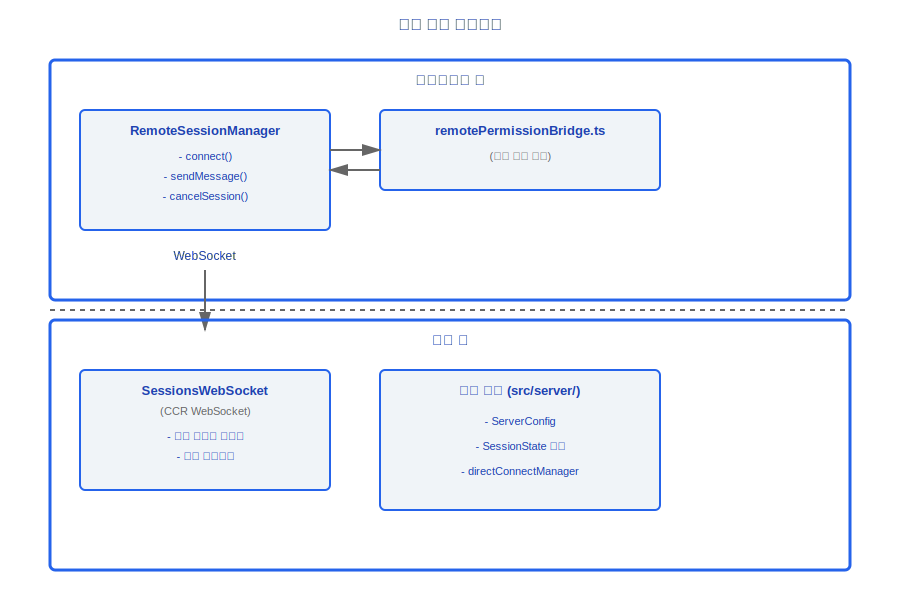
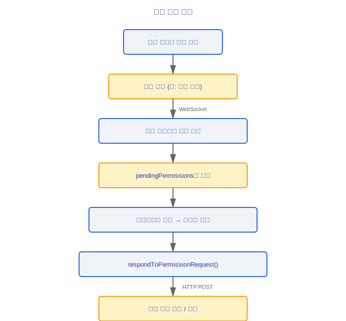
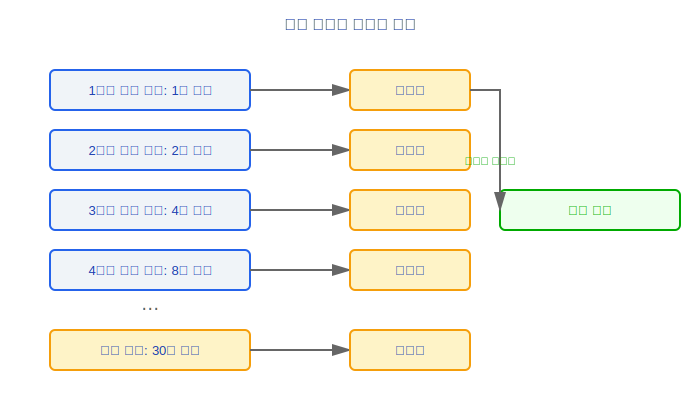
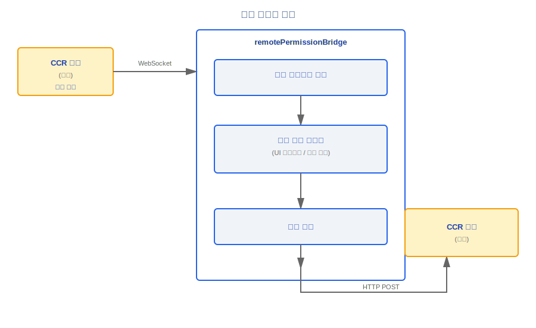
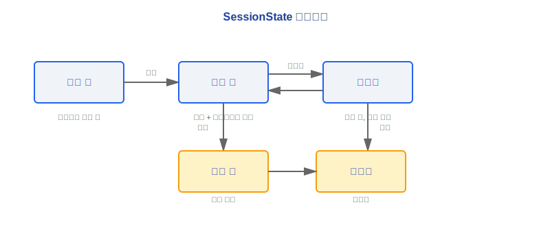

# 원격(Remote) 세션 및 서버 모드

> Claude Code는 원격(Remote) 세션 관리와 서버 모드 배포를 지원합니다. 원격 세션은 실시간 통신과 권한 요청 전달에 WebSocket을 사용하며; 서버 모드를 통해 데몬으로 실행하여 여러 동시 세션을 관리할 수 있습니다.

---

## 아키텍처 개요



### 설계 철학

#### 왜 CCR은 HTTP 폴링 대신 WebSocket을 사용하는가?

원격 코딩 시나리오는 극도로 낮은 지연을 요구합니다 — 사용자가 로컬 터미널에서 명령을 입력하면 원격 에이전트로부터 즉각적인 응답을 기대합니다. WebSocket의 전이중(full-duplex) 연결은 ~50ms 수준의 지연을 제공하지만, HTTP 폴링은 1초 간격이더라도 최악의 경우 최대 1초의 체감 지연이 발생합니다. 소스 파일 `SessionsWebSocket.ts`는 완전한 연결 생명주기를 구현합니다. 여기에는 지수 백오프(exponential backoff) 재연결(2s에서 시작, 최대 5회 시도), 핑/퐁(ping/pong) 하트비트(30s 간격), 영구 서버 종료 코드(4003 인증되지 않음)와 일시적 종료 코드(4001 세션을 찾을 수 없음, 3회 재시도 허용)의 차별화된 처리가 포함됩니다. 이 모든 것은 폴링 모델로는 우아하게 처리할 수 없습니다.

#### 왜 권한 브릿지(Permission Bridge)인가?

원격 세션의 권한 결정은 **반드시** 로컬 사용자에 의해 확인되어야 합니다 — 원격 에이전트가 위험한 작업(파일 쓰기 또는 명령 실행 등)을 자율적으로 실행하는 것을 허용해서는 안 됩니다. `remotePermissionBridge.ts`의 역할은 CCR 서버로부터의 권한 요청을 로컬 권한 시스템이 이해하는 형식으로 변환하고, 로컬 사용자의 결정을 다시 전달하는 것입니다. 이는 "원격 실행, 로컬 인증"의 보안 모델을 구현합니다: 컴퓨팅 파워는 클라우드에 있지만, 제어는 항상 사용자의 손에 있습니다.

---

## 1. RemoteSessionManager (src/remote/)

원격 세션의 핵심 관리자로, 완전한 세션 생명주기 제어를 제공합니다.

### 1.1 핵심 API

```typescript
class RemoteSessionManager {
  // ─── 연결 관리 ───
  connect(): Promise<void>
  // WebSocket 연결 수립, 세션 이벤트 구독

  disconnect(): void
  // 연결 해제 및 리소스 정리

  reconnect(): Promise<void>
  // 재연결 (자동으로 상태 복원 처리)

  isConnected(): boolean
  // 현재 연결 상태

  // ─── 메시지 통신 ───
  sendMessage(message: UserMessage): Promise<void>
  // HTTP POST를 통해 사용자 메시지 전송

  // ─── 권한 제어 ───
  respondToPermissionRequest(
    requestId: string,
    decision: PermissionDecision
  ): Promise<void>
  // 원격 세션으로부터의 권한 요청에 응답

  // ─── 세션 제어 ───
  cancelSession(): Promise<void>
  // 진행 중인 작업을 취소하기 위한 인터럽트 신호 전송
}
```

### 1.2 대기 중인 권한 요청 추적

```typescript
interface PendingPermissionRequest {
  requestId: string
  toolName: string
  params: Record<string, unknown>
  timestamp: number
}

// 관리자는 내부적으로 대기 중인 요청 큐를 유지합니다:
private pendingPermissions: Map<string, PendingPermissionRequest>
```

**흐름**:



---

## 2. SessionsWebSocket

CCR (Claude Code Remote) 기반의 WebSocket 연결 관리.

### 2.1 연결 특성

| 특성 | 구현 |
|------|------|
| 프로토콜 | WebSocket (wss://) |
| 인증 | CCR 토큰 |
| 재연결 전략 | 지수 백오프(Exponential Backoff) |
| 하트비트 | 주기적 핑/퐁(Ping/Pong) |

### 2.2 지수 백오프(Exponential Backoff) 재연결



### 2.3 권한 요청/응답 프로토콜

```typescript
// 서버 → 클라이언트: 권한 요청
interface PermissionRequestMessage {
  type: 'permission_request'
  requestId: string
  tool: string
  params: Record<string, unknown>
  description: string
}

// 클라이언트 → 서버: 권한 응답
interface PermissionResponseMessage {
  type: 'permission_response'
  requestId: string
  decision: 'allow' | 'deny' | 'allow_always'
}
```

---

## 3. 권한 브릿지(Permission Bridge) (remotePermissionBridge.ts)

원격 CCR 권한 요청을 로컬 권한 처리 시스템에 연결합니다.

### 3.1 브릿지 흐름



### 3.2 역할

- **전달**: 원격 권한 요청을 로컬 권한 시스템이 이해하는 형식으로 변환합니다
- **수집**: 로컬 권한 핸들러(UI 프롬프트 또는 자동 정책)가 결정을 내릴 때까지 대기합니다
- **응답**: 결정을 직렬화하여 원격 서버로 다시 전송합니다

---

## 4. 서버 모드 (src/server/)

서버 모드는 Claude Code가 데몬으로 실행되어 HTTP/WebSocket을 통해 외부 연결을 수락할 수 있게 합니다.

### 4.1 ServerConfig

```typescript
interface ServerConfig {
  port: number             // 수신 포트
  auth: AuthConfig         // 인증 설정
  idleTimeout: number      // 유휴 타임아웃 (ms); 만료 후 자동 중지
  maxSessions: number      // 최대 동시 세션 수
}
```

### 4.2 SessionState 생명주기



| 상태 | 설명 |
|------|------|
| `starting` | 세션 프로세스가 시작 중 |
| `running` | 세션이 활성 상태이며 클라이언트가 연결됨 |
| `detached` | 세션이 실행 중이지만 연결된 클라이언트 없음 (백그라운드) |
| `stopping` | 정상 종료 진행 중 |
| `stopped` | 세션이 종료됨 |

### 4.3 createDirectConnectSession

```typescript
function createDirectConnectSession(
  config: SessionConfig
): ChildProcess
```

- `child_process.spawn`을 통해 자식 프로세스를 생성합니다
- 각 세션은 격리된 자식 프로세스에서 실행됩니다
- 자식 프로세스는 IPC를 통해 부모와 통신합니다

### 4.4 directConnectManager

```typescript
const directConnectManager = {
  // 세션 생명주기 관리
  createSession(config: SessionConfig): Promise<SessionId>
  getSession(id: SessionId): SessionInfo | null
  listSessions(): SessionInfo[]
  stopSession(id: SessionId): Promise<void>

  // 연결 관리
  attachClient(sessionId: SessionId, ws: WebSocket): void
  detachClient(sessionId: SessionId): void

  // 리소스 정리
  cleanup(): Promise<void>  // 모든 세션 중지, 포트 해제
}
```

---

## 통신 프로토콜

### HTTP 엔드포인트 (서버 모드)

| 메서드 | 경로 | 설명 |
|-------|------|------|
| `POST` | `/sessions` | 새 세션 생성 |
| `GET` | `/sessions` | 모든 세션 목록 |
| `GET` | `/sessions/:id` | 세션 상세 정보 |
| `POST` | `/sessions/:id/messages` | 메시지 전송 |
| `DELETE` | `/sessions/:id` | 세션 중지 |

### WebSocket 엔드포인트

| 경로 | 설명 |
|------|------|
| `/sessions/:id/ws` | 실시간 이벤트 스트림 (어시스턴트 메시지, 도구 호출, 권한 요청) |

---

## 보안 고려사항

| 측면 | 조치 |
|------|------|
| 인증 | 모든 요청에서 인증 토큰 검증 |
| 세션 격리 | 각 세션은 자체 자식 프로세스에서 실행 |
| 리소스 제한 | `maxSessions`으로 리소스 소진 방지 |
| 타임아웃 정리 | `idleTimeout`으로 유휴 세션 자동 회수 |
| 권한 제어 | 원격 권한 요청은 로컬에서 확인해야 함 |

---

## 엔지니어링 실천 가이드

### 원격 세션 설정

1. **CCR 서비스 접근성 확인**: 원격 세션은 CCR (Claude Code Remote) WebSocket 연결에 의존합니다; 먼저 네트워크가 CCR 서비스 엔드포인트(`wss://...`)에 접근할 수 있는지 확인합니다
2. **WebSocket 연결 수립**: `RemoteSessionManager.connect()`를 호출하여 연결을 수립하고 `isConnected() === true`인지 확인합니다
3. **권한 브릿지(Permission Bridge) 설정**: `remotePermissionBridge.ts`는 원격 권한 요청을 로컬 측으로 전달하는 역할을 합니다 — 브릿지가 올바르게 초기화되었는지 확인하세요. 그렇지 않으면 원격 에이전트의 도구 호출(예: 파일 쓰기)이 권한 응답을 기다리며 무한정 대기합니다
4. **인증 토큰 검증**: CCR은 별도의 인증 토큰을 사용합니다; 토큰이 유효하고 만료되지 않았는지 확인합니다

### 연결 문제 디버깅

1. **WebSocket 상태 확인**:
   - 연결이 수립되었나요? `isConnected()`의 반환값 확인
   - 재연결이 트리거되었나요? 지수 백오프 카운터 확인 — 1s에서 시작, 최대 30s, 5번 연속 실패 후 중지
   - 어떤 종료 코드를 받았나요? `4003` = 인증되지 않음 (영구적 오류, 재연결 안 함); `4001` = 세션을 찾을 수 없음 (3회 재시도 허용)
2. **하트비트 확인**: 핑/퐁(ping/pong) 하트비트(30s 간격)가 정상적으로 작동하는지 확인하세요; 하트비트 타임아웃은 네트워크 중단을 나타낼 수 있습니다
3. **권한 브릿지(Permission Bridge) 확인**:
   - 원격 권한 요청이 로컬 측에 도달하고 있나요? `pendingPermissions` Map에 새 항목이 나타나는지 확인
   - 로컬 결정이 다시 전송되고 있나요? `respondToPermissionRequest()`가 호출되고 있는지 확인
   - 응답이 원격 측에 도달하고 있나요? HTTP POST가 성공적으로 전송되는지 확인

### 서버 모드 배포 단계

1. `ServerConfig` 설정: `port`, `auth`, `idleTimeout`, `maxSessions` 설정
2. 데몬 프로세스 시작
3. `POST /sessions`를 통해 세션 생성
4. `/sessions/:id/ws`를 통해 WebSocket 연결을 수립하여 실시간 이벤트 스트림 수신
5. `POST /sessions/:id/messages`를 통해 사용자 메시지 전송

### 흔한 함정

> **원격 세션 지연은 네트워크 품질에 의존합니다**: WebSocket 전이중 연결 지연은 약 50ms이지만, 네트워크 변동으로 체감 지연이 초 단위로 증가할 수 있습니다. 고지연 네트워크에서는 사용자가 에이전트가 느리다고 느낄 수 있습니다 — 이는 에이전트 성능 문제가 아니라 네트워크 전송 지연입니다. UI에 연결 품질 표시기를 표시하는 것을 고려하세요.

> **권한 결정은 로컬 사용자 확인이 필요합니다**: 원격 에이전트가 위험한 작업(파일 쓰기, 명령 실행)을 수행할 때, 권한 요청은 WebSocket을 통해 로컬 측으로 전달되어 사용자 확인을 기다립니다. 로컬에서 아무도 대기 중이 아니라면, 권한 요청은 무한정 대기하고 원격 에이전트는 차단됩니다. **무인 원격 세션에는 사전 설정된 권한 규칙이 필요합니다** (예: `allow_always`) — 시작 전에 알려진 안전한 도구 작업을 자동 승인 목록에 추가하세요.

> **지수 백오프 재연결의 부작용**: 연결 해제 후 재연결 간격이 지수적으로 증가합니다 (1s→2s→4s→8s→...→30s). 재연결을 기다리는 동안 사용자가 수동 작업을 수행하면 상태 불일치가 발생할 수 있습니다. 카운터는 연결에 성공하면 초기화되지만, 재연결 중에 전송된 메시지는 손실됩니다 (버퍼링되지 않음) — 연결이 확인된 후에만 중요한 작업을 전송하세요.

> **세션 모드를 혼용하면 안 됩니다**: `detached` 상태의 세션은 다시 `attach`할 수 있지만, `stopping` 상태에서 메시지를 전송하려고 시도하지 마세요. `idleTimeout`이 만료되면 세션이 자동으로 `stopping` → `stopped`로 전환됩니다; 중지된 세션은 복구할 수 없습니다.


---

[← 음성 시스템](../29-语音系统/voice-system-ko.md) | [목차](../README_KO.md) | [브릿지 프로토콜 →](../31-Bridge协议/bridge-protocol-ko.md)
