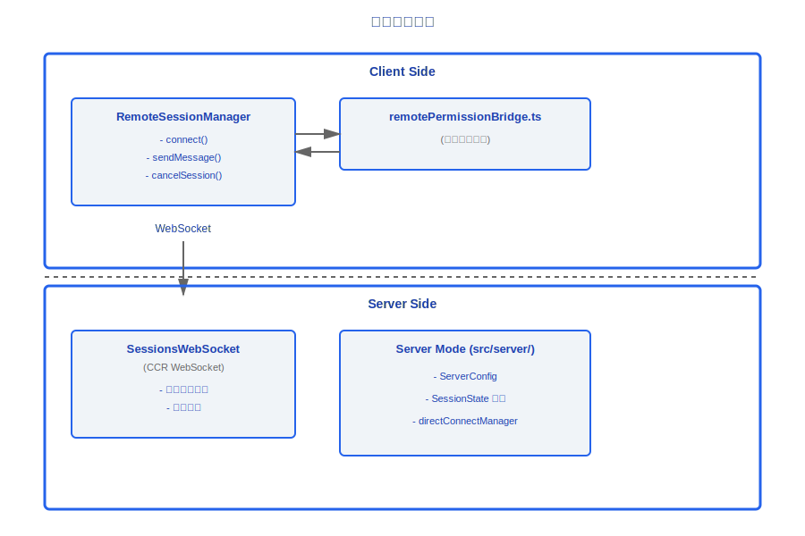
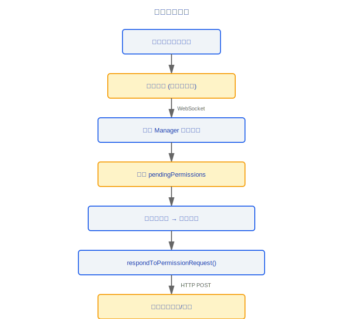
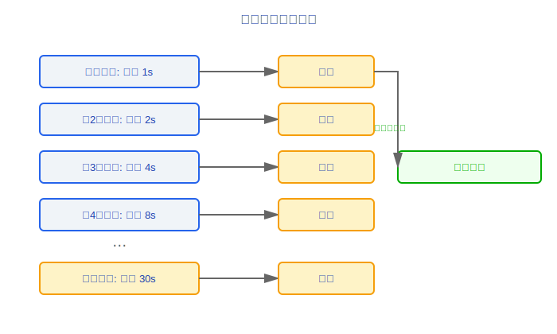
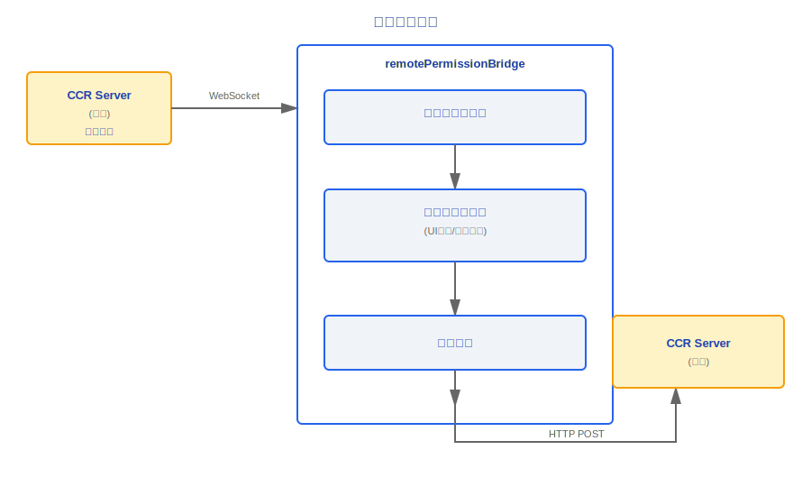
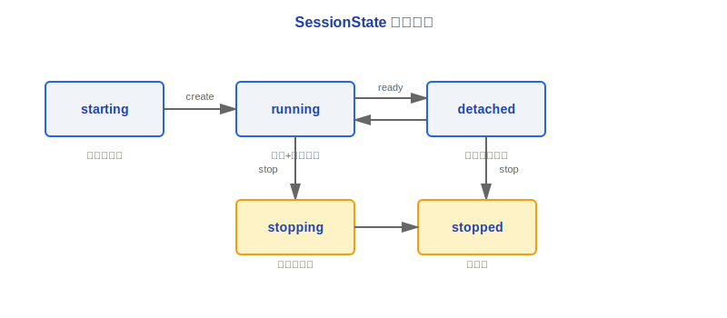

# 远程会话与 Server 模式

> Claude Code 支持远程会话管理和 Server 模式部署。远程会话通过 WebSocket 实现实时通信和权限请求转发;Server 模式允许以守护进程运行,管理多个并发会话。

---

## 架构总览



### 设计理念

#### 为什么 CCR 用 WebSocket 而不是 HTTP polling?

远程编码场景对实时性要求极高——用户在本地终端敲命令,期望看到远程 agent 的即时响应。WebSocket 的全双工连接延迟在 ~50ms 级别,而 HTTP polling 即使间隔 1 秒也意味着最坏情况下 1 秒的感知延迟。源码 `SessionsWebSocket.ts` 实现了完整的连接生命周期管理,包括指数退避重连 (从 2s 到最大 5 次尝试)、ping/pong 心跳 (30s 间隔)、以及对服务端永久关闭码 (4003 unauthorized) 和瞬态关闭码 (4001 session not found,允许 3 次重试) 的区分处理。这些都是 polling 模型难以优雅实现的。

#### 为什么权限桥接?

远程 session 的权限决策**必须**由本地用户确认——不能让远程 agent 自主执行危险操作 (如文件写入、命令执行)。`remotePermissionBridge.ts` 的职责是将 CCR 服务端的权限请求转换为本地权限系统可理解的格式,经本地用户决策后回传。这实现了"远程执行、本地授权"的安全模型:算力在云端,但控制权始终在用户手中。

---

## 1. RemoteSessionManager (src/remote/)

远程会话的核心管理器,提供完整的会话生命周期控制。

### 1.1 核心 API

```typescript
class RemoteSessionManager {
  // ─── 连接管理 ───
  connect(): Promise<void>
  // 建立 WebSocket 连接, 订阅会话事件

  disconnect(): void
  // 断开连接, 清理资源

  reconnect(): Promise<void>
  // 重新连接 (自动处理状态恢复)

  isConnected(): boolean
  // 当前连接状态

  // ─── 消息通信 ───
  sendMessage(message: UserMessage): Promise<void>
  // HTTP POST 发送用户消息

  // ─── 权限控制 ───
  respondToPermissionRequest(
    requestId: string,
    decision: PermissionDecision
  ): Promise<void>
  // 响应远程会话的权限请求

  // ─── 会话控制 ───
  cancelSession(): Promise<void>
  // 发送中断信号, 取消正在执行的操作
}
```

### 1.2 待处理权限请求跟踪

```typescript
interface PendingPermissionRequest {
  requestId: string
  toolName: string
  params: Record<string, unknown>
  timestamp: number
}

// Manager 内部维护待处理请求队列:
private pendingPermissions: Map<string, PendingPermissionRequest>
```

**流程**:



---

## 2. SessionsWebSocket

基于 CCR (Claude Code Remote) 的 WebSocket 连接管理。

### 2.1 连接特性

| 特性 | 实现 |
|------|------|
| 协议 | WebSocket (wss://) |
| 认证 | CCR 令牌 |
| 重连策略 | 指数退避 (exponential backoff) |
| 心跳 | 定期 ping/pong |

### 2.2 指数退避重连



### 2.3 权限请求/响应协议

```typescript
// 服务端 → 客户端: 权限请求
interface PermissionRequestMessage {
  type: 'permission_request'
  requestId: string
  tool: string
  params: Record<string, unknown>
  description: string
}

// 客户端 → 服务端: 权限响应
interface PermissionResponseMessage {
  type: 'permission_response'
  requestId: string
  decision: 'allow' | 'deny' | 'allow_always'
}
```

---

## 3. 权限桥接 (remotePermissionBridge.ts)

将远程 CCR 权限请求桥接到本地权限处理系统。

### 3.1 桥接流程



### 3.2 职责

- **转发**: 将远程权限请求转换为本地权限系统可理解的格式
- **收集**: 等待本地权限处理器 (UI 提示或自动策略) 产生决策
- **回传**: 将决策序列化并发送回远程服务端

---

## 4. Server 模式 (src/server/)

Server 模式允许 Claude Code 作为守护进程运行,通过 HTTP/WebSocket 接受外部连接。

### 4.1 ServerConfig

```typescript
interface ServerConfig {
  port: number             // 监听端口
  auth: AuthConfig         // 认证配置
  idleTimeout: number      // 空闲超时 (ms), 超时后自动停止
  maxSessions: number      // 最大并发会话数
}
```

### 4.2 SessionState 生命周期



| 状态 | 说明 |
|------|------|
| `starting` | 会话进程正在启动 |
| `running` | 会话活跃,有客户端连接 |
| `detached` | 会话运行中但无客户端连接 (后台) |
| `stopping` | 正在优雅关闭 |
| `stopped` | 会话已终止 |

### 4.3 createDirectConnectSession

```typescript
function createDirectConnectSession(
  config: SessionConfig
): ChildProcess
```

- 通过 `child_process.spawn` 创建子进程
- 每个会话运行在独立的子进程中
- 子进程与父进程通过 IPC 通信

### 4.4 directConnectManager

```typescript
const directConnectManager = {
  // 会话生命周期管理
  createSession(config: SessionConfig): Promise<SessionId>
  getSession(id: SessionId): SessionInfo | null
  listSessions(): SessionInfo[]
  stopSession(id: SessionId): Promise<void>

  // 连接管理
  attachClient(sessionId: SessionId, ws: WebSocket): void
  detachClient(sessionId: SessionId): void

  // 资源清理
  cleanup(): Promise<void>  // 停止所有会话, 释放端口
}
```

---

## 通信协议

### HTTP 端点 (Server 模式)

| 方法 | 路径 | 说明 |
|------|------|------|
| `POST` | `/sessions` | 创建新会话 |
| `GET` | `/sessions` | 列出所有会话 |
| `GET` | `/sessions/:id` | 获取会话详情 |
| `POST` | `/sessions/:id/messages` | 发送消息 |
| `DELETE` | `/sessions/:id` | 停止会话 |

### WebSocket 端点

| 路径 | 说明 |
|------|------|
| `/sessions/:id/ws` | 实时事件流 (assistant 消息、工具调用、权限请求) |

---

## 安全考虑

| 方面 | 措施 |
|------|------|
| 认证 | 每个请求验证 auth token |
| 会话隔离 | 每个会话独立子进程 |
| 资源限制 | `maxSessions` 防止资源耗尽 |
| 超时清理 | `idleTimeout` 自动回收空闲会话 |
| 权限控制 | 远程权限请求必须经本地确认 |

---

## 工程实践指南

### 设置远程会话

1. **确认 CCR 服务可达**: 远程会话依赖 CCR (Claude Code Remote) WebSocket 连接,首先确认网络可以访问 CCR 服务端点 (`wss://...`)
2. **建立 WebSocket 连接**: 调用 `RemoteSessionManager.connect()` 建立连接,确认返回 `isConnected() === true`
3. **配置权限桥接**: `remotePermissionBridge.ts` 负责将远程权限请求转发到本地——确认桥接已正确初始化,否则远程 agent 的工具调用 (如文件写入) 将永远等待权限响应
4. **验证认证令牌**: CCR 使用独立的认证令牌,确认令牌有效且未过期

### 调试连接问题

1. **检查 WebSocket 状态**:
   - 连接是否建立? 检查 `isConnected()` 返回值
   - 是否触发了重连? 检查指数退避计数器——从 1s 开始,最大 30s,连续 5 次后停止
   - 收到的关闭码是什么? `4003` = 未授权 (永久错误,不重连); `4001` = 会话未找到 (允许 3 次重试)
2. **检查心跳**: 确认 ping/pong 心跳 (30s 间隔) 正常,如果心跳超时可能是网络中断
3. **检查权限桥接**:
   - 远程权限请求是否到达本地? 检查 `pendingPermissions` Map 是否有新增条目
   - 本地决策是否回传? 检查 `respondToPermissionRequest()` 是否被调用
   - 响应是否到达远程端? 检查 HTTP POST 是否成功发送

### Server 模式部署步骤

1. 配置 `ServerConfig`: 设置 `port`、`auth`、`idleTimeout`、`maxSessions`
2. 启动守护进程
3. 通过 `POST /sessions` 创建会话
4. 通过 `/sessions/:id/ws` 建立 WebSocket 获取实时事件流
5. 通过 `POST /sessions/:id/messages` 发送用户消息

### 常见陷阱

> **远程会话延迟取决于网络质量**: WebSocket 全双工连接延迟约 50ms,但网络波动可能导致感知延迟增加到秒级。在高延迟网络下,用户可能觉得 agent 响应迟钝——这不是 agent 性能问题,而是网络传输延迟。考虑在 UI 中显示连接质量指标。

> **权限决策需要本地用户确认**: 远程 agent 执行危险操作 (文件写入、命令执行) 时,权限请求会通过 WebSocket 转发到本地等待用户确认。如果本地无人值守,权限请求会一直挂起,远程 agent 将阻塞。**无人值守远程会话需要预配置权限规则** (如 `allow_always`)——在启动前将已知安全的工具操作添加到自动批准列表。

> **指数退避重连的副作用**: 断连后重连间隔指数增长 (1s→2s→4s→8s→...→30s),如果用户在等待重连时手动操作可能导致状态不一致。连接成功后计数器会重置,但在重连期间发送的消息会丢失 (不会缓冲)——确保重要操作在连接确认后再发送。

> **会话模式不可混用**: `detached` 状态的会话可以被重新 `attach`,但不要在 `stopping` 状态尝试发送消息。`idleTimeout` 到期后会话自动进入 `stopping` → `stopped`,已停止的会话不可恢复。


---

[← 语音系统](../29-语音系统/voice-system.md) | [目录](../README.md) | [Bridge 协议 →](../31-Bridge协议/bridge-protocol.md)
