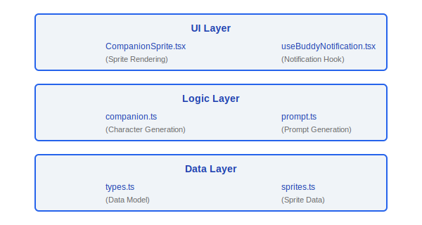
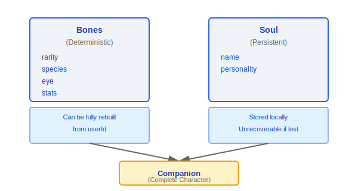
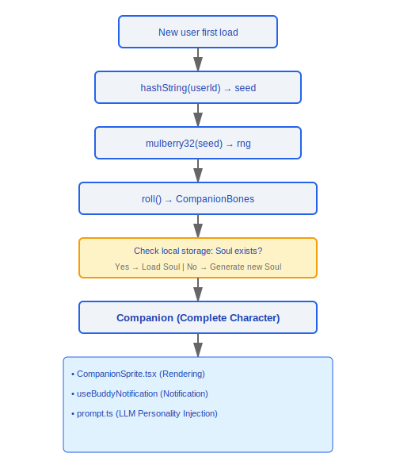

# Buddy Companion System

> Claude Code includes a fun virtual companion (Buddy) system. Each user deterministically generates a unique companion character based on their userId, with varying rarity, species, appearance, and personality.

---

## Architecture Overview



### Design Philosophy

#### Why Separate Bones from Soul?

This is a "rebuildable vs. non-rebuildable" data classification. The source code comments explain the motivation directly: "Bones are regenerated from hash(userId) on every read so species renames don't break stored companions and users can't edit their way to a legendary". Bones (appearance/rarity/stats) are deterministically generated from the userId hash and can be fully reconstructed even if storage is lost. Soul (name/personality) is AI-generated and cannot be recovered if lost — it must be persisted. This separation provides three benefits: resilience to storage corruption (at worst only the name is lost), prevention of users manually editing config files to obtain rare companions, and support for future species renaming without breaking existing characters.

#### Why Deterministic PRNG (Mulberry32)?

Source code comment: "Mulberry32 -- tiny seeded PRNG, good enough for picking ducks". The same user always gets the same companion — this creates a sense of "ownership". If a different character were generated each login, users would form no emotional connection. Mulberry32 was chosen because it is compact enough (a few lines of code), sufficiently uniform, and fully deterministic, with no dependency on external state.

#### Why is the Rarity Distribution 1/4/10/25/60?

The source `types.ts` defines `RARITY_WEIGHTS = { common: 60, uncommon: 25, rare: 10, epic: 4, legendary: 1 }`. This is game design psychology — rarity creates anticipation and surprise. The 1% probability for legendary makes it truly "precious", while the 60% common rate ensures most users have a reasonable experience. Additionally, different rarities correspond to different stat floors (`RARITY_FLOOR`), with legendary having a floor of 50 vs. common's floor of 5, making rarity not just a visual difference but a meaningful stat advantage.

---

## 1. Character Generation (companion.ts)

### 1.1 Deterministic Random Number Generation

```typescript
function mulberry32(seed: number): () => number
// Mulberry32 algorithm: seeded PRNG (pseudo-random number generator)
// The same seed always produces the same random sequence
// Purpose: ensures the same user always gets the same companion

function hashString(str: string): number
// Converts a string (e.g. userId) to a 32-bit integer hash
// Used as the seed for mulberry32
```

### 1.2 Character Generation

```typescript
function roll(userId: string): CompanionBones {
  const seed = hashString(userId)
  const rng = mulberry32(seed)

  return {
    rarity:  pickWeighted(rng(), RARITY_WEIGHTS),
    species: pickWeighted(rng(), SPECIES_WEIGHTS),
    eye:     pickRandom(rng(), EYES),
    hat:     pickRandom(rng(), HATS),
    stats:   rollStats(rng, /* based on rarity */),
  }
}
```

**Key property**: Fully deterministic — the same `userId` always generates the same `CompanionBones`.

### 1.3 Companion Loading

```typescript
function getCompanion(userId: string): Companion {
  // 1. Generate Bones from roll() (deterministic, rebuildable)
  const bones = roll(userId)

  // 2. Load Soul (name + personality) from persistent storage
  //    If it doesn't exist, generate a new Soul
  const soul = loadOrCreateSoul(userId, bones)

  // 3. Combine into a complete Companion
  return { ...bones, ...soul }
}
```

**"Regenerating bones"**: Even if storage data is lost, `bones` can be fully reconstructed from `userId`. Only the `soul` (name/personality) needs to be persisted.

---

## 2. Data Models (types.ts)

### 2.1 Enum Types

| Type | Values | Description |
|------|--------|-------------|
| **Rarity** | `common`, `uncommon`, `rare`, `epic`, `legendary` | Rarity tier, affects stat ranges |
| **Species** | `cat`, `dog`, `fox`, `owl`, `dragon`, `penguin`, ... | Species type |
| **Eye** | `normal`, `sleepy`, `star`, `heart`, `spiral`, ... | Eye style |
| **Hat** | `none`, `tophat`, `crown`, `wizard`, `beret`, ... | Hat decoration |
| **StatName** | `vitality`, `charm`, `wit`, `grit`, `spark` | Stat names |

### 2.2 Core Data Structures

```typescript
// ─── CompanionBones (deterministic, rebuildable from userId) ───
interface CompanionBones {
  rarity: Rarity
  species: Species
  eye: Eye
  hat: Hat
  stats: Record<StatName, number>
}

// ─── CompanionSoul (must be persisted, not rebuildable) ───
interface CompanionSoul {
  name: string          // The companion's name (assigned by user/AI)
  personality: string   // Personality description
}

// ─── Companion (complete, runtime) ───
interface Companion extends CompanionBones, CompanionSoul {
  // combination of bones + soul
}

// ─── StoredCompanion (persistence format) ───
interface StoredCompanion {
  userId: string
  soul: CompanionSoul
  createdAt: number
  lastSeenAt: number
}
```

### 2.3 Bones vs Soul Design



---

## 3. UI Components

### 3.1 CompanionSprite.tsx

```typescript
function CompanionSprite({
  companion,
  size,
  animated
}: CompanionSpriteProps): JSX.Element
```

- Renders sprite based on `species` + `eye` + `hat` combination
- Supports animation effects (idle, walking, interaction)
- Configurable size

### 3.2 useBuddyNotification.tsx

```typescript
function useBuddyNotification(): {
  showNotification: (message: string) => void
  notification: string | null
}
```

- Companion speech bubble notification hook
- Used to display companion "dialogue" or "reactions"
- Auto-dismiss timer

### 3.3 prompt.ts

```typescript
function generateCompanionPrompt(companion: Companion): string
// Generates prompt text based on the companion's attributes
// Used to inject the companion's "personality" into LLM interactions
```

### 3.4 sprites.ts

```typescript
// Sprite image data definitions
const SPRITES: Record<Species, SpriteData> = {
  cat: { frames: [...], hitbox: {...} },
  dog: { frames: [...], hitbox: {...} },
  // ...
}
```

- Stores sprite frame data for all species
- Contains animation frame sequences and hitboxes

---

## Rarity Distribution

```
Rarity        Probability   Stat Range    Visual Feature
──────────────────────────────────────────────────────
legendary     ~1%           90-100        Special particle effects
epic          ~5%           75-95         Glowing border
rare          ~15%          60-85         Unique color scheme
uncommon      ~30%          40-70         Extra decorations
common        ~49%          20-55         Base appearance
```

---

## Lifecycle Flow



---

## Engineering Practice Guide

### Viewing Companion Information

1. **Deterministic generation**: Call `getCompanion(userId)` to retrieve the complete companion — the same `userId` always returns the same companion
2. **Viewing Bones**: `roll(userId)` returns `CompanionBones` (rarity/species/eye/hat/stats), fully determined by the `userId` hash
3. **Viewing Soul**: Read the `StoredCompanion` data from local persistent storage, which contains `name` and `personality`

### Debugging Companion Generation

1. **Check hashString output**: Verify that `hashString(userId)` always returns the same 32-bit integer seed for the same userId
2. **Check mulberry32 sequence**: Initialize `mulberry32(seed)` with the same seed and verify that the sequence of `rng()` calls is consistent — the call order must be strictly consistent (rarity first, then species, then eye, then hat, then stats)
3. **Check roll results**: Confirm that `pickWeighted(rng(), RARITY_WEIGHTS)` correctly reflects the weight distribution (`common:60, uncommon:25, rare:10, epic:4, legendary:1`)
4. **Check Soul data in local storage**: The `StoredCompanion` structure contains `userId`, `soul` (name + personality), `createdAt`, and `lastSeenAt` — if Soul data is missing, the system will trigger AI generation of a new name and personality

### Customizing Companion Names

- The `name` field in `CompanionSoul` can be renamed via AI
- The modified name is stored in the `soul` of `StoredCompanion`
- **Note**: Bones (appearance/rarity/stats) cannot be customized — they are entirely determined by the `userId` hash, and manually editing the storage file will not change Bones (because they are regenerated from userId on every load)

### Common Pitfalls

> **Bones can be rebuilt but Soul loss is unrecoverable**: Bones are deterministically generated from `hash(userId)` and can be fully reconstructed even if storage is corrupted. However, Soul (name and personality) is one-time AI-generated data — if lost, the original name cannot be recovered, and the system will generate a completely new name. **It is recommended to back up `StoredCompanion` data**, especially when users have an emotional connection to their companion's name.

> **Do not manually edit Bones to obtain a rare companion**: The source code is explicitly designed to prevent this — Bones are regenerated from userId every time `getCompanion()` is called, overwriting any manual modifications. If you change the rarity in the storage file to `legendary`, it will be recalculated back to the original value on the next load.

> **rng call order is sensitive**: `mulberry32` is a sequential PRNG — the same seed produces a fixed sequence. If the order of `rng()` calls in `roll()` is changed (e.g., rolling species before rarity), all users' companions will change. When adding new random attributes, they must be appended to the **end** of the existing call chain — never inserted in the middle.


---

[← Bridge Protocol](../31-Bridge协议/bridge-protocol-en.md) | [Index](../README_EN.md) | [Coordinator Pattern →](../33-协调器模式/coordinator-mode-en.md)
