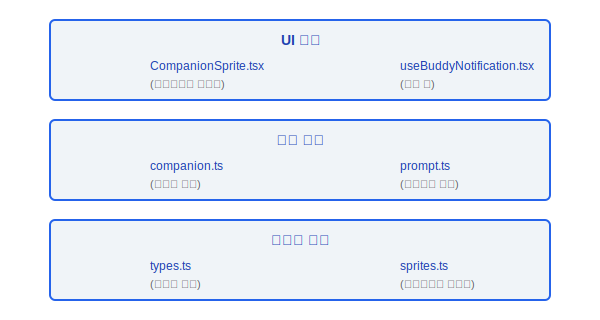
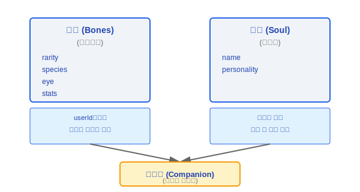
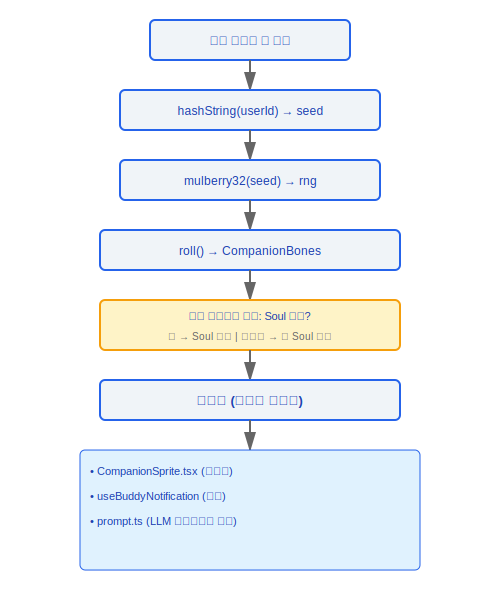

# 버디 시스템(Buddy System) — 가상 동반자

> Claude Code에는 재미있는 가상 동반자(Buddy) 시스템이 포함되어 있습니다. 각 사용자는 userId를 기반으로 결정론적으로 희귀도, 종, 외모, 성격이 다른 고유한 동반자 캐릭터를 생성합니다.

---

## 아키텍처 개요



### 설계 철학

#### 왜 뼈대(Bones)와 영혼(Soul)을 분리하는가?

이는 "재구축 가능 vs 재구축 불가능" 데이터 분류입니다. 소스 코드 주석은 동기를 직접 설명합니다: "뼈대(Bones)는 매번 읽을 때 hash(userId)로 재생성되므로 종 이름 변경 시 저장된 동반자가 깨지지 않고 사용자가 편집을 통해 전설(legendary)을 얻을 수 없습니다". 뼈대(외모/희귀도/스탯)는 userId 해시에서 결정론적으로 생성되며 저장소가 손실되더라도 완전히 재구성할 수 있습니다. 영혼(이름/성격)은 AI가 생성하며 손실되면 복구할 수 없습니다 — 반드시 지속되어야 합니다. 이 분리는 세 가지 이점을 제공합니다: 저장소 손상에 대한 복원력 (최악의 경우 이름만 손실됨), 사용자가 설정 파일을 수동으로 편집하여 희귀한 동반자를 얻는 것 방지, 기존 캐릭터를 깨지 않고 미래의 종 이름 변경 지원.

#### 왜 결정론적 PRNG (Mulberry32)인가?

소스 코드 주석: "Mulberry32 -- 오리를 고르기에 충분한 작은 시드 PRNG". 동일한 사용자는 항상 동일한 동반자를 얻습니다 — 이는 "소유감"을 만들어냅니다. 로그인할 때마다 다른 캐릭터가 생성된다면 사용자는 감정적 연결을 형성하지 못할 것입니다. Mulberry32는 코드가 간결하고 (몇 줄), 충분히 균일하며, 완전히 결정론적이고, 외부 상태에 대한 의존성이 없어 선택되었습니다.

#### 왜 희귀도 분포가 1/4/10/25/60인가?

소스 `types.ts`는 `RARITY_WEIGHTS = { common: 60, uncommon: 25, rare: 10, epic: 4, legendary: 1 }`을 정의합니다. 이것은 게임 설계 심리학입니다 — 희귀도는 기대감과 놀라움을 만들어냅니다. 전설의 1% 확률은 그것을 진정으로 "귀중하게" 만들고, 60%의 일반 비율은 대부분의 사용자가 합리적인 경험을 할 수 있도록 보장합니다. 또한 다른 희귀도는 다른 스탯 하한값(`RARITY_FLOOR`)에 해당하며, 전설은 하한값이 50인 반면 일반은 5로, 희귀도가 단순한 시각적 차이가 아닌 의미 있는 스탯 이점입니다.

---

## 1. 캐릭터 생성 (companion.ts)

### 1.1 결정론적 난수 생성

```typescript
function mulberry32(seed: number): () => number
// Mulberry32 알고리즘: 시드 PRNG (의사 난수 생성기)
// 동일한 시드는 항상 동일한 난수 시퀀스를 생성합니다
// 목적: 동일한 사용자가 항상 동일한 동반자를 얻도록 보장합니다

function hashString(str: string): number
// 문자열(예: userId)을 32비트 정수 해시로 변환합니다
// mulberry32의 시드로 사용됩니다
```

### 1.2 캐릭터 생성

```typescript
function roll(userId: string): CompanionBones {
  const seed = hashString(userId)
  const rng = mulberry32(seed)

  return {
    rarity:  pickWeighted(rng(), RARITY_WEIGHTS),
    species: pickWeighted(rng(), SPECIES_WEIGHTS),
    eye:     pickRandom(rng(), EYES),
    hat:     pickRandom(rng(), HATS),
    stats:   rollStats(rng, /* 희귀도 기반 */),
  }
}
```

**핵심 특성**: 완전히 결정론적 — 동일한 `userId`는 항상 동일한 `CompanionBones`를 생성합니다.

### 1.3 동반자 로딩

```typescript
function getCompanion(userId: string): Companion {
  // 1. roll()에서 뼈대(Bones) 생성 (결정론적, 재구축 가능)
  const bones = roll(userId)

  // 2. 영구 저장소에서 영혼(Soul) (이름 + 성격) 로드
  //    존재하지 않으면 새 영혼 생성
  const soul = loadOrCreateSoul(userId, bones)

  // 3. 완전한 동반자로 결합
  return { ...bones, ...soul }
}
```

**"뼈대 재생성"**: 저장소 데이터가 손실되더라도, `bones`는 `userId`에서 완전히 재구성할 수 있습니다. `soul` (이름/성격)만 지속되어야 합니다.

---

## 2. 데이터 모델 (types.ts)

### 2.1 열거형 타입

| 타입 | 값 | 설명 |
|------|-----|------|
| **Rarity** | `common`, `uncommon`, `rare`, `epic`, `legendary` | 희귀도 등급, 스탯 범위에 영향 |
| **Species** | `cat`, `dog`, `fox`, `owl`, `dragon`, `penguin`, ... | 종 타입 |
| **Eye** | `normal`, `sleepy`, `star`, `heart`, `spiral`, ... | 눈 스타일 |
| **Hat** | `none`, `tophat`, `crown`, `wizard`, `beret`, ... | 모자 장식 |
| **StatName** | `vitality`, `charm`, `wit`, `grit`, `spark` | 스탯 이름 |

### 2.2 핵심 데이터 구조

```typescript
// ─── CompanionBones (결정론적, userId에서 재구축 가능) ───
interface CompanionBones {
  rarity: Rarity
  species: Species
  eye: Eye
  hat: Hat
  stats: Record<StatName, number>
}

// ─── CompanionSoul (반드시 지속되어야 함, 재구축 불가) ───
interface CompanionSoul {
  name: string          // 동반자 이름 (사용자/AI가 지정)
  personality: string   // 성격 설명
}

// ─── Companion (완전한, 런타임) ───
interface Companion extends CompanionBones, CompanionSoul {
  // 뼈대(bones) + 영혼(soul) 결합
}

// ─── StoredCompanion (영구 저장 형식) ───
interface StoredCompanion {
  userId: string
  soul: CompanionSoul
  createdAt: number
  lastSeenAt: number
}
```

### 2.3 뼈대(Bones) vs 영혼(Soul) 설계



---

## 3. UI 컴포넌트

### 3.1 CompanionSprite.tsx

```typescript
function CompanionSprite({
  companion,
  size,
  animated
}: CompanionSpriteProps): JSX.Element
```

- `species` + `eye` + `hat` 조합을 기반으로 스프라이트를 렌더링합니다
- 애니메이션 효과를 지원합니다 (idle, 걷기, 상호작용)
- 크기 설정 가능

### 3.2 useBuddyNotification.tsx

```typescript
function useBuddyNotification(): {
  showNotification: (message: string) => void
  notification: string | null
}
```

- 동반자 말풍선 알림 훅(Hook)
- 동반자의 "대화" 또는 "반응" 표시에 사용됩니다
- 자동 닫기 타이머

### 3.3 prompt.ts

```typescript
function generateCompanionPrompt(companion: Companion): string
// 동반자의 속성을 기반으로 프롬프트 텍스트를 생성합니다
// LLM 상호작용에 동반자의 "성격"을 주입하는 데 사용됩니다
```

### 3.4 sprites.ts

```typescript
// 스프라이트 이미지 데이터 정의
const SPRITES: Record<Species, SpriteData> = {
  cat: { frames: [...], hitbox: {...} },
  dog: { frames: [...], hitbox: {...} },
  // ...
}
```

- 모든 종의 스프라이트 프레임 데이터를 저장합니다
- 애니메이션 프레임 시퀀스와 히트박스를 포함합니다

---

## 희귀도 분포

```
희귀도        확률      스탯 범위    시각적 특성
──────────────────────────────────────────────────────
legendary     ~1%       90-100      특수 파티클 효과
epic          ~5%       75-95       발광 테두리
rare          ~15%      60-85       고유 색상 구성
uncommon      ~30%      40-70       추가 장식
common        ~49%      20-55       기본 외모
```

---

## 생명주기 흐름



---

## 엔지니어링 실천 가이드

### 동반자 정보 보기

1. **결정론적 생성**: `getCompanion(userId)`를 호출하여 완전한 동반자를 검색합니다 — 동일한 `userId`는 항상 동일한 동반자를 반환합니다
2. **뼈대(Bones) 보기**: `roll(userId)`는 `CompanionBones` (희귀도/종/눈/모자/스탯)를 반환하며, `userId` 해시에 의해 완전히 결정됩니다
3. **영혼(Soul) 보기**: 로컬 영구 저장소에서 `StoredCompanion` 데이터를 읽습니다. 여기에는 `name`과 `personality`가 포함됩니다

### 동반자 생성 디버깅

1. **hashString 출력 확인**: `hashString(userId)`가 동일한 userId에 대해 항상 동일한 32비트 정수 시드를 반환하는지 확인합니다
2. **mulberry32 시퀀스 확인**: 동일한 시드로 `mulberry32(seed)`를 초기화하고 `rng()` 호출 시퀀스가 일관되는지 확인합니다 — 호출 순서는 반드시 엄격하게 일관되어야 합니다 (먼저 희귀도, 그 다음 종, 눈, 모자, 스탯 순서)
3. **roll 결과 확인**: `pickWeighted(rng(), RARITY_WEIGHTS)`가 가중치 분포(`common:60, uncommon:25, rare:10, epic:4, legendary:1`)를 올바르게 반영하는지 확인합니다
4. **로컬 저장소의 영혼(Soul) 데이터 확인**: `StoredCompanion` 구조에는 `userId`, `soul` (이름 + 성격), `createdAt`, `lastSeenAt`이 포함됩니다 — 영혼 데이터가 없으면 시스템이 AI 생성을 트리거하여 새 이름과 성격을 생성합니다

### 동반자 이름 커스터마이징

- `CompanionSoul`의 `name` 필드는 AI를 통해 이름을 변경할 수 있습니다
- 변경된 이름은 `StoredCompanion`의 `soul`에 저장됩니다
- **참고**: 뼈대(외모/희귀도/스탯)는 커스터마이징할 수 없습니다 — 완전히 `userId` 해시에 의해 결정되며, 저장 파일을 수동으로 편집해도 뼈대가 변경되지 않습니다 (매번 로드 시 userId에서 재생성되기 때문)

### 흔한 함정

> **뼈대(Bones)는 재구축할 수 있지만 영혼(Soul) 손실은 복구 불가능합니다**: 뼈대는 `hash(userId)`에서 결정론적으로 생성되며 저장소가 손상되더라도 완전히 재구성할 수 있습니다. 그러나 영혼(이름과 성격)은 일회성 AI 생성 데이터입니다 — 손실되면 원래 이름을 복구할 수 없고 시스템은 완전히 새로운 이름을 생성합니다. **`StoredCompanion` 데이터를 백업하는 것이 권장됩니다**, 특히 사용자가 동반자 이름에 감정적 연결을 형성한 경우.

> **뼈대(Bones)를 수동으로 편집하여 희귀한 동반자를 얻으려 하지 마세요**: 소스 코드는 명시적으로 이를 방지하도록 설계되어 있습니다 — 뼈대는 `getCompanion()`이 호출될 때마다 userId에서 재생성되어 수동 수정을 덮어씁니다. 저장 파일에서 희귀도를 `legendary`로 변경하면, 다음 로드 시 원래 값으로 다시 계산됩니다.

> **rng 호출 순서가 민감합니다**: `mulberry32`는 순차적 PRNG입니다 — 동일한 시드가 고정된 시퀀스를 생성합니다. `roll()`에서 `rng()` 호출 순서가 변경되면 (예: 희귀도보다 종을 먼저 굴림) 모든 사용자의 동반자가 변경됩니다. 새로운 랜덤 속성을 추가할 때는 기존 호출 체인의 **끝에** 추가해야 합니다 — 중간에 삽입하면 안 됩니다.


---

[← 브릿지 프로토콜](../31-Bridge协议/bridge-protocol-ko.md) | [목차](../README_KO.md) | [코디네이터 패턴 →](../33-协调器模式/coordinator-mode-ko.md)
