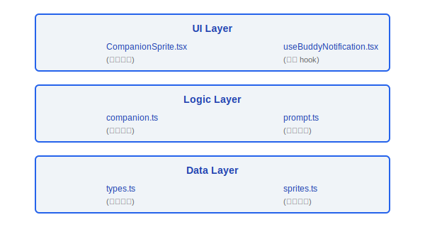
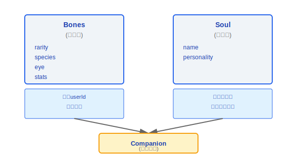
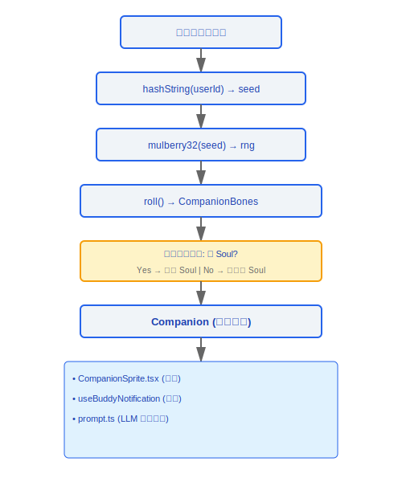

# Buddy 伴侣系统

> Claude Code 包含一个趣味性的虚拟伴侣 (Buddy) 系统。每位用户基于其 userId 确定性地生成一个独特的伴侣角色,具有不同的稀有度、物种、外观和性格。

---

## 架构总览



### 设计理念

#### 为什么 Bones/Soul 分离?

这是"可重建 vs 不可重建"的数据分类,源码注释直接说明了动机:"Bones are regenerated from hash(userId) on every read so species renames don't break stored companions and users can't edit their way to a legendary"。Bones (外观/稀有度/属性) 从 userId 哈希确定性生成,即使存储丢失也能完全重建;Soul (名字/性格) 是 AI 生成的,丢失不可恢复,必须持久化。这种分离带来三个好处:对存储损坏有韧性 (最坏只丢名字)、防止用户手动编辑配置文件获得稀有伴侣、以及支持后续物种重命名而不破坏已有角色。

#### 为什么确定性 PRNG (Mulberry32)?

源码注释:"Mulberry32 -- tiny seeded PRNG, good enough for picking ducks"。同一用户永远得到同一伴侣——这创造了"拥有感"。如果每次登录生成不同角色,用户不会产生情感连接。Mulberry32 被选中是因为它足够小巧 (几行代码)、足够均匀、且完全确定性,不依赖任何外部状态。

#### 为什么稀有度分布是 1/4/10/25/60?

源码 `types.ts` 定义 `RARITY_WEIGHTS = { common: 60, uncommon: 25, rare: 10, epic: 4, legendary: 1 }`。这是游戏设计心理学——稀有度制造期望和惊喜。legendary 的 1% 概率让它真正"珍贵",而 common 的 60% 保证大多数用户有合理体验。同时,不同稀有度对应不同的属性下限 (`RARITY_FLOOR`),legendary 下限 50 vs common 下限 5,让稀有度不仅是视觉差异,更是实质性的属性优势。

---

## 1. 角色生成 (companion.ts)

### 1.1 确定性随机数生成

```typescript
function mulberry32(seed: number): () => number
// Mulberry32 算法: 种子 PRNG (伪随机数生成器)
// 同一 seed 永远产生相同的随机序列
// 用途: 保证同一用户总是得到同一个伴侣

function hashString(str: string): number
// 将字符串 (如 userId) 转为 32位整数 hash
// 作为 mulberry32 的 seed
```

### 1.2 角色生成

```typescript
function roll(userId: string): CompanionBones {
  const seed = hashString(userId)
  const rng = mulberry32(seed)

  return {
    rarity:  pickWeighted(rng(), RARITY_WEIGHTS),
    species: pickWeighted(rng(), SPECIES_WEIGHTS),
    eye:     pickRandom(rng(), EYES),
    hat:     pickRandom(rng(), HATS),
    stats:   rollStats(rng, /* based on rarity */),
  }
}
```

**关键特性**: 完全确定性,相同 `userId` 永远生成相同的 `CompanionBones`。

### 1.3 伴侣加载

```typescript
function getCompanion(userId: string): Companion {
  // 1. 从 roll() 生成 Bones (确定性, 可重生)
  const bones = roll(userId)

  // 2. 从持久化存储加载 Soul (名字+性格)
  //    如果不存在, 生成新的 Soul
  const soul = loadOrCreateSoul(userId, bones)

  // 3. 组合为完整 Companion
  return { ...bones, ...soul }
}
```

**"重生 bones"**: 即使存储数据丢失,`bones` 可以从 `userId` 完全重建。只有 `soul` (名字/性格) 需要持久化。

---

## 2. 数据模型 (types.ts)

### 2.1 枚举类型

| 类型 | 值 | 说明 |
|------|-----|------|
| **Rarity** | `common`, `uncommon`, `rare`, `epic`, `legendary` | 稀有度等级,影响属性范围 |
| **Species** | `cat`, `dog`, `fox`, `owl`, `dragon`, `penguin`, ... | 物种类型 |
| **Eye** | `normal`, `sleepy`, `star`, `heart`, `spiral`, ... | 眼睛样式 |
| **Hat** | `none`, `tophat`, `crown`, `wizard`, `beret`, ... | 帽子装饰 |
| **StatName** | `vitality`, `charm`, `wit`, `grit`, `spark` | 属性名称 |

### 2.2 核心数据结构

```typescript
// ─── CompanionBones (确定性, 可从 userId 重生) ───
interface CompanionBones {
  rarity: Rarity
  species: Species
  eye: Eye
  hat: Hat
  stats: Record<StatName, number>
}

// ─── CompanionSoul (需持久化, 不可重生) ───
interface CompanionSoul {
  name: string          // 伴侣的名字 (用户/AI 命名)
  personality: string   // 性格描述
}

// ─── Companion (完整, 运行时) ───
interface Companion extends CompanionBones, CompanionSoul {
  // bones + soul 的组合
}

// ─── StoredCompanion (持久化格式) ───
interface StoredCompanion {
  userId: string
  soul: CompanionSoul
  createdAt: number
  lastSeenAt: number
}
```

### 2.3 Bones vs Soul 设计



---

## 3. UI 组件

### 3.1 CompanionSprite.tsx

```typescript
function CompanionSprite({
  companion,
  size,
  animated
}: CompanionSpriteProps): JSX.Element
```

- 根据 `species` + `eye` + `hat` 组合渲染精灵
- 支持动画效果 (空闲、行走、互动)
- 尺寸可配置

### 3.2 useBuddyNotification.tsx

```typescript
function useBuddyNotification(): {
  showNotification: (message: string) => void
  notification: string | null
}
```

- 伴侣气泡通知 hook
- 用于显示伴侣的"对话"或"反应"
- 自动消失计时

### 3.3 prompt.ts

```typescript
function generateCompanionPrompt(companion: Companion): string
// 根据伴侣的属性生成提示文本
// 用于在 LLM 交互中注入伴侣"人格"
```

### 3.4 sprites.ts

```typescript
// 精灵图数据定义
const SPRITES: Record<Species, SpriteData> = {
  cat: { frames: [...], hitbox: {...} },
  dog: { frames: [...], hitbox: {...} },
  // ...
}
```

- 存储所有物种的精灵帧数据
- 包含动画帧序列和碰撞框

---

## 稀有度分布

```
Rarity        概率       属性范围      视觉特征
──────────────────────────────────────────────────
legendary     ~1%       90-100       特殊粒子效果
epic          ~5%       75-95        发光边框
rare          ~15%      60-85        独特配色
uncommon      ~30%      40-70        额外装饰
common        ~49%      20-55        基础外观
```

---

## 生命周期流程



---

## 工程实践指南

### 查看伴侣信息

1. **确定性生成**: 调用 `getCompanion(userId)` 即可获取完整伴侣信息——同一 `userId` 永远返回同一伴侣
2. **查看 Bones**: `roll(userId)` 返回 `CompanionBones` (rarity/species/eye/hat/stats),完全由 `userId` 哈希决定
3. **查看 Soul**: 从本地持久化存储中读取 `StoredCompanion` 数据,包含 `name` 和 `personality`

### 调试伴侣生成

1. **检查 hashString 输出**: 确认 `hashString(userId)` 对同一 userId 总是返回相同的 32 位整数 seed
2. **检查 mulberry32 序列**: 用相同 seed 初始化 `mulberry32(seed)`,验证 `rng()` 调用序列是否一致——注意 rng 调用次序必须严格一致 (先 rarity,再 species,再 eye,再 hat,再 stats)
3. **检查 roll 结果**: 确认 `pickWeighted(rng(), RARITY_WEIGHTS)` 的权重分布 (`common:60, uncommon:25, rare:10, epic:4, legendary:1`) 是否正确
4. **检查本地存储中的 Soul 数据**: `StoredCompanion` 结构包含 `userId`、`soul` (name + personality)、`createdAt`、`lastSeenAt`——如果 Soul 数据不存在,系统会触发 AI 生成新的名字和性格

### 自定义伴侣名字

- `CompanionSoul` 中的 `name` 字段可以通过 AI 重新命名
- 修改后的名字存储在 `StoredCompanion` 的 `soul` 中
- **注意**: Bones (外观/稀有度/属性) 不可自定义——它们完全由 `userId` 哈希决定,手动编辑存储文件不会改变 Bones (因为每次加载都会从 userId 重新生成)

### 常见陷阱

> **Bones 可以重建但 Soul 丢失不可恢复**: Bones 从 `hash(userId)` 确定性生成,即使存储损坏也能完全重建。但 Soul (名字和性格) 是 AI 生成的一次性数据,丢失后无法恢复为原来的名字——系统会生成一个全新的名字。**建议备份 `StoredCompanion` 数据**,特别是当用户对伴侣名字有情感连接时。

> **不要手动编辑 Bones 来获取稀有伴侣**: 源码设计明确防止这种操作——Bones 在每次 `getCompanion()` 调用时从 userId 重新生成,覆盖任何手动修改。如果你修改了存储文件中的 rarity 为 `legendary`,下次加载时会被重新计算回原来的值。

> **rng 调用顺序敏感**: `mulberry32` 是顺序 PRNG——同一 seed 产生固定序列。如果在 `roll()` 中改变了 `rng()` 的调用顺序 (例如先 roll species 再 roll rarity),所有用户的伴侣都会变化。添加新的随机属性时,必须在现有调用链的**末尾**追加,不能插入中间。


---

[← Bridge 协议](../31-Bridge协议/bridge-protocol.md) | [目录](../README.md) | [协调器模式 →](../33-协调器模式/coordinator-mode.md)
