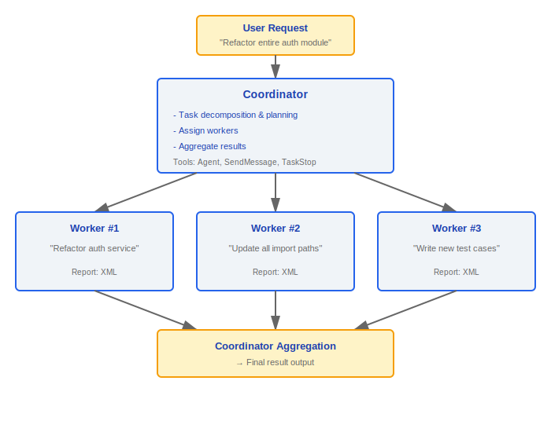
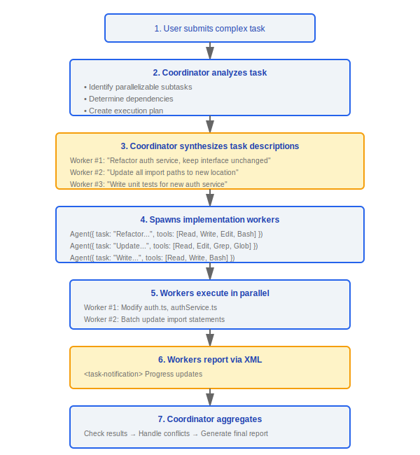

# Coordinator Mode

> Coordinator Mode is an advanced orchestration mode in Claude Code where one coordinator instance is responsible for task decomposition and planning, while multiple worker instances handle parallel execution of concrete implementation tasks.

---

## Architecture Overview



### Design Philosophy

#### Why Multi-Worker Orchestration Instead of Single-Threaded?

The source system prompt explicitly states: "Parallelism is your superpower. Workers are async. Launch independent workers concurrently whenever possible -- don't serialize work that can run simultaneously and look for opportunities to fan out". Complex tasks are naturally decomposable — one Worker refactors code, another updates import paths, a third writes tests. Parallel execution not only speeds up completion, but more importantly, each Worker runs in an isolated context, preventing state pollution. The Coordinator is responsible for identifying dependencies and maximizing parallelism.

#### Why the Task Notification Mechanism (task-notification)?

Workers need to be aware of each other's progress — to avoid duplicate work or waiting on already-completed dependencies. The source code uses XML-formatted `<task-notification>` as the reporting format, containing three sections: `<completed>`, `<current>`, and `<remaining>`, allowing the Coordinator to monitor each Worker's status in real time. This structured format is more reliably parsed than free text, while remaining LLM-friendly. The source code also provides the `TaskStop` tool so the Coordinator can abort workers that go off track — "when you realize mid-flight that the approach is wrong, or the user changes requirements after you launched the worker".

---

## 1. Gating

### 1.1 isCoordinatorMode()

```typescript
function isCoordinatorMode(): boolean {
  // Condition 1: Environment variable
  const envEnabled = process.env.COORDINATOR_MODE === 'true'

  // Condition 2: Feature gate
  const gateEnabled = isFeatureEnabled('coordinator_mode')

  return envEnabled && gateEnabled
}
```

| Condition | Source | Description |
|-----------|--------|-------------|
| `COORDINATOR_MODE` env | Environment variable | Explicitly enable |
| Feature gate | Server-side config | Gradual rollout control |

### 1.2 matchSessionMode()

```typescript
function matchSessionMode(
  resumedMode: 'coordinator' | 'normal',
  currentMode: 'coordinator' | 'normal'
): boolean
```

- Ensures mode consistency when resuming a session
- Prevents: a session created in coordinator mode from being resumed in normal mode (and vice versa)

---

## 2. Context Construction

### 2.1 getCoordinatorUserContext()

```typescript
function getCoordinatorUserContext(): string
```

Builds an enhanced user context for the coordinator, including:

| Context Item | Description |
|--------------|-------------|
| **Worker tool list** | Informs the coordinator which tools each worker can use |
| **MCP access info** | Available MCP servers and the tools they provide |
| **Scratch directory** | Path to the temporary directory shared between workers |

```
Coordinator context example:
```


---

## 3. System Prompt

### 3.1 getCoordinatorSystemPrompt()

```typescript
function getCoordinatorSystemPrompt(): string
```

Defines the coordinator's role and behavioral guidelines:

**Core content**:

- Role definition: "You are a task coordinator responsible for decomposing complex tasks and assigning them to workers"
- Available tools description
- Agent parameter format and result format documentation
- task-notification XML format specification

### 3.2 Coordinator Available Tools

| Tool | Purpose |
|------|---------|
| `Agent` | Spawns worker instances to execute subtasks |
| `SendMessage` | Sends a message to a specific worker |
| `TaskStop` | Stops a specific worker task |
| `PR subscribe` | Subscribes to Pull Request events |

### 3.3 Agent Tool Documentation

```typescript
// Agent parameter format:
interface AgentParams {
  task: string        // Subtask description
  tools: string[]     // List of tools the worker is allowed to use
  context?: string    // Additional context
}

// Agent result format:
interface AgentResult {
  status: 'completed' | 'failed' | 'cancelled'
  output: string      // Worker's final output
  toolCalls: number   // Number of tool calls made
  duration: number    // Execution time (ms)
}
```

### 3.4 task-notification XML Format

Workers report progress to the Coordinator using XML format:

```xml
<task-notification>
  <worker-id>worker-1</worker-id>
  <status>in-progress</status>
  <progress>
    <completed>Refactored auth service main file</completed>
    <current>Updating dependency injection configuration</current>
    <remaining>Testing and validation</remaining>
  </progress>
</task-notification>
```

---

## 4. Internal Tools

### 4.1 INTERNAL_WORKER_TOOLS

```typescript
const INTERNAL_WORKER_TOOLS = [
  // Team operations
  'TeamCreateTask',
  'TeamGetTask',
  'TeamUpdateTask',

  // Message communication
  'SendMessage',

  // Synthetic output
  'SyntheticOutput',
]
```

| Tool Category | Tool Name | Purpose |
|---------------|-----------|---------|
| **Team operations** | `TeamCreateTask` | Create a subtask record |
| | `TeamGetTask` | Query task status |
| | `TeamUpdateTask` | Update task progress |
| **Message communication** | `SendMessage` | Worker → Coordinator communication |
| **Synthetic output** | `SyntheticOutput` | Generate structured output (non-LLM generated) |

---

## 5. Orchestration Patterns

### 5.1 Typical Workflow



### 5.2 Parallel vs. Serial


The Coordinator automatically identifies task dependencies to maximize parallelism.

---

## Design Considerations

| Aspect | Decision | Rationale |
|--------|----------|-----------|
| Process model | Each worker runs in an isolated context | Isolation, prevents state pollution |
| Communication | XML-format reports | Structured, LLM-friendly |
| Tool restrictions | Worker tool list is specified by the Coordinator | Principle of least privilege |
| Mode consistency | Check mode match on session resume | Prevents state inconsistency |
| Scratch directory | Workers share a temporary directory | File passing across workers |

---

## Engineering Practice Guide

### Enabling Coordinator Mode

1. **Set the environment variable**: `COORDINATOR_MODE=true` to explicitly enable
2. **Confirm the Feature Gate**: `isFeatureEnabled('coordinator_mode')` must return `true` — this is server-side gradual rollout control; both the local environment variable and the remote gate are required
3. **Configure workers**: Use the `Agent` tool to define each worker's task description and list of available tools
4. **Set up the scratch directory**: The Coordinator automatically creates `/tmp/claude-coord-<session-id>/` for file sharing between workers

### Debugging Worker Issues

1. **Check worker status**: Each Worker reports progress via `<task-notification>` XML — inspect the `<status>` field to confirm whether the worker is running
2. **Check task assignment**:
   - Is the worker's `AgentParams.task` description clear and unambiguous?
   - Does the worker's `AgentParams.tools` list include all tools needed to complete the task?
   - Do the tasks of multiple workers overlap? Check for concurrent modifications to the same file
3. **Inspect worker results**: When `AgentResult.status` is `'failed'`, check the `output` field for the failure reason
4. **Use TaskStop to abort a worker going off track**: When you find a worker executing in the wrong direction or user requirements change, call `TaskStop` immediately rather than waiting for it to finish
5. **Check the notification mechanism**: Are workers' XML reports reaching the Coordinator? Verify that the `SendMessage` communication channel is functioning properly

### Task Decomposition Best Practices

1. **Maximize parallelism**: Identify independent subtasks and launch them in parallel whenever possible — "Parallelism is your superpower"
2. **Make dependencies explicit**: Tasks with dependencies must be executed serially; do not assume any execution order among workers
3. **Minimal privilege tool lists**: Assign each Worker only the minimum set of tools needed to complete its task — refactoring tasks get `[Read, Write, Edit, Bash]`, search tasks get `[Read, Grep, Glob]`
4. **Use the scratch directory**: When workers need to pass intermediate results to each other, write to the scratch directory; do not rely on direct communication between workers

### Common Pitfalls

> **Workers share a file system**: All workers run on the same file system, and concurrent modifications to the same file **will cause data races**. The Coordinator is responsible for ensuring different workers operate on different files, or serializing dependent modifications. A typical mistake: one Worker refactors a module while another simultaneously modifies that module's imports — resulting in each overwriting the other's changes.

> **Poorly assigned tasks cause duplicate work**: If two workers' task descriptions have vague overlap (e.g., "optimize the auth module" and "refactor auth-related code"), they may modify the same set of files. Task descriptions must be precise down to the file level or functional boundary.

> **Mode consistency check**: `matchSessionMode()` ensures that the mode matches when resuming a session — a session created in coordinator mode cannot be resumed in normal mode (and vice versa). If resumption fails, check the original creation mode of the session.

> **Worker context isolation**: Each Worker runs in an isolated context and does not share memory state. Workers cannot directly read the Coordinator's variables or other workers' state — they can only communicate indirectly through `<task-notification>` XML reports and the scratch directory.


---

[← Buddy System](../32-Buddy系统/buddy-system-en.md) | [Index](../README_EN.md) | [Swarm System →](../34-Swarm系统/swarm-architecture-en.md)
