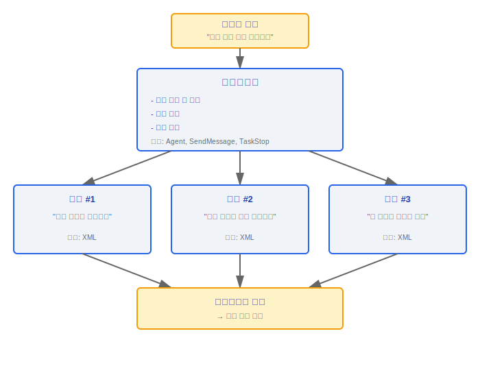
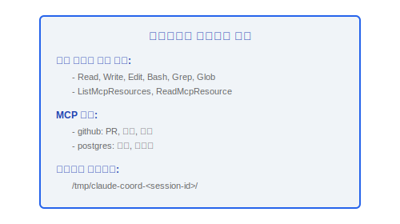
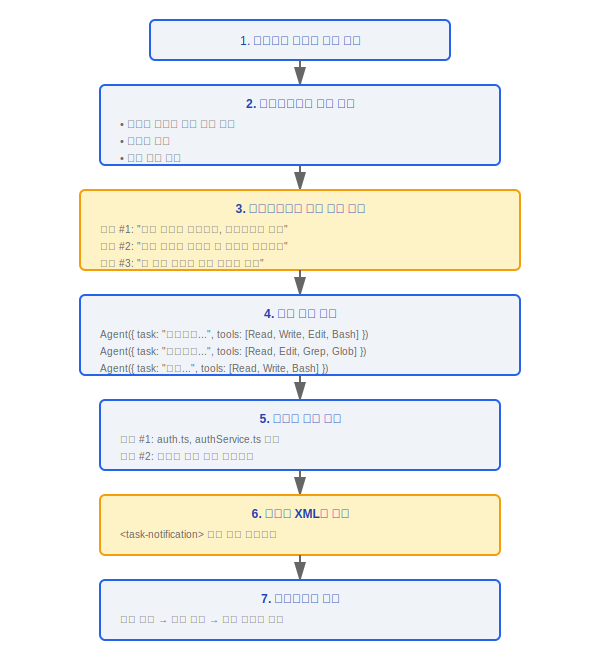
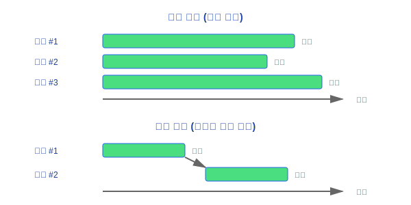

# 코디네이터 모드(Coordinator Mode)

> 코디네이터 모드(Coordinator Mode)는 Claude Code의 고급 오케스트레이션 모드로, 하나의 코디네이터(Coordinator) 인스턴스가 작업 분해 및 계획을 담당하고, 여러 워커 인스턴스가 구체적인 구현 작업을 병렬로 실행합니다.

---

## 아키텍처 개요



### 설계 철학

#### 왜 단일 스레드 대신 멀티 워커 오케스트레이션인가?

소스 시스템 프롬프트에는 명확히 명시되어 있습니다: "병렬성이 당신의 초능력입니다. 워커는 비동기적입니다. 독립적인 워커를 가능할 때마다 동시에 시작하세요 -- 동시에 실행할 수 있는 작업을 직렬화하지 말고 팬아웃 기회를 찾으세요". 복잡한 작업은 자연스럽게 분해 가능합니다 — 하나의 워커가 코드를 리팩터링하고, 다른 워커가 임포트 경로를 업데이트하며, 세 번째 워커가 테스트를 작성합니다. 병렬 실행은 완료 속도를 높일 뿐만 아니라, 더 중요하게는 각 워커가 격리된 컨텍스트에서 실행되어 상태 오염을 방지합니다. 코디네이터(Coordinator)는 의존성을 파악하고 병렬성을 극대화하는 역할을 담당합니다.

#### 왜 태스크 알림 메커니즘 (task-notification)인가?

워커들은 서로의 진행 상황을 인식해야 합니다 — 중복 작업이나 이미 완료된 의존성을 기다리는 것을 피하기 위해. 소스 코드는 XML 형식의 `<task-notification>`을 보고 형식으로 사용하며, `<completed>`, `<current>`, `<remaining>` 세 섹션을 포함하여 코디네이터(Coordinator)가 각 워커의 상태를 실시간으로 모니터링할 수 있습니다. 이 구조화된 형식은 자유 텍스트보다 더 신뢰할 수 있게 파싱되면서도 LLM 친화적입니다. 소스 코드는 코디네이터(Coordinator)가 이탈한 워커를 중단할 수 있는 `TaskStop` 도구도 제공합니다 — "워커가 시작된 후 접근 방식이 잘못되었거나 사용자가 요구사항을 변경한 것을 깨달을 때".

---

## 1. 게이팅

### 1.1 isCoordinatorMode()

```typescript
function isCoordinatorMode(): boolean {
  // 조건 1: 환경 변수
  const envEnabled = process.env.COORDINATOR_MODE === 'true'

  // 조건 2: 기능 게이트
  const gateEnabled = isFeatureEnabled('coordinator_mode')

  return envEnabled && gateEnabled
}
```

| 조건 | 소스 | 설명 |
|------|------|------|
| `COORDINATOR_MODE` 환경 변수 | 환경 변수 | 명시적 활성화 |
| 기능 게이트 | 서버 측 설정 | 점진적 롤아웃 제어 |

### 1.2 matchSessionMode()

```typescript
function matchSessionMode(
  resumedMode: 'coordinator' | 'normal',
  currentMode: 'coordinator' | 'normal'
): boolean
```

- 세션 재개 시 모드 일관성을 보장합니다
- 방지: 코디네이터 모드에서 생성된 세션이 일반 모드에서 재개되는 것 (또는 그 반대)

---

## 2. 컨텍스트 구성

### 2.1 getCoordinatorUserContext()

```typescript
function getCoordinatorUserContext(): string
```

코디네이터(Coordinator)를 위한 향상된 사용자 컨텍스트를 구성합니다. 다음을 포함합니다:

| 컨텍스트 항목 | 설명 |
|------------|------|
| **워커 도구 목록** | 각 워커가 사용할 수 있는 도구를 코디네이터(Coordinator)에게 알립니다 |
| **MCP(Model Context Protocol) 접근 정보** | 사용 가능한 MCP 서버 및 제공하는 도구 |
| **스크래치 디렉터리** | 워커 간에 공유되는 임시 디렉터리 경로 |

```
코디네이터(Coordinator) 컨텍스트 예시:
```



---

## 3. 시스템 프롬프트

### 3.1 getCoordinatorSystemPrompt()

```typescript
function getCoordinatorSystemPrompt(): string
```

코디네이터(Coordinator)의 역할 및 행동 지침을 정의합니다:

**핵심 내용**:

- 역할 정의: "당신은 복잡한 작업을 분해하고 워커에게 할당하는 작업 코디네이터입니다"
- 사용 가능한 도구 설명
- 에이전트 매개변수 형식 및 결과 형식 문서화
- task-notification XML 형식 사양

### 3.2 코디네이터(Coordinator) 사용 가능 도구

| 도구 | 목적 |
|------|------|
| `Agent` | 워커 인스턴스를 생성하여 서브태스크 실행 |
| `SendMessage` | 특정 워커에 메시지 전송 |
| `TaskStop` | 특정 워커 태스크 중지 |
| `PR subscribe` | Pull Request 이벤트 구독 |

### 3.3 Agent 도구 문서화

```typescript
// Agent 매개변수 형식:
interface AgentParams {
  task: string        // 서브태스크 설명
  tools: string[]     // 워커가 사용할 수 있는 도구 목록
  context?: string    // 추가 컨텍스트
}

// Agent 결과 형식:
interface AgentResult {
  status: 'completed' | 'failed' | 'cancelled'
  output: string      // 워커의 최종 출력
  toolCalls: number   // 도구 호출 횟수
  duration: number    // 실행 시간 (ms)
}
```

### 3.4 task-notification XML 형식

워커는 XML 형식으로 코디네이터(Coordinator)에 진행 상황을 보고합니다:

```xml
<task-notification>
  <worker-id>worker-1</worker-id>
  <status>in-progress</status>
  <progress>
    <completed>인증 서비스 메인 파일 리팩터링 완료</completed>
    <current>의존성 주입 설정 업데이트 중</current>
    <remaining>테스트 및 검증</remaining>
  </progress>
</task-notification>
```

---

## 4. 내부 도구

### 4.1 INTERNAL_WORKER_TOOLS

```typescript
const INTERNAL_WORKER_TOOLS = [
  // 팀 작업
  'TeamCreateTask',
  'TeamGetTask',
  'TeamUpdateTask',

  // 메시지 통신
  'SendMessage',

  // 합성 출력
  'SyntheticOutput',
]
```

| 도구 카테고리 | 도구 이름 | 목적 |
|------------|---------|------|
| **팀 작업** | `TeamCreateTask` | 서브태스크 레코드 생성 |
| | `TeamGetTask` | 태스크 상태 조회 |
| | `TeamUpdateTask` | 태스크 진행 상황 업데이트 |
| **메시지 통신** | `SendMessage` | 워커 → 코디네이터(Coordinator) 통신 |
| **합성 출력** | `SyntheticOutput` | 구조화된 출력 생성 (LLM이 생성하지 않은) |

---

## 5. 오케스트레이션 패턴

### 5.1 일반적인 워크플로우



### 5.2 병렬 vs 직렬



코디네이터(Coordinator)는 자동으로 태스크 의존성을 파악하여 병렬성을 극대화합니다.

---

## 설계 고려사항

| 측면 | 결정 | 근거 |
|------|------|------|
| 프로세스 모델 | 각 워커는 격리된 컨텍스트에서 실행 | 격리, 상태 오염 방지 |
| 통신 | XML 형식 보고 | 구조화됨, LLM 친화적 |
| 도구 제한 | 워커 도구 목록은 코디네이터(Coordinator)가 지정 | 최소 권한 원칙 |
| 모드 일관성 | 세션 재개 시 모드 일치 확인 | 상태 불일치 방지 |
| 스크래치 디렉터리 | 워커들이 임시 디렉터리 공유 | 워커 간 파일 전달 |

---

## 엔지니어링 실천 가이드

### 코디네이터 모드(Coordinator Mode) 활성화

1. **환경 변수 설정**: `COORDINATOR_MODE=true`로 명시적 활성화
2. **Feature Gate 확인**: `isFeatureEnabled('coordinator_mode')`가 `true`를 반환해야 합니다 — 이것은 서버 측 점진적 롤아웃 제어입니다; 로컬 환경 변수와 원격 게이트가 모두 필요합니다
3. **워커 설정**: `Agent` 도구를 사용하여 각 워커의 태스크 설명과 사용 가능한 도구 목록을 정의합니다
4. **스크래치 디렉터리 설정**: 코디네이터(Coordinator)는 자동으로 `/tmp/claude-coord-<session-id>/`를 생성하여 워커 간 파일 공유에 사용합니다

### 워커 문제 디버깅

1. **워커 상태 확인**: 각 워커는 `<task-notification>` XML로 진행 상황을 보고합니다 — `<status>` 필드를 검사하여 워커가 실행 중인지 확인합니다
2. **태스크 할당 확인**:
   - 워커의 `AgentParams.task` 설명이 명확하고 모호하지 않은가?
   - 워커의 `AgentParams.tools` 목록에 태스크 완료에 필요한 모든 도구가 포함되어 있는가?
   - 여러 워커의 태스크가 겹치는가? 동일한 파일의 동시 수정 여부 확인
3. **워커 결과 검사**: `AgentResult.status`가 `'failed'`인 경우 `output` 필드에서 실패 이유를 확인합니다
4. **TaskStop으로 이탈한 워커 중단**: 워커가 잘못된 방향으로 실행 중이거나 사용자 요구사항이 변경된 경우, 완료를 기다리지 말고 즉시 `TaskStop`을 호출합니다
5. **알림 메커니즘 확인**: 워커의 XML 보고가 코디네이터(Coordinator)에 도달하고 있는가? `SendMessage` 통신 채널이 올바르게 작동하는지 확인합니다

### 태스크 분해 모범 사례

1. **병렬성 극대화**: 독립적인 서브태스크를 파악하고 가능할 때마다 병렬로 시작합니다 — "병렬성이 당신의 초능력입니다"
2. **의존성 명시**: 의존성이 있는 태스크는 반드시 직렬로 실행해야 합니다; 워커 간의 실행 순서를 가정하지 마세요
3. **최소 권한 도구 목록**: 각 워커에게 태스크 완료에 필요한 최소 도구만 할당합니다 — 리팩터링 태스크에는 `[Read, Write, Edit, Bash]`, 검색 태스크에는 `[Read, Grep, Glob]`
4. **스크래치 디렉터리 사용**: 워커들이 중간 결과를 서로 전달해야 할 때는 스크래치 디렉터리에 씁니다; 워커 간의 직접 통신에 의존하지 마세요

### 흔한 함정

> **워커들은 파일 시스템을 공유합니다**: 모든 워커는 동일한 파일 시스템에서 실행되며, 동일한 파일에 대한 동시 수정은 **데이터 경쟁을 유발합니다**. 코디네이터(Coordinator)는 다른 워커들이 다른 파일에서 작업하도록 하거나, 의존적인 수정을 직렬화하는 역할을 담당합니다. 일반적인 실수: 하나의 워커가 모듈을 리팩터링하는 동안 다른 워커가 동시에 그 모듈의 임포트를 수정 — 서로의 변경 사항을 덮어쓰는 결과가 됩니다.

> **태스크 할당이 불명확하면 중복 작업을 유발합니다**: 두 워커의 태스크 설명에 모호한 겹침이 있으면 (예: "인증 모듈 최적화"와 "인증 관련 코드 리팩터링"), 동일한 파일 세트를 수정할 수 있습니다. 태스크 설명은 파일 수준이나 기능 경계까지 정확해야 합니다.

> **모드 일관성 확인**: `matchSessionMode()`는 세션 재개 시 모드가 일치하는지 확인합니다 — 코디네이터 모드에서 생성된 세션은 일반 모드에서 재개할 수 없습니다 (또는 그 반대). 재개가 실패하면 세션의 원래 생성 모드를 확인하세요.

> **워커 컨텍스트 격리**: 각 워커는 격리된 컨텍스트에서 실행되며 메모리 상태를 공유하지 않습니다. 워커들은 코디네이터(Coordinator)의 변수나 다른 워커의 상태를 직접 읽을 수 없습니다 — `<task-notification>` XML 보고와 스크래치 디렉터리를 통해서만 간접적으로 통신할 수 있습니다.


---

[← 버디 시스템](../32-Buddy系统/buddy-system-ko.md) | [목차](../README_KO.md) | [스웜 시스템 →](../34-Swarm系统/swarm-architecture-ko.md)
