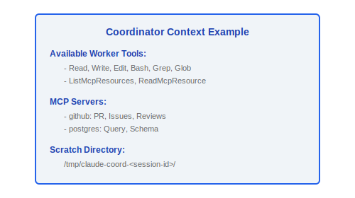
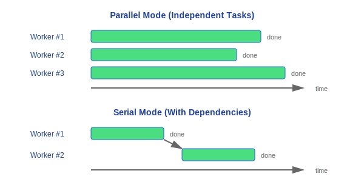

# 协调器模式

> 协调器模式 (Coordinator Mode) 是 Claude Code 的高级编排模式,一个协调器实例负责任务分解和规划,多个 worker 实例负责并行执行具体实现任务。

---

## 架构总览


### 设计理念

#### 为什么多 Worker 编排而不是单线程?

源码系统提示中明确写道:"Parallelism is your superpower. Workers are async. Launch independent workers concurrently whenever possible -- don't serialize work that can run simultaneously and look for opportunities to fan out"。复杂任务天然可分解——一个 Worker 重构代码,另一个更新 import 路径,第三个编写测试。并行执行不仅加速完成,更重要的是每个 Worker 运行在独立上下文中,防止状态污染。Coordinator 负责识别依赖关系,最大化并行度。

#### 为什么任务通知机制 (task-notification)?

Worker 之间需要感知彼此进度——避免重复工作或等待已完成的依赖。源码选择 XML 格式的 `<task-notification>` 作为报告格式,包含 `<completed>`、`<current>`、`<remaining>` 三段,让 Coordinator 能实时了解每个 Worker 的状态。这种结构化格式比自由文本更可靠解析,同时对 LLM 友好。源码还提供了 `TaskStop` 工具让 Coordinator 能中止偏离方向的 Worker——"when you realize mid-flight that the approach is wrong, or the user changes requirements after you launched the worker"。

---

## 1. 门控

### 1.1 isCoordinatorMode()

```typescript
function isCoordinatorMode(): boolean {
  // 条件 1: 环境变量
  const envEnabled = process.env.COORDINATOR_MODE === 'true'

  // 条件 2: Feature gate
  const gateEnabled = isFeatureEnabled('coordinator_mode')

  return envEnabled && gateEnabled
}
```

| 条件 | 来源 | 说明 |
|------|------|------|
| `COORDINATOR_MODE` env | 环境变量 | 显式启用 |
| Feature gate | 服务端配置 | 灰度控制 |

### 1.2 matchSessionMode()

```typescript
function matchSessionMode(
  resumedMode: 'coordinator' | 'normal',
  currentMode: 'coordinator' | 'normal'
): boolean
```

- 恢复会话时确保模式一致性
- 防止: 以 coordinator 模式创建的会话被 normal 模式恢复 (反之亦然)

---

## 2. 上下文构建

### 2.1 getCoordinatorUserContext()

```typescript
function getCoordinatorUserContext(): string
```

为协调器构建增强的用户上下文,包含:

| 上下文项 | 说明 |
|----------|------|
| **Worker 工具列表** | 告知 coordinator 每个 worker 可使用哪些工具 |
| **MCP 访问信息** | 可用的 MCP servers 及其提供的工具 |
| **暂存目录** | Worker 之间共享文件的临时目录路径 |

```
Coordinator 上下文示例:
```



---

## 3. 系统提示

### 3.1 getCoordinatorSystemPrompt()

```typescript
function getCoordinatorSystemPrompt(): string
```

定义协调器的角色和行为规范:

**核心内容**:

- 角色定义: "你是一个任务协调器,负责分解复杂任务并分配给 worker"
- 可用工具说明
- Agent 参数格式和结果格式文档
- task-notification XML 格式规范

### 3.2 协调器可用工具

| 工具 | 用途 |
|------|------|
| `Agent` | 生成 worker 实例执行子任务 |
| `SendMessage` | 向特定 worker 发送消息 |
| `TaskStop` | 停止某个 worker 任务 |
| `PR 订阅` | 订阅 Pull Request 事件 |

### 3.3 Agent 工具文档

```typescript
// Agent 参数格式:
interface AgentParams {
  task: string        // 子任务描述
  tools: string[]     // 允许该 worker 使用的工具列表
  context?: string    // 额外上下文
}

// Agent 结果格式:
interface AgentResult {
  status: 'completed' | 'failed' | 'cancelled'
  output: string      // Worker 的最终输出
  toolCalls: number   // 工具调用次数
  duration: number    // 执行耗时 (ms)
}
```

### 3.4 task-notification XML 格式

Worker 通过 XML 格式向 Coordinator 报告进展:

```xml
<task-notification>
  <worker-id>worker-1</worker-id>
  <status>in-progress</status>
  <progress>
    <completed>重构 auth service 主文件</completed>
    <current>更新依赖注入配置</current>
    <remaining>测试验证</remaining>
  </progress>
</task-notification>
```

---

## 4. 内部工具

### 4.1 INTERNAL_WORKER_TOOLS

```typescript
const INTERNAL_WORKER_TOOLS = [
  // Team 操作
  'TeamCreateTask',
  'TeamGetTask',
  'TeamUpdateTask',

  // 消息通信
  'SendMessage',

  // 合成输出
  'SyntheticOutput',
]
```

| 工具分类 | 工具名 | 用途 |
|---------|--------|------|
| **Team 操作** | `TeamCreateTask` | 创建子任务记录 |
| | `TeamGetTask` | 查询任务状态 |
| | `TeamUpdateTask` | 更新任务进度 |
| **消息通信** | `SendMessage` | Worker → Coordinator 通信 |
| **合成输出** | `SyntheticOutput` | 生成结构化输出 (非 LLM 生成) |

---

## 5. 编排模式

### 5.1 典型流程


### 5.2 并行 vs 串行



Coordinator 自动识别任务依赖关系,最大化并行度。

---

## 设计考量

| 方面 | 决策 | 原因 |
|------|------|------|
| 进程模型 | 每个 worker 独立上下文 | 隔离性, 防止状态污染 |
| 通信方式 | XML 格式报告 | 结构化, LLM 友好 |
| 工具限制 | Worker 工具列表由 Coordinator 指定 | 最小权限原则 |
| 模式一致性 | 恢复时检查模式匹配 | 防止状态不一致 |
| 暂存目录 | Worker 共享临时目录 | 跨 worker 文件传递 |

---

## 工程实践指南

### 启用协调器模式

1. **设置环境变量**: `COORDINATOR_MODE=true` 显式启用
2. **确认 Feature Gate**: `isFeatureEnabled('coordinator_mode')` 必须返回 `true`——这是服务端灰度控制,本地环境变量和远程 gate 缺一不可
3. **配置 Worker**: 通过 `Agent` 工具定义每个 worker 的任务描述和可用工具列表
4. **设置暂存目录**: Coordinator 会自动创建 `/tmp/claude-coord-<session-id>/` 用于 Worker 间文件共享

### 调试 Worker 问题

1. **检查 Worker 状态**: 每个 Worker 通过 `<task-notification>` XML 报告进度——检查 `<status>` 字段确认 Worker 是否在运行
2. **检查任务分配**:
   - Worker 的 `AgentParams.task` 描述是否清晰无歧义?
   - Worker 的 `AgentParams.tools` 列表是否包含完成任务所需的所有工具?
   - 多个 Worker 的任务是否有重叠? 检查是否存在对同一文件的并发修改
3. **检查 Worker 结果**: `AgentResult.status` 为 `'failed'` 时,检查 `output` 字段获取失败原因
4. **使用 TaskStop 中止偏离方向的 Worker**: 当发现 Worker 执行方向错误或用户需求变更时,立即调用 `TaskStop` 而不是等待它完成
5. **检查通知机制**: Worker 的 XML 报告是否到达 Coordinator? 检查 `SendMessage` 通信通道是否正常

### 任务分解最佳实践

1. **最大化并行度**: 识别独立子任务,尽可能并行启动——"Parallelism is your superpower"
2. **明确依赖关系**: 有依赖的任务必须串行执行,不要假设 Worker 之间的执行顺序
3. **最小权限工具列表**: 每个 Worker 只分配完成其任务所需的最小工具集——重构任务给 `[Read, Write, Edit, Bash]`,搜索任务给 `[Read, Grep, Glob]`
4. **利用暂存目录**: Worker 之间需要传递中间结果时,写入暂存目录,不要依赖 Worker 之间的直接通信

### 常见陷阱

> **Worker 之间共享文件系统**: 所有 Worker 运行在同一文件系统上,并发修改同一文件**会导致数据竞争**。Coordinator 负责确保不同 Worker 操作不同的文件,或者将有依赖的修改串行化。典型错误:一个 Worker 重构模块,另一个同时修改该模块的 import——结果互相覆盖。

> **任务分配不当导致重复工作**: 如果两个 Worker 的任务描述有模糊重叠 (如"优化 auth 模块"和"重构 auth 相关代码"),它们可能修改同一批文件。任务描述必须精确到文件级别或功能边界。

> **模式一致性检查**: `matchSessionMode()` 确保恢复会话时模式匹配——以 coordinator 模式创建的会话不能被 normal 模式恢复 (反之亦然)。如果恢复失败,检查会话的原始创建模式。

> **Worker 上下文隔离**: 每个 Worker 运行在独立上下文中,不共享内存状态。Worker 不能直接读取 Coordinator 的变量或其他 Worker 的状态——只能通过 `<task-notification>` XML 报告和暂存目录间接通信。


---

[← Buddy 系统](../32-Buddy系统/buddy-system.md) | [目录](../README.md) | [Swarm 系统 →](../34-Swarm系统/swarm-architecture.md)
