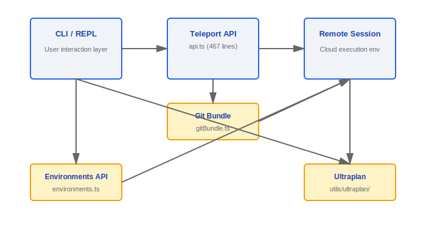
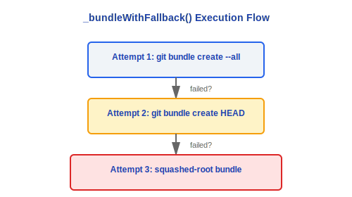
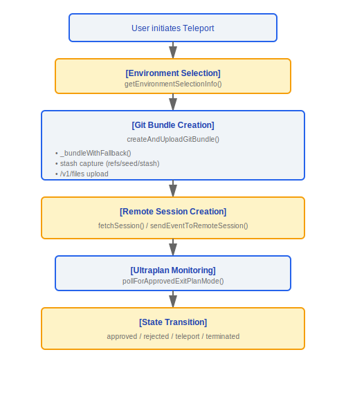

# Teleport Remote Session Navigation

> The Teleport subsystem manages the full lifecycle of remote code sessions -- from creation, event pushing, and Git bundle uploading to Ultraplan exit detection.

---

## Architecture Overview



---

## 1. Teleport API Client (api.ts, 467 loc)

### 1.1 Core Type Definitions

```typescript
type SessionStatus = 'requires_action' | 'running' | 'idle' | 'archived';

type SessionContextSource = GitSource | KnowledgeBaseSource;
```

| Status            | Meaning                                  |
|-------------------|------------------------------------------|
| `requires_action` | Session requires user interaction        |
| `running`         | Session is currently executing           |
| `idle`            | Session is idle, waiting for instruction |
| `archived`        | Session has been archived                |

### 1.2 Main API Functions

| Function                           | HTTP Method | Endpoint                      | Description                                                      |
|------------------------------------|-------------|-------------------------------|------------------------------------------------------------------|
| `fetchCodeSessionsFromSessionsAPI` | GET         | /v1/sessions                  | Converts `SessionResource[]` -> `CodeSession[]`                  |
| `fetchSession`                     | GET         | /v1/sessions/{id}             | Fetches a single session's details                               |
| `sendEventToRemoteSession`         | POST        | /v1/sessions/{id}/events      | Sends a user message (optional UUID for deduplication)           |
| `updateSessionTitle`               | PATCH       | /v1/sessions/{id}             | Updates the session title                                        |

### 1.3 Retry Mechanism

```typescript
// axiosGetWithRetry() -- exponential backoff strategy
const RETRY_DELAYS = [2000, 4000, 8000, 16000]; // 2s, 4s, 8s, 16s

function isTransientNetworkError(error: AxiosError): boolean {
  // Retry: 5xx server errors + network connection errors
  // No retry: 4xx client errors
}
```

### Design Philosophy: Why Use Git Bundle for Code Transfer?

Git Bundle is a self-contained binary archive format natively supported by Git that packages repository objects and references into a single file. The reasons for choosing this approach over `git clone` or tar archiving:

1. **No dependency on remote repository** -- A Bundle is completely self-contained; the target machine does not need access to the origin remote. This is suitable for offline/restricted network environments (e.g., enterprise intranets, air-gapped environments).
2. **Preserves Git history** -- Unlike simple file snapshots, a Bundle retains the full commit history, branches, and tags, allowing the remote session to run `git log`, `git diff`, and other operations normally.
3. **Incremental transfer friendly** -- The Git Bundle format natively supports delta packs. While the current implementation does not use incremental features, the architecture reserves room for optimization.
4. **Three-level fallback ensures availability** -- The source `_bundleWithFallback()` implements a progressive degradation chain of `--all → HEAD → squashed-root`, ensuring that even large repositories can be transferred (see comments at lines 46-49 in `gitBundle.ts`).

### Design Philosophy: Why Is an Environment Snapshot Needed?

The remote execution environment may differ significantly from the local development environment -- different Node versions, different shell configurations, different toolchain versions. The environment snapshot captures uncommitted changes via the `refs/seed/stash` reference (the stash capture mechanism in the source), ensuring:

- The dirty state of the workspace is also uploaded with the Bundle without losing changes the user is working on.
- The code state seen by the remote session is exactly the same as locally, eliminating the "works on my machine" problem.

### Engineering Practice

**Debugging Teleport connection failures**:
1. Check the CCR WebSocket connection status -- Teleport relies on the retry mechanism of `axiosGetWithRetry()` (exponential backoff 2s/4s/8s/16s). If all retries fail, check network connectivity and API endpoint reachability.
2. Check Git Bundle generation logs -- `_bundleWithFallback()` will try three strategies in sequence. If all fail, it returns a `BundleFailReason` (`git_error` / `too_large` / `empty_repo`), which can be used to pinpoint the problem.
3. Confirm the Bundle size has not exceeded the limit -- the default limit is 100MB (`DEFAULT_BUNDLE_MAX_BYTES`), which can be overridden via the `tengu_ccr_bundle_max_bytes` server-side configuration.
4. Check whether the feature flag `ccr-byoc-2025-07-29` has been enabled.

**Prerequisites for creating a new Teleport target**:
- The target environment requires the correct Node version (meeting the minimum `process.version` requirement) and an available `git` command.
- The environment type (`anthropic_cloud` / `byoc` / `bridge`) determines different connection paths and permission models.
- BYOC environments require an additional session token and the `CLAUDE_CODE_REMOTE_SESSION_ID` environment variable.

### 1.4 Feature Flag

```typescript
const CCR_BYOC_BETA = 'ccr-byoc-2025-07-29';
```

---

## 2. Environments API (environments.ts)

### 2.1 Environment Types

```typescript
type EnvironmentKind = 'anthropic_cloud' | 'byoc' | 'bridge';
```

| Environment Type  | Description                                 |
|-------------------|---------------------------------------------|
| `anthropic_cloud` | Anthropic-hosted cloud environment          |
| `byoc`            | Bring Your Own Cloud                        |
| `bridge`          | Bridge environment (local-remote hybrid)    |

### 2.2 API Functions

- **`fetchEnvironments()`** -- `GET /v1/environment_providers`
  - Returns a list of all available execution environments.
- **`createDefaultCloudEnvironment()`** -- `POST /v1/environment_providers`
  - Creates the default Anthropic Cloud environment.
- **`getEnvironmentSelectionInfo()`**
  - Returns: list of available environments + currently selected environment + selection source (user selection / default / configuration).

---

## 3. Git Bundle (gitBundle.ts, 293 loc)

### 3.1 Exported Functions

```typescript
async function createAndUploadGitBundle(): Promise<BundleUploadResult>
```

### 3.2 Bundle Creation Strategy (Three-Level Fallback)



### 3.3 Stash Capture

- Uncommitted changes are captured via the `refs/seed/stash` reference.
- Ensures that the workspace's dirty state is also uploaded together with the bundle.

### 3.4 Upload Configuration

| Parameter                       | Default    | Description                    |
|---------------------------------|------------|--------------------------------|
| Upload endpoint                 | /v1/files  | Files API endpoint             |
| Maximum bundle size             | 100 MB     | Default limit                  |
| `tengu_ccr_bundle_max_bytes`    | Configurable | Server-side override config  |

### 3.5 Return Type

```typescript
interface BundleUploadResult {
  fileId: string;           // File ID after upload
  bundleSizeBytes: number;  // Bundle size (bytes)
  scope: BundleScope;       // 'all' | 'head' | 'squashed-root'
  hasWip: boolean;          // Whether uncommitted changes are included
}
```

---

## 4. Ultraplan (utils/ultraplan/)

### 4.1 ExitPlanModeScanner Class

```typescript
class ExitPlanModeScanner {
  // Scans remote session stream, detects exit conditions
  // State enum:
  //   approved    -- plan has been approved
  //   rejected    -- plan was rejected
  //   teleport    -- teleport jump triggered
  //   pending     -- waiting
  //   terminated  -- terminated

  rejectCount: number;       // Accumulated rejection count
  hasPendingPlan: boolean;   // Whether there is a pending plan
}
```

### 4.2 Polling Mechanism

```typescript
const POLL_INTERVAL_MS = 3000; // Poll every 3 seconds

async function pollForApprovedExitPlanMode(): Promise<ExitPlanResult>
```

### 4.3 Keyword Detection and Replacement

| Function                            | Description                                                                             |
|-------------------------------------|-----------------------------------------------------------------------------------------|
| `findUltraplanTriggerPositions()`   | Detects ultraplan trigger keyword positions (skips content inside delimiters/paths/identifiers) |
| `findUltrareviewTriggerPositions()` | Detects ultrareview trigger keyword positions                                           |
| `replaceUltraplanKeyword()`         | Replaces matched keywords                                                               |

---

## Data Flow Summary




---

[← DeepLink](../36-DeepLink/deeplink-system-en.md) | [Index](../README_EN.md) | [Output Styles →](../38-输出样式/output-styles-en.md)
