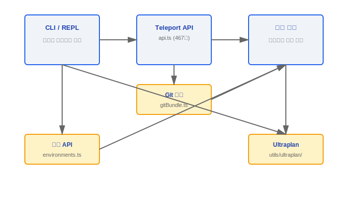
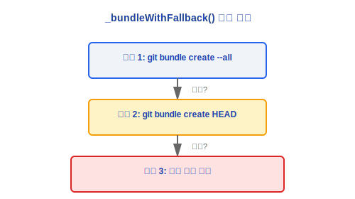
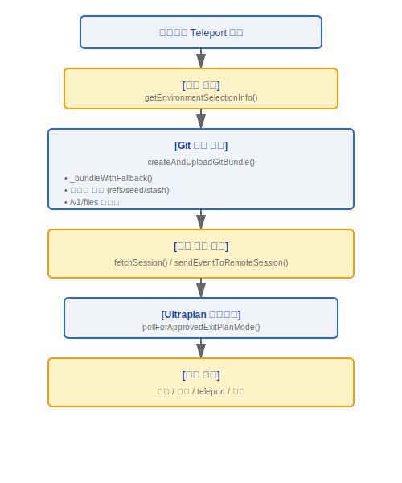

# 텔레포트(Teleport) 원격 세션 탐색

> 텔레포트(Teleport) 서브시스템은 원격 코드 세션의 전체 생명주기를 관리합니다 -- 생성, 이벤트 푸시, Git 번들 업로드부터 Ultraplan 종료 감지까지.

---

## 아키텍처 개요



---

## 1. 텔레포트 API 클라이언트 (api.ts, 467줄)

### 1.1 핵심 타입 정의

```typescript
type SessionStatus = 'requires_action' | 'running' | 'idle' | 'archived';

type SessionContextSource = GitSource | KnowledgeBaseSource;
```

| 상태              | 의미                                     |
|-------------------|------------------------------------------|
| `requires_action` | 세션에 사용자 상호작용이 필요함          |
| `running`         | 세션이 현재 실행 중임                    |
| `idle`            | 세션이 유휴 상태로 명령을 기다리는 중    |
| `archived`        | 세션이 보관됨                            |

### 1.2 주요 API 함수

| 함수                               | HTTP 메서드 | 엔드포인트                    | 설명                                                             |
|------------------------------------|-------------|-------------------------------|------------------------------------------------------------------|
| `fetchCodeSessionsFromSessionsAPI` | GET         | /v1/sessions                  | `SessionResource[]` -> `CodeSession[]`로 변환                    |
| `fetchSession`                     | GET         | /v1/sessions/{id}             | 단일 세션의 세부 정보를 가져옴                                   |
| `sendEventToRemoteSession`         | POST        | /v1/sessions/{id}/events      | 사용자 메시지 전송 (중복 제거를 위한 선택적 UUID)                |
| `updateSessionTitle`               | PATCH       | /v1/sessions/{id}             | 세션 제목 업데이트                                               |

### 1.3 재시도 메커니즘

```typescript
// axiosGetWithRetry() -- 지수 백오프 전략
const RETRY_DELAYS = [2000, 4000, 8000, 16000]; // 2초, 4초, 8초, 16초

function isTransientNetworkError(error: AxiosError): boolean {
  // 재시도: 5xx 서버 오류 + 네트워크 연결 오류
  // 재시도 없음: 4xx 클라이언트 오류
}
```

### 설계 철학: 왜 코드 전송에 Git 번들을 사용하는가?

Git 번들은 Git에서 기본적으로 지원하는 자급자족형 바이너리 아카이브 형식으로, 저장소 객체와 참조를 단일 파일로 패키징합니다. `git clone`이나 tar 아카이브 대신 이 방식을 선택한 이유:

1. **원격 저장소에 의존하지 않음** -- 번들은 완전히 자급자족적이며, 대상 머신은 오리진 원격에 접근할 필요가 없습니다. 오프라인/제한된 네트워크 환경(예: 기업 인트라넷, 에어갭 환경)에 적합합니다.
2. **Git 히스토리 보존** -- 단순한 파일 스냅샷과 달리 번들은 완전한 커밋 히스토리, 브랜치, 태그를 유지하여 원격 세션이 `git log`, `git diff` 등의 작업을 정상적으로 실행할 수 있습니다.
3. **증분 전송 친화적** -- Git 번들 형식은 기본적으로 델타 팩을 지원합니다. 현재 구현은 증분 기능을 사용하지 않지만, 아키텍처는 최적화 여지를 남겨두고 있습니다.
4. **세 단계 폴백으로 가용성 보장** -- 소스 `_bundleWithFallback()`은 `--all → HEAD → squashed-root`의 점진적 저하 체인을 구현하여 대형 저장소도 전송될 수 있도록 보장합니다(`gitBundle.ts`의 46-49줄 주석 참조).

### 설계 철학: 왜 환경 스냅샷이 필요한가?

원격 실행 환경은 로컬 개발 환경과 크게 다를 수 있습니다 -- 다른 Node 버전, 다른 셸 구성, 다른 도구 체인 버전. 환경 스냅샷은 `refs/seed/stash` 참조를 통해 커밋되지 않은 변경 사항을 캡처하여(소스의 스태시 캡처 메커니즘):

- 작업 공간의 더티 상태도 번들과 함께 업로드되어 사용자가 작업 중인 변경 사항이 손실되지 않습니다.
- 원격 세션에서 보이는 코드 상태가 로컬과 완전히 동일하여 "내 머신에서는 동작함" 문제를 제거합니다.

### 엔지니어링 실천

**텔레포트(Teleport) 연결 실패 디버깅**:
1. CCR WebSocket 연결 상태를 확인하십시오 -- 텔레포트(Teleport)는 `axiosGetWithRetry()`의 재시도 메커니즘(지수 백오프 2초/4초/8초/16초)에 의존합니다. 모든 재시도가 실패하면 네트워크 연결 및 API 엔드포인트 접근성을 확인하십시오.
2. Git 번들 생성 로그를 확인하십시오 -- `_bundleWithFallback()`은 세 가지 전략을 순서대로 시도합니다. 모두 실패하면 `BundleFailReason`(`git_error` / `too_large` / `empty_repo`)을 반환하며, 이를 통해 문제를 정확히 파악할 수 있습니다.
3. 번들 크기가 제한을 초과하지 않았는지 확인하십시오 -- 기본 제한은 100MB(`DEFAULT_BUNDLE_MAX_BYTES`)이며, `tengu_ccr_bundle_max_bytes` 서버 측 구성을 통해 재정의할 수 있습니다.
4. 기능 플래그 `ccr-byoc-2025-07-29`가 활성화되었는지 확인하십시오.

**새 텔레포트(Teleport) 대상 생성을 위한 전제 조건**:
- 대상 환경은 올바른 Node 버전(최소 `process.version` 요구 사항 충족)과 사용 가능한 `git` 명령이 필요합니다.
- 환경 유형(`anthropic_cloud` / `byoc` / `bridge`)에 따라 다른 연결 경로와 권한 모델(Permission Model)이 결정됩니다.
- BYOC 환경은 추가 세션 토큰과 `CLAUDE_CODE_REMOTE_SESSION_ID` 환경 변수가 필요합니다.

### 1.4 기능 플래그

```typescript
const CCR_BYOC_BETA = 'ccr-byoc-2025-07-29';
```

---

## 2. 환경 API (environments.ts)

### 2.1 환경 유형

```typescript
type EnvironmentKind = 'anthropic_cloud' | 'byoc' | 'bridge';
```

| 환경 유형         | 설명                                        |
|-------------------|---------------------------------------------|
| `anthropic_cloud` | Anthropic 호스팅 클라우드 환경              |
| `byoc`            | 자체 클라우드 사용(Bring Your Own Cloud)    |
| `bridge`          | 브리지 환경 (로컬-원격 하이브리드)          |

### 2.2 API 함수

- **`fetchEnvironments()`** -- `GET /v1/environment_providers`
  - 사용 가능한 모든 실행 환경 목록을 반환합니다.
- **`createDefaultCloudEnvironment()`** -- `POST /v1/environment_providers`
  - 기본 Anthropic Cloud 환경을 생성합니다.
- **`getEnvironmentSelectionInfo()`**
  - 반환값: 사용 가능한 환경 목록 + 현재 선택된 환경 + 선택 소스 (사용자 선택 / 기본값 / 구성).

---

## 3. Git 번들 (gitBundle.ts, 293줄)

### 3.1 내보내기 함수

```typescript
async function createAndUploadGitBundle(): Promise<BundleUploadResult>
```

### 3.2 번들 생성 전략 (세 단계 폴백)



### 3.3 스태시 캡처

- 커밋되지 않은 변경 사항은 `refs/seed/stash` 참조를 통해 캡처됩니다.
- 작업 공간의 더티 상태도 번들과 함께 업로드되도록 보장합니다.

### 3.4 업로드 구성

| 파라미터                        | 기본값     | 설명                           |
|---------------------------------|------------|--------------------------------|
| 업로드 엔드포인트               | /v1/files  | Files API 엔드포인트           |
| 최대 번들 크기                  | 100 MB     | 기본 제한                      |
| `tengu_ccr_bundle_max_bytes`    | 구성 가능  | 서버 측 재정의 구성            |

### 3.5 반환 타입

```typescript
interface BundleUploadResult {
  fileId: string;           // 업로드 후 파일 ID
  bundleSizeBytes: number;  // 번들 크기 (바이트)
  scope: BundleScope;       // 'all' | 'head' | 'squashed-root'
  hasWip: boolean;          // 커밋되지 않은 변경 사항 포함 여부
}
```

---

## 4. Ultraplan (utils/ultraplan/)

### 4.1 ExitPlanModeScanner 클래스

```typescript
class ExitPlanModeScanner {
  // 원격 세션 스트림을 스캔하여 종료 조건을 감지
  // 상태 열거형:
  //   approved    -- 계획이 승인됨
  //   rejected    -- 계획이 거부됨
  //   teleport    -- 텔레포트 점프가 트리거됨
  //   pending     -- 대기 중
  //   terminated  -- 종료됨

  rejectCount: number;       // 누적 거부 횟수
  hasPendingPlan: boolean;   // 대기 중인 계획 존재 여부
}
```

### 4.2 폴링 메커니즘

```typescript
const POLL_INTERVAL_MS = 3000; // 3초마다 폴링

async function pollForApprovedExitPlanMode(): Promise<ExitPlanResult>
```

### 4.3 키워드 감지 및 교체

| 함수                                | 설명                                                                                    |
|-------------------------------------|-----------------------------------------------------------------------------------------|
| `findUltraplanTriggerPositions()`   | ultraplan 트리거 키워드 위치를 감지 (구분 기호/경로/식별자 내부 내용 건너뜀)           |
| `findUltrareviewTriggerPositions()` | ultrareview 트리거 키워드 위치를 감지                                                  |
| `replaceUltraplanKeyword()`         | 일치하는 키워드를 교체                                                                  |

---

## 데이터 흐름(Data Flow) 요약




---

[← 딥링크](../36-DeepLink/deeplink-system-ko.md) | [인덱스](../README_KO.md) | [출력 스타일 →](../38-输出样式/output-styles-ko.md)
