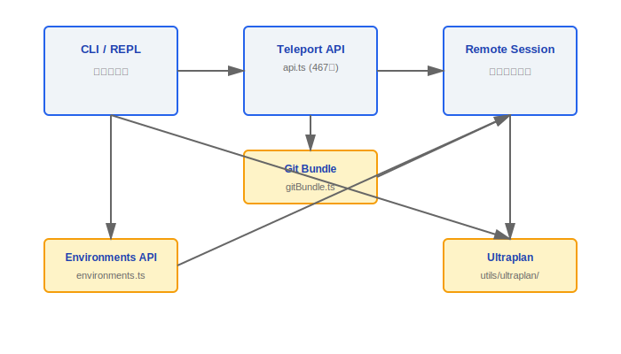
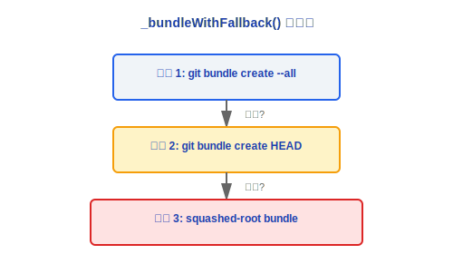
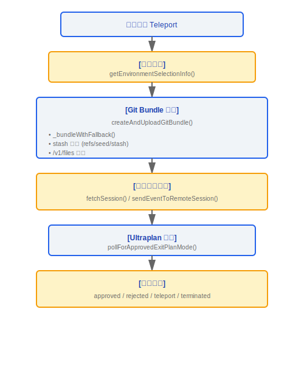

# Teleport 远程会话导航

> Teleport 子系统负责管理远程代码会话的全生命周期 -- 从创建、事件推送、Git bundle 上传到 Ultraplan 退出检测。

---

## 架构总览



---

## 1. Teleport API 客户端 (api.ts, 467行)

### 1.1 核心类型定义

```typescript
type SessionStatus = 'requires_action' | 'running' | 'idle' | 'archived';

type SessionContextSource = GitSource | KnowledgeBaseSource;
```

| 状态              | 含义                       |
|-------------------|---------------------------|
| `requires_action` | 会话需要用户交互            |
| `running`         | 会话正在执行中              |
| `idle`            | 会话空闲, 等待指令          |
| `archived`        | 会话已归档                  |

### 1.2 主要 API 函数

| 函数                               | HTTP 方法 | 端点                           | 说明                                    |
|------------------------------------|-----------|-------------------------------|-----------------------------------------|
| `fetchCodeSessionsFromSessionsAPI` | GET       | /v1/sessions                  | 转换 `SessionResource[]` -> `CodeSession[]` |
| `fetchSession`                     | GET       | /v1/sessions/{id}             | 获取单个会话详情                          |
| `sendEventToRemoteSession`         | POST      | /v1/sessions/{id}/events      | 发送用户消息 (可选 UUID 去重)             |
| `updateSessionTitle`               | PATCH     | /v1/sessions/{id}             | 更新会话标题                              |

### 1.3 重试机制

```typescript
// axiosGetWithRetry() -- 指数退避策略
const RETRY_DELAYS = [2000, 4000, 8000, 16000]; // 2s, 4s, 8s, 16s

function isTransientNetworkError(error: AxiosError): boolean {
  // 重试: 5xx 服务器错误 + 网络连接错误
  // 不重试: 4xx 客户端错误
}
```

### 设计理念：为什么用 Git Bundle 传输代码？

Git Bundle 是 Git 原生支持的自包含二进制归档格式，将仓库对象和引用打包为单个文件。选择这种方式而非 `git clone` 或 tar 打包的原因：

1. **不依赖远程仓库** -- Bundle 是完全自包含的，目标机器不需要访问 origin remote，适合离线/受限网络环境（如企业内网、air-gapped 环境）
2. **保留 Git 历史** -- 与简单的文件快照不同，Bundle 保留了完整的提交历史、分支、标签，远程会话可以正常执行 `git log`、`git diff` 等操作
3. **增量传输友好** -- Git Bundle 格式天然支持差量包，虽然当前实现未使用增量功能，但架构上预留了优化空间
4. **三级回退保证可用性** -- 源码 `_bundleWithFallback()` 实现了 `--all → HEAD → squashed-root` 的渐进降级链，确保即使大型仓库也能传输（见 `gitBundle.ts` 第 46-49 行注释）

### 设计理念：为什么需要环境快照？

远程执行环境与本地开发环境可能存在显著差异——不同的 Node 版本、不同的 shell 配置、不同的工具链版本。环境快照通过 `refs/seed/stash` 捕获未提交更改（源码中的 stash 捕获机制），确保：

- 工作区的脏状态（dirty state）也能随 Bundle 传输，不会丢失用户正在进行的修改
- 远程会话看到的代码状态与本地完全一致，消除"在我机器上能跑"的问题

### 工程实践

**调试 Teleport 连接失败**：
1. 检查 CCR WebSocket 连接状态 -- Teleport 依赖 `axiosGetWithRetry()` 的重试机制（指数退避 2s/4s/8s/16s），如果所有重试都失败，检查网络连接和 API 端点可达性
2. 检查 Git Bundle 生成日志 -- `_bundleWithFallback()` 会依次尝试三种策略，如果全部失败则返回 `BundleFailReason`（`git_error` / `too_large` / `empty_repo`），可据此定位问题
3. 确认 Bundle 大小未超限 -- 默认限制 100MB（`DEFAULT_BUNDLE_MAX_BYTES`），可通过 `tengu_ccr_bundle_max_bytes` 服务端配置覆盖
4. 检查 Feature Flag `ccr-byoc-2025-07-29` 是否已启用

**创建新 Teleport 目标的前置条件**：
- 目标环境需要正确的 Node 版本（满足 `process.version` 最低要求）和 git 命令可用
- 环境类型（`anthropic_cloud` / `byoc` / `bridge`）决定了不同的连接路径和权限模型
- BYOC 环境需要额外的 session token 和 `CLAUDE_CODE_REMOTE_SESSION_ID` 环境变量

### 1.4 Feature Flag

```typescript
const CCR_BYOC_BETA = 'ccr-byoc-2025-07-29';
```

---

## 2. 环境 API (environments.ts)

### 2.1 环境类型

```typescript
type EnvironmentKind = 'anthropic_cloud' | 'byoc' | 'bridge';
```

| 环境类型           | 说明                          |
|-------------------|-------------------------------|
| `anthropic_cloud` | Anthropic 托管的云端环境        |
| `byoc`            | Bring Your Own Cloud (自带云)  |
| `bridge`          | 桥接环境 (本地-远程混合)        |

### 2.2 API 函数

- **`fetchEnvironments()`** -- `GET /v1/environment_providers`
  - 返回所有可用的执行环境列表
- **`createDefaultCloudEnvironment()`** -- `POST /v1/environment_providers`
  - 创建默认的 Anthropic Cloud 环境
- **`getEnvironmentSelectionInfo()`**
  - 返回: 可用环境列表 + 当前选中环境 + 选择来源 (用户选择 / 默认 / 配置)

---

## 3. Git Bundle (gitBundle.ts, 293行)

### 3.1 导出函数

```typescript
async function createAndUploadGitBundle(): Promise<BundleUploadResult>
```

### 3.2 Bundle 创建策略 (三级回退)



### 3.3 Stash 捕获

- 未提交的更改通过 `refs/seed/stash` 引用捕获
- 确保工作区脏状态也随 bundle 一起上传

### 3.4 上传配置

| 参数                            | 默认值     | 说明              |
|---------------------------------|-----------|-------------------|
| 上传端点                         | /v1/files | Files API 端点     |
| 最大 bundle 大小                 | 100 MB    | 默认限制           |
| `tengu_ccr_bundle_max_bytes`    | 可配置     | 服务端覆盖配置      |

### 3.5 返回类型

```typescript
interface BundleUploadResult {
  fileId: string;           // 上传后的文件 ID
  bundleSizeBytes: number;  // Bundle 大小 (字节)
  scope: BundleScope;       // 'all' | 'head' | 'squashed-root'
  hasWip: boolean;          // 是否包含未提交更改
}
```

---

## 4. Ultraplan (utils/ultraplan/)

### 4.1 ExitPlanModeScanner 类

```typescript
class ExitPlanModeScanner {
  // 扫描远程会话流, 检测退出条件
  // 状态枚举:
  //   approved    -- 计划已批准
  //   rejected    -- 计划被拒绝
  //   teleport    -- 触发 teleport 跳转
  //   pending     -- 等待中
  //   terminated  -- 已终止

  rejectCount: number;       // 拒绝次数累计
  hasPendingPlan: boolean;   // 是否有待处理计划
}
```

### 4.2 轮询机制

```typescript
const POLL_INTERVAL_MS = 3000; // 每 3 秒轮询一次

async function pollForApprovedExitPlanMode(): Promise<ExitPlanResult>
```

### 4.3 关键词检测与替换

| 函数                                | 说明                                          |
|------------------------------------|-------------------------------------------------|
| `findUltraplanTriggerPositions()`  | 检测 ultraplan 触发关键词位置 (跳过定界符内/路径/标识符) |
| `findUltrareviewTriggerPositions()`| 检测 ultrareview 触发关键词位置                    |
| `replaceUltraplanKeyword()`        | 替换匹配到的关键词                                 |

---

## 数据流总结




---

[← DeepLink](../36-DeepLink/deeplink-system.md) | [目录](../README.md) | [输出样式 →](../38-输出样式/output-styles.md)
