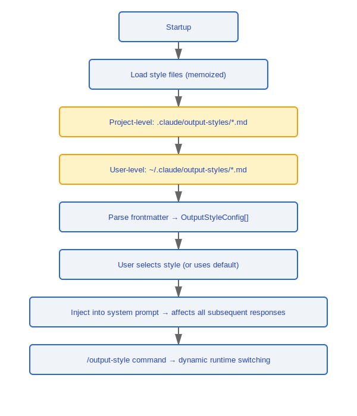

# Output Styles System

> The output styles system allows users to customize Claude Code's response style -- from concise technical output to detailed teaching mode, configured via Markdown files and injected into the system prompt.

---

## Architecture Overview


---

## 1. Style Loading (loadOutputStylesDir.ts)

### 1.1 Loading Function

```typescript
function getOutputStyleDirStyles(cwd: string): OutputStyleConfig[]
```

- **Memoized**: results are cached to avoid repeated filesystem reads
- Call `clearOutputStyleCaches()` to force cache invalidation

### 1.2 Search Paths

Style files are loaded in the following priority order:

| Priority | Path                              | Scope        |
|----------|----------------------------------|--------------|
| 1        | `{cwd}/.claude/output-styles/`   | Project-level |
| 2        | `~/.claude/output-styles/`       | User-level    |

### 1.3 File Format

Each style is defined as a Markdown file using YAML frontmatter:

```markdown
---
name: concise
description: Concise technical style, minimal verbosity
keepCodingInstructions: true
---

Your answers should be concise and direct. Avoid unnecessary explanations.
Prefer code blocks to demonstrate solutions.
```

---

## 2. Configuration Fields

### OutputStyleConfig Structure

| Field                     | Type      | Required | Description                                          |
|--------------------------|-----------|----------|------------------------------------------------------|
| `name`                   | `string`  | Yes      | Unique style identifier name                         |
| `description`            | `string`  | Yes      | Style description (shown in the selection UI)        |
| `prompt`                 | `string`  | Yes      | Prompt text injected into the system prompt          |
| `source`                 | `string`  | No       | Style origin (`'project'` / `'user'`)               |
| `keepCodingInstructions` | `boolean` | No       | Whether to keep default coding instructions (default `true`) |

### Field Details

- **`name`** -- identifier used when switching styles via the `/output-style` command
- **`description`** -- displayed to the user in the style selection list
- **`prompt`** -- the Markdown body section, all content after the frontmatter
- **`source`** -- auto-populated, indicates whether the style file came from the project directory or the user directory
- **`keepCodingInstructions`** -- when set to `false`, the style prompt completely replaces the default coding instructions

---

## 3. Integration

### 3.1 System Prompt Injection

The style prompt is injected during system message construction. The merge strategy is determined by the `keepCodingInstructions` field:

```typescript
// keepCodingInstructions = true  --> appended after default instructions
// keepCodingInstructions = false --> completely replaces default instructions
```

### 3.2 Runtime Switching

```
/output-style              -- list all available styles
/output-style <name>       -- switch to the specified style
/output-style default      -- restore the default style
```

### 3.3 Built-in Style Constants

File path: `constants/outputStyles.ts`

```typescript
// Pre-defined built-in styles, no need for users to create .md files
const BUILT_IN_STYLES: OutputStyleConfig[] = [
  // concise, verbose, educational, ...
];
```

### 3.4 Cache Management

```typescript
// Call in the following scenarios to refresh styles:
// - Project directory switch
// - User manually requests a refresh
// - Filesystem change detected
function clearOutputStyleCaches(): void
```

---

## Design Philosophy

### Design Philosophy: Why Markdown Files Instead of JSON Configuration?

The core of output styles is prompt text -- users want to tell Claude "what style to use when responding." Choosing the Markdown format is a "what you see is what you get" design philosophy:

1. **Markdown itself is the prompt** -- the body text users write in the `.md` file is injected directly into the system prompt, with no need to learn an additional DSL or configuration syntax. In the source code, `loadOutputStylesDir.ts` uses the content after the frontmatter directly as the `prompt` field (line 75: `prompt: content.trim()`)
2. **frontmatter provides structured metadata** -- machine-readable information such as name, description, and flag fields goes in the YAML frontmatter, naturally separated from the prompt content
3. **User-friendly editing experience** -- any text editor can edit Markdown, no dedicated JSON editing tool needed, reducing the probability of formatting errors

### Design Philosophy: Why Does keepCodingInstructions Default to true?

The decision logic in the source code `prompts.ts` (lines 564-567): when `outputStyleConfig === null` or `keepCodingInstructions === true`, `getSimpleDoingTasksSection()` (the default coding instructions) is included. The reasons for defaulting to `true`:

- **Most custom styles are supplements, not replacements** -- users want a "concise style" but don't want to lose coding rules like "don't create unnecessary files" or "prefer editing existing files"
- **Safe default** -- if the default were `false`, every style a user creates would accidentally lose the coding instructions, causing Claude's behavior to degrade
- **Explicit replacement** -- only when the user explicitly sets `keepCodingInstructions: false` are the default instructions completely replaced, making it a conscious choice

---

## Engineering Practices

### Creating a Custom Output Style

1. Create a `.md` file in the `.claude/output-styles/` directory (project-level) or `~/.claude/output-styles/` directory (user-level)
2. Write the YAML frontmatter, including `name` (required), `description` (required), and `keepCodingInstructions` (optional, defaults to true)
3. The body content after the frontmatter becomes the prompt text injected into the system prompt
4. Use `/output-style <name>` to switch to the new style

### Troubleshooting When a Style Doesn't Take Effect

1. **Cache issue** -- call `clearOutputStyleCaches()` to force-clear the memoized cache (in the source code, lines 94-96 clear both the `getOutputStyleDirStyles` and `loadMarkdownFilesForSubdir` cache levels simultaneously)
2. **File path** -- confirm the file is under the correct search path (project-level `.claude/output-styles/` or user-level `~/.claude/output-styles/`)
3. **frontmatter format** -- note that `keep-coding-instructions` uses kebab-case in the frontmatter (not camelCase); the source code handles both `true` and `'true'` value variants for compatibility

### Choosing Between Project-Level and User-Level Styles

- **Project-level** (`.claude/output-styles/`): suitable for team-wide consistency, can be committed to version control, shared by all team members
- **User-level** (`~/.claude/output-styles/`): suitable for personal preferences, effective across projects, does not affect other team members
- When a style with the same name exists in both, the project-level style takes priority over the user-level style

---

## Lifecycle Flow




---

[← Teleport](../37-Teleport/teleport-system-en.md) | [Index](../README_EN.md) | [Native Modules →](../39-原生模块/native-modules-en.md)
