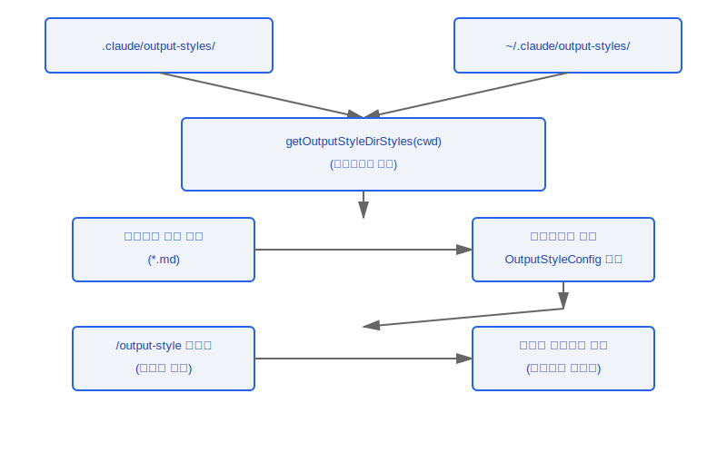
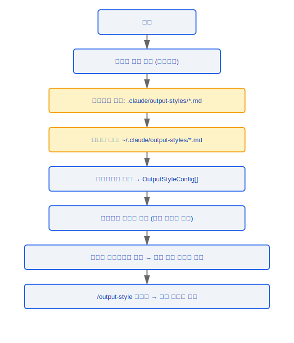

# 출력 스타일(Output Style) 시스템

> 출력 스타일(Output Style) 시스템은 사용자가 Claude Code의 응답 스타일을 커스터마이즈할 수 있도록 합니다 -- 간결한 기술 출력부터 상세한 교육 모드까지, 마크다운 파일로 구성하고 시스템 프롬프트에 주입됩니다.

---

## 아키텍처 개요



---

## 1. 스타일 로딩 (loadOutputStylesDir.ts)

### 1.1 로딩 함수

```typescript
function getOutputStyleDirStyles(cwd: string): OutputStyleConfig[]
```

- **메모이즈(Memoized)**: 반복적인 파일 시스템 읽기를 피하기 위해 결과가 캐시됨
- `clearOutputStyleCaches()`를 호출하여 캐시 무효화를 강제할 수 있음

### 1.2 검색 경로

스타일 파일은 다음 우선 순위 순으로 로드됩니다:

| 우선 순위 | 경로                             | 범위         |
|----------|----------------------------------|--------------|
| 1        | `{cwd}/.claude/output-styles/`   | 프로젝트 수준 |
| 2        | `~/.claude/output-styles/`       | 사용자 수준   |

### 1.3 파일 형식

각 스타일은 YAML 프론트매터를 사용하는 마크다운 파일로 정의됩니다:

```markdown
---
name: concise
description: 간결한 기술 스타일, 최소한의 상세 설명
keepCodingInstructions: true
---

답변은 간결하고 직접적이어야 합니다. 불필요한 설명을 피하십시오.
솔루션을 보여주기 위해 코드 블록을 선호하십시오.
```

---

## 2. 구성 필드

### OutputStyleConfig 구조

| 필드                      | 타입      | 필수 여부 | 설명                                                 |
|--------------------------|-----------|----------|------------------------------------------------------|
| `name`                   | `string`  | 예       | 고유 스타일 식별자 이름                               |
| `description`            | `string`  | 예       | 스타일 설명 (선택 UI에 표시됨)                        |
| `prompt`                 | `string`  | 예       | 시스템 프롬프트에 주입되는 프롬프트 텍스트            |
| `source`                 | `string`  | 아니요   | 스타일 출처 (`'project'` / `'user'`)                 |
| `keepCodingInstructions` | `boolean` | 아니요   | 기본 코딩 지침 유지 여부 (기본값 `true`)              |

### 필드 세부 정보

- **`name`** -- `/output-style` 명령을 통해 스타일을 전환할 때 사용되는 식별자
- **`description`** -- 스타일 선택 목록에서 사용자에게 표시됨
- **`prompt`** -- 마크다운 본문 섹션, 프론트매터 이후의 모든 내용
- **`source`** -- 자동으로 채워지며, 스타일 파일이 프로젝트 디렉터리에서 왔는지 사용자 디렉터리에서 왔는지 나타냄
- **`keepCodingInstructions`** -- `false`로 설정하면 스타일 프롬프트가 기본 코딩 지침을 완전히 대체함

---

## 3. 통합

### 3.1 시스템 프롬프트 주입

스타일 프롬프트는 시스템 메시지 구성 중에 주입됩니다. 병합 전략은 `keepCodingInstructions` 필드에 의해 결정됩니다:

```typescript
// keepCodingInstructions = true  --> 기본 지침 뒤에 추가
// keepCodingInstructions = false --> 기본 지침을 완전히 대체
```

### 3.2 런타임 전환

```
/output-style              -- 사용 가능한 모든 스타일 목록
/output-style <name>       -- 지정된 스타일로 전환
/output-style default      -- 기본 스타일 복원
```

### 3.3 내장 스타일 상수

파일 경로: `constants/outputStyles.ts`

```typescript
// 사전 정의된 내장 스타일, 사용자가 .md 파일을 만들 필요 없음
const BUILT_IN_STYLES: OutputStyleConfig[] = [
  // concise, verbose, educational, ...
];
```

### 3.4 캐시 관리

```typescript
// 다음 시나리오에서 스타일을 새로 고침하기 위해 호출:
// - 프로젝트 디렉터리 전환
// - 사용자가 수동으로 새로 고침 요청
// - 파일 시스템 변경 감지
function clearOutputStyleCaches(): void
```

---

## 설계 철학

### 설계 철학: 왜 JSON 구성 대신 마크다운 파일인가?

출력 스타일(Output Style)의 핵심은 프롬프트 텍스트입니다 -- 사용자는 Claude에게 "어떤 스타일로 응답할지"를 전달하고 싶어합니다. 마크다운 형식을 선택하는 것은 "보이는 대로 얻는다"는 설계 철학입니다:

1. **마크다운 자체가 프롬프트** -- 사용자가 `.md` 파일에 작성하는 본문 텍스트가 시스템 프롬프트에 직접 주입되며, 추가적인 DSL이나 구성 구문을 배울 필요가 없습니다. 소스 코드에서 `loadOutputStylesDir.ts`는 프론트매터 이후의 내용을 직접 `prompt` 필드로 사용합니다(75줄: `prompt: content.trim()`)
2. **프론트매터가 구조화된 메타데이터 제공** -- 이름, 설명, 플래그 필드 등 머신 가독성 정보는 YAML 프론트매터에 들어가며, 프롬프트 내용과 자연스럽게 분리됩니다
3. **사용자 친화적인 편집 경험** -- 어떤 텍스트 편집기로도 마크다운을 편집할 수 있으며, 전용 JSON 편집 도구가 필요하지 않아 서식 오류 가능성을 줄입니다

### 설계 철학: 왜 keepCodingInstructions의 기본값이 true인가?

소스 코드 `prompts.ts`의 결정 로직(564-567줄): `outputStyleConfig === null` 또는 `keepCodingInstructions === true`일 때 `getSimpleDoingTasksSection()`(기본 코딩 지침)이 포함됩니다. 기본값이 `true`인 이유:

- **대부분의 커스텀 스타일은 대체가 아닌 보완** -- 사용자는 "간결한 스타일"을 원하지만 "불필요한 파일을 만들지 마라" 또는 "기존 파일 편집을 선호하라"와 같은 코딩 규칙을 잃고 싶지 않습니다
- **안전한 기본값** -- 기본값이 `false`라면 사용자가 만드는 모든 스타일이 실수로 코딩 지침을 잃게 되어 Claude의 동작이 저하됩니다
- **명시적 대체** -- 사용자가 명시적으로 `keepCodingInstructions: false`를 설정할 때만 기본 지침이 완전히 대체되며, 의식적인 선택이 됩니다

---

## 엔지니어링 실천

### 커스텀 출력 스타일(Output Style) 만들기

1. `.claude/output-styles/` 디렉터리(프로젝트 수준) 또는 `~/.claude/output-styles/` 디렉터리(사용자 수준)에 `.md` 파일을 생성
2. YAML 프론트매터 작성: `name`(필수), `description`(필수), `keepCodingInstructions`(선택, 기본값 true) 포함
3. 프론트매터 이후의 본문 내용이 시스템 프롬프트에 주입되는 프롬프트 텍스트가 됨
4. `/output-style <name>`을 사용하여 새 스타일로 전환

### 스타일이 적용되지 않을 때 문제 해결

1. **캐시 문제** -- `clearOutputStyleCaches()`를 호출하여 메모이즈된 캐시를 강제 초기화합니다(소스 코드 94-96줄에서 `getOutputStyleDirStyles`와 `loadMarkdownFilesForSubdir` 캐시 레벨을 동시에 지웁니다)
2. **파일 경로** -- 파일이 올바른 검색 경로(프로젝트 수준 `.claude/output-styles/` 또는 사용자 수준 `~/.claude/output-styles/`) 아래에 있는지 확인
3. **프론트매터 형식** -- 프론트매터에서 `keep-coding-instructions`는 kebab-case를 사용함(camelCase가 아님)에 주의; 소스 코드는 호환성을 위해 `true`와 `'true'` 값 변형 모두를 처리합니다

### 프로젝트 수준과 사용자 수준 스타일 선택

- **프로젝트 수준** (`.claude/output-styles/`): 팀 전체의 일관성에 적합하며, 버전 관리에 커밋하여 모든 팀원이 공유할 수 있음
- **사용자 수준** (`~/.claude/output-styles/`): 개인 선호도에 적합하며, 프로젝트 전반에 걸쳐 유효하고 다른 팀원에게 영향을 미치지 않음
- 동일한 이름의 스타일이 양쪽에 모두 존재할 때 프로젝트 수준 스타일이 사용자 수준 스타일보다 우선합니다

---

## 생명주기 흐름




---

[← 텔레포트](../37-Teleport/teleport-system-ko.md) | [인덱스](../README_KO.md) | [네이티브 모듈 →](../39-原生模块/native-modules-ko.md)
