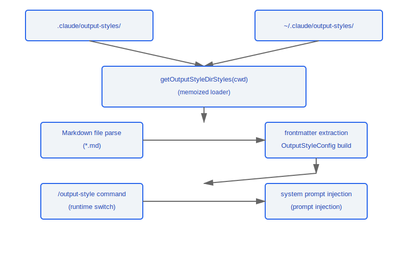

# 输出样式系统

> 输出样式系统允许用户自定义 Claude Code 的响应风格 -- 从简洁技术输出到详细教学模式, 通过 Markdown 文件配置并注入系统提示。

---

## 架构总览



---

## 1. 样式加载 (loadOutputStylesDir.ts)

### 1.1 加载函数

```typescript
function getOutputStyleDirStyles(cwd: string): OutputStyleConfig[]
```

- **Memoized**: 结果缓存, 避免重复文件系统读取
- 调用 `clearOutputStyleCaches()` 可强制使缓存失效

### 1.2 搜索路径

样式文件按以下优先级顺序加载:

| 优先级 | 路径                              | 作用域  |
|--------|----------------------------------|--------|
| 1      | `{cwd}/.claude/output-styles/`   | 项目级  |
| 2      | `~/.claude/output-styles/`       | 用户级  |

### 1.3 文件格式

每个样式定义为一个 Markdown 文件, 使用 YAML frontmatter:

```markdown
---
name: concise
description: 简洁技术风格, 最少废话
keepCodingInstructions: true
---

你的回答应该简洁、直接。避免不必要的解释。
优先使用代码块展示解决方案。
```

---

## 2. 配置字段

### OutputStyleConfig 结构

| 字段                      | 类型      | 必填 | 说明                                 |
|--------------------------|-----------|------|--------------------------------------|
| `name`                   | `string`  | Yes  | 样式唯一标识名                         |
| `description`            | `string`  | Yes  | 样式描述 (用于选择界面展示)              |
| `prompt`                 | `string`  | Yes  | 注入系统提示的 prompt 文本              |
| `source`                 | `string`  | No   | 样式来源 (`'project'` / `'user'`)     |
| `keepCodingInstructions` | `boolean` | No   | 是否保留默认编码指令 (默认 `true`)       |

### 字段详解

- **`name`** -- 用于 `/output-style` 命令切换时的标识符
- **`description`** -- 在样式选择列表中展示给用户
- **`prompt`** -- Markdown 正文部分, frontmatter 之后的所有内容
- **`source`** -- 自动填充, 指示样式文件来自项目目录还是用户目录
- **`keepCodingInstructions`** -- 设为 `false` 时, 样式 prompt 完全替代默认编码指令

---

## 3. 集成

### 3.1 系统提示注入

样式 prompt 在系统消息构建时注入, 根据 `keepCodingInstructions` 字段决定合并策略:

```typescript
// keepCodingInstructions = true  --> 追加到默认指令之后
// keepCodingInstructions = false --> 完全替代默认指令
```

### 3.2 运行时切换

```
/output-style              -- 列出所有可用样式
/output-style <name>       -- 切换到指定样式
/output-style default      -- 恢复默认样式
```

### 3.3 内置样式常量

文件路径: `constants/outputStyles.ts`

```typescript
// 预定义的内置样式, 无需用户创建 .md 文件
const BUILT_IN_STYLES: OutputStyleConfig[] = [
  // concise, verbose, educational, ...
];
```

### 3.4 缓存管理

```typescript
// 在以下场景调用以刷新样式:
// - 项目目录切换
// - 用户手动请求刷新
// - 文件系统变更检测
function clearOutputStyleCaches(): void
```

---

## 设计理念

### 设计理念：为什么用 Markdown 文件而不是 JSON 配置？

输出样式的核心是 prompt 文本——用户想要告诉 Claude "用什么风格回答"。选择 Markdown 格式是"所见即所得"的设计哲学：

1. **Markdown 本身就是 prompt** -- 用户在 `.md` 文件中写的正文会被直接注入系统提示，不需要学习额外的 DSL 或配置语法。源码中 `loadOutputStylesDir.ts` 将 frontmatter 之后的内容直接作为 `prompt` 字段（第 75 行 `prompt: content.trim()`）
2. **frontmatter 提供结构化元数据** -- 名称、描述、标志位等机器可读信息放在 YAML frontmatter 中，与 prompt 内容自然分离
3. **用户友好的编辑体验** -- 任何文本编辑器都能编辑 Markdown，无需专门的 JSON 编辑工具，减少格式错误的概率

### 设计理念：为什么 keepCodingInstructions 默认 true？

源码 `prompts.ts`（第 564-567 行）中的判断逻辑：当 `outputStyleConfig === null` 或 `keepCodingInstructions === true` 时，会包含 `getSimpleDoingTasksSection()`（默认编码指令）。默认 `true` 的原因：

- **大部分自定义样式是补充而非替代** -- 用户想要"简洁风格"但不想丢失"不要创建不必要文件"、"优先编辑现有文件"等编码规则
- **安全默认值** -- 如果默认为 `false`，用户创建的每个样式都会意外丢失编码指令，导致 Claude 的行为退化
- **显式替代** -- 只有当用户明确设置 `keepCodingInstructions: false` 时，才完全替代默认指令，这是一个有意识的选择

---

## 工程实践

### 创建自定义输出样式

1. 在 `.claude/output-styles/` 目录（项目级）或 `~/.claude/output-styles/` 目录（用户级）创建 `.md` 文件
2. 编写 YAML frontmatter，包含 `name`（必填）、`description`（必填）、`keepCodingInstructions`（可选，默认 true）
3. frontmatter 之后的正文内容即为注入系统提示的 prompt 文本
4. 使用 `/output-style <name>` 切换到新样式

### 样式不生效时的排查步骤

1. **缓存问题** -- 调用 `clearOutputStyleCaches()` 强制清除 memoized 缓存（源码第 94-96 行同时清除 `getOutputStyleDirStyles` 和 `loadMarkdownFilesForSubdir` 两级缓存）
2. **文件路径** -- 确认文件在正确的搜索路径下（项目级 `.claude/output-styles/` 或用户级 `~/.claude/output-styles/`）
3. **frontmatter 格式** -- 注意 `keep-coding-instructions` 在 frontmatter 中使用短横线命名（非驼峰），源码中做了 `true`/`'true'` 两种值的兼容解析

### 项目级 vs 用户级样式的选择

- **项目级**（`.claude/output-styles/`）：适合团队统一风格，可以提交到版本控制，所有团队成员共享
- **用户级**（`~/.claude/output-styles/`）：适合个人偏好，跨项目生效，不影响团队其他成员
- 当同名样式存在时，项目级优先级高于用户级

---

## 生命周期流程


---

[← Teleport](../37-Teleport/teleport-system.md) | [目录](../README.md) | [原生模块 →](../39-原生模块/native-modules.md)
