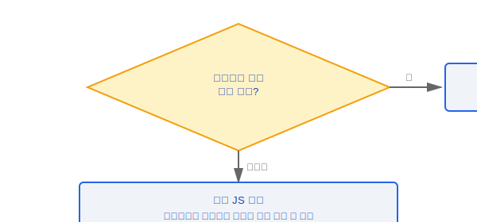

# 네이티브 모듈(Native Module)과 핵심 도구

Claude Code의 네이티브 모듈(Native Module) 레이어는 파일 인덱싱, 색상 차이 계산, 레이아웃 엔진 등의 핵심 기능과 출력 스타일(Output Style), 마이그레이션(Migration), 모델 선택을 위한 인프라를 제공합니다.

### 설계 철학: 왜 순수 JS 대신 FFI 브리징인가?

네이티브 모듈(Native Module) 레이어(`native-ts/`)는 성능 중심의 설계 결정으로 존재합니다:

1. **색상 차이 계산** -- Color Diff는 무거운 픽셀 수준의 수학 연산(색 공간 변환, 행렬 곱셈)을 수반하며, 순수 JS 부동소수점 성능은 컴파일된 언어보다 훨씬 열등합니다
2. **파일 인덱싱** -- FileIndex는 수만 개의 파일 경로에 대해 퍼지 매칭과 정렬을 수행해야 합니다. 소스 주석은 이것이 "vendor/file-index-src(Rust NAPI 모듈)의 순수 TypeScript 포트"라고 명시하며, 원래 버전은 Rust의 nucleo 라이브러리를 기반으로 합니다(`native-ts/file-index/index.ts` 2-4줄)
3. **Yoga 레이아웃** -- Ink 터미널 렌더링은 플렉스 레이아웃 계산이 필요합니다. Yoga는 Facebook의 C++ 레이아웃 엔진이며, FFI 바인딩은 거의 네이티브에 가까운 레이아웃 성능을 제공합니다

### 설계 철학: 왜 네이티브 모듈(Native Module)이 선택 사항인가?



모든 플랫폼이 네이티브 코드를 컴파일할 수 있는 것은 아닙니다(예: 일부 CI 환경, 제한된 컨테이너, Windows ARM 등). 순수 JS 구현으로의 우아한 저하(Graceful Degradation)는 가용성을 보장합니다:
- FileIndex는 이미 완전한 순수 TypeScript 구현(371줄)을 가지고 있으며, nucleo의 동작을 정확하게 에뮬레이션하는 점수 알고리즘이 있습니다
- 이 "선택적 네이티브" 패턴은 Node.js 생태계의 모범 사례입니다 — `sharp`와 `better-sqlite3` 같은 npm 패키지도 유사한 전략을 사용합니다

### 엔지니어링 실천

**네이티브 모듈(Native Module) 컴파일 실패 디버깅**:
- `node-gyp` 환경 확인: Python 3.x와 C++ 컴파일러 필요 (Windows는 Visual Studio Build Tools 필요)
- Node.js 버전 호환성 확인: 네이티브 모듈(Native Module)은 일반적으로 특정 Node ABI 버전용으로 컴파일됩니다
- Bun 런타임을 사용하는 경우 `bun:ffi` 지원 상태를 확인하십시오

**새 네이티브 모듈(Native Module) 추가를 위한 체크리스트**:
1. `native-ts/` 아래에 새 모듈 디렉터리를 생성
2. 동시에 순수 JS 폴백 구현을 제공 (이는 선택 사항이 아닌 필수 요구 사항)
3. 로딩 레이어에서 자동 감지 구현: 네이티브 버전을 선호하고, 실패 시 JS 버전으로 폴백
4. 순수 JS 버전의 API 시그니처가 네이티브 버전과 완전히 동일한지 확인

---

## 파일 인덱스 (file-index/index.ts, 371줄)

### 개요

퍼지 파일 검색 엔진의 순수 TypeScript 구현으로, 이전의 Rust nucleo 바인딩을 대체하여 네이티브 의존성을 제거합니다.

### FileIndex 클래스

#### loadFromFileList

```typescript
loadFromFileList(files: string[]) → void
```

파일 목록을 동기적으로 로드합니다:
- 파일 경로를 중복 제거
- 각 파일에 대한 검색 인덱스를 구축 (비트맵 + 정규화된 경로)

#### loadFromFileListAsync

```typescript
loadFromFileListAsync(files: string[]) → Promise<void>
```

파일 목록을 비동기적으로 로드합니다:
- 청크 단위로 처리하며 청크 사이에 이벤트 루프에 양보
- 대규모 파일 목록에 대한 UI 렌더링 차단을 방지
- 수만 개의 파일이 있는 대형 프로젝트에 적합

#### search

```typescript
search(query: string, limit: number) → SearchResult[]
```

퍼지 검색을 수행하고 상위 K개의 결과를 반환합니다:
- 쿼리를 정규화
- 모든 인덱싱된 파일에 대한 유사도 점수를 계산
- 상위 K 선택 알고리즘을 사용 (전체 정렬 회피)
- 점수 내림차순으로 정렬된 결과를 반환

### 점수 알고리즘

#### 기본 점수

```typescript
SCORE_MATCH  // 기본 매칭 점수
```

각 매칭된 문자는 기본 점수를 받습니다.

#### 보너스 점수

- **경계 보너스**: 단어 경계에서 매칭 발생 (경로 구분 기호, 밑줄, 하이픈 이후)
- **CamelCase 보너스**: camelCase 명명에서 대문자에 매칭 발생
- **연속 보너스**: 연속으로 매칭된 문자는 증가하는 보너스를 받음

#### 비트맵 최적화

```
26비트 마스크 → O(1) 문자 존재 감지
```

각 파일은 파일 경로에 어떤 문자가 있는지를 기록하는 26비트 비트마스크를 유지합니다. 쿼리 시 비트맵을 먼저 확인하며, 쿼리의 문자가 파일의 비트맵에 없으면 해당 파일을 즉시 건너뛰어 O(1) 빠른 거부를 달성합니다.

#### 테스트 파일 패널티

```typescript
// 테스트 파일 점수는 1.05배로 나눔 (분모, 순위 낮춤)
```

test/spec/mock 같은 패턴이 포함된 파일 경로는 약간의 순위 패널티를 받습니다(점수를 1.05로 나눔). 동일한 매칭 품질에서 비테스트 파일이 더 높은 순위를 갖도록 합니다.

#### 상위 K 선택

힙 또는 부분 정렬 알고리즘을 사용하여 상위 K개의 결과를 선택하며, 시간 복잡도는 전체 정렬의 O(n log n) 대신 O(n log k)입니다.

---

## 색상 차이 (color-diff/index.ts, ~10KB)

### 개요

차이 계산 엔진의 순수 TypeScript 구현입니다.

### 핵심 기능

- 시각적 차이를 정량화하기 위한 색상 행렬 계산
- 여러 색 공간에서의 차이 메트릭 지원
- 터미널 차이 표시를 위한 기본 계산 제공

---

## Yoga 레이아웃 (yoga-layout/index.ts, 27KB)

### 개요

Yoga 레이아웃 엔진의 바인딩으로, Ink 터미널 렌더링을 위한 플렉스 레이아웃 지원을 제공합니다.

### 열거형 정의

```typescript
// 방향
enum Direction { Inherit, LTR, RTL }

// 주 축 정렬
enum Justify { FlexStart, Center, FlexEnd, SpaceBetween, SpaceAround, SpaceEvenly }

// 교차 축 정렬
enum Align { Auto, FlexStart, Center, FlexEnd, Stretch, Baseline, SpaceBetween, SpaceAround }

// 디스플레이 모드
enum Display { Flex, None }

// 래핑
enum Wrap { NoWrap, Wrap, WrapReverse }

// 오버플로 처리
enum Overflow { Visible, Hidden, Scroll }

// 포지셔닝
enum Position { Static, Relative, Absolute }
```

### 사용법

- 커스텀 Ink 렌더러에 의해 사용됨
- 플렉스박스 기반 터미널 UI 레이아웃을 구현
- 중첩 컨테이너, 유연한 크기 조정, 정렬, 래핑 지원

---

## 출력 스타일(Output Style) (src/outputStyles/)

### loadOutputStylesDir.ts

출력 스타일 정의를 검색하고 로드하는 메모이즈된 로더입니다.

#### 검색 경로

```
프로젝트 수준: .claude/output-styles/
사용자 수준:    ~/.claude/output-styles/
```

프로젝트 수준에서 사용자 수준 순으로 스타일 파일을 검색합니다.

#### 파일 형식

프론트매터 메타데이터가 있는 마크다운 파일:

```markdown
---
name: "Custom Style"
description: "커스텀 출력 스타일"
keepCodingInstructions: true
---

여기에 프롬프트 지침을 작성하세요...
```

#### OutputStyleConfig 필드

```typescript
interface OutputStyleConfig {
  name: string                      // 스타일 이름
  description: string               // 스타일 설명
  prompt: string                    // 시스템 프롬프트에 주입되는 내용
  source: 'project' | 'user'       // 소스 (프로젝트 수준 또는 사용자 수준)
  keepCodingInstructions: boolean   // 기본 코딩 지침 유지 여부
}
```

#### clearOutputStyleCaches

```typescript
clearOutputStyleCaches() → void
```

메모이즈된 캐시를 지워 다음 호출 시 스타일 파일을 다시 로드하도록 강제합니다.

---

## 마이그레이션(Migration) (src/migrations/, 11개 파일)

설정 및 설정 파일의 버전 마이그레이션(Migration)을 처리하여 이전 구성에서 새 구성으로 원활하게 업그레이드할 수 있도록 합니다.

### 마이그레이션 목록

| 마이그레이션 함수 | 설명 |
|-------------------|-------------|
| `migrateAutoUpdatesToSettings` | 자동 업데이트 구성을 통합 설정 시스템으로 마이그레이션 |
| `migrateBypassPermissionsAcceptedToSettings` | 권한 우회 플래그를 설정으로 마이그레이션 |
| `migrateEnableAllProjectMcpServersToSettings` | 프로젝트 MCP 서버 활성화 구성을 설정으로 마이그레이션 |
| `migrateFennecToOpus` | Fennec(내부 코드명) 모델 참조를 Opus로 마이그레이션 |
| `migrateLegacyOpusToCurrent` | 레거시 Opus 모델 ID를 현재 버전으로 마이그레이션 |
| `migrateOpusToOpus1m` | Opus를 Opus 1M 컨텍스트 버전으로 마이그레이션 |
| `migrateReplBridgeEnabledToRemoteControlAtStartup` | REPL Bridge 구성을 시작 시 원격 제어 구성으로 마이그레이션 |
| `migrateSonnet1mToSonnet45` | Sonnet 1M을 Sonnet 4.5로 마이그레이션 |
| `migrateSonnet45ToSonnet46` | Sonnet 4.5를 Sonnet 4.6으로 마이그레이션 |
| `resetAutoModeOptInForDefaultOffer` | 자동 모드 옵트인 상태를 재설정 |
| `resetProToOpusDefault` | Pro 사용자의 기본 모델을 Opus로 재설정 |

각 마이그레이션 함수:
- 마이그레이션이 필요한지 확인 (멱등성)
- 마이그레이션 로직 실행
- 재실행을 방지하기 위해 마이그레이션 완료 상태를 기록

---

## 모델 선택 (src/utils/model/)

### getMainLoopModel

```typescript
getMainLoopModel() → string
```

우선 순위에 따라 메인 루프에서 사용할 모델을 결정합니다:

```
1. override (코드 수준 강제 재정의)
2. CLI flag (--model 인수)
3. env var (CLAUDE_MODEL 환경 변수)
4. settings (사용자 설정의 모델 설정)
5. default (기본 모델)
```

### MODEL_ALIASES

```typescript
const MODEL_ALIASES = [
  'sonnet',      // → claude-sonnet-4-6
  'opus',        // → claude-opus-4-6
  'haiku',       // → claude-haiku
  'best',        // → 현재 최고 모델
  'sonnet[1m]',  // → claude-sonnet-4-6 (1M 컨텍스트)
  'opus[1m]',    // → claude-opus-4-6 (1M 컨텍스트)
  'opusplan',    // → 계획 모드의 opus
]
```

사용자는 별칭을 사용하여 모델 지정을 단순화할 수 있습니다.

### APIProvider

```typescript
type APIProvider = 'firstParty' | 'bedrock' | 'vertex' | 'foundry'
```

- `firstParty`: Anthropic 직접 API
- `bedrock`: AWS Bedrock
- `vertex`: Google Cloud Vertex AI
- `foundry`: 커스텀 모델 서비스

### 더 이상 사용되지 않는 모델 추적

더 이상 사용되지 않는 모델과 그 종료 날짜의 목록을 유지합니다:
- 사용자가 더 이상 사용되지 않는 모델 사용을 시도할 때 경고
- 대체 모델로의 마이그레이션을 자동으로 제안
- 타임라인 표시를 위한 종료 날짜 정보 포함

### 1M 컨텍스트 접근 확인

```typescript
checkOpus1mAccess() → Promise<boolean>
checkSonnet1mAccess() → Promise<boolean>
```

현재 계정이 1M 컨텍스트 버전의 모델에 접근할 수 있는지 확인합니다:
- 구독 유형과 권한 수준에 의해 결정됨
- 접근이 불가능하면 표준 컨텍스트 버전으로 다운그레이드

### 모델 기능

```typescript
// API 쿼리 엔드포인트
GET /v1/models

// 로컬 캐시
~/.claude/cache/model-capabilities.json
```

- API를 통해 모델의 특정 기능 파라미터를 쿼리
- 쿼리 결과는 반복 요청을 피하기 위해 로컬 파일에 캐시
- 컨텍스트 창 크기, 지원되는 기능 플래그 등의 정보 포함


---

[← 출력 스타일](../38-输出样式/output-styles-ko.md) | [인덱스](../README_KO.md) | [마이그레이션 시스템 →](../40-迁移系统/migration-system-ko.md)
