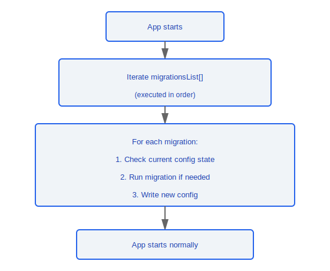
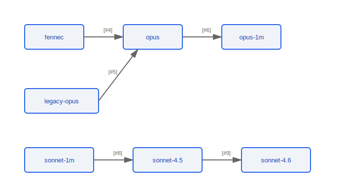

# Configuration Migration System

> All migrations run automatically at application startup and are designed to be idempotent -- repeated execution produces no side effects. The migration system ensures smooth transitions of user configuration across version upgrades.

---

## Overview

### Design Principles

- **Startup-time execution**: All migrations run sequentially during the application initialization phase
- **Idempotency**: Each migration function can be safely executed multiple times; completed migrations are not re-applied
- **Forward compatibility**: Migrations perform one-way transformations only; rollback is not supported
- **Lossless transformation**: No user data is lost during migration

### Design Rationale: Why Idempotent Design?

Users may exit unexpectedly mid-migration (crash, force-quit, power loss), causing the migration to run again on the next startup. The idempotent guard pattern found in the source code (e.g., the `"Already migrated, just mark for removal"` comment at lines 54-56 of `migrateEnableAllProjectMcpServersToSettings.ts`) ensures:
- Already-completed migrations are safely skipped
- Partially completed migrations can resume from where they left off rather than producing an inconsistent state

### Design Rationale: Why Forward-Only Migrations Without Rollback?

- **Downgrade scenarios are extremely rare** -- Users almost never revert from a newer version to an older one
- **Rollback logic doubles complexity** -- Every migration would need both a forward and a reverse implementation; a bug in any rollback could cause data loss
- **Configuration changes are usually irreversible** -- For example, after a model name is migrated from `fennec` to `opus`, the old name is no longer valid, making rollback meaningless

### Design Rationale: Why Execute Synchronously at Startup?

Migrations affect configuration reads -- if executed asynchronously, race conditions could occur (the application might read unmigratable old config). In the source code, migrations execute sequentially in the synchronous flow: `App starts → iterate migrationsList[] → App starts normally`, ensuring:
- All subsequent code reads the fully migrated, latest version of the configuration
- No race window exists between "reading config" and "migrating config"

### Execution Flow



---

## Migration List

| #  | Function Name                                             | Description                              | Migration Direction                        |
|----|----------------------------------------------------------|------------------------------------------|--------------------------------------------|
| 1  | `migrateAutoUpdatesToSettings`                           | Feature flag migrated to settings        | Feature Flag -> `settings.json`            |
| 2  | `migrateBypassPermissionsAcceptedToSettings`             | Permission acceptance config to settings | Permission Config -> `settings.json`       |
| 3  | `migrateEnableAllProjectMcpServersToSettings`            | MCP enable config migrated to settings   | MCP Config -> `settings.json`              |
| 4  | `migrateFennecToOpus`                                    | Fennec model name updated to Opus        | `fennec` -> `opus`                         |
| 5  | `migrateLegacyOpusToCurrent`                             | Legacy Opus identifier updated           | Legacy Opus ID -> Current Opus ID          |
| 6  | `migrateOpusToOpus1m`                                    | Opus upgraded to Opus 1M context         | `opus` -> `opus-1m`                        |
| 7  | `migrateReplBridgeEnabledToRemoteControlAtStartup`       | REPL Bridge migrated to Remote Control   | REPL Bridge -> Remote Control              |
| 8  | `migrateSonnet1mToSonnet45`                              | Sonnet 1M migrated to Sonnet 4.5         | `sonnet-1m` -> `sonnet-4.5`                |
| 9  | `migrateSonnet45ToSonnet46`                              | Sonnet 4.5 migrated to Sonnet 4.6        | `sonnet-4.5` -> `sonnet-4.6`               |
| 10 | `resetAutoModeOptInForDefaultOffer`                      | Auto mode selection reset                | Reset opt-in state to default              |
| 11 | `resetProToOpusDefault`                                  | Pro users reset to Opus default          | Pro model preference -> Opus default       |

---

## Migration Categories

### Settings Migrations

Consolidates scattered feature flags and configuration items into `settings.json`:

```typescript
// Migration #1: Feature Flag -> settings
function migrateAutoUpdatesToSettings(): void

// Migration #2: Permission config -> settings
function migrateBypassPermissionsAcceptedToSettings(): void

// Migration #3: MCP config -> settings
function migrateEnableAllProjectMcpServersToSettings(): void
```

### Model Name Migrations

Automatically updates model identifiers in user configuration as model versions evolve:



### Feature Migrations

```typescript
// Migration #7: REPL Bridge -> Remote Control
function migrateReplBridgeEnabledToRemoteControlAtStartup(): void
// REPL Bridge functionality has been replaced by Remote Control
// Maps the old config to the new remote control option
```

### Reset Migrations

```typescript
// Migration #10: Reset user opt-in state when the default offer changes
function resetAutoModeOptInForDefaultOffer(): void

// Migration #11: Reset default model to Opus for Pro subscription users
function resetProToOpusDefault(): void
```

---

## Idempotency Guarantee

Each migration follows a uniform idempotent pattern:

```typescript
function migrationTemplate(): void {
  // 1. Read current configuration state
  const currentValue = readConfig('some.key');

  // 2. Check whether migration is needed (idempotency guard)
  if (currentValue === undefined || isAlreadyMigrated(currentValue)) {
    return; // Already completed or not applicable, skip
  }

  // 3. Execute migration
  writeConfig('new.key', transformValue(currentValue));

  // 4. Clean up old config (optional)
  removeConfig('some.key');
}
```

---

## Adding New Migrations

Things to note when adding a new migration:

1. Append to the end of the `migrationsList` array (preserve order)
2. Ensure the function is idempotent -- multiple calls produce the same result
3. Handle the case where configuration does not exist (new installations)
4. Add corresponding unit tests

### Engineering Practices

**Complete checklist for adding a new migration**:

1. Append the new migration function to the **end** of the `migrationsList` array (never insert in the middle; preserve execution order)
2. The migration function must be idempotent -- multiple calls produce exactly the same result. Follow the unified pattern in the source code: read first -> check whether migration is needed (idempotency guard) -> execute -> clean up
3. Handle the case where configuration does not exist -- new installation users have nothing, and `readConfig()` may return `undefined`
4. Add unit tests covering three scenarios:
   - Already-migrated state (should skip, no side effects)
   - Not-yet-migrated state (should execute migration correctly)
   - Configuration-absent state (should handle safely, throw no exceptions)

**Migration testing pattern**:
- Tests can be performed by calling the migration function directly with a mocked config file, without starting the full application
- Leveraging idempotency, you can call the migration function twice consecutively in tests to verify that the second call produces no changes

**Common pitfalls**:
- **Do not depend on the results of other migrations** -- Each migration must work independently and cannot assume a preceding migration has already run. Although `migrationsList` executes in order, if migration A depends on migration B's result, a failure in B will cascade-fail A
- **Do not make network calls inside migrations** -- Migrations execute synchronously at startup; network calls will block the startup flow and will cause the application to fail to start in offline scenarios
- **Do not delete code that reads old config fields** -- Retain the read logic for old fields as a compatibility layer until you can confirm all users have been migrated


---

[← Native Modules](../39-原生模块/native-modules-en.md) | [Index](../README_EN.md) | [File Persistence →](../41-文件持久化/file-persistence-en.md)
