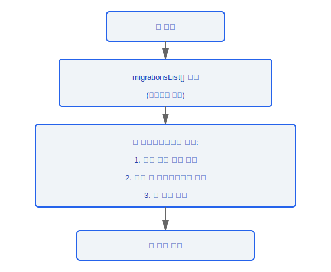
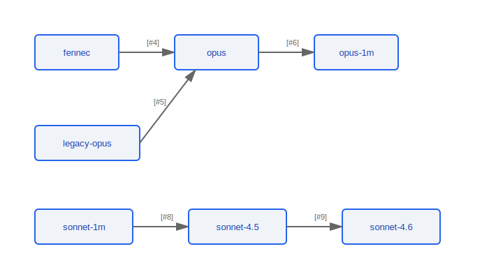

# 구성 마이그레이션(Migration) 시스템

> 모든 마이그레이션(Migration)은 애플리케이션 시작 시 자동으로 실행되며 멱등성을 갖도록 설계되어 있습니다 -- 반복 실행해도 부작용이 없습니다. 마이그레이션(Migration) 시스템은 버전 업그레이드를 통한 사용자 구성의 원활한 전환을 보장합니다.

---

## 개요

### 설계 원칙

- **시작 시 실행**: 모든 마이그레이션(Migration)은 애플리케이션 초기화 단계에서 순차적으로 실행됨
- **멱등성**: 각 마이그레이션 함수는 여러 번 안전하게 실행할 수 있으며, 완료된 마이그레이션은 재적용되지 않음
- **순방향 호환성**: 마이그레이션은 단방향 변환만 수행하며 롤백을 지원하지 않음
- **손실 없는 변환**: 마이그레이션 중에 사용자 데이터가 손실되지 않음

### 설계 근거: 왜 멱등성 설계인가?

사용자는 마이그레이션(Migration) 도중 예기치 않게 종료될 수 있습니다(크래시, 강제 종료, 전원 손실). 이는 다음 시작 시 마이그레이션이 다시 실행되도록 합니다. 소스 코드에서 발견된 멱등성 가드 패턴(예: `migrateEnableAllProjectMcpServersToSettings.ts`의 54-56줄에 있는 `"Already migrated, just mark for removal"` 주석)은 다음을 보장합니다:
- 이미 완료된 마이그레이션은 안전하게 건너뜀
- 부분적으로 완료된 마이그레이션은 불일치 상태를 생성하는 대신 중단된 곳에서 재개할 수 있음

### 설계 근거: 왜 롤백 없는 순방향 전용 마이그레이션인가?

- **다운그레이드 시나리오는 극히 드뭄** -- 사용자가 최신 버전에서 이전 버전으로 되돌리는 경우는 거의 없음
- **롤백 로직이 복잡도를 배가시킴** -- 모든 마이그레이션은 순방향과 역방향 구현이 모두 필요하며, 롤백의 버그는 데이터 손실을 유발할 수 있음
- **구성 변경은 대개 되돌릴 수 없음** -- 예를 들어 모델 이름이 `fennec`에서 `opus`로 마이그레이션된 후에는 이전 이름이 더 이상 유효하지 않아 롤백이 의미 없음

### 설계 근거: 왜 시작 시 동기적으로 실행하는가?

마이그레이션(Migration)은 구성 읽기에 영향을 미칩니다 -- 비동기적으로 실행하면 경쟁 조건이 발생할 수 있습니다(애플리케이션이 마이그레이션할 수 없는 이전 구성을 읽을 수 있음). 소스 코드에서 마이그레이션은 동기 흐름에서 순차적으로 실행됩니다: `앱 시작 → migrationsList[] 순회 → 앱 정상 시작`. 이는 다음을 보장합니다:
- 이후의 모든 코드가 완전히 마이그레이션된 최신 버전의 구성을 읽음
- "구성 읽기"와 "구성 마이그레이션" 사이에 경쟁 창이 없음

### 실행 흐름



---

## 마이그레이션 목록

| #  | 함수 이름                                                 | 설명                                     | 마이그레이션 방향                          |
|----|----------------------------------------------------------|------------------------------------------|--------------------------------------------|
| 1  | `migrateAutoUpdatesToSettings`                           | 기능 플래그를 설정으로 마이그레이션       | Feature Flag -> `settings.json`            |
| 2  | `migrateBypassPermissionsAcceptedToSettings`             | 권한 수락 구성을 설정으로 마이그레이션    | Permission Config -> `settings.json`       |
| 3  | `migrateEnableAllProjectMcpServersToSettings`            | MCP 활성화 구성을 설정으로 마이그레이션   | MCP Config -> `settings.json`              |
| 4  | `migrateFennecToOpus`                                    | Fennec 모델 이름을 Opus로 업데이트        | `fennec` -> `opus`                         |
| 5  | `migrateLegacyOpusToCurrent`                             | 레거시 Opus 식별자 업데이트               | Legacy Opus ID -> Current Opus ID          |
| 6  | `migrateOpusToOpus1m`                                    | Opus를 Opus 1M 컨텍스트로 업그레이드     | `opus` -> `opus-1m`                        |
| 7  | `migrateReplBridgeEnabledToRemoteControlAtStartup`       | REPL Bridge를 Remote Control로 마이그레이션 | REPL Bridge -> Remote Control            |
| 8  | `migrateSonnet1mToSonnet45`                              | Sonnet 1M을 Sonnet 4.5로 마이그레이션    | `sonnet-1m` -> `sonnet-4.5`                |
| 9  | `migrateSonnet45ToSonnet46`                              | Sonnet 4.5를 Sonnet 4.6으로 마이그레이션 | `sonnet-4.5` -> `sonnet-4.6`               |
| 10 | `resetAutoModeOptInForDefaultOffer`                      | 자동 모드 선택 재설정                     | 옵트인 상태를 기본값으로 재설정            |
| 11 | `resetProToOpusDefault`                                  | Pro 사용자를 Opus 기본값으로 재설정       | Pro 모델 기본 설정 -> Opus 기본값          |

---

## 마이그레이션 범주

### 설정 마이그레이션(Migration)

분산된 기능 플래그와 구성 항목을 `settings.json`으로 통합합니다:

```typescript
// 마이그레이션 #1: Feature Flag -> settings
function migrateAutoUpdatesToSettings(): void

// 마이그레이션 #2: 권한 구성 -> settings
function migrateBypassPermissionsAcceptedToSettings(): void

// 마이그레이션 #3: MCP 구성 -> settings
function migrateEnableAllProjectMcpServersToSettings(): void
```

### 모델 이름 마이그레이션(Migration)

모델 버전이 발전함에 따라 사용자 구성의 모델 식별자를 자동으로 업데이트합니다:



### 기능 마이그레이션(Migration)

```typescript
// 마이그레이션 #7: REPL Bridge -> Remote Control
function migrateReplBridgeEnabledToRemoteControlAtStartup(): void
// REPL Bridge 기능은 Remote Control로 대체되었습니다
// 이전 구성을 새 원격 제어 옵션에 매핑합니다
```

### 재설정 마이그레이션(Migration)

```typescript
// 마이그레이션 #10: 기본 제공이 변경될 때 사용자 옵트인 상태 재설정
function resetAutoModeOptInForDefaultOffer(): void

// 마이그레이션 #11: Pro 구독 사용자의 기본 모델을 Opus로 재설정
function resetProToOpusDefault(): void
```

---

## 멱등성 보장

각 마이그레이션은 균일한 멱등성 패턴을 따릅니다:

```typescript
function migrationTemplate(): void {
  // 1. 현재 구성 상태 읽기
  const currentValue = readConfig('some.key');

  // 2. 마이그레이션이 필요한지 확인 (멱등성 가드)
  if (currentValue === undefined || isAlreadyMigrated(currentValue)) {
    return; // 이미 완료되었거나 해당 없음, 건너뜀
  }

  // 3. 마이그레이션 실행
  writeConfig('new.key', transformValue(currentValue));

  // 4. 이전 구성 정리 (선택 사항)
  removeConfig('some.key');
}
```

---

## 새 마이그레이션 추가

새 마이그레이션을 추가할 때 유의 사항:

1. `migrationsList` 배열의 끝에 추가 (순서 유지)
2. 함수가 멱등성인지 확인 -- 여러 번 호출해도 동일한 결과를 생성함
3. 구성이 없는 경우 처리 (신규 설치)
4. 해당하는 단위 테스트 추가

### 엔지니어링 실천

**새 마이그레이션 추가를 위한 완전한 체크리스트**:

1. `migrationsList` 배열의 **끝**에 새 마이그레이션 함수를 추가합니다 (중간에 삽입하지 않으며 실행 순서를 유지합니다)
2. 마이그레이션 함수는 반드시 멱등성이어야 합니다 -- 여러 번 호출해도 정확히 동일한 결과를 생성합니다. 소스 코드의 통합 패턴을 따릅니다: 먼저 읽기 -> 마이그레이션이 필요한지 확인 (멱등성 가드) -> 실행 -> 정리
3. 구성이 없는 경우를 처리합니다 -- 신규 설치 사용자에게는 아무것도 없으며 `readConfig()`가 `undefined`를 반환할 수 있습니다
4. 세 가지 시나리오를 커버하는 단위 테스트를 추가합니다:
   - 이미 마이그레이션된 상태 (건너뛰어야 하며 부작용 없음)
   - 아직 마이그레이션되지 않은 상태 (올바르게 마이그레이션을 실행해야 함)
   - 구성 부재 상태 (안전하게 처리되어야 하며 예외를 발생시키지 않음)

**마이그레이션 테스트 패턴**:
- 전체 애플리케이션을 시작하지 않고 모의 구성 파일로 마이그레이션 함수를 직접 호출하여 테스트를 수행할 수 있습니다
- 멱등성을 활용하여 테스트에서 마이그레이션 함수를 연속으로 두 번 호출하여 두 번째 호출이 변경을 생성하지 않는지 확인할 수 있습니다

**흔한 함정**:
- **다른 마이그레이션의 결과에 의존하지 마십시오** -- 각 마이그레이션은 독립적으로 작동해야 하며 이전 마이그레이션이 이미 실행되었다고 가정할 수 없습니다. `migrationsList`는 순서대로 실행되지만, 마이그레이션 A가 마이그레이션 B의 결과에 의존하면 B의 실패가 A를 연쇄 실패시킵니다
- **마이그레이션 내부에서 네트워크 호출을 하지 마십시오** -- 마이그레이션은 시작 시 동기적으로 실행됩니다; 네트워크 호출은 시작 흐름을 차단하고 오프라인 시나리오에서 애플리케이션이 시작되지 않도록 합니다
- **이전 구성 필드를 읽는 코드를 삭제하지 마십시오** -- 모든 사용자가 마이그레이션되었음을 확인할 때까지 이전 필드를 읽는 로직을 호환성 레이어로 유지하십시오


---

[← 네이티브 모듈](../39-原生模块/native-modules-ko.md) | [인덱스](../README_KO.md) | [파일 영속화 →](../41-文件持久化/file-persistence-ko.md)
