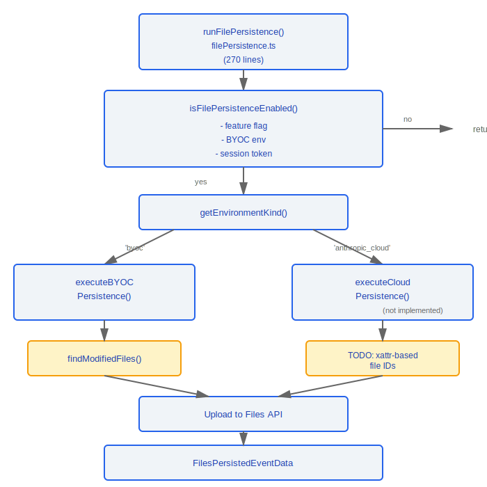
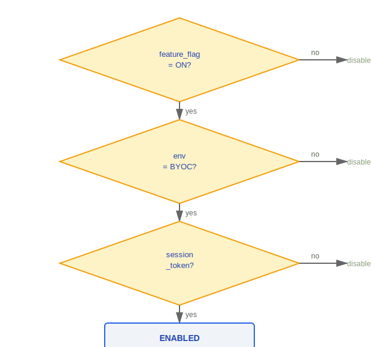
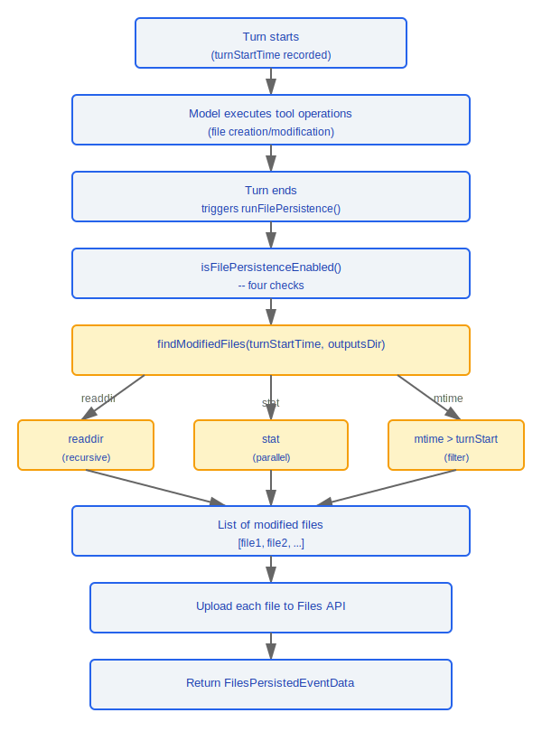

# File Persistence System

> The file persistence system is responsible for synchronizing and uploading modified files from remote sessions to cloud storage, ensuring that file changes in BYOC and Cloud environments are not lost.

---

## Architecture Overview



---

## 1. Main Orchestration (filePersistence.ts, 270 lines)

### 1.1 Entry Function

```typescript
async function runFilePersistence(
  turnStartTime: number,
  signal: AbortSignal
): Promise<FilesPersistedEventData | null>
```

| Parameter       | Type          | Description                                   |
|----------------|---------------|-----------------------------------------------|
| `turnStartTime` | `number`      | Timestamp of the current turn's start time    |
| `signal`        | `AbortSignal` | Cancellation signal used to interrupt uploads |

**Return value**: Returns `FilesPersistedEventData` on success, or `null` if not enabled or no changes detected.

### 1.2 Enable Condition Check

```typescript
function isFilePersistenceEnabled(): boolean
```

All **four conditions** must be satisfied simultaneously:

| Condition                       | Description                                          |
|---------------------------------|------------------------------------------------------|
| Feature Flag                    | File persistence feature flag is enabled             |
| BYOC Environment                | Currently running in a BYOC environment              |
| Session Token                   | A valid session token exists                         |
| `CLAUDE_CODE_REMOTE_SESSION_ID` | Remote session ID exists in environment variables    |



### 1.3 BYOC Persistence

```typescript
async function executeBYOCPersistence(
  turnStartTime: number,
  signal: AbortSignal
): Promise<FilesPersistedEventData>
```

Execution flow:

1. Call `findModifiedFiles()` to scan for files modified since `turnStartTime`
2. Filter the list of files that need to be uploaded
3. Upload each file individually via the Files API
4. Return the persistence event data

### 1.4 Cloud Persistence

```typescript
async function executeCloudPersistence(): Promise<FilesPersistedEventData>
// TODO: xattr-based file ID tracking scheme
// Not yet implemented
```

---

## 2. File Scanning (outputsScanner.ts, 127 lines)

### 2.1 Environment Type Detection

```typescript
function getEnvironmentKind(): 'byoc' | 'anthropic_cloud'
```

### 2.2 Modified File Discovery

```typescript
async function findModifiedFiles(
  turnStartTime: number,
  outputsDir: string
): Promise<string[]>
```

**Scanning strategy**:

| Step | Operation            | Description                                          |
|------|----------------------|------------------------------------------------------|
| 1    | Recursive `readdir`  | Traverse the directory tree to get all files         |
| 2    | Parallel `stat`      | Batch-fetch file metadata                            |
| 3    | `mtime` filter       | Select files with modification time > `turnStartTime` |

### 2.3 Security Measures

```typescript
// Symbolic link handling:
// - Skip when a symbolic link (symlink) is encountered
// - Prevents directory traversal attacks
// - Prevents infinite loops (circular symlinks)

if (dirent.isSymbolicLink()) {
  continue; // skip symbolic links
}
```

---

## Data Flow



---

## Design Philosophy

### Design Philosophy: Why BYOC (Bring Your Own Cloud) File Upload?

Large files should not remain permanently on the local disk of a remote session — remote environments are typically ephemeral, resource-constrained compute instances:

1. **Avoid disk bloat** -- Remote sessions may run in containers or temporary VMs with limited local disk space
2. **User data sovereignty** -- Files are uploaded to the user's own cloud storage (BYOC), not Anthropic-controlled storage, so users retain data ownership and access control
3. **Session lifecycle decoupling** -- Once files are persisted to the cloud, modified files remain accessible even if the remote session is archived or destroyed

### Design Philosophy: Why mtime Scanning?

The source code `outputsScanner.ts` uses `stat().mtime > turnStartTime` to detect file changes, which is the most lightweight cross-platform approach:

- **More cross-platform than inotify/fswatch** -- `fs.stat()` behaves consistently across all operating systems, whereas `inotify` (Linux), `FSEvents` (macOS), and `ReadDirectoryChangesW` (Windows) each have their own differences
- **No resident process overhead** -- No need to maintain a file watcher's event loop and callback registration
- **Suited to turn granularity** -- File persistence is triggered after each turn ends (`turnStartTime` marks the starting point), requiring only a single scan rather than continuous monitoring

## Engineering Practices

### Capacity Management in the File Persistence Layer

- Periodically clean up expired tool result files — when a tool execution result exceeds 20KB, it is written to disk and a reference is returned (the `>20KB → write to disk, return reference` step in the full data flow diagram); these files accumulate over time
- Use `AbortSignal` to interrupt uploads that are still in progress when the user initiates a new turn, avoiding resource waste

### Debugging File Read Cache Issues

- Check the LRU cache eviction policy of `readFileState` — the SDK control schema has a `seed_read_state` subtype (lines 354–359 of `controlSchemas.ts`), which allows manually injecting cache entries via `path + mtime`
- `mtime` precision depends on the system clock — clock skew may cause file changes to be missed or detected more than once
- Symbolic links are always skipped by `findModifiedFiles()` (a security design decision to prevent directory traversal attacks and infinite loops)

---

## Notes

- The BYOC path is fully implemented; the Cloud path is still a TODO (xattr-based file IDs)
- Symbolic links are always skipped — this is a deliberate security design decision
- `turnStartTime` precision depends on the system clock; clock skew may cause misses or duplicates
- `AbortSignal` allows interrupting uploads that are still in progress when the user initiates a new turn


---

[← Migration System](../40-迁移系统/migration-system-en.md) | [Index](../README_EN.md) | [Cost Tracking →](../42-代价追踪/cost-tracking-en.md)
