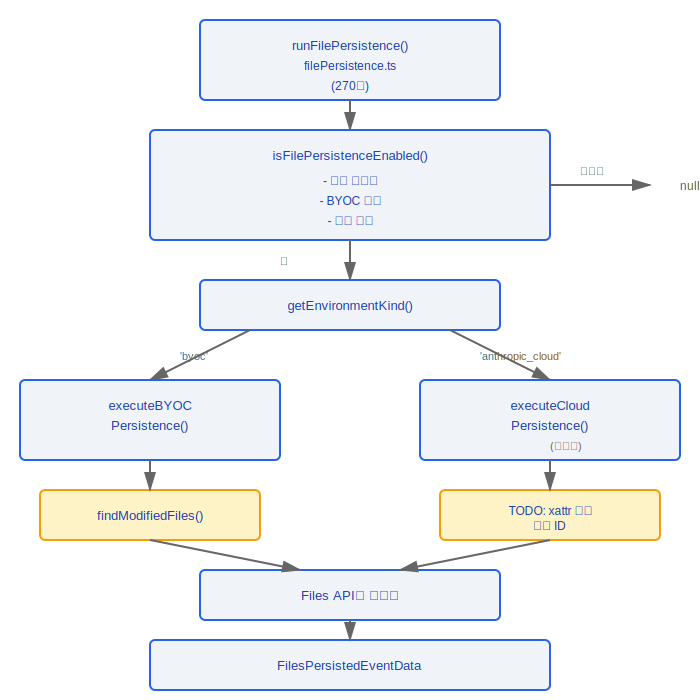
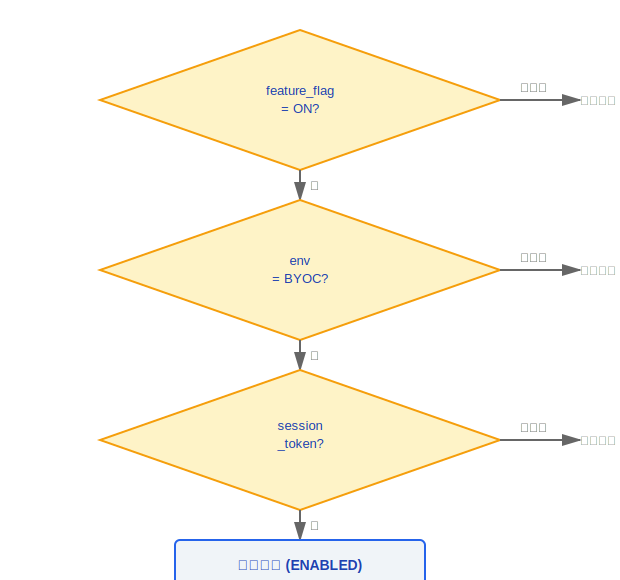
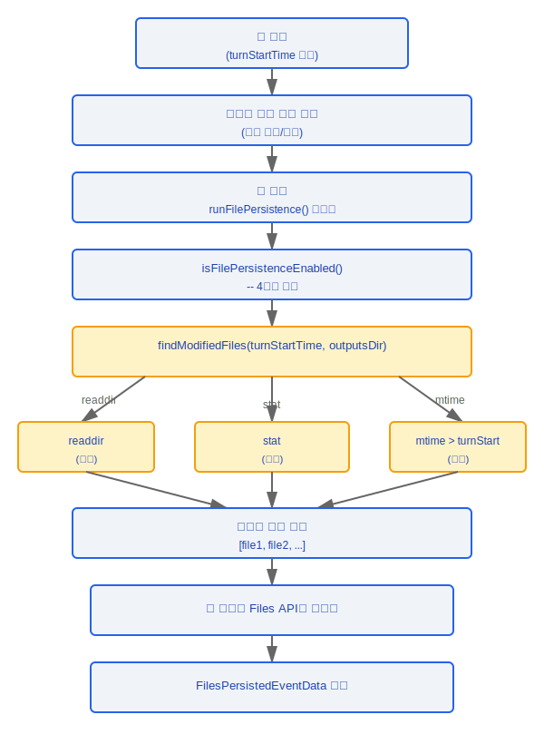

# 파일 영속화(File Persistence) 시스템

> 파일 영속화(File Persistence) 시스템은 원격 세션에서 수정된 파일을 클라우드 스토리지에 동기화하고 업로드하는 역할을 하며, BYOC 및 Cloud 환경에서 파일 변경 사항이 손실되지 않도록 보장합니다.

---

## 아키텍처 개요



---

## 1. 메인 오케스트레이션 (filePersistence.ts, 270줄)

### 1.1 진입 함수

```typescript
async function runFilePersistence(
  turnStartTime: number,
  signal: AbortSignal
): Promise<FilesPersistedEventData | null>
```

| 파라미터        | 타입          | 설명                                          |
|----------------|---------------|-----------------------------------------------|
| `turnStartTime` | `number`      | 현재 턴의 시작 시간 타임스탬프                |
| `signal`        | `AbortSignal` | 업로드 중단에 사용되는 취소 신호              |

**반환값**: 성공 시 `FilesPersistedEventData`를 반환하거나, 활성화되지 않거나 변경 사항이 감지되지 않으면 `null`을 반환합니다.

### 1.2 활성화 조건 확인

```typescript
function isFilePersistenceEnabled(): boolean
```

**네 가지 조건**을 모두 동시에 만족해야 합니다:

| 조건                            | 설명                                                 |
|---------------------------------|------------------------------------------------------|
| 기능 플래그                     | 파일 영속화(File Persistence) 기능 플래그가 활성화됨 |
| BYOC 환경                       | 현재 BYOC 환경에서 실행 중임                         |
| 세션 토큰                       | 유효한 세션 토큰이 존재함                            |
| `CLAUDE_CODE_REMOTE_SESSION_ID` | 환경 변수에 원격 세션 ID가 존재함                    |



### 1.3 BYOC 영속화

```typescript
async function executeBYOCPersistence(
  turnStartTime: number,
  signal: AbortSignal
): Promise<FilesPersistedEventData>
```

실행 흐름:

1. `findModifiedFiles()`를 호출하여 `turnStartTime` 이후 수정된 파일을 스캔
2. 업로드가 필요한 파일 목록을 필터링
3. Files API를 통해 각 파일을 개별 업로드
4. 영속화 이벤트 데이터를 반환

### 1.4 클라우드 영속화

```typescript
async function executeCloudPersistence(): Promise<FilesPersistedEventData>
// TODO: xattr 기반 파일 ID 추적 방식
// 아직 구현되지 않음
```

---

## 2. 파일 스캔 (outputsScanner.ts, 127줄)

### 2.1 환경 유형 감지

```typescript
function getEnvironmentKind(): 'byoc' | 'anthropic_cloud'
```

### 2.2 수정된 파일 검색

```typescript
async function findModifiedFiles(
  turnStartTime: number,
  outputsDir: string
): Promise<string[]>
```

**스캔 전략**:

| 단계 | 작업               | 설명                                                 |
|------|--------------------|------------------------------------------------------|
| 1    | 재귀 `readdir`     | 디렉터리 트리를 순회하여 모든 파일을 가져옴          |
| 2    | 병렬 `stat`        | 파일 메타데이터를 일괄 가져옴                        |
| 3    | `mtime` 필터       | 수정 시간 > `turnStartTime`인 파일을 선택            |

### 2.3 보안 조치

```typescript
// 심볼릭 링크 처리:
// - 심볼릭 링크(symlink)를 만나면 건너뜀
// - 디렉터리 탐색 공격을 방지
// - 무한 루프를 방지 (순환 심볼릭 링크)

if (dirent.isSymbolicLink()) {
  continue; // 심볼릭 링크 건너뜀
}
```

---

## 데이터 흐름(Data Flow)



---

## 설계 철학

### 설계 철학: 왜 BYOC(Bring Your Own Cloud) 파일 업로드인가?

대용량 파일은 원격 세션의 로컬 디스크에 영구적으로 남아있어서는 안 됩니다 — 원격 환경은 일반적으로 임시적이며 리소스가 제한된 컴퓨팅 인스턴스입니다:

1. **디스크 비대 방지** -- 원격 세션은 로컬 디스크 공간이 제한된 컨테이너 또는 임시 VM에서 실행될 수 있음
2. **사용자 데이터 주권** -- 파일은 Anthropic이 제어하는 스토리지가 아닌 사용자 자신의 클라우드 스토리지(BYOC)에 업로드되므로 사용자가 데이터 소유권과 접근 제어를 유지함
3. **세션 생명주기 분리** -- 파일이 클라우드에 영속화되면, 원격 세션이 보관되거나 삭제되더라도 수정된 파일에 접근할 수 있음

### 설계 철학: 왜 mtime 스캔인가?

소스 코드 `outputsScanner.ts`는 `stat().mtime > turnStartTime`을 사용하여 파일 변경을 감지합니다. 이는 가장 경량화된 크로스 플랫폼 방식입니다:

- **inotify/fswatch보다 더 크로스 플랫폼** -- `fs.stat()`는 모든 운영 체제에서 일관되게 동작하며, `inotify`(Linux), `FSEvents`(macOS), `ReadDirectoryChangesW`(Windows)는 각각 차이가 있습니다
- **상주 프로세스 오버헤드 없음** -- 파일 감시기의 이벤트 루프 및 콜백 등록을 유지할 필요가 없음
- **턴 단위에 적합** -- 파일 영속화(File Persistence)는 각 턴이 종료된 후 트리거됩니다(`turnStartTime`이 시작 지점을 표시). 지속적인 모니터링 대신 단일 스캔만 필요합니다

## 엔지니어링 실천

### 파일 영속화(File Persistence) 레이어의 용량 관리

- 만료된 도구 결과 파일을 주기적으로 정리하십시오 — 도구 실행 결과가 20KB를 초과하면 디스크에 작성되고 참조가 반환됩니다(전체 데이터 흐름 다이어그램의 `>20KB → 디스크에 쓰기, 참조 반환` 단계). 이러한 파일은 시간이 지남에 따라 축적됩니다
- 사용자가 새 턴을 시작할 때 아직 진행 중인 업로드를 중단하기 위해 `AbortSignal`을 사용하여 리소스 낭비를 방지하십시오

### 파일 읽기 캐시 문제 디버깅

- `readFileState`의 LRU 캐시 제거 정책을 확인하십시오 — SDK 제어 스키마에는 `seed_read_state` 하위 유형이 있습니다(`controlSchemas.ts`의 354-359줄). 이를 통해 `path + mtime`으로 캐시 항목을 수동으로 주입할 수 있습니다
- `mtime` 정밀도는 시스템 클럭에 따라 다릅니다 — 클럭 편차로 인해 파일 변경이 누락되거나 두 번 이상 감지될 수 있습니다
- 심볼릭 링크는 항상 `findModifiedFiles()`에 의해 건너뜁니다(디렉터리 탐색 공격과 무한 루프를 방지하기 위한 보안 설계 결정)

---

## 참고 사항

- BYOC 경로는 완전히 구현되어 있습니다; Cloud 경로는 아직 TODO입니다 (xattr 기반 파일 ID)
- 심볼릭 링크는 항상 건너뜁니다 — 이는 의도적인 보안 설계 결정입니다
- `turnStartTime` 정밀도는 시스템 클럭에 따라 다릅니다; 클럭 편차로 인해 누락 또는 중복이 발생할 수 있습니다
- `AbortSignal`은 사용자가 새 턴을 시작할 때 아직 진행 중인 업로드를 중단할 수 있게 합니다


---

[← 마이그레이션 시스템](../40-迁移系统/migration-system-ko.md) | [인덱스](../README_KO.md) | [비용 추적 →](../42-代价追踪/cost-tracking-ko.md)
