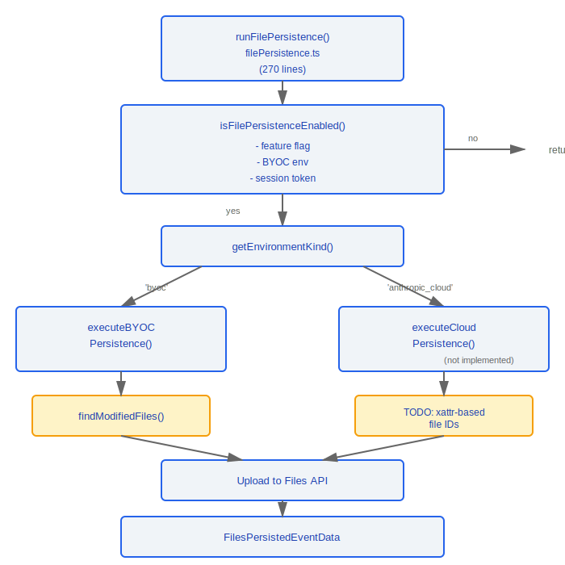
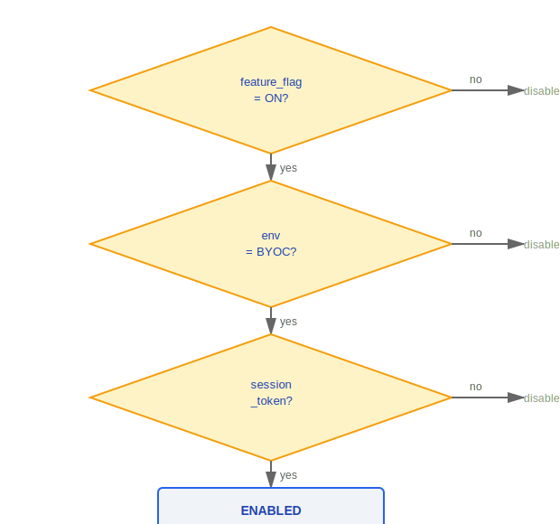
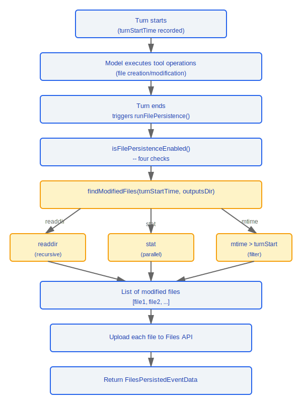

# 文件持久化系统

> 文件持久化系统负责将远程会话中被修改的文件同步上传至云端存储, 确保 BYOC 和 Cloud 环境下的文件变更不丢失。

---

## 架构总览



---

## 1. 主编排 (filePersistence.ts, 270行)

### 1.1 入口函数

```typescript
async function runFilePersistence(
  turnStartTime: number,
  signal: AbortSignal
): Promise<FilesPersistedEventData | null>
```

| 参数             | 类型           | 说明                        |
|-----------------|----------------|----------------------------|
| `turnStartTime` | `number`       | 当前 turn 的开始时间戳       |
| `signal`        | `AbortSignal`  | 取消信号, 用于中断上传       |

**返回值**: 成功时返回 `FilesPersistedEventData`, 未启用或无变更时返回 `null`。

### 1.2 启用条件检查

```typescript
function isFilePersistenceEnabled(): boolean
```

必须同时满足以下 **全部四个条件**:

| 条件                        | 说明                             |
|----------------------------|----------------------------------|
| Feature Flag               | 文件持久化功能标志已开启            |
| BYOC 环境                   | 当前运行在 BYOC 环境中            |
| Session Token              | 存在有效的会话令牌                 |
| `CLAUDE_CODE_REMOTE_SESSION_ID` | 环境变量中存在远程会话 ID     |



### 1.3 BYOC 持久化

```typescript
async function executeBYOCPersistence(
  turnStartTime: number,
  signal: AbortSignal
): Promise<FilesPersistedEventData>
```

执行流程:

1. 调用 `findModifiedFiles()` 扫描自 `turnStartTime` 以来修改的文件
2. 过滤出需要上传的文件列表
3. 通过 Files API 逐文件上传
4. 返回持久化事件数据

### 1.4 Cloud 持久化

```typescript
async function executeCloudPersistence(): Promise<FilesPersistedEventData>
// TODO: 基于 xattr 的文件 ID 追踪方案
// 尚未实现
```

---

## 2. 文件扫描 (outputsScanner.ts, 127行)

### 2.1 环境类型检测

```typescript
function getEnvironmentKind(): 'byoc' | 'anthropic_cloud'
```

### 2.2 修改文件发现

```typescript
async function findModifiedFiles(
  turnStartTime: number,
  outputsDir: string
): Promise<string[]>
```

**扫描策略**:

| 步骤 | 操作                   | 说明                          |
|------|----------------------|-------------------------------|
| 1    | 递归 `readdir`        | 遍历目录树获取所有文件           |
| 2    | 并行 `stat`           | 批量获取文件元信息              |
| 3    | `mtime` 过滤          | 筛选修改时间 > `turnStartTime` 的文件 |

### 2.3 安全措施

```typescript
// 符号链接处理:
// - 遇到符号链接 (symlink) 时跳过
// - 防止目录遍历攻击 (directory traversal)
// - 防止无限循环 (circular symlinks)

if (dirent.isSymbolicLink()) {
  continue; // 跳过符号链接
}
```

---

## 数据流



---

## 设计理念

### 设计理念：为什么 BYOC (Bring Your Own Cloud) 文件上传？

大文件不应永久留在远程会话的本地磁盘上——远程环境通常是临时的、受限的计算实例：

1. **避免磁盘膨胀** -- 远程会话可能运行在容器或临时 VM 中，本地磁盘空间有限
2. **用户数据主权** -- 上传到用户自己的云存储（BYOC），而非 Anthropic 控制的存储，用户保留数据所有权和访问控制
3. **会话生命周期解耦** -- 文件持久化到云端后，即使远程会话被归档或销毁，修改的文件仍然可访问

### 设计理念：为什么 mtime 扫描？

源码 `outputsScanner.ts` 使用 `stat().mtime > turnStartTime` 来检测文件变更，这是最轻量的跨平台方案：

- **比 inotify/fswatch 更跨平台** -- `fs.stat()` 在所有操作系统上行为一致，而 `inotify`（Linux）、`FSEvents`（macOS）、`ReadDirectoryChangesW`（Windows）各有差异
- **无常驻进程开销** -- 不需要维护文件监视器的事件循环和回调注册
- **适合 Turn 粒度** -- 文件持久化在每个 Turn 结束后触发（`turnStartTime` 标记起点），只需扫描一次而非持续监控

## 工程实践

### 文件持久化层的容量管理

- 定期清理过期的工具结果文件——源码中工具执行结果大于 20KB 时会存磁盘并返回引用（完整数据流图中的 `>20KB → 存磁盘,返回引用`），这些文件会随时间累积
- 利用 `AbortSignal` 在用户发起新 Turn 时中断尚未完成的上传，避免资源浪费

### 调试文件读取缓存问题

- 检查 `readFileState` 的 LRU 缓存 eviction 策略——SDK 控制 schema 中有 `seed_read_state` 子类型（`controlSchemas.ts` 第 354-359 行），可以通过 `path + mtime` 手动注入缓存条目
- `mtime` 精度依赖系统时钟——时钟偏移可能导致文件变更被遗漏或重复检测
- 符号链接始终被 `findModifiedFiles()` 跳过（安全设计，防止目录遍历攻击和无限循环）

---

## 注意事项

- BYOC 路径已完整实现, Cloud 路径尚为 TODO (xattr-based file IDs)
- 符号链接始终被跳过, 这是安全设计决策
- `turnStartTime` 精度依赖于系统时钟, 时钟偏移可能导致遗漏或重复
- `AbortSignal` 允许在用户发起新 turn 时中断尚未完成的上传


---

[← 迁移系统](../40-迁移系统/migration-system.md) | [目录](../README.md) | [代价追踪 →](../42-代价追踪/cost-tracking.md)
