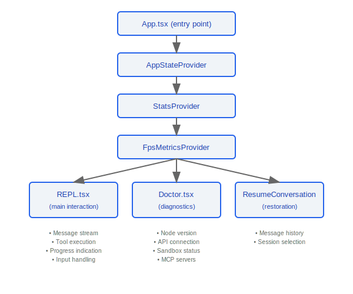
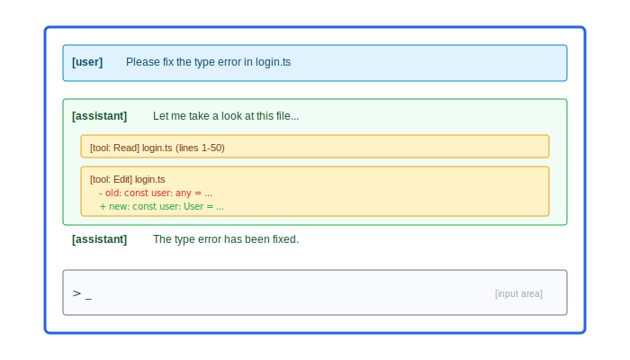

# Screens Components

> The Screens components are the core React component collection for the Claude Code user interface, responsible for REPL interaction, system diagnostics, session restoration, and application entry-point orchestration.

---

## Component Hierarchy



### Design Philosophy: Why Are Providers Nested AppState -> Stats -> FpsMetrics?

The nesting order in `App.tsx` source code is `AppStateProvider → StatsProvider → FpsMetricsProvider` (lines 29-47), with each layer managing state at a different update frequency:

1. **AppStateProvider (outermost)** -- manages global application state (current session, configuration, etc.), updated on user actions; lowest frequency but widest impact
2. **StatsProvider (middle layer)** -- manages usage statistics and telemetry data, updated on API calls; medium frequency
3. **FpsMetricsProvider (innermost)** -- manages render frame-rate monitoring, updated every frame; highest frequency but smallest impact

This nesting order from low-frequency to high-frequency follows React performance best practices: high-frequency-update Providers are placed in the inner layers so their re-renders do not trigger re-renders of the outer low-frequency Providers. In the source code, `AppStateProvider` also contains a re-entrancy guard — "AppStateProvider can not be nested within another AppStateProvider" (`AppState.tsx` line 46).

### Design Philosophy: Why Is REPL the Main Screen While Doctor and Resume Are Auxiliary Screens?

- **Users spend 80%+ of their time in REPL** -- REPL is the core interaction loop, carrying message stream rendering, tool execution visualization, input handling, and other core functions
- **Doctor is the diagnostic path** -- only used when something goes wrong in the environment; checks Node version, API connectivity, sandbox status, etc.
- **ResumeConversation is the entry path** -- only used when restoring a previous session; transitions immediately into REPL after loading

---

## 1. REPL.tsx -- Main Interaction Interface

REPL (Read-Eval-Print Loop) is the primary interface through which users interact with Claude Code, carrying the vast majority of user interaction logic.

### Core Responsibilities

| Feature Module            | Description                                                      |
|--------------------------|------------------------------------------------------------------|
| Message stream rendering  | Displays assistant/user/system messages in chronological order   |
| Tool execution visualization | Shows tool call status, parameters, and results in real time  |
| Progress indication       | Loading animation and progress bar during streaming output       |
| Input handling            | Multi-line input, command completion, keyboard shortcut handling  |

### Message Stream Rendering



### Tool Execution Visualization

- Displays tool name and parameters
- Updates execution status in real time (pending / running / success / error)
- Shows file modifications in diff format

---

## 2. Doctor.tsx -- System Diagnostics

The Doctor component performs comprehensive environment health checks to help users troubleshoot configuration issues.

### Diagnostic Items

| Check Item     | What Is Checked                                        | Pass Condition                         |
|---------------|--------------------------------------------------------|----------------------------------------|
| Node version  | `process.version`                                      | >= required minimum version            |
| API connection| Sends a test request to the API endpoint               | Receives a valid response              |
| Sandbox status| Checks whether the sandbox environment is correctly configured | Sandbox is available and permissions are correct |
| MCP servers   | Checks the connection status of all configured MCP servers | All servers are reachable          |
| Plugin status | Checks the compatibility of installed plugins          | Plugin versions are compatible         |

### Output Format


---

## 3. ResumeConversation.tsx -- Session Restoration

### Core Features

- **Load saved message history**: reads the complete message chain from a previous session from local storage
- **Session selection**: provides a selection interface when there are multiple restorable sessions

### Restoration Flow


---

## 4. Entry Component (App.tsx)

App.tsx is the root component of the application, responsible for Provider hierarchy orchestration and global state initialization.

### Provider Nesting Hierarchy

```typescript
function App() {
  return (
    <AppStateProvider>          {/* global application state */}
      <StatsProvider>           {/* usage statistics and telemetry */}
        <FpsMetricsProvider>    {/* frame-rate performance monitoring */}
          <REPL />              {/* main interaction interface */}
        </FpsMetricsProvider>
      </StatsProvider>
    </AppStateProvider>
  );
}
```

### Provider Responsibilities

| Provider             | Responsibility                                               |
|---------------------|--------------------------------------------------------------|
| `AppStateProvider`  | Global application state management (current session, configuration, etc.) |
| `StatsProvider`     | Usage statistics collection and telemetry reporting          |
| `FpsMetricsProvider`| Render frame-rate monitoring for performance analysis        |

---

## Engineering Practices

### Adding a New Full-Screen View

1. Create a new React component in the `screens/` directory (follow the props interface patterns of existing components)
2. Add conditional rendering to the routing logic in `App.tsx` — decide which screen to render based on application state
3. New screen components can access global state via `useAppState()`, but be careful not to call it outside `AppStateProvider` (the source code provides `useAppStateMaybeOutsideOfProvider()` as a safe alternative)
4. Ensure the new screen integrates with the existing `KeybindingSetup` layer to support global keyboard shortcuts

### REPL Performance Optimization

- **Message list virtualization** -- `VirtualMessageList.tsx` and `useVirtualScroll.ts` exist in the source code; as the number of messages grows, only messages within the visible area are rendered, avoiding rendering lag caused by large numbers of DOM nodes
- **Lazy rendering of tool results** -- tool execution results may contain large amounts of text (e.g., file contents); expand-on-demand rendering is used
- **Yoga layout optimization** -- Ink uses the Yoga engine to calculate flex layouts; complex components such as `Stats.tsx` and `StructuredDiff.tsx` should avoid unnecessary layout calculations
- **FpsMetrics monitoring** -- use `FpsMetricsProvider` to monitor the actual render frame rate; when FPS drops, performance bottlenecks can be located

---

## Inter-Component Communication


---

[← Shell Toolchain](../43-Shell工具链/shell-toolchain-en.md) | [Index](../README_EN.md) | [Type System →](../45-类型系统/type-system-en.md)
