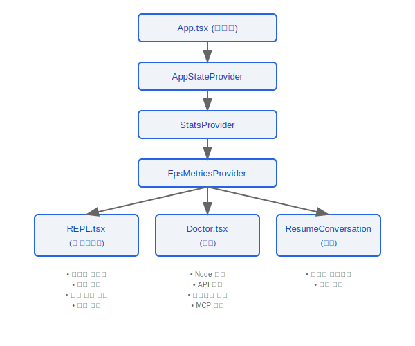
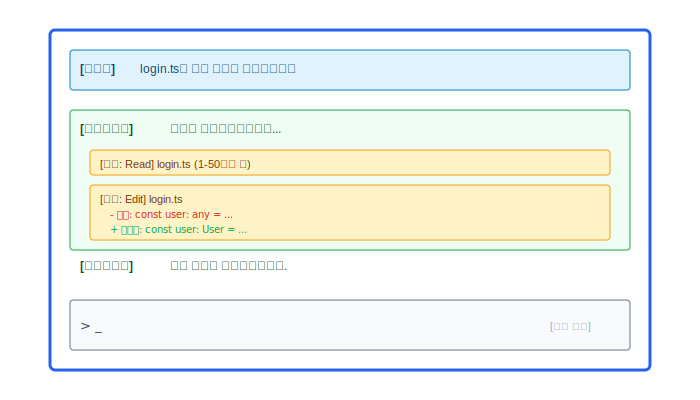
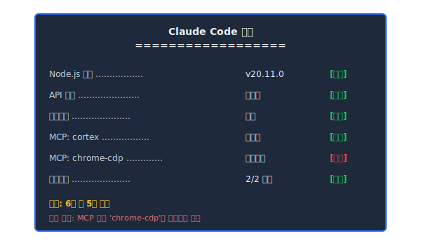
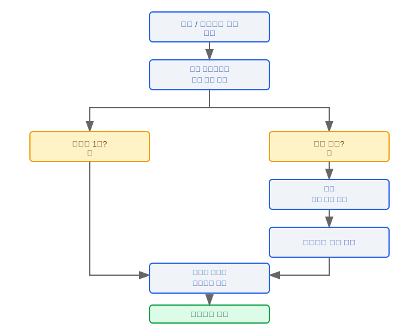
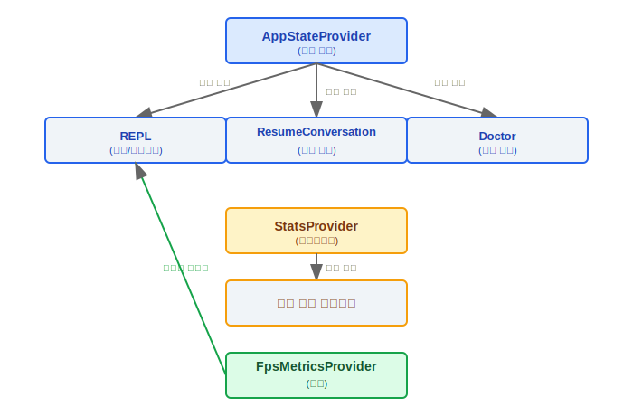

# 스크린(Screen) 컴포넌트(Component)

> 스크린(Screen) 컴포넌트(Component)는 Claude Code 사용자 인터페이스의 핵심 React 컴포넌트(Component) 컬렉션으로, REPL 상호작용, 시스템 진단, 세션 복원, 애플리케이션 진입점 오케스트레이션을 담당합니다.

---

## 컴포넌트(Component) 계층 구조



### 설계 철학: 왜 Provider가 AppState -> Stats -> FpsMetrics 순으로 중첩되는가?

`App.tsx` 소스 코드의 중첩 순서는 `AppStateProvider → StatsProvider → FpsMetricsProvider`입니다(29-47줄). 각 레이어는 서로 다른 업데이트 빈도의 상태를 관리합니다:

1. **AppStateProvider (가장 바깥쪽)** -- 전역 애플리케이션 상태(현재 세션, 구성 등)를 관리하며, 사용자 행동에 따라 업데이트됩니다; 가장 낮은 빈도이지만 가장 넓은 영향
2. **StatsProvider (중간 레이어)** -- 사용량 통계 및 원격 측정 데이터를 관리하며, API 호출 시 업데이트됩니다; 중간 빈도
3. **FpsMetricsProvider (가장 안쪽)** -- 렌더 프레임 레이트 모니터링을 관리하며, 매 프레임마다 업데이트됩니다; 가장 높은 빈도이지만 가장 작은 영향

이 저빈도에서 고빈도 순의 중첩 순서는 React 성능 모범 사례를 따릅니다: 고빈도 업데이트 Provider는 내부 레이어에 배치되어 외부의 저빈도 Provider의 리렌더를 트리거하지 않습니다. 소스 코드에서 `AppStateProvider`는 재진입 가드도 포함합니다 — "AppStateProvider can not be nested within another AppStateProvider"(`AppState.tsx` 46줄).

### 설계 철학: 왜 REPL이 메인 스크린(Screen)이고 Doctor와 Resume은 보조 스크린인가?

- **사용자는 80% 이상의 시간을 REPL에서 보냄** -- REPL은 핵심 상호작용 루프로, 메시지 스트림 렌더링, 도구 실행 시각화, 입력 처리 등의 핵심 기능을 담당합니다
- **Doctor는 진단 경로** -- 환경에 문제가 있을 때만 사용됩니다; Node 버전, API 연결성, 샌드박스 상태 등을 확인합니다
- **ResumeConversation은 진입 경로** -- 이전 세션을 복원할 때만 사용됩니다; 로딩 후 즉시 REPL로 전환합니다

---

## 1. REPL.tsx -- 메인 상호작용 인터페이스

REPL(Read-Eval-Print Loop)은 사용자가 Claude Code와 상호작용하는 주요 인터페이스로, 대부분의 사용자 상호작용 로직을 담당합니다.

### 핵심 책임

| 기능 모듈              | 설명                                                           |
|------------------------|----------------------------------------------------------------|
| 메시지 스트림 렌더링   | 어시스턴트/사용자/시스템 메시지를 시간순으로 표시             |
| 도구 실행 시각화       | 도구 호출 상태, 파라미터, 결과를 실시간으로 표시              |
| 진행 표시              | 스트리밍 출력 중 로딩 애니메이션 및 진행 표시줄               |
| 입력 처리              | 다중 줄 입력, 커맨드 완성, 키보드 단축키 처리                 |

### 메시지 스트림 렌더링



### 도구 실행 시각화

- 도구 이름과 파라미터를 표시
- 실행 상태를 실시간으로 업데이트 (대기 / 실행 중 / 성공 / 오류)
- 파일 수정을 diff 형식으로 표시

---

## 2. Doctor.tsx -- 시스템 진단

Doctor 컴포넌트(Component)는 포괄적인 환경 상태 검사를 수행하여 사용자가 구성 문제를 해결하는 데 도움을 줍니다.

### 진단 항목

| 검사 항목      | 검사 내용                                          | 통과 조건                              |
|---------------|---------------------------------------------------|----------------------------------------|
| Node 버전     | `process.version`                                 | >= 필요한 최소 버전                    |
| API 연결      | API 엔드포인트에 테스트 요청 전송                 | 유효한 응답 수신                       |
| 샌드박스 상태 | 샌드박스 환경이 올바르게 구성되었는지 확인        | 샌드박스를 사용할 수 있고 권한이 올바름 |
| MCP 서버      | 구성된 모든 MCP 서버의 연결 상태 확인             | 모든 서버에 연결 가능                  |
| 플러그인 상태 | 설치된 플러그인의 호환성 확인                     | 플러그인 버전이 호환됨                 |

### 출력 형식



---

## 3. ResumeConversation.tsx -- 세션 복원

### 핵심 기능

- **저장된 메시지 히스토리 로드**: 로컬 스토리지에서 이전 세션의 완전한 메시지 체인을 읽습니다
- **세션 선택**: 복원 가능한 세션이 여러 개인 경우 선택 인터페이스를 제공합니다

### 복원 흐름



---

## 4. 진입 컴포넌트(Component) (App.tsx)

App.tsx는 애플리케이션의 루트 컴포넌트(Component)로, Provider 계층 오케스트레이션 및 전역 상태 초기화를 담당합니다.

### Provider 중첩 계층 구조

```typescript
function App() {
  return (
    <AppStateProvider>          {/* 전역 애플리케이션 상태 */}
      <StatsProvider>           {/* 사용량 통계 및 원격 측정 */}
        <FpsMetricsProvider>    {/* 프레임 레이트 성능 모니터링 */}
          <REPL />              {/* 메인 상호작용 인터페이스 */}
        </FpsMetricsProvider>
      </StatsProvider>
    </AppStateProvider>
  );
}
```

### Provider 책임

| Provider              | 책임                                                         |
|-----------------------|--------------------------------------------------------------|
| `AppStateProvider`    | 전역 애플리케이션 상태 관리(현재 세션, 구성 등)             |
| `StatsProvider`       | 사용량 통계 수집 및 원격 측정 보고                          |
| `FpsMetricsProvider`  | 성능 분석을 위한 렌더 프레임 레이트 모니터링                |

---

## 엔지니어링 실천

### 새 전체 화면 뷰 추가

1. `screens/` 디렉터리에 새 React 컴포넌트(Component)를 생성합니다 (기존 컴포넌트의 props 인터페이스 패턴을 따름)
2. `App.tsx`의 라우팅 로직에 조건부 렌더링을 추가합니다 — 애플리케이션 상태에 따라 어떤 스크린(Screen)을 렌더링할지 결정합니다
3. 새 스크린(Screen) 컴포넌트(Component)는 `useAppState()`를 통해 전역 상태에 접근할 수 있지만, `AppStateProvider` 외부에서 호출하지 않도록 주의해야 합니다(소스 코드는 안전한 대안으로 `useAppStateMaybeOutsideOfProvider()`를 제공합니다)
4. 새 스크린(Screen)이 기존 `KeybindingSetup` 레이어와 통합되어 전역 키보드 단축키를 지원하도록 확인합니다

### REPL 성능 최적화

- **메시지 목록 가상화** -- 소스 코드에 `VirtualMessageList.tsx`와 `useVirtualScroll.ts`가 있습니다; 메시지 수가 늘어남에 따라 가시 영역 내의 메시지만 렌더링하여 많은 수의 DOM 노드로 인한 렌더링 지연을 방지합니다
- **도구 결과의 지연 렌더링** -- 도구 실행 결과에는 대량의 텍스트(예: 파일 내용)가 포함될 수 있습니다; 요청 시 확장 렌더링을 사용합니다
- **Yoga 레이아웃 최적화** -- Ink는 Yoga 엔진을 사용하여 플렉스 레이아웃을 계산합니다; `Stats.tsx`와 `StructuredDiff.tsx` 같은 복잡한 컴포넌트(Component)는 불필요한 레이아웃 계산을 피해야 합니다
- **FpsMetrics 모니터링** -- `FpsMetricsProvider`를 사용하여 실제 렌더 프레임 레이트를 모니터링합니다; FPS가 떨어지면 성능 병목 지점을 찾을 수 있습니다

---

## 컴포넌트(Component) 간 통신




---

[← 셸 도구 체인](../43-Shell工具链/shell-toolchain-ko.md) | [인덱스](../README_KO.md) | [타입 시스템 →](../45-类型系统/type-system-ko.md)
