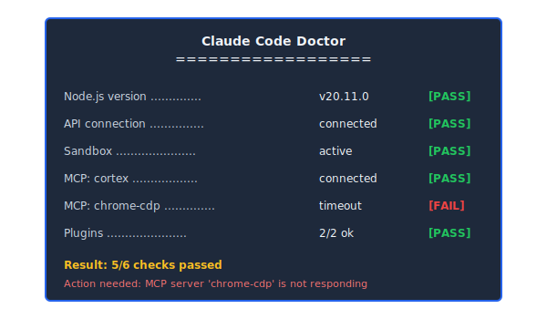
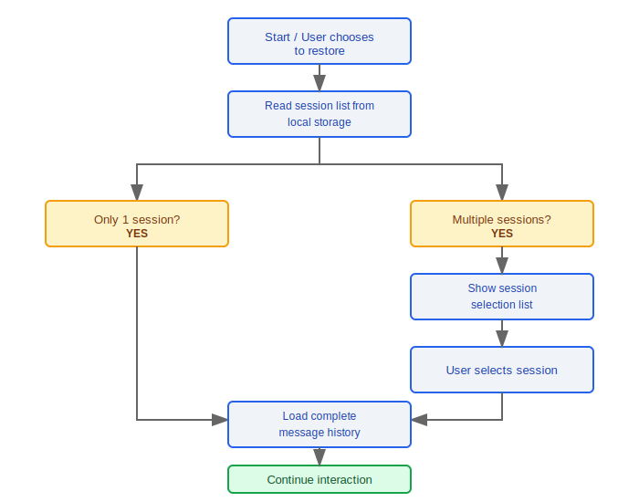
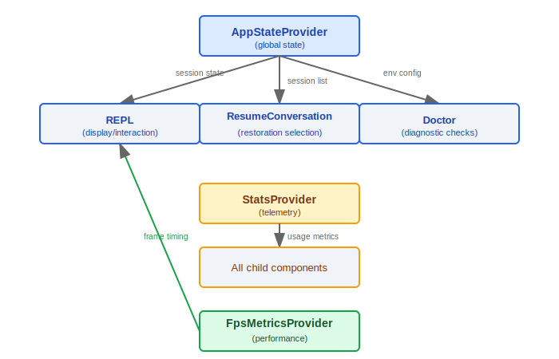

# Screens 组件

> Screens 组件是 Claude Code 用户界面的核心 React 组件集合, 负责 REPL 交互、系统诊断、会话恢复和应用入口编排。

---

## 组件层次结构


### 设计理念：为什么 Provider 嵌套 AppState -> Stats -> FpsMetrics？

源码 `App.tsx` 中的嵌套顺序是 `AppStateProvider → StatsProvider → FpsMetricsProvider`（第 29-47 行），每层管理不同更新频率的状态：

1. **AppStateProvider（最外层）** -- 管理全局应用状态（当前会话、配置等），随用户操作更新，频率最低但影响面最大
2. **StatsProvider（中间层）** -- 管理使用统计和遥测数据，随 API 调用更新，频率中等
3. **FpsMetricsProvider（最内层）** -- 管理渲染帧率监控，每帧更新，频率最高但影响面最小

这种从低频到高频的嵌套顺序遵循 React 性能最佳实践：高频更新的 Provider 放在内层，其 re-render 不会触发外层低频 Provider 的重渲染。源码中 `AppStateProvider` 还包含防重入保护——"AppStateProvider can not be nested within another AppStateProvider"（`AppState.tsx` 第 46 行）。

### 设计理念：为什么 REPL 是主屏幕而 Doctor 和 Resume 是辅助屏幕？

- **80%+ 的时间用户在 REPL 中** -- REPL 是核心交互循环，承载消息流渲染、工具执行可视化、输入处理等核心功能
- **Doctor 是诊断路径** -- 只在环境出问题时使用，检查 Node 版本、API 连接、沙箱状态等
- **ResumeConversation 是入口路径** -- 只在恢复之前会话时使用，加载后立即转入 REPL

---

## 1. REPL.tsx -- 主交互界面

REPL (Read-Eval-Print Loop) 是用户与 Claude Code 交互的主要界面, 承载了绝大部分用户交互逻辑。

### 核心职责

| 功能模块       | 说明                                           |
|---------------|------------------------------------------------|
| 消息流渲染     | 按时间顺序展示 assistant/user/system 消息         |
| 工具执行可视化  | 实时显示工具调用状态、参数和结果                    |
| 进度指示       | 流式输出时的 loading 动画和进度条                  |
| 输入处理       | 多行输入、命令补全、快捷键处理                      |

### 消息流渲染


### 工具执行可视化

- 展示工具名称和参数
- 实时更新执行状态 (pending / running / success / error)
- diff 格式展示文件修改

---

## 2. Doctor.tsx -- 系统诊断

Doctor 组件执行全面的环境健康检查, 帮助用户排查配置问题。

### 诊断项目

| 检查项         | 检查内容                          | 通过条件                   |
|---------------|----------------------------------|---------------------------|
| Node 版本     | `process.version`                | >= 所需最低版本             |
| API 连接      | 向 API 端点发送测试请求            | 收到有效响应                |
| 沙箱状态      | 检查沙箱环境是否正确配置            | 沙箱可用且权限正确           |
| MCP 服务器    | 检查所有已配置 MCP 服务器的连接状态  | 所有服务器可达              |
| 插件状态      | 检查已安装插件的兼容性              | 插件版本兼容                |

### 输出格式



---

## 3. ResumeConversation.tsx -- 会话恢复

### 核心功能

- **加载保存的消息历史**: 从本地存储读取之前会话的完整消息链
- **会话选择**: 当存在多个可恢复会话时, 提供选择界面

### 恢复流程



---

## 4. 入口组件 (App.tsx)

App.tsx 是应用的根组件, 负责 Provider 层级编排和全局状态初始化。

### Provider 嵌套层级

```typescript
function App() {
  return (
    <AppStateProvider>          {/* 全局应用状态 */}
      <StatsProvider>           {/* 使用统计和遥测 */}
        <FpsMetricsProvider>    {/* 帧率性能监控 */}
          <REPL />              {/* 主交互界面 */}
        </FpsMetricsProvider>
      </StatsProvider>
    </AppStateProvider>
  );
}
```

### Provider 职责

| Provider             | 职责                              |
|---------------------|-----------------------------------|
| `AppStateProvider`  | 全局应用状态管理 (当前会话、配置等)   |
| `StatsProvider`     | 使用统计数据收集和遥测上报           |
| `FpsMetricsProvider`| 渲染帧率监控, 用于性能分析           |

---

## 工程实践

### 添加新的全屏视图

1. 在 `screens/` 目录中创建新的 React 组件（遵循现有组件的 props 接口模式）
2. 在 `App.tsx` 的路由逻辑中添加条件渲染——根据应用状态决定渲染哪个屏幕
3. 新屏幕组件可以通过 `useAppState()` 访问全局状态，但注意不要在 `AppStateProvider` 外部调用（源码中有 `useAppStateMaybeOutsideOfProvider()` 作为安全替代）
4. 确保新屏幕与现有的 `KeybindingSetup` 层集成，支持全局快捷键

### REPL 性能优化

- **消息列表虚拟化** -- 源码中存在 `VirtualMessageList.tsx` 和 `useVirtualScroll.ts`，当消息数量增长时只渲染可视区域内的消息，避免大量 DOM 节点导致的渲染卡顿
- **工具结果懒渲染** -- 工具执行结果可能包含大量文本（如文件内容），按需展开渲染
- **Yoga 布局优化** -- Ink 使用 Yoga 引擎计算 flex 布局，`Stats.tsx` 和 `StructuredDiff.tsx` 等复杂组件应避免不必要的布局计算
- **FpsMetrics 监控** -- 利用 `FpsMetricsProvider` 监控实际渲染帧率，当 FPS 下降时可以定位性能瓶颈

---

## 组件间通信




---

[← Shell 工具链](../43-Shell工具链/shell-toolchain.md) | [目录](../README.md) | [类型系统 →](../45-类型系统/type-system.md)
