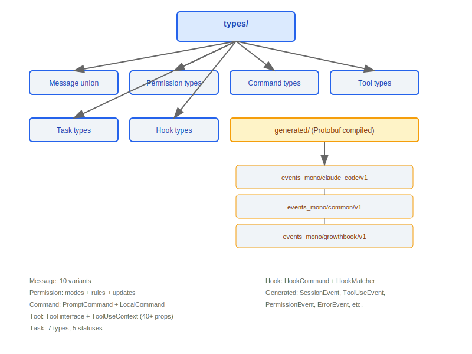
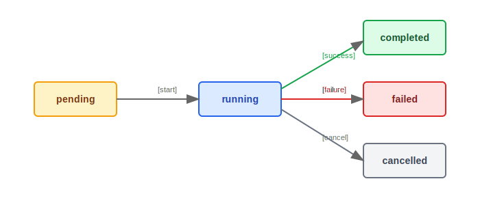

# Type System

> Claude Code's type system defines TypeScript types for core domains including messages, permissions, commands, tools, tasks, hooks, and generated code. It is the type-safety foundation of the entire application.

---

## Type System Overview



### Design Philosophy: Why Are Message Types So Complex (10 Variants)?

Each message source has a different structure and lifecycle:

1. **User input** (`UserMessage`) may contain `tool_result` content blocks, because the API protocol requires tool results to be sent with the user role
2. **Assistant responses** (`AssistantMessage`) may contain `tool_use` blocks, triggering the tool execution loop
3. **System messages** (`SystemMessage`, `SystemLocalCommandMessage`) are generated internally by the application and are not sent to the API
4. **Lifecycle markers** (`TombstoneMessage`, `SystemCompactBoundaryMessage`) have special semantics in context management — tombstones mark messages discarded during model downgrade, and compact boundaries mark the dividing line before and after context compaction
5. **Streaming** (`ProgressMessage`) is ephemeral — it only exists during tool execution and is not persisted

This fine-grained type distinction allows the TypeScript compiler to provide precise type inference in each processing branch, eliminating the need for runtime type checks.

### Design Philosophy: Why DeepImmutable?

The source code in `hooks/useSettings.ts` contains the comment: "`Settings type as stored in AppState (DeepImmutable wrapped)`", and line 425 of `types/permissions.ts` contains: "`Uses a simplified DeepImmutable approximation for this types-only file`".

The permission context (`ToolPermissionContext`) and settings (`ReadonlySettings`) are passed across multiple functions in the decision chain — from `canUseTool()` → rule matching → tool-specific checks → classifier. Any accidental mutation at an intermediate step is a security vulnerability:
- If permission rules are mutated, dangerous operations could bypass security checks
- If settings are mutated, it could affect the behavior of all subsequent tool calls
- `DeepImmutable` prevents such mutations at compile time via recursive `Readonly`

---

## 1. Message Types (Message Union)

`Message` is a union type covering all message variants in the system:

```typescript
type Message =
  | UserMessage                  // user-typed text message
  | AssistantMessage             // Claude's text response
  | SystemMessage                // system-level prompts and notifications
  | AttachmentMessage            // attachment message (files/images)
  | TombstoneMessage             // placeholder for deleted messages
  | ToolUseSummaryMessage        // tool call summary
  | HookResultMessage            // hook execution result
  | SystemLocalCommandMessage    // system message for local commands
  | SystemCompactBoundaryMessage // context compaction boundary marker
  | ProgressMessage;             // streaming progress update
```

### Message Type Relationship Diagram


---

## 2. Permission Types

### 2.1 Permission Modes

```typescript
const PERMISSION_MODES = [
  'acceptEdits',        // Accept edits: automatically approve file modifications
  'bypassPermissions',  // Bypass permissions: skip all permission checks
  'default',            // Default mode: sensitive operations require confirmation
  'dontAsk',            // Don't ask: handle silently
  'plan',               // Plan mode: read-only, no execution
  'auto',               // Auto mode: skip confirmations
] as const;
```

### 2.2 Permission Rules

```typescript
interface PermissionRule {
  source: string;           // rule source (user / project / system)
  ruleBehavior: string;     // rule behavior (allow / deny / ask)
  ruleValue: string;        // rule match value (tool name / glob pattern)
}
```

### 2.3 Permission Updates

```typescript
interface PermissionUpdate {
  type: 'addRules' | 'removeRules' | 'setMode';
  destination: string;      // update target (session / project / global)
}
```

---

## 3. Command Types

```typescript
// Prompt command -- sent to Claude for processing
interface PromptCommand {
  type: 'prompt';
  progressMessage: string;        // progress message shown during execution
  contentLength: number;          // content length
  allowedTools: string[];         // list of allowed tools
  source: string;                 // command source
  context: unknown;               // context data
  hooks: HookConfig[];            // associated hooks
}

// Local command -- executed directly on the client
interface LocalCommand {
  type: 'local';
  supportsNonInteractive: boolean; // whether non-interactive mode is supported
  load(): Promise<void>;           // lazy-load execution function
}
```

| Type            | Execution Location | Characteristics                                   |
|----------------|-------------------|---------------------------------------------------|
| `PromptCommand`| Server-side        | Has `progressMessage`, `allowedTools`, `hooks`    |
| `LocalCommand` | Client-side        | Has `supportsNonInteractive`, `load()`            |

---

## 4. Tool Types

### 4.1 Tool Interface (Tool.ts)

```typescript
interface Tool {
  name: string;
  displayName: string;
  description: string;
  inputSchema: JSONSchema;
  execute(input: unknown, ctx: ToolUseContext): Promise<ToolResult>;
  isEnabled?(ctx: ToolUseContext): boolean;
  requiresPermission?(input: unknown): PermissionRequest | null;
}
```

### 4.2 ToolUseContext (40+ Properties)

`ToolUseContext` is the complete context object at tool execution time, containing 40+ properties:

```typescript
interface ToolUseContext {
  // --- Session info ---
  sessionId: string;
  conversationId: string;
  turnIndex: number;

  // --- File system ---
  cwd: string;
  homedir: string;
  projectRoot: string;

  // --- Permissions ---
  permissionMode: PermissionMode;
  permissionRules: PermissionRule[];

  // --- Configuration ---
  settings: Settings;
  featureFlags: FeatureFlags;

  // --- Runtime ---
  abortSignal: AbortSignal;
  readFileTimestamps: Map<string, number>;
  modifiedFiles: Set<string>;

  // --- API ---
  apiClient: ApiClient;
  sessionToken?: string;

  // ... (40+ properties total)
}
```

### 4.3 ToolPermissionContext

```typescript
interface ToolPermissionContext {
  mode: PermissionMode;
  additionalWorkingDirectories: string[];
  alwaysAllowRules: PermissionRule[];
  alwaysDenyRules: PermissionRule[];
  alwaysAskRules: PermissionRule[];
}
```

---

## 5. Task Types (Task.ts)

### 5.1 TaskType (7 variants)

```typescript
type TaskType =
  | 'main'            // main task (initiated directly by the user)
  | 'subtask'         // subtask (dispatched by agent)
  | 'hook'            // hook task
  | 'background'      // background task
  | 'remote'          // remote task (teleport)
  | 'scheduled'       // scheduled task
  | 'continuation';   // continuation task
```

### 5.2 TaskStatus (5 variants)

```typescript
type TaskStatus =
  | 'pending'         // waiting for execution
  | 'running'         // currently executing
  | 'completed'       // completed successfully
  | 'failed'          // execution failed
  | 'cancelled';      // cancelled
```

### 5.3 Core Interfaces

```typescript
interface TaskHandle {
  id: string;
  type: TaskType;
  status: TaskStatus;
  cancel(): void;
  result: Promise<TaskResult>;
}

interface TaskContext {
  parentTaskId?: string;
  depth: number;
  maxDepth: number;
  sharedState: Map<string, unknown>;
}

interface TaskStateBase {
  taskId: string;
  type: TaskType;
  status: TaskStatus;
  createdAt: number;
  updatedAt: number;
  error?: Error;
}
```

### Task State Transitions



### 5.4 LocalShellSpawnInput

```typescript
// shell command input type used by the Bash tool
interface LocalShellSpawnInput {
  command: string;
  timeout?: number;
  // ...
}
```

---

## 6. Hook Types

### 6.1 HookCommand Union

```typescript
type HookCommand =
  | ShellHookCommand        // execute a shell command
  | McpToolHookCommand;     // invoke an MCP tool

interface ShellHookCommand {
  type: 'shell';
  command: string;
  timeout?: number;
}

interface McpToolHookCommand {
  type: 'mcp_tool';
  serverName: string;
  toolName: string;
  args?: Record<string, unknown>;
}
```

### 6.2 HookMatcherSchema

```typescript
interface HookMatcherSchema {
  event: HookEvent;              // trigger event type
  toolName?: string;             // match tool name (optional)
  filePath?: string;             // match file path glob (optional)
  conditions?: HookCondition[];  // additional conditions (optional)
}
```

### 6.3 HookProgress

```typescript
// hook execution progress tracking
interface HookProgress {
  hookName: string;
  status: 'pending' | 'running' | 'completed' | 'failed';
  output?: string;
}
```

---

## 7. Generated Types (types/generated/)

### Protobuf-Compiled Event Types

All telemetry and event reporting types are generated by compiling Protobuf definition files and must not be manually modified.

```
types/generated/
  |
  +-- events_mono/
  |     |
  |     +-- claude_code/v1/     # Claude Code-specific events
  |     |     +-- SessionEvent
  |     |     +-- ToolUseEvent
  |     |     +-- PermissionEvent
  |     |     +-- ErrorEvent
  |     |     +-- ...
  |     |
  |     +-- common/v1/          # common event types
  |     |     +-- Timestamp
  |     |     +-- UserInfo
  |     |     +-- DeviceInfo
  |     |     +-- ...
  |     |
  |     +-- growthbook/v1/      # feature flag events
  |           +-- FeatureEvent
  |           +-- ExperimentEvent
  |           +-- ...
  |
  +-- google/
        +-- protobuf/           # Google Protobuf base types
```

### Generation Pipeline


> **Note**: Files under `types/generated/` are auto-generated by the build pipeline. Any manual modifications will be overwritten on the next build.

---

## Engineering Practices

### Checklist for Adding a New Message Type

1. **`types/message.ts`** -- Define the new message type interface and add it to the `Message` union type
2. **`utils/messages.ts`** -- Add message constructor functions and type guards (`isXxxMessage()` functions)
3. **`utils/messages.ts` / `utils/queryHelpers.ts`** -- Add handling logic for the new type in the 6-step normalization pipeline of `normalizeMessagesForAPI()` (decide whether to send to the API and how to convert to `MessageParam`)
4. **UI components** -- Add a rendering component for the new message type in the REPL's message stream rendering logic
5. **Serialization/deserialization** -- If the new message needs to be persisted (session recovery), ensure `sessionStorage.ts` handles it correctly

### Best Practices for Type Safety

- **Zod schema for runtime validation of external input** -- External data such as API responses, config files, and user input should be validated with Zod schemas before being converted to internal types (the source code in `controlSchemas.ts` makes heavy use of `z.literal()`, `z.string()`, and `z.number()` for strict validation)
- **Compile-time type checking for internal passing** -- Data passing between internal functions relies on the TypeScript type system and does not require runtime validation
- **Exhaustiveness checking** -- Use `switch` + `never` pattern on the `Message` union type to ensure the compiler forces handling of all branches when a new message type is added
- **Generated types are read-only references** -- Protobuf-compiled artifacts under `types/generated/` can only be imported and used; they must not be manually modified

---

## Other Auxiliary Types

| Type               | Description                                    |
|--------------------|------------------------------------------------|
| `SessionId`        | UUID type, unique session identifier           |
| `LogOptions`       | Logging configuration options                  |
| `Plugin`           | Plugin manifest schema                         |
| `PromptInputMode`  | Input mode enumeration                         |


---

[← Screens Components](../44-Screens组件/screens-components-en.md) | [Index](../README_EN.md) | [Complete Data Flow →](../46-完整数据流图/complete-data-flow-en.md)
