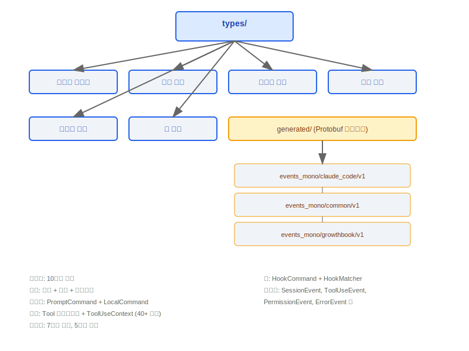
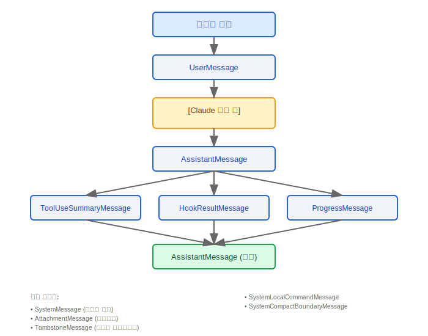
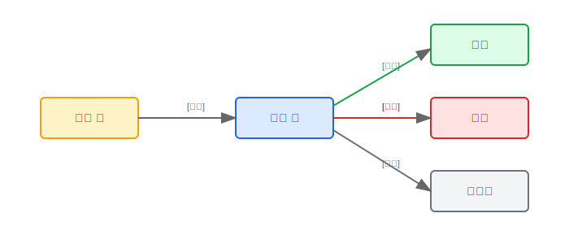
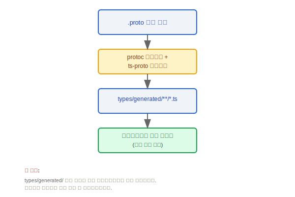

# 타입 시스템(Type System)

> Claude Code의 타입 시스템(Type System)은 메시지, 권한, 커맨드, 도구, 태스크, 훅, 생성된 코드 등 핵심 도메인에 대한 TypeScript 타입을 정의합니다. 이는 전체 애플리케이션의 타입 안전성 기반입니다.

---

## 타입 시스템(Type System) 개요



### 설계 철학: 왜 메시지 타입이 이렇게 복잡한가(10가지 변형)?

각 메시지 소스는 서로 다른 구조와 생명주기를 가집니다:

1. **사용자 입력** (`UserMessage`)에는 `tool_result` 내용 블록이 포함될 수 있습니다. API 프로토콜이 도구 결과를 사용자 역할과 함께 전송하도록 요구하기 때문입니다
2. **어시스턴트 응답** (`AssistantMessage`)에는 도구 실행 루프를 트리거하는 `tool_use` 블록이 포함될 수 있습니다
3. **시스템 메시지** (`SystemMessage`, `SystemLocalCommandMessage`)는 애플리케이션 내부에서 생성되며 API에 전송되지 않습니다
4. **생명주기 마커** (`TombstoneMessage`, `SystemCompactBoundaryMessage`)는 컨텍스트 관리에서 특수한 의미를 갖습니다 — 톰스톤은 모델 다운그레이드 중 삭제된 메시지를 표시하고, 컴팩트 경계는 컨텍스트 압축 전후의 구분선을 표시합니다
5. **스트리밍** (`ProgressMessage`)은 임시적입니다 — 도구 실행 중에만 존재하며 영속화되지 않습니다

이 세분화된 타입 구별을 통해 TypeScript 컴파일러는 각 처리 분기에서 정확한 타입 추론을 제공하여 런타임 타입 검사가 필요 없습니다.

### 설계 철학: 왜 DeepImmutable인가?

소스 코드 `hooks/useSettings.ts`의 주석: "`Settings type as stored in AppState (DeepImmutable wrapped)`", 그리고 `types/permissions.ts`의 425줄: "`Uses a simplified DeepImmutable approximation for this types-only file`".

권한 컨텍스트(`ToolPermissionContext`)와 설정(`ReadonlySettings`)은 결정 체인의 여러 함수에 걸쳐 전달됩니다 — `canUseTool()` → 규칙 매칭 → 도구별 검사 → 분류기. 중간 단계에서의 우발적인 변형은 보안 취약점입니다:
- 권한 규칙이 변형되면 위험한 작업이 보안 검사를 우회할 수 있습니다
- 설정이 변형되면 이후 모든 도구 호출의 동작에 영향을 미칠 수 있습니다
- `DeepImmutable`은 재귀적 `Readonly`를 통해 컴파일 타임에 이러한 변형을 방지합니다

---

## 1. 메시지 타입 (Message Union)

`Message`는 시스템의 모든 메시지 변형을 커버하는 유니온 타입입니다:

```typescript
type Message =
  | UserMessage                  // 사용자가 입력한 텍스트 메시지
  | AssistantMessage             // Claude의 텍스트 응답
  | SystemMessage                // 시스템 수준 프롬프트 및 알림
  | AttachmentMessage            // 첨부 메시지 (파일/이미지)
  | TombstoneMessage             // 삭제된 메시지의 자리 표시자
  | ToolUseSummaryMessage        // 도구 호출 요약
  | HookResultMessage            // 훅 실행 결과
  | SystemLocalCommandMessage    // 로컬 커맨드의 시스템 메시지
  | SystemCompactBoundaryMessage // 컨텍스트 압축 경계 마커
  | ProgressMessage;             // 스트리밍 진행 업데이트
```

### 메시지 타입 관계 다이어그램



---

## 2. 권한 타입

### 2.1 권한 모드(Permission Mode)

```typescript
const PERMISSION_MODES = [
  'acceptEdits',        // 편집 수락: 파일 수정 자동 승인
  'bypassPermissions',  // 권한 우회: 모든 권한 검사 건너뜀
  'default',            // 기본 모드: 민감한 작업은 확인 필요
  'dontAsk',            // 묻지 않음: 자동으로 처리
  'plan',               // 계획 모드: 읽기 전용, 실행 없음
  'auto',               // 자동 모드: 확인 건너뜀
] as const;
```

### 2.2 권한 규칙(Permission Rule)

```typescript
interface PermissionRule {
  source: string;           // 규칙 소스 (user / project / system)
  ruleBehavior: string;     // 규칙 동작 (allow / deny / ask)
  ruleValue: string;        // 규칙 매칭 값 (도구 이름 / glob 패턴)
}
```

### 2.3 권한 업데이트

```typescript
interface PermissionUpdate {
  type: 'addRules' | 'removeRules' | 'setMode';
  destination: string;      // 업데이트 대상 (session / project / global)
}
```

---

## 3. 커맨드 타입

```typescript
// 프롬프트 커맨드 -- Claude에 처리를 위해 전송됨
interface PromptCommand {
  type: 'prompt';
  progressMessage: string;        // 실행 중 표시되는 진행 메시지
  contentLength: number;          // 내용 길이
  allowedTools: string[];         // 허용된 도구 목록
  source: string;                 // 커맨드 소스
  context: unknown;               // 컨텍스트 데이터
  hooks: HookConfig[];            // 연관된 훅
}

// 로컬 커맨드 -- 클라이언트에서 직접 실행됨
interface LocalCommand {
  type: 'local';
  supportsNonInteractive: boolean; // 비인터랙티브 모드 지원 여부
  load(): Promise<void>;           // 지연 로드 실행 함수
}
```

| 타입            | 실행 위치 | 특징                                              |
|----------------|-----------|---------------------------------------------------|
| `PromptCommand`| 서버 측    | `progressMessage`, `allowedTools`, `hooks` 보유  |
| `LocalCommand` | 클라이언트 측 | `supportsNonInteractive`, `load()` 보유         |

---

## 4. 도구 타입

### 4.1 Tool 인터페이스 (Tool.ts)

```typescript
interface Tool {
  name: string;
  displayName: string;
  description: string;
  inputSchema: JSONSchema;
  execute(input: unknown, ctx: ToolUseContext): Promise<ToolResult>;
  isEnabled?(ctx: ToolUseContext): boolean;
  requiresPermission?(input: unknown): PermissionRequest | null;
}
```

### 4.2 ToolUseContext (40개 이상의 속성)

`ToolUseContext`는 도구 실행 시 완전한 컨텍스트 객체로, 40개 이상의 속성을 포함합니다:

```typescript
interface ToolUseContext {
  // --- 세션 정보 ---
  sessionId: string;
  conversationId: string;
  turnIndex: number;

  // --- 파일 시스템 ---
  cwd: string;
  homedir: string;
  projectRoot: string;

  // --- 권한 ---
  permissionMode: PermissionMode;
  permissionRules: PermissionRule[];

  // --- 구성 ---
  settings: Settings;
  featureFlags: FeatureFlags;

  // --- 런타임 ---
  abortSignal: AbortSignal;
  readFileTimestamps: Map<string, number>;
  modifiedFiles: Set<string>;

  // --- API ---
  apiClient: ApiClient;
  sessionToken?: string;

  // ... (총 40개 이상의 속성)
}
```

### 4.3 ToolPermissionContext

```typescript
interface ToolPermissionContext {
  mode: PermissionMode;
  additionalWorkingDirectories: string[];
  alwaysAllowRules: PermissionRule[];
  alwaysDenyRules: PermissionRule[];
  alwaysAskRules: PermissionRule[];
}
```

---

## 5. 태스크 타입 (Task.ts)

### 5.1 TaskType (7가지 변형)

```typescript
type TaskType =
  | 'main'            // 메인 태스크 (사용자가 직접 시작)
  | 'subtask'         // 서브태스크 (에이전트가 디스패치)
  | 'hook'            // 훅 태스크
  | 'background'      // 백그라운드 태스크
  | 'remote'          // 원격 태스크 (텔레포트)
  | 'scheduled'       // 예약된 태스크
  | 'continuation';   // 계속 태스크
```

### 5.2 TaskStatus (5가지 변형)

```typescript
type TaskStatus =
  | 'pending'         // 실행 대기 중
  | 'running'         // 현재 실행 중
  | 'completed'       // 성공적으로 완료됨
  | 'failed'          // 실행 실패
  | 'cancelled';      // 취소됨
```

### 5.3 핵심 인터페이스

```typescript
interface TaskHandle {
  id: string;
  type: TaskType;
  status: TaskStatus;
  cancel(): void;
  result: Promise<TaskResult>;
}

interface TaskContext {
  parentTaskId?: string;
  depth: number;
  maxDepth: number;
  sharedState: Map<string, unknown>;
}

interface TaskStateBase {
  taskId: string;
  type: TaskType;
  status: TaskStatus;
  createdAt: number;
  updatedAt: number;
  error?: Error;
}
```

### 태스크 상태 전환



### 5.4 LocalShellSpawnInput

```typescript
// Bash 도구에서 사용하는 셸 커맨드 입력 타입
interface LocalShellSpawnInput {
  command: string;
  timeout?: number;
  // ...
}
```

---

## 6. 훅 타입

### 6.1 HookCommand Union

```typescript
type HookCommand =
  | ShellHookCommand        // 셸 커맨드 실행
  | McpToolHookCommand;     // MCP 도구 호출

interface ShellHookCommand {
  type: 'shell';
  command: string;
  timeout?: number;
}

interface McpToolHookCommand {
  type: 'mcp_tool';
  serverName: string;
  toolName: string;
  args?: Record<string, unknown>;
}
```

### 6.2 HookMatcherSchema

```typescript
interface HookMatcherSchema {
  event: HookEvent;              // 트리거 이벤트 유형
  toolName?: string;             // 도구 이름 매칭 (선택 사항)
  filePath?: string;             // 파일 경로 glob 매칭 (선택 사항)
  conditions?: HookCondition[];  // 추가 조건 (선택 사항)
}
```

### 6.3 HookProgress

```typescript
// 훅 실행 진행 추적
interface HookProgress {
  hookName: string;
  status: 'pending' | 'running' | 'completed' | 'failed';
  output?: string;
}
```

---

## 7. 생성된 타입 (types/generated/)

### Protobuf 컴파일 이벤트 타입

모든 원격 측정 및 이벤트 보고 타입은 Protobuf 정의 파일을 컴파일하여 생성되며, 수동으로 수정해서는 안 됩니다.

```
types/generated/
  |
  +-- events_mono/
  |     |
  |     +-- claude_code/v1/     # Claude Code 전용 이벤트
  |     |     +-- SessionEvent
  |     |     +-- ToolUseEvent
  |     |     +-- PermissionEvent
  |     |     +-- ErrorEvent
  |     |     +-- ...
  |     |
  |     +-- common/v1/          # 공통 이벤트 타입
  |     |     +-- Timestamp
  |     |     +-- UserInfo
  |     |     +-- DeviceInfo
  |     |     +-- ...
  |     |
  |     +-- growthbook/v1/      # 기능 플래그 이벤트
  |           +-- FeatureEvent
  |           +-- ExperimentEvent
  |           +-- ...
  |
  +-- google/
        +-- protobuf/           # Google Protobuf 기본 타입
```

### 생성 파이프라인



> **참고**: `types/generated/` 아래의 파일은 빌드 파이프라인에 의해 자동으로 생성됩니다. 수동으로 수정하면 다음 빌드 시 덮어씌워집니다.

---

## 엔지니어링 실천

### 새 메시지 타입 추가를 위한 체크리스트

1. **`types/message.ts`** -- 새 메시지 타입 인터페이스를 정의하고 `Message` 유니온 타입에 추가합니다
2. **`utils/messages.ts`** -- 메시지 생성자 함수와 타입 가드(`isXxxMessage()` 함수)를 추가합니다
3. **`utils/messages.ts` / `utils/queryHelpers.ts`** -- `normalizeMessagesForAPI()`의 6단계 정규화 파이프라인에서 새 타입에 대한 처리 로직을 추가합니다 (API에 전송 여부와 `MessageParam`으로의 변환 방법 결정)
4. **UI 컴포넌트(Component)** -- REPL의 메시지 스트림 렌더링 로직에 새 메시지 타입에 대한 렌더링 컴포넌트(Component)를 추가합니다
5. **직렬화/역직렬화** -- 새 메시지를 영속화해야 하는 경우(세션 복원), `sessionStorage.ts`가 올바르게 처리하도록 확인합니다

### 타입 안전성 모범 사례

- **외부 입력의 런타임 검증에는 Zod 스키마 사용** -- API 응답, 구성 파일, 사용자 입력 등의 외부 데이터는 내부 타입으로 변환되기 전에 Zod 스키마로 검증해야 합니다(소스 코드 `controlSchemas.ts`는 엄격한 검증을 위해 `z.literal()`, `z.string()`, `z.number()`를 광범위하게 사용합니다)
- **내부 전달에는 컴파일 타임 타입 검사** -- 내부 함수 간의 데이터 전달은 TypeScript 타입 시스템(Type System)에 의존하며 런타임 검증이 필요하지 않습니다
- **완전성 검사** -- `Message` 유니온 타입에 `switch` + `never` 패턴을 사용하여 새 메시지 타입이 추가될 때 컴파일러가 모든 분기 처리를 강제하도록 합니다
- **생성된 타입은 읽기 전용 참조** -- `types/generated/` 아래의 Protobuf 컴파일 아티팩트는 임포트하여 사용만 할 수 있으며 수동으로 수정해서는 안 됩니다

---

## 기타 보조 타입

| 타입               | 설명                                           |
|--------------------|------------------------------------------------|
| `SessionId`        | UUID 타입, 고유 세션 식별자                    |
| `LogOptions`       | 로깅 구성 옵션                                 |
| `Plugin`           | 플러그인 매니페스트 스키마                     |
| `PromptInputMode`  | 입력 모드 열거형                               |


---

[← 스크린 컴포넌트](../44-Screens组件/screens-components-ko.md) | [인덱스](../README_KO.md) | [완전한 데이터 흐름 →](../46-完整数据流图/complete-data-flow-ko.md)
