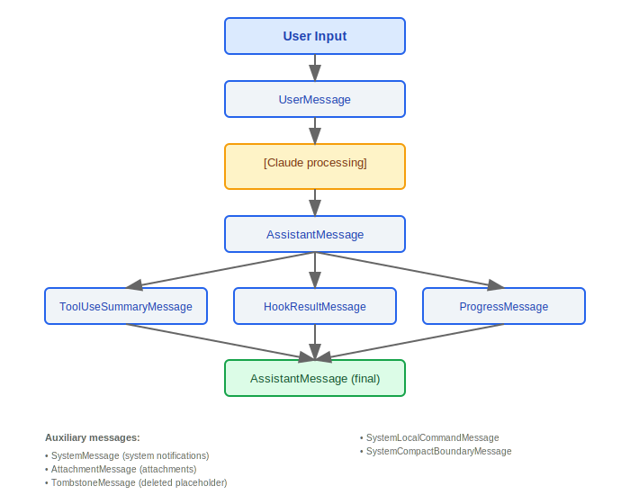
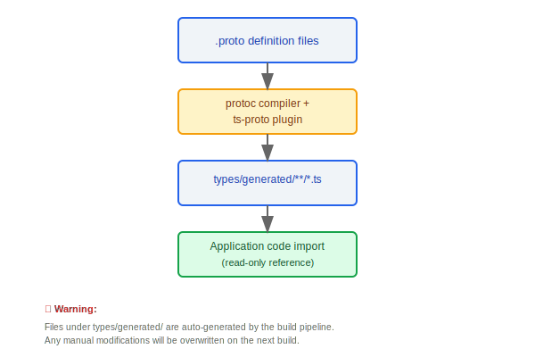

# 类型系统

> Claude Code 的类型系统定义了消息、权限、命令、工具、任务、钩子和生成代码等核心领域的 TypeScript 类型, 是整个应用的类型安全基石。

---

## 类型体系总览


### 设计理念：为什么消息类型如此复杂（10 种变体）？

每种消息来源有不同的结构和生命周期：

1. **用户输入**（`UserMessage`）可能包含 `tool_result` 内容块，因为 API 协议要求 tool result 以 user role 发送
2. **助手响应**（`AssistantMessage`）可能包含 `tool_use` 块，触发工具执行循环
3. **系统消息**（`SystemMessage`、`SystemLocalCommandMessage`）是应用内部生成的，不发送给 API
4. **生命周期标记**（`TombstoneMessage`、`SystemCompactBoundaryMessage`）在上下文管理中有特殊语义——tombstone 标记模型降级时被丢弃的消息，compact boundary 标记压缩前后的分界
5. **流式传输**（`ProgressMessage`）是临时的——只在工具执行期间存在，不会持久化

这种细粒度的类型区分让 TypeScript 编译器在每个处理分支中提供精确的类型推断，消除运行时类型检查的需要。

### 设计理念：为什么 DeepImmutable？

源码 `hooks/useSettings.ts` 中注释："`Settings type as stored in AppState (DeepImmutable wrapped)`"，`types/permissions.ts` 第 425 行注释："`Uses a simplified DeepImmutable approximation for this types-only file`"。

权限上下文（`ToolPermissionContext`）和设置（`ReadonlySettings`）在决策链中跨多个函数传递——从 `canUseTool()` → 规则匹配 → 工具特定检查 → 分类器。任何中间环节的意外修改都是安全漏洞：
- 如果权限规则被修改，可能让危险操作绕过安全检查
- 如果设置被修改，可能影响后续所有工具调用的行为
- `DeepImmutable` 通过递归 `Readonly` 在编译时防止此类修改

---

## 1. 消息类型 (Message 联合)

Message 是一个联合类型, 涵盖系统中所有消息变体:

```typescript
type Message =
  | UserMessage                  // 用户输入的文本消息
  | AssistantMessage             // Claude 的文本响应
  | SystemMessage                // 系统级提示和通知
  | AttachmentMessage            // 附件消息 (文件/图片)
  | TombstoneMessage             // 已删除消息的占位符
  | ToolUseSummaryMessage        // 工具调用摘要
  | HookResultMessage            // 钩子执行结果
  | SystemLocalCommandMessage    // 本地命令的系统消息
  | SystemCompactBoundaryMessage // 上下文压缩边界标记
  | ProgressMessage;             // 流式进度更新
```

### 消息类型关系图



---

## 2. 权限类型

### 2.1 权限模式

```typescript
const PERMISSION_MODES = [
  'acceptEdits',        // 接受编辑: 自动批准文件修改
  'bypassPermissions',  // 绕过权限: 跳过所有权限检查
  'default',            // 默认模式: 敏感操作需确认
  'dontAsk',            // 不询问: 静默处理
  'plan',               // 计划模式: 只读, 不执行
  'auto',               // 自动模式: 跳过确认
] as const;
```

### 2.2 权限规则

```typescript
interface PermissionRule {
  source: string;           // 规则来源 (user / project / system)
  ruleBehavior: string;     // 规则行为 (allow / deny / ask)
  ruleValue: string;        // 规则匹配值 (工具名 / glob 模式)
}
```

### 2.3 权限更新

```typescript
interface PermissionUpdate {
  type: 'addRules' | 'removeRules' | 'setMode';
  destination: string;      // 更新目标 (session / project / global)
}
```

---

## 3. 命令类型

```typescript
// Prompt 命令 -- 发送到 Claude 处理
interface PromptCommand {
  type: 'prompt';
  progressMessage: string;        // 执行中显示的进度消息
  contentLength: number;          // 内容长度
  allowedTools: string[];         // 允许使用的工具列表
  source: string;                 // 命令来源
  context: unknown;               // 上下文数据
  hooks: HookConfig[];            // 关联的钩子
}

// 本地命令 -- 在客户端直接执行
interface LocalCommand {
  type: 'local';
  supportsNonInteractive: boolean; // 是否支持非交互模式
  load(): Promise<void>;           // 懒加载执行函数
}
```

| 类型            | 执行位置  | 特征                                          |
|----------------|----------|-----------------------------------------------|
| `PromptCommand`| 服务端    | 有 `progressMessage`, `allowedTools`, `hooks` |
| `LocalCommand` | 客户端    | 有 `supportsNonInteractive`, `load()`         |

---

## 4. 工具类型

### 4.1 Tool 接口 (Tool.ts)

```typescript
interface Tool {
  name: string;
  displayName: string;
  description: string;
  inputSchema: JSONSchema;
  execute(input: unknown, ctx: ToolUseContext): Promise<ToolResult>;
  isEnabled?(ctx: ToolUseContext): boolean;
  requiresPermission?(input: unknown): PermissionRequest | null;
}
```

### 4.2 ToolUseContext (40+ 属性)

`ToolUseContext` 是工具执行时的完整上下文对象, 包含 40+ 个属性:

```typescript
interface ToolUseContext {
  // --- 会话信息 ---
  sessionId: string;
  conversationId: string;
  turnIndex: number;

  // --- 文件系统 ---
  cwd: string;
  homedir: string;
  projectRoot: string;

  // --- 权限 ---
  permissionMode: PermissionMode;
  permissionRules: PermissionRule[];

  // --- 配置 ---
  settings: Settings;
  featureFlags: FeatureFlags;

  // --- 运行时 ---
  abortSignal: AbortSignal;
  readFileTimestamps: Map<string, number>;
  modifiedFiles: Set<string>;

  // --- API ---
  apiClient: ApiClient;
  sessionToken?: string;

  // ... (40+ 属性总计)
}
```

### 4.3 ToolPermissionContext

```typescript
interface ToolPermissionContext {
  mode: PermissionMode;
  additionalWorkingDirectories: string[];
  alwaysAllowRules: PermissionRule[];
  alwaysDenyRules: PermissionRule[];
  alwaysAskRules: PermissionRule[];
}
```

---

## 5. 任务类型 (Task.ts)

### 5.1 TaskType (7种)

```typescript
type TaskType =
  | 'main'            // 主任务 (用户直接发起)
  | 'subtask'         // 子任务 (agent 分派)
  | 'hook'            // 钩子任务
  | 'background'      // 后台任务
  | 'remote'          // 远程任务 (teleport)
  | 'scheduled'       // 定时任务
  | 'continuation';   // 延续任务
```

### 5.2 TaskStatus (5种)

```typescript
type TaskStatus =
  | 'pending'         // 等待执行
  | 'running'         // 执行中
  | 'completed'       // 已完成
  | 'failed'          // 执行失败
  | 'cancelled';      // 已取消
```

### 5.3 核心接口

```typescript
interface TaskHandle {
  id: string;
  type: TaskType;
  status: TaskStatus;
  cancel(): void;
  result: Promise<TaskResult>;
}

interface TaskContext {
  parentTaskId?: string;
  depth: number;
  maxDepth: number;
  sharedState: Map<string, unknown>;
}

interface TaskStateBase {
  taskId: string;
  type: TaskType;
  status: TaskStatus;
  createdAt: number;
  updatedAt: number;
  error?: Error;
}
```

### 任务状态转换


### 5.4 LocalShellSpawnInput

```typescript
// 用于 Bash 工具的 shell 命令输入类型
interface LocalShellSpawnInput {
  command: string;
  timeout?: number;
  // ...
}
```

---

## 6. 钩子类型

### 6.1 HookCommand 联合

```typescript
type HookCommand =
  | ShellHookCommand        // 执行 shell 命令
  | McpToolHookCommand;     // 调用 MCP 工具

interface ShellHookCommand {
  type: 'shell';
  command: string;
  timeout?: number;
}

interface McpToolHookCommand {
  type: 'mcp_tool';
  serverName: string;
  toolName: string;
  args?: Record<string, unknown>;
}
```

### 6.2 HookMatcherSchema

```typescript
interface HookMatcherSchema {
  event: HookEvent;              // 触发事件类型
  toolName?: string;             // 匹配工具名 (可选)
  filePath?: string;             // 匹配文件路径 glob (可选)
  conditions?: HookCondition[];  // 额外条件 (可选)
}
```

### 6.3 HookProgress

```typescript
// 钩子执行进度追踪
interface HookProgress {
  hookName: string;
  status: 'pending' | 'running' | 'completed' | 'failed';
  output?: string;
}
```

---

## 7. 生成类型 (types/generated/)

### Protobuf 编译的事件类型

所有遥测和事件上报类型由 Protobuf 定义文件编译生成, 不可手动修改。

```
types/generated/
  |
  +-- events_mono/
  |     |
  |     +-- claude_code/v1/     # Claude Code 特定事件
  |     |     +-- SessionEvent
  |     |     +-- ToolUseEvent
  |     |     +-- PermissionEvent
  |     |     +-- ErrorEvent
  |     |     +-- ...
  |     |
  |     +-- common/v1/          # 通用事件类型
  |     |     +-- Timestamp
  |     |     +-- UserInfo
  |     |     +-- DeviceInfo
  |     |     +-- ...
  |     |
  |     +-- growthbook/v1/      # 特性标志事件
  |           +-- FeatureEvent
  |           +-- ExperimentEvent
  |           +-- ...
  |
  +-- google/
        +-- protobuf/           # Google Protobuf 基础类型
```

### 生成流程



> **注意**: `types/generated/` 下的文件由构建流程自动生成, 任何手动修改都会在下次构建时被覆盖。

---

## 工程实践

### 添加新消息类型的清单

1. **`types/message.ts`** -- 定义新的消息类型接口，添加到 `Message` 联合类型中
2. **`utils/messages.ts`** -- 添加消息构造函数和类型守卫（`isXxxMessage()` 函数）
3. **`utils/messages.ts` / `utils/queryHelpers.ts`** -- 在 `normalizeMessagesForAPI()` 的 6 步标准化流程中添加对新类型的处理逻辑（决定是否发送给 API、如何转换为 `MessageParam`）
4. **UI 组件** -- 在 REPL 的消息流渲染逻辑中添加新消息类型的渲染组件
5. **序列化/反序列化** -- 如果新消息需要持久化（会话恢复），确保 `sessionStorage.ts` 能正确处理

### 类型安全的最佳实践

- **Zod schema 运行时验证外部输入** -- API 响应、配置文件、用户输入等外部数据应使用 Zod schema 验证后再转换为内部类型（源码中 `controlSchemas.ts` 大量使用 `z.literal()`、`z.string()`、`z.number()` 进行严格验证）
- **编译时类型检查内部传递** -- 内部函数间的数据传递依赖 TypeScript 类型系统，不需要运行时验证
- **穷尽性检查** -- 对 Message 联合类型使用 `switch` + `never` 模式，确保新增消息类型时编译器强制要求处理所有分支
- **生成类型只读引用** -- `types/generated/` 下的 Protobuf 编译产物只能 import 使用，不可手动修改

---

## 其他辅助类型

| 类型            | 说明                              |
|----------------|-----------------------------------|
| `SessionId`    | UUID 类型, 会话唯一标识             |
| `LogOptions`   | 日志配置选项                        |
| `Plugin`       | 插件清单 (manifest) schema         |
| `PromptInputMode` | 输入模式枚举                    |


---

[← Screens 组件](../44-Screens组件/screens-components.md) | [目录](../README.md) | [完整数据流图 →](../46-完整数据流图/complete-data-flow.md)
