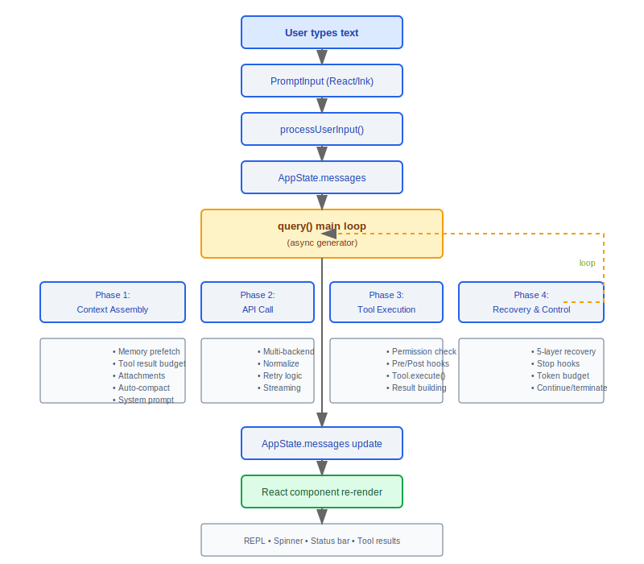
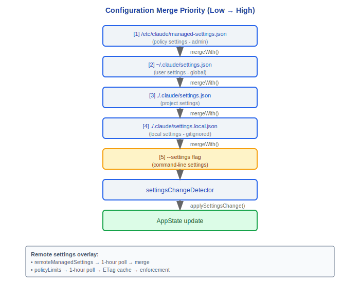
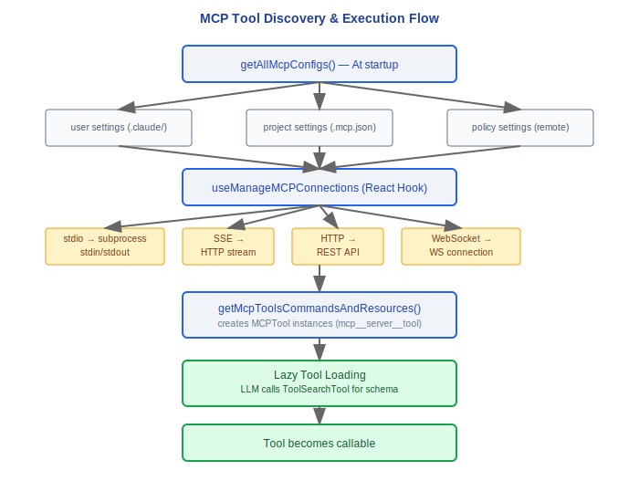
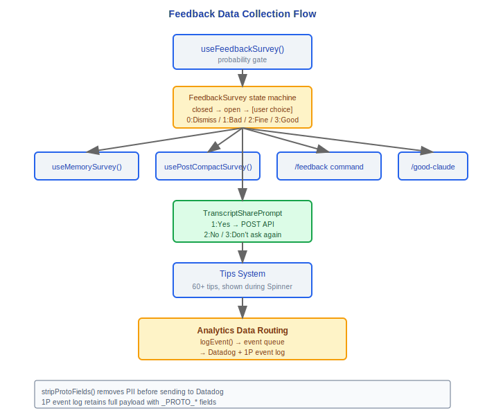
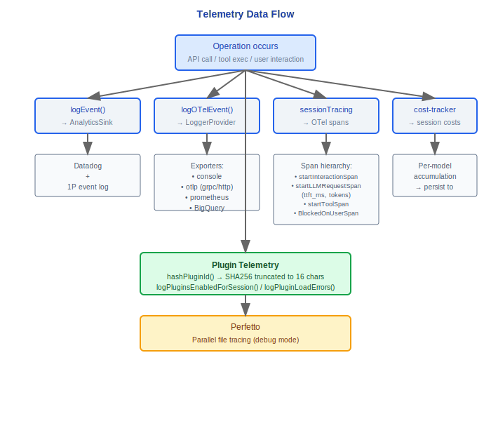
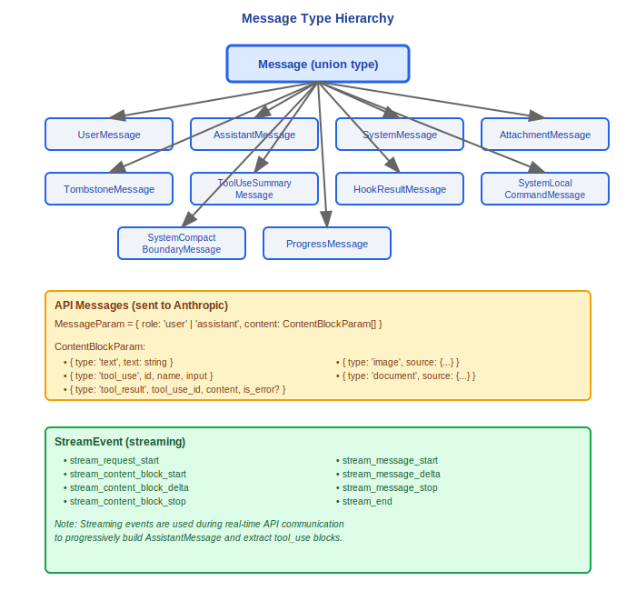

# Complete Data Flow Atlas

## Design Philosophy: Why Does End-to-End Flow Involve So Many Steps?

This data flow atlas is a panoramic view of the Claude Code architecture — from the moment a user types text to the moment a React component re-renders, each step solves an independent problem domain. Skipping any step leads to a specific category of bugs:

| Phase | Problem Solved | Consequence If Skipped |
|-------|---------------|------------------------|
| Context Assembly | Build complete conversation context (memory, attachments, compaction) | Model lacks critical information, response quality degrades |
| normalizeMessagesForAPI | Message format normalization (6-step processing) | API rejects non-compliant messages, tool_result pairing fails |
| Retry Mechanism | Handle transient errors (529/429/connection errors) | A single network blip causes user operation failure |
| Permission Check | Security validation before tool execution | Dangerous commands execute without confirmation |
| Hook System | Pre/Post tool execution hooks | User-configured automation workflows are skipped |
| Error Recovery | 5-layer progressive recovery strategy | Errors like prompt-too-long cause session interruption |

Each step is independently validated and tested to ensure end-to-end process reliability.

---

## 1. End-to-End Main Flow



## 2. Configuration Loading Flow



## 3. Permission Decision Flow


## 4. MCP Tool Discovery and Execution Flow



## 5. Multi-Agent Communication Flow


## 6. Feedback Data Collection Flow



## 7. Telemetry Data Flow



## 8. Background Service Orchestration Sequence


## 9. Message Type Hierarchy



---

## Engineering Practices

### How to Debug the Complete Request Chain

Enabling debug mode lets you inspect the input/output at each phase:

1. **Context Assembly Phase** -- Check whether `autoCompactIfNeeded()` triggers compaction (threshold: context window - 13K tokens), and observe the assembly process for attachment messages (memory / file discovery / agent list / MCP instructions).
2. **API Call Phase** -- Inspect the 6-step normalization output of `normalizeMessagesForAPI()` to confirm message format compliance.
3. **Retry Phase** -- `withRetry()` logs show the retry reason (529 capacity / 429 rate limit / connection error / 401 auth); retry intervals follow exponential backoff.
4. **Tool Execution Phase** -- Permission check results for each `runToolUse()` call, Pre/Post hook execution status, and tool execution results are all traceable in the logs.
5. **Error Recovery Phase** -- The 5-layer recovery strategy is attempted in increasing cost order (L1 no API call → L5 user interrupt); logs mark which recovery layer is currently active.

### Locating Performance Bottlenecks

OTel spans map to each phase of the data flow. Use Perfetto flame graphs to identify the slowest segment:

```
Span hierarchy provided by sessionTracing:
  startInteractionSpan(userPrompt)           -- entire interaction cycle
    ├─ startLLMRequestSpan()                 -- API call (includes TTFT)
    │   └─ endLLMRequestSpan(metadata)       -- records input/output tokens, ttft_ms
    ├─ startToolSpan()                       -- tool execution
    │   ├─ startToolBlockedOnUserSpan()      -- waiting for user confirmation
    │   └─ endToolSpan()                     -- tool complete
    └─ endInteractionSpan()                  -- interaction end
```

Common bottleneck locations:
- API first-token latency (TTFT) -- check model selection and prompt size
- Tool execution time -- especially file read/write and Bash command execution
- User confirmation wait -- `startToolBlockedOnUserSpan()` records wait time
- Context compaction -- `compactConversation()` involves an additional Claude API call

### Where Should a New Feature Be Inserted in the Data Flow?

Decision tree:

```
New feature needs to modify how user input is processed?
  └─ YES → processUserInput() layer (alongside "!" / "/" prefix handling)

New feature needs to modify messages before API call?
  └─ YES → Phase 1 (context assembly), add in getAttachmentMessages() or system prompt construction

New feature needs to add logic before/after tool execution?
  └─ YES → use Hook system (Pre/Post ToolUse), do not modify core data flow

New feature needs to run after each conversation turn ends?
  └─ YES → add background service in handleStopHooks() (fire-and-forget pattern)

New feature needs to modify how API responses are processed?
  └─ YES → add processing in Phase 2 (API call) streaming event loop

New feature needs a new error recovery strategy?
  └─ YES → choose the appropriate layer within Phase 4 (error recovery) 5-layer strategy to insert
```


---

[← Type System](../45-类型系统/type-system-en.md) | [Index](../README_EN.md)
