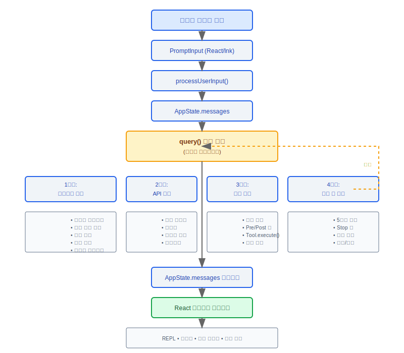
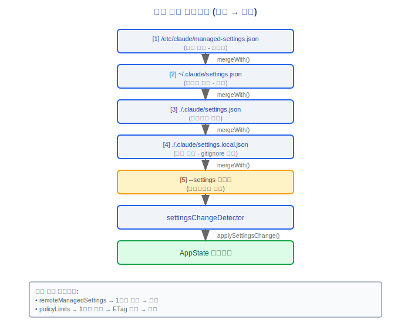
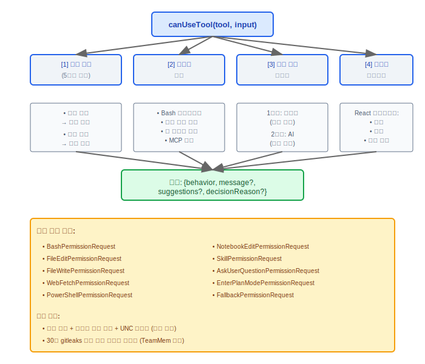
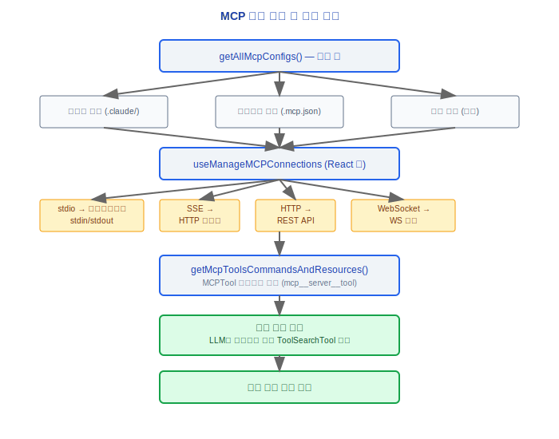
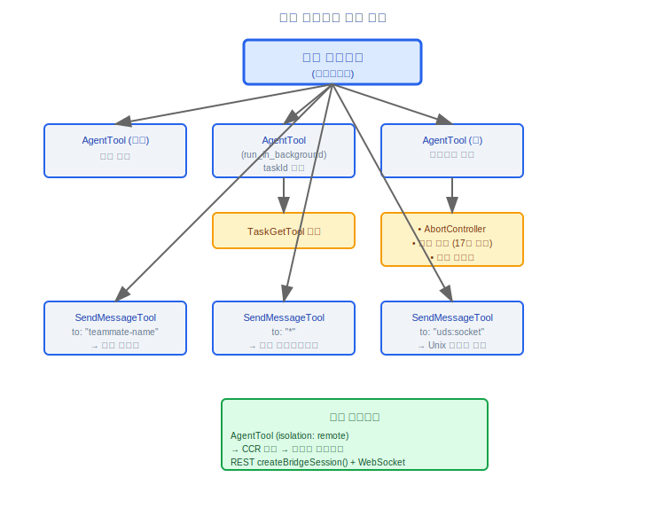
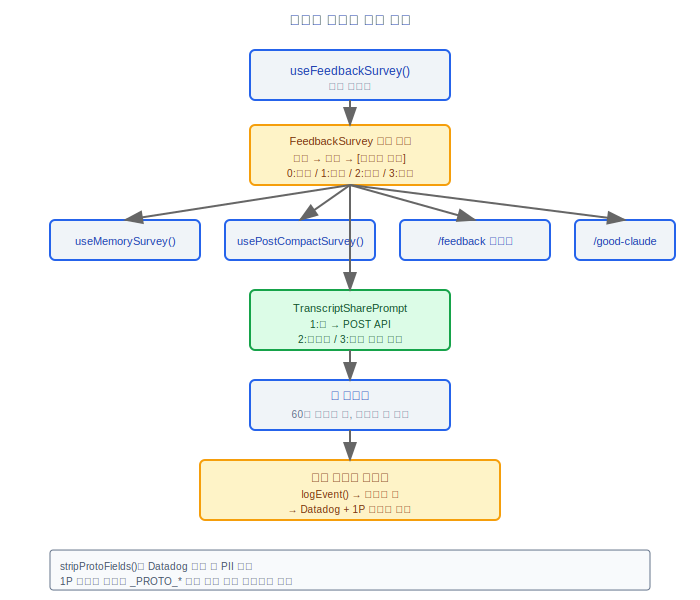
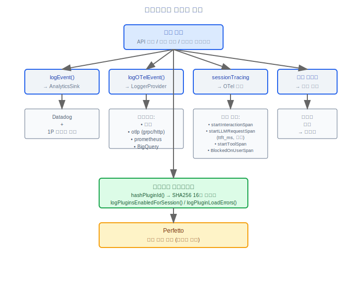
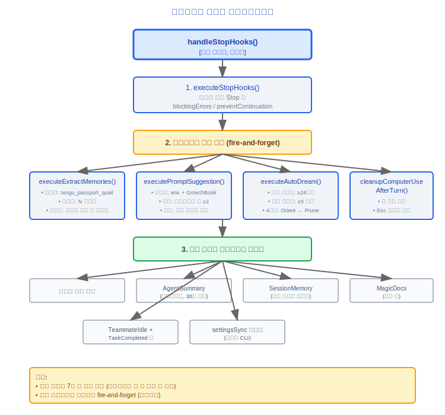
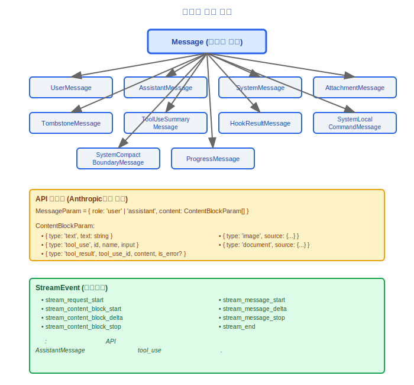

# 완전한 데이터 흐름(Data Flow) 아틀라스

## 설계 철학: 왜 엔드-투-엔드 흐름에 이렇게 많은 단계가 관여하는가?

이 데이터 흐름(Data Flow) 아틀라스는 Claude Code 아키텍처의 파노라마 뷰입니다 — 사용자가 텍스트를 입력하는 순간부터 React 컴포넌트(Component)가 리렌더링되는 순간까지, 각 단계는 독립적인 문제 도메인을 해결합니다. 어떤 단계를 건너뛰어도 특정 범주의 버그가 발생합니다:

| 단계 | 해결하는 문제 | 건너뛸 경우의 결과 |
|-------|---------------|------------------------|
| 컨텍스트 어셈블리 | 완전한 대화 컨텍스트 구축 (메모리, 첨부 파일, 압축) | 모델에 중요한 정보가 부족하여 응답 품질이 저하됨 |
| normalizeMessagesForAPI | 메시지 형식 정규화 (6단계 처리) | API가 비준수 메시지를 거부하고 tool_result 페어링이 실패함 |
| 재시도 메커니즘 | 일시적 오류 처리 (529/429/연결 오류) | 단일 네트워크 순간 장애로 사용자 작업이 실패함 |
| 권한 검사 | 도구 실행 전 보안 검증 | 위험한 커맨드가 확인 없이 실행됨 |
| 훅 시스템 | 도구 실행 전/후 훅 | 사용자가 구성한 자동화 워크플로가 건너뜀 |
| 오류 복구 | 5단계 점진적 복구 전략 | prompt-too-long 같은 오류로 세션이 중단됨 |

각 단계는 독립적으로 검증되고 테스트되어 엔드-투-엔드 프로세스 안정성을 보장합니다.

---

## 1. 엔드-투-엔드 메인 흐름



## 2. 구성 로딩 흐름



## 3. 권한 결정 흐름



## 4. MCP 도구 검색 및 실행 흐름



## 5. 멀티 에이전트 통신 흐름



## 6. 피드백 데이터 수집 흐름



## 7. 원격 측정 데이터 흐름(Data Flow)



## 8. 백그라운드 서비스 오케스트레이션 시퀀스



## 9. 메시지 타입 계층 구조



---

## 엔지니어링 실천

### 완전한 요청 체인 디버깅 방법

디버그 모드를 활성화하면 각 단계의 입력/출력을 검사할 수 있습니다:

1. **컨텍스트 어셈블리 단계** -- `autoCompactIfNeeded()`가 압축을 트리거하는지 확인하고(임계값: 컨텍스트 창 - 13K 토큰), 첨부 메시지(메모리 / 파일 검색 / 에이전트 목록 / MCP 지침)의 어셈블리 과정을 관찰합니다.
2. **API 호출 단계** -- `normalizeMessagesForAPI()`의 6단계 정규화 출력을 검사하여 메시지 형식 준수를 확인합니다.
3. **재시도 단계** -- `withRetry()` 로그에서 재시도 이유(529 용량 / 429 속도 제한 / 연결 오류 / 401 인증)와 지수 백오프를 따르는 재시도 간격을 확인합니다.
4. **도구 실행 단계** -- 각 `runToolUse()` 호출에 대한 권한 검사 결과, Pre/Post 훅 실행 상태, 도구 실행 결과는 모두 로그에서 추적 가능합니다.
5. **오류 복구 단계** -- 5단계 복구 전략은 비용 증가 순서로 시도됩니다(L1 API 호출 없음 → L5 사용자 중단); 로그에서 현재 활성화된 복구 레이어를 표시합니다.

### 성능 병목 지점 찾기

OTel 스팬은 데이터 흐름(Data Flow)의 각 단계에 매핑됩니다. Perfetto 플레임 그래프를 사용하여 가장 느린 세그먼트를 식별합니다:

```
sessionTracing이 제공하는 스팬 계층 구조:
  startInteractionSpan(userPrompt)           -- 전체 상호작용 주기
    ├─ startLLMRequestSpan()                 -- API 호출 (TTFT 포함)
    │   └─ endLLMRequestSpan(metadata)       -- 입력/출력 토큰, ttft_ms 기록
    ├─ startToolSpan()                       -- 도구 실행
    │   ├─ startToolBlockedOnUserSpan()      -- 사용자 확인 대기
    │   └─ endToolSpan()                     -- 도구 완료
    └─ endInteractionSpan()                  -- 상호작용 종료
```

일반적인 병목 지점:
- API 첫 토큰 지연 (TTFT) -- 모델 선택 및 프롬프트 크기 확인
- 도구 실행 시간 -- 특히 파일 읽기/쓰기 및 Bash 커맨드 실행
- 사용자 확인 대기 -- `startToolBlockedOnUserSpan()`에서 대기 시간을 기록
- 컨텍스트 압축 -- `compactConversation()`은 추가적인 Claude API 호출을 수반

### 데이터 흐름(Data Flow)에 새 기능을 어디에 삽입해야 하는가?

결정 트리:

```
새 기능이 사용자 입력 처리 방식을 수정해야 하는가?
  └─ YES → processUserInput() 레이어 ("!" / "/" 접두사 처리와 함께)

새 기능이 API 호출 전에 메시지를 수정해야 하는가?
  └─ YES → 단계 1 (컨텍스트 어셈블리), getAttachmentMessages() 또는 시스템 프롬프트 구성에 추가

새 기능이 도구 실행 전/후에 로직을 추가해야 하는가?
  └─ YES → 훅 시스템 사용 (Pre/Post ToolUse), 핵심 데이터 흐름 수정하지 않음

새 기능이 각 대화 턴이 종료된 후 실행되어야 하는가?
  └─ YES → handleStopHooks()에 백그라운드 서비스 추가 (fire-and-forget 패턴)

새 기능이 API 응답 처리 방식을 수정해야 하는가?
  └─ YES → 단계 2 (API 호출) 스트리밍 이벤트 루프에서 처리 추가

새 기능에 새로운 오류 복구 전략이 필요한가?
  └─ YES → 단계 4 (오류 복구) 5단계 전략 내에서 적절한 레이어를 선택하여 삽입
```


---

[← 타입 시스템](../45-类型系统/type-system-ko.md) | [인덱스](../README_KO.md)
