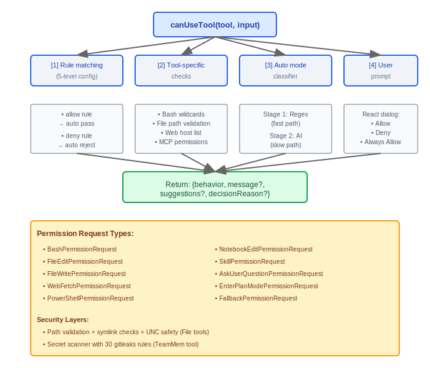
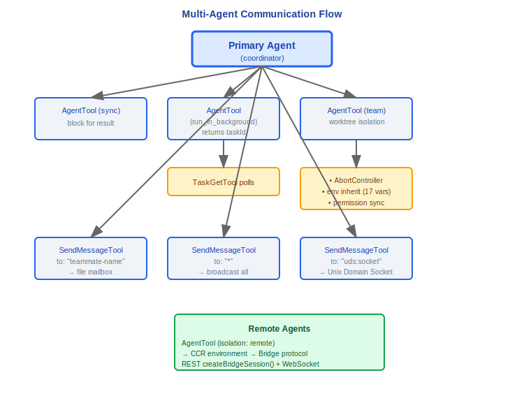
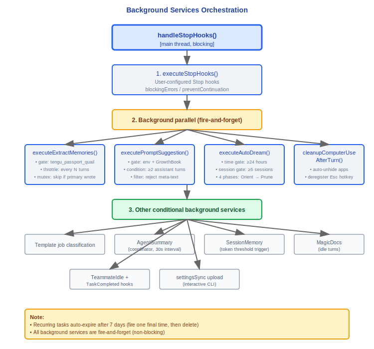

# 完整数据流转图谱

## 设计理念：端到端流转为什么包含这么多步骤？

这份数据流图谱是 Claude Code 架构的全景——从用户键入文字到 React 组件重渲染，每个步骤解决一个独立的问题域。跳过任何步骤都会导致特定类别的 bug：

| 阶段 | 解决的问题 | 跳过后的后果 |
|------|-----------|-------------|
| 上下文组装 | 构建完整的对话上下文（记忆、附件、压缩） | 模型缺少关键信息，响应质量下降 |
| normalizeMessagesForAPI | 消息格式标准化（6 步处理） | API 拒绝格式不合规的消息，tool_result 配对失败 |
| 重试机制 | 处理瞬态错误（529/429/连接错误） | 一次网络波动就导致用户操作失败 |
| 权限检查 | 工具执行前的安全验证 | 危险命令未经确认直接执行 |
| 钩子系统 | Pre/Post 工具执行钩子 | 用户配置的自动化流程被跳过 |
| 错误恢复 | 5 层渐进恢复策略 | prompt-too-long 等错误导致会话中断 |

每个步骤都经过独立验证和测试，确保端到端流程的可靠性。

---

## 1. 端到端主流程


## 2. 配置加载流


## 3. 权限决策流



## 4. MCP 工具发现与执行流


## 5. 多智能体通信流



## 6. 反馈数据收集流


## 7. 遥测数据流


## 8. 后台服务编排时序



## 9. 消息类型层次


---

## 工程实践

### 调试完整请求链的方法

开启 debug 模式可以查看每个阶段的输入/输出：

1. **上下文组装阶段** -- 检查 `autoCompactIfNeeded()` 是否触发压缩（阈值：上下文窗口 - 13K token），观察附件消息的组装过程（记忆/文件发现/智能体列表/MCP指令）
2. **API 调用阶段** -- 检查 `normalizeMessagesForAPI()` 的 6 步标准化输出，确认消息格式合规
3. **重试阶段** -- `withRetry()` 的日志会显示重试原因（529 容量/429 速率/连接错误/401 认证），重试间隔遵循指数退避
4. **工具执行阶段** -- 每个 `runToolUse()` 调用的权限检查结果、Pre/Post 钩子执行情况、工具执行结果都可在日志中追踪
5. **错误恢复阶段** -- 5 层恢复策略按成本递增尝试（L1 无 API 调用 → L5 用户中断），日志标记当前进入的恢复层级

### 性能瓶颈定位

OTel span 对应数据流的每个阶段，可以使用 Perfetto 火焰图定位最慢环节：

```
sessionTracing 提供的 span 层级:
  startInteractionSpan(userPrompt)           -- 整个交互周期
    ├─ startLLMRequestSpan()                 -- API 调用（含 TTFT）
    │   └─ endLLMRequestSpan(metadata)       -- 记录 input/output tokens, ttft_ms
    ├─ startToolSpan()                       -- 工具执行
    │   ├─ startToolBlockedOnUserSpan()      -- 等待用户确认
    │   └─ endToolSpan()                     -- 工具完成
    └─ endInteractionSpan()                  -- 交互结束
```

常见瓶颈位置：
- API 首 token 延迟（TTFT）-- 检查模型选择和 prompt 大小
- 工具执行耗时 -- 特别是文件读写和 Bash 命令执行
- 用户确认等待 -- `startToolBlockedOnUserSpan()` 记录等待时间
- 上下文压缩 -- `compactConversation()` 涉及额外的 Claude API 调用

### 新功能应该插入到数据流的哪个位置？

决策树：

```
新功能需要修改用户输入的处理方式？
  └─ YES → processUserInput() 层（与 "!" / "/" 前缀处理并列）

新功能需要在 API 调用前修改消息？
  └─ YES → 阶段 1（上下文组装），在 getAttachmentMessages() 或系统提示构建中添加

新功能需要在工具执行前/后添加逻辑？
  └─ YES → 使用 Hook 系统（Pre/Post ToolUse），不修改核心数据流

新功能需要在每轮对话结束后执行？
  └─ YES → handleStopHooks() 中添加后台服务（fire-and-forget 模式）

新功能需要修改 API 响应的处理方式？
  └─ YES → 阶段 2（API 调用）的流式事件循环中添加处理

新功能需要新的错误恢复策略？
  └─ YES → 阶段 4（错误恢复）的 5 层策略中选择合适的层级插入
```


---

[← 类型系统](../45-类型系统/type-system.md) | [目录](../README.md)
