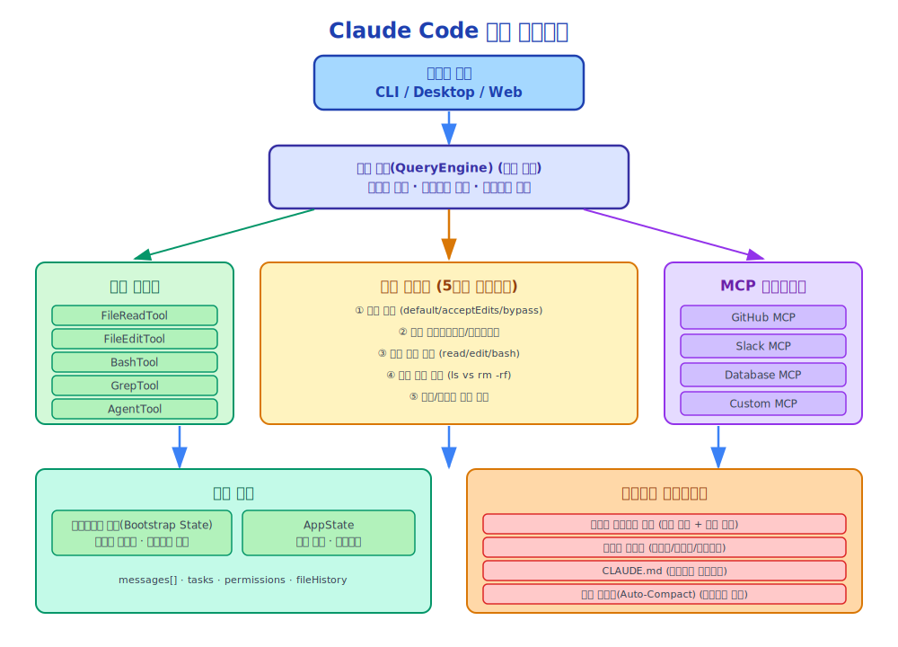

# 제1장: 소개

> Claude Code는 단순한 코드 생성 도구가 아니라, 완전한 에이전트 런타임 시스템(Agent Runtime System)입니다.

---

## 1.1 Claude Code란 무엇인가?

Claude Code는 Anthropic이 출시한 AI 기반 커맨드라인 개발 도구입니다. 하지만 "도구"라고 부르기엔 과소평가입니다 — 이것은 실제로 **프로덕션 수준의 에이전트 런타임 시스템(Agent Runtime System)** 입니다.

기존의 코드 생성 도구(예: GitHub Copilot)와 달리, Claude Code는 다음을 할 수 있습니다:

- **복잡한 작업 이해**: 단순한 코드 완성이 아니라, 사용자의 의도를 이해하고 작업을 분해
- **자율 실행**: 자동으로 도구를 호출하고, 파일을 읽고, 명령어를 실행하며, 작업 완료까지 반복
- **컨텍스트 인식**: 프로젝트 구조, 코드 스타일, 히스토리 컨텍스트를 이해
- **대화형 협업**: 모호함을 만나면 질문하고, 맹목적으로 실행하지 않음

요약하면, Claude Code는 **코드를 작성하고, 디버깅하고, 리팩토링하며, 프로젝트 아키텍처까지 이해할 수 있는 AI 에이전트(Agent)** 입니다.

---

## 1.2 왜 Claude Code를 분석하는가?

Claude Code가 **현재 에이전트 시스템 설계의 모범 사례**를 대표하기 때문입니다.

"에이전트 시스템"이라고 할 때, 단순한 챗봇이 아니라 다음을 할 수 있는 시스템을 말합니다:

1. **자율 계획**: 복잡한 작업을 실행 가능한 단계로 분해
2. **도구 호출(Tool Call)**: 외부 도구와 API를 호출하여 작업 수행
3. **상태 관리(State Management)**: 긴 상호작용 흐름에서 컨텍스트와 상태 유지
4. **오류 복구(Error Recovery)**: 실패 시 예외를 처리하고 재시도
5. **권한 제어(Permission Control)**: 안전한 작업 실행 보장

Claude Code는 이 모든 영역에서 뛰어납니다. 소스 코드를 분석함으로써 다음을 배울 수 있습니다:

- 유연하고 확장 가능한 **도구 시스템(Tool System)** 설계 방법
- 효율적인 **컨텍스트 관리(Context Management)** 메커니즘 구현 방법
- 견고한 **권한 모델(Permission Model)** 구축 방법
- 복잡한 상호작용 흐름에서 **상태 전환(State Transitions)** 처리 방법
- **MCP(Model Context Protocol)** 를 통한 외부 서비스 통합 방법

---

## 1.3 핵심 아키텍처 개요

Claude Code의 아키텍처는 몇 가지 핵심 계층으로 나눌 수 있습니다:



### 1.3.1 쿼리 엔진(Query Engine)

쿼리 엔진은 Claude Code의 두뇌로, 다음을 담당합니다:
- 사용자 입력 파싱
- 실행 경로 계획
- 도구 호출 조율
- 대화 흐름 관리

### 1.3.2 도구 시스템(Tool System)

도구 시스템은 Claude에게 외부 세계와 상호작용하는 능력을 제공합니다:
- 파일 작업 (Read, Write, Edit)
- 명령어 실행 (Bash)
- 코드 검색 (Glob, Grep)
- 웹 접근 (WebFetch, WebSearch)
- 그 외 다수...

### 1.3.3 권한 모델(Permission Model)

권한 모델은 안전한 실행을 보장합니다:
- 도구 호출 승인
- 위험 작업 경고
- 사용자 확인 메커니즘
- 권한 수준 설정

### 1.3.4 컨텍스트 관리(Context Management)

컨텍스트 관리는 제한된 컨텍스트 윈도우의 도전을 처리합니다:
- 자동 컨텍스트 압축
- 스마트 파일 로딩
- 대화 히스토리 관리
- 메모리 시스템

### 1.3.5 MCP 통합

MCP(Model Context Protocol)는 Claude Code가 외부 서비스에 연결할 수 있게 합니다:
- 데이터베이스 접근
- API 통합
- 커스텀 도구 확장
- 서드파티 서비스 연결

---

## 1.4 설계 철학

Claude Code의 설계는 몇 가지 중요한 원칙을 체현합니다:

### 1.4.1 유닉스 철학(Unix Philosophy)

- **한 가지 일을 잘하라**: 각 도구는 단일하고 명확한 책임을 가짐
- **조합 가능성(Composability)**: 도구를 조합하여 복잡한 작업 수행 가능
- **텍스트 스트림**: 텍스트를 범용 인터페이스로 사용

### 1.4.2 휴먼 인 더 루프(Human-in-the-Loop)

- **투명성**: 모든 작업이 사용자에게 표시됨
- **제어 가능성**: 사용자가 언제든지 실행을 중단하거나 수정 가능
- **안전성**: 위험 작업은 명시적 확인이 필요

### 1.4.3 컨텍스트 인식(Context-Aware)

- **프로젝트 이해**: CLAUDE.md와 프로젝트 구조를 자동으로 읽음
- **코드 스타일 인식**: 기존 코드 패턴을 학습하고 따름
- **히스토리 메모리**: 이전 대화와 결정을 기억

---

## 1.5 소스 코드 구조

Claude Code 소스 코드(2026년 3월 공개)는 다음과 같이 구성되어 있습니다:

```
src/
├── agent/           # 에이전트 핵심 로직
│   ├── query-engine/    # 쿼리 엔진 구현
│   ├── tools/           # 도구 시스템
│   └── state/           # 상태 관리
├── mcp/             # MCP 클라이언트 구현
├── context/         # 컨텍스트 관리
├── permissions/     # 권한 모델
├── cli/             # 커맨드라인 인터페이스
└── utils/           # 유틸리티 함수
```

주요 모듈:

- **query-engine**: 핵심 에이전트 루프를 구현하며, 사용자 입력, 도구 호출, 응답 생성을 처리
- **tools**: 모든 사용 가능한 도구와 실행 로직을 정의
- **permissions**: 권한 확인 및 승인 메커니즘 구현
- **mcp**: 외부 서비스 연결을 위한 MCP 클라이언트
- **context**: 컨텍스트 압축, 파일 로딩, 메모리 관리

---

## 1.6 이 책의 대상 독자

이 책은 다음과 같은 분들에게 적합합니다:

| 독자 유형 | 얻을 수 있는 것 |
|----------|----------------|
| **입문자** | 에이전트 시스템 개념 이해, Claude Code를 효과적으로 사용하는 방법 학습 |
| **고급 개발자** | 에이전트 시스템 디자인 패턴 마스터, 유사한 시스템 구축 방법 학습 |
| **에이전트 시스템 설계자** | 프로덕션 수준의 아키텍처, 권한 모델, 컨텍스트 엔지니어링 학습 |

---

## 1.7 이 책의 사용법

이 책은 9부로 나뉘어 있습니다:

1. **시작하기** (제1-2장): Claude Code를 빠르게 이해
2. **핵심 아키텍처** (제3-7장): 쿼리 엔진, 도구 시스템, 권한 모델 심층 분석
3. **컨텍스트 엔지니어링** (제8-10장): 컨텍스트 관리 전략 학습
4. **상태 관리** (제11-13장): 상태 전환과 영속화 마스터
5. **MCP 통합** (제14-16장): MCP 프로토콜과 통합 이해
6. **고급 기능** (제17-19장): 멀티 에이전트, 메모리, 스케줄링 탐구
7. **성능 최적화** (제20-21장): 성능 튜닝 기법 학습
8. **모범 사례** (제22-24장): 개발 워크플로우와 배포 마스터
9. **생태계와 미래** (제25-26장): 생태계와 트렌드 이해

**읽기 제안**:

- **입문자**: 제1장부터 순서대로 읽으며 실습 연습을 완료합니다
- **숙련된 개발자**: 제3장부터 시작하여 아키텍처와 구현에 집중합니다
- **특정 문제 해결자**: 목차를 기반으로 관련 장으로 직접 이동합니다

---

## 1.8 요약

Claude Code는 단순한 도구가 아니라 완전한 에이전트 런타임 시스템(Agent Runtime System)입니다. 소스 코드를 분석함으로써 다음을 배울 수 있습니다:

- 프로덕션 수준의 에이전트 시스템 설계 방법
- 유연한 도구 시스템과 권한 모델 구현 방법
- 컨텍스트 관리 도전 과제 처리 방법
- MCP를 통한 외부 서비스 통합 방법

다음으로, 빠른 실습 가이드를 통해 Claude Code의 기능을 체험해 봅시다.

---

*다음 장: [빠른 시작](02-quickstart_ko.md)*
