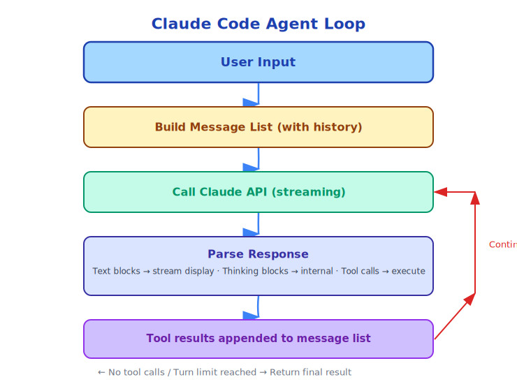

# Chapter 5: From Chatbot to Agent

> "An agent is a system that perceives its environment, makes decisions, and takes actions to achieve goals."
> —— Russell & Norvig, "Artificial Intelligence: A Modern Approach"

---

## 5.1 The Fundamental Limitations of Chatbots

After ChatGPT's release in 2022, the whole world discussed AI. But most people didn't realize that ChatGPT is essentially a **very smart text generator**.

Its working mode is:

```
Input text → [LLM] → Output text
```

This mode has a fundamental limitation: **it can only generate text, not change the state of the world**.

You can ask ChatGPT to write code, but it can't run that code for you. You can ask it to analyze a bug, but it can't fix the file. You can ask it to design a system, but it can't deploy it.

**Text generation ≠ Action execution**.

---

## 5.2 Tool Calling: Breaking Out of the Text Prison

In 2023, OpenAI introduced Function Calling, and Anthropic introduced Tool Use. This was a key step in AI's evolution from "chatbot" to "Agent".

The tool calling mechanism:

```
User: What's the weather in Beijing today?

LLM internal decision: I need to call weather API
→ Generate tool call: get_weather(city="Beijing")
→ System executes tool, returns result: {"temp": 15, "weather": "sunny"}
→ LLM generates answer based on result: Today Beijing is sunny, temperature 15 degrees.
```

This mechanism transformed LLM from "can only talk" to "can do".

---

## 5.3 Definition of Agent

What is an Agent?

In AI, an Agent is a system that can:
1. **Perceive** environment: Read files, execute commands, get information
2. **Decide**: Plan next action
3. **Act**: Call tools to change environment state
4. **Observe**: See the effects of actions
5. **Loop**: Adjust plan based on results

This **PDAOL loop** (Perceive-Decide-Act-Observe-Loop) is the core of an Agent.

---

## 5.4 ReAct: Combining Reasoning and Acting

In 2022, Google proposed the **ReAct** (Reasoning + Acting) framework, which is the theoretical foundation of modern AI Agents:

```
Thought: I need to find all TODO comments in the project
Action: GrepTool("TODO", path="src/")
Observation: Found 23 TODOs, distributed across 8 files
Thought: I should organize these TODOs by priority
Action: FileReadTool("src/main.ts")
Observation: [file content]
Thought: This file has 3 TODOs, 2 of which are high priority
...
```

ReAct's key insight: **Having the LLM "think" before acting significantly improves task completion quality**.

Claude Code implements this pattern. When you enable "Extended Thinking", Claude generates thinking blocks before each tool call. These thoughts aren't shown to users but influence decision quality.

---

## 5.5 Claude Code's Agent Loop

Claude Code's core is an Agent loop, implemented in `src/query.ts`:



This loop has several key characteristics:

**Multi-turn tool calling**: A single user request may trigger multiple API call rounds, each potentially containing multiple tool calls.

**Parallel tool execution**: Claude can request multiple tool calls in one response, which can execute in parallel.

**Context accumulation**: Tool results from each round are added to the message list, Claude can see complete execution history.

**Automatic termination**: When Claude believes the task is complete, it stops requesting tool calls and generates a final answer.

---

## 5.6 Chatbot vs Agent: Key Differences

| Dimension | Chatbot | Agent (Claude Code) |
|-----------|---------|---------------------|
| Output | Text | Text + Actions |
| State | None (each independent) | Yes (file system, task state) |
| Loop | Single-turn (input→output) | Multi-turn (perceive→decide→act→observe) |
| Tools | None | 43 built-in tools + MCP extensions |
| Goal | Answer questions | Complete tasks |
| Failure Handling | None | Can retry, rollback, adjust strategy |
| Time Span | Seconds | Minutes to hours |

---

## 5.7 New Challenges for Agents

Increased Agent capabilities bring new challenges:

**Reliability**: Agents execute multi-step tasks, any step failing can cause overall failure. Claude Code improves reliability through tool result validation, error retry, and user confirmation.

**Safety**: Agents can execute real actions, wrong actions may cause irreversible damage. Claude Code ensures safety through permission models, operation confirmation, and sandbox isolation.

**Observability**: Users need to know what the Agent is doing. Claude Code ensures observability through transparent tool call display and real-time streaming output.

**Context Management**: Long tasks consume many tokens. Claude Code manages context length through auto-compact.

**Cost Control**: Multi-turn API calls are expensive. Claude Code controls costs through token budgets and cost tracking.

---

## 5.8 From Tool Calling to Agent System

Tool calling is the foundation of Agents, but a complete Agent system also needs:

```
Tool Calling
    +
Context Management (remember what was done)
    +
Task Planning (know what to do next)
    +
Error Handling (what to do when errors occur)
    +
Permission Control (what can and cannot be done)
    +
State Persistence (can resume after task interruption)
    =
Agent System
```

Claude Code's source code is the complete implementation of this equation. In the following chapters, we'll dive deep into each component.

---

## 5.9 Summary

From chatbot to Agent is essentially a leap from "generating text" to "executing actions".

This leap requires:
- Tool calling mechanism (let LLM call external functions)
- Agent loop (perceive-decide-act-observe iteration)
- Complete engineering system (reliability, safety, observability)

Claude Code is one of the most complete AI Agent engineering implementations. Understanding its design means understanding the current state of Agent system engineering.

---

*Next Chapter: [Query Engine — The Heart of Conversation](../part3/06-query-engine_en.md)*