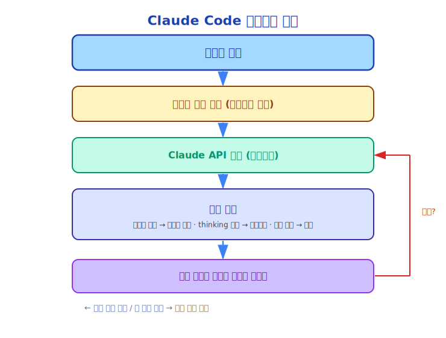

# 제5장: 챗봇에서 에이전트로

> "에이전트(Agent)는 환경을 인식하고, 결정을 내리며, 목표를 달성하기 위해 행동을 취하는 시스템입니다."
> —— Russell & Norvig, "인공지능: 현대적 접근"

---

## 5.1 챗봇의 근본적인 한계

2022년 ChatGPT가 출시된 후, 온 세상이 AI를 논했습니다. 그러나 대부분의 사람들은 ChatGPT가 본질적으로 **매우 똑똑한 텍스트 생성기**라는 사실을 깨닫지 못했습니다.

그 동작 방식은 다음과 같습니다.

```
텍스트 입력 → [LLM] → 텍스트 출력
```

이 방식에는 근본적인 한계가 있습니다. **텍스트만 생성할 수 있고, 세상의 상태를 변경할 수 없습니다**.

ChatGPT에게 코드를 작성해달라고 할 수 있지만, 그 코드를 실행해줄 수는 없습니다. 버그를 분석해달라고 할 수 있지만, 파일을 수정해줄 수는 없습니다. 시스템을 설계해달라고 할 수 있지만, 배포해줄 수는 없습니다.

**텍스트 생성 ≠ 액션 실행**.

---

## 5.2 도구 호출: 텍스트 감옥에서 탈출

2023년, OpenAI는 Function Calling을 도입했고, Anthropic은 Tool Use를 도입했습니다. 이것은 AI가 "챗봇"에서 "에이전트(Agent)"로 진화하는 핵심 단계였습니다.

도구 호출 메커니즘:

```
사용자: 오늘 베이징 날씨는?

LLM 내부 결정: 날씨 API를 호출해야 합니다
→ 도구 호출 생성: get_weather(city="Beijing")
→ 시스템이 도구를 실행하고 결과를 반환: {"temp": 15, "weather": "맑음"}
→ LLM이 결과를 기반으로 답변 생성: 오늘 베이징은 맑고 기온은 15도입니다.
```

이 메커니즘은 LLM을 "말만 할 수 있는" 것에서 "행동할 수 있는" 것으로 전환시켰습니다.

---

## 5.3 에이전트(Agent)의 정의

에이전트(Agent)란 무엇일까요?

AI에서 에이전트(Agent)는 다음을 할 수 있는 시스템입니다.
1. **인식(Perceive)**: 환경을 읽습니다. 파일 읽기, 명령어 실행, 정보 획득
2. **결정(Decide)**: 다음 액션을 계획합니다
3. **행동(Act)**: 도구를 호출하여 환경 상태를 변경합니다
4. **관찰(Observe)**: 액션의 효과를 확인합니다
5. **반복(Loop)**: 결과를 바탕으로 계획을 조정합니다

이 **PDAOL 루프**(Perceive-Decide-Act-Observe-Loop)가 에이전트(Agent)의 핵심입니다.

---

## 5.4 ReAct: 추론과 행동의 결합

2022년, Google은 **ReAct**(Reasoning + Acting) 프레임워크를 제안했습니다. 이것은 현대 AI 에이전트(Agent)의 이론적 기반입니다.

```
생각(Thought): 프로젝트에서 모든 TODO 주석을 찾아야 합니다
액션(Action): GrepTool("TODO", path="src/")
관찰(Observation): 23개의 TODO를 찾았고, 8개 파일에 분산되어 있습니다
생각(Thought): 이 TODO들을 우선순위별로 정리해야 합니다
액션(Action): FileReadTool("src/main.ts")
관찰(Observation): [파일 내용]
생각(Thought): 이 파일에는 3개의 TODO가 있고, 그 중 2개가 높은 우선순위입니다
...
```

ReAct의 핵심 통찰: **LLM이 행동하기 전에 "생각"하도록 하면 태스크 완료 품질이 크게 향상됩니다**.

Claude Code는 이 패턴을 구현합니다. "Extended Thinking"을 활성화하면, Claude는 각 도구 호출 전에 생각 블록을 생성합니다. 이러한 생각은 사용자에게 표시되지 않지만 결정 품질에 영향을 미칩니다.

---

## 5.5 Claude Code의 에이전트(Agent) 루프

Claude Code의 핵심은 에이전트(Agent) 루프이며, `src/query.ts`에 구현되어 있습니다.



이 루프에는 몇 가지 핵심 특성이 있습니다.

**멀티턴 도구 호출**: 단일 사용자 요청이 여러 API 호출 라운드를 트리거할 수 있으며, 각 라운드에는 여러 도구 호출이 포함될 수 있습니다.

**병렬 도구 실행**: Claude는 하나의 응답에서 여러 도구 호출을 요청할 수 있으며, 이는 병렬로 실행될 수 있습니다.

**컨텍스트 누적**: 각 라운드의 도구 결과가 메시지 목록에 추가되어, Claude는 완전한 실행 히스토리를 볼 수 있습니다.

**자동 종료**: Claude가 태스크가 완료되었다고 판단하면, 도구 호출 요청을 중단하고 최종 답변을 생성합니다.

---

## 5.6 챗봇 vs 에이전트(Agent): 핵심 차이점

| 차원 | 챗봇 | 에이전트(Agent) (Claude Code) |
|------|------|------------------------------|
| 출력 | 텍스트 | 텍스트 + 액션 |
| 상태(State) | 없음(각각 독립적) | 있음(파일 시스템, 태스크 상태) |
| 루프 | 단일턴(입력→출력) | 멀티턴(인식→결정→행동→관찰) |
| 도구 | 없음 | 43개 내장 도구 + MCP(Model Context Protocol) 확장 |
| 목표 | 질문에 답변 | 태스크 완료 |
| 오류 복구(Error Recovery) | 없음 | 재시도, 롤백, 전략 조정 가능 |
| 시간 범위 | 초 단위 | 분에서 시간 단위 |

---

## 5.7 에이전트(Agent)의 새로운 과제들

에이전트(Agent) 기능이 향상될수록 새로운 과제들이 생깁니다.

**신뢰성(Reliability)**: 에이전트(Agent)는 다단계 태스크를 실행하므로, 어느 단계에서의 실패도 전체 실패로 이어질 수 있습니다. Claude Code는 도구 결과 검증, 오류 재시도, 사용자 확인을 통해 신뢰성을 향상시킵니다.

**안전성(Safety)**: 에이전트(Agent)는 실제 액션을 실행할 수 있으며, 잘못된 액션은 되돌릴 수 없는 피해를 야기할 수 있습니다. Claude Code는 권한 모델(Permission Model), 작업 확인, 샌드박스(Sandbox) 격리를 통해 안전성을 보장합니다.

**관찰 가능성(Observability)**: 사용자는 에이전트(Agent)가 무엇을 하는지 알아야 합니다. Claude Code는 투명한 도구 호출 표시와 실시간 스트리밍(Streaming) 출력을 통해 관찰 가능성을 보장합니다.

**컨텍스트 관리(Context Management)**: 긴 태스크는 많은 토큰을 소비합니다. Claude Code는 자동 컴팩트(Compact)를 통해 컨텍스트 길이를 관리합니다.

**비용 제어**: 멀티턴 API 호출은 비용이 많이 듭니다. Claude Code는 토큰 예산과 비용 추적을 통해 비용을 제어합니다.

---

## 5.8 도구 호출에서 에이전트(Agent) 시스템으로

도구 호출은 에이전트(Agent)의 기반이지만, 완전한 에이전트(Agent) 시스템에는 더 많은 것이 필요합니다.

```
도구 호출
    +
컨텍스트 관리(무엇을 했는지 기억)
    +
태스크 계획(다음에 무엇을 할지 파악)
    +
오류 처리(오류 발생 시 무엇을 할지)
    +
권한 제어(무엇을 할 수 있고 할 수 없는지)
    +
상태(State) 지속성(태스크 중단 후 재개 가능)
    =
에이전트 런타임 시스템(Agent Runtime System)
```

Claude Code의 소스 코드는 이 방정식의 완전한 구현입니다. 다음 장들에서 각 컴포넌트를 깊이 살펴볼 것입니다.

---

## 5.9 요약

챗봇에서 에이전트(Agent)로의 전환은 본질적으로 "텍스트 생성"에서 "액션 실행"으로의 도약입니다.

이 도약에는 다음이 필요합니다.
- 도구 호출 메커니즘(LLM이 외부 함수를 호출할 수 있게 함)
- 에이전트(Agent) 루프(인식-결정-행동-관찰 반복)
- 완전한 엔지니어링 시스템(신뢰성, 안전성, 관찰 가능성)

Claude Code는 가장 완전한 AI 에이전트(Agent) 엔지니어링 구현 중 하나입니다. 그 설계를 이해한다는 것은 에이전트(Agent) 시스템 엔지니어링의 현재 상태를 이해하는 것입니다.

---

*다음 장: [쿼리 엔진(Query Engine) — 대화의 심장](../part3/06-query-engine_ko.md)*
