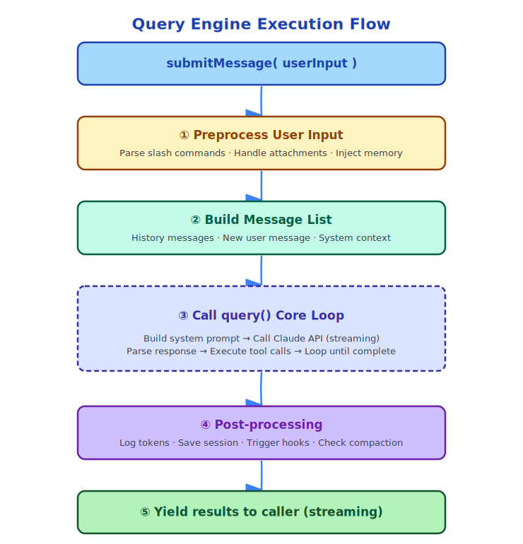

# Chapter 6: Query Engine — The Heart of Conversation

> If Claude Code is a machine, QueryEngine is its engine.

---

## 6.1 QueryEngine's Responsibilities

`QueryEngine` (`src/QueryEngine.ts`, 1295 lines) is the most core class in Claude Code. It manages the complete lifecycle of a conversation:

- Maintains message history
- Calls Claude API
- Executes tool calls
- Manages token budget
- Handles errors and retries
- Triggers context compression

In one sentence: **Every user input, to final output, goes through QueryEngine's orchestration**.

---

## 6.2 QueryEngine Configuration

```typescript
// src/QueryEngine.ts
export type QueryEngineConfig = {
  cwd: string                          // Working directory
  tools: Tools                         // Available toolset
  commands: Command[]                  // Available slash commands
  mcpClients: MCPServerConnection[]    // MCP server connections
  agents: AgentDefinition[]            // Agent definitions
  canUseTool: CanUseToolFn             // Permission check function
  getAppState: () => AppState          // Read global state
  setAppState: (f) => void             // Update global state
  initialMessages?: Message[]          // Initial messages (for session restore)
  readFileCache: FileStateCache        // File read cache
  customSystemPrompt?: string          // Custom system prompt
  appendSystemPrompt?: string          // Append system prompt
  userSpecifiedModel?: string          // User-specified model
  maxTurns?: number                    // Maximum turn limit
  maxBudgetUsd?: number                // Maximum cost limit (USD)
  taskBudget?: { total: number }       // Token budget
  jsonSchema?: Record<string, unknown> // Structured output schema
  handleElicitation?: ...              // MCP permission request handling
}
```

This configuration reveals QueryEngine's design philosophy: **It is stateless and configuration-driven**. All behavior is determined by configuration; QueryEngine itself holds no business logic, only orchestration.

---

## 6.3 QueryEngine's Internal State

```typescript
class QueryEngine {
  private config: QueryEngineConfig
  private mutableMessages: Message[]           // Message history (mutable)
  private abortController: AbortController     // Abort controller
  private permissionDenials: SDKPermissionDenial[]  // Permission denial records
  private totalUsage: NonNullableUsage         // Cumulative token usage
  private discoveredSkillNames = new Set<string>()  // Discovered Skills
  private loadedNestedMemoryPaths = new Set<string>() // Loaded Memory paths
}
```

Note `mutableMessages`: This is the message list for the entire conversation. Every tool call result is appended here. This list is Claude's "memory" — all the history it can see.

---

## 6.4 submitMessage: Complete Flow of a Conversation Turn



`submitMessage` is QueryEngine's core method, handling one user input:

---

## 6.5 query(): The Real Execution Loop

The `query()` function (`src/query.ts`, 1729 lines) is the actual Agent loop:


Simplified pseudocode:

```typescript
// Simplified pseudocode showing core logic
async function* query(params: QueryParams) {
  let messages = params.messages
  let turnCount = 0

  while (true) {
    turnCount++

    // Check turn limit
    if (turnCount > maxTurns) break

    // Call Claude API (streaming)
    const stream = await callClaudeAPI({
      messages,
      systemPrompt,
      tools,
      model,
    })

    // Parse streaming response
    const toolCalls = []
    for await (const chunk of stream) {
      if (chunk.type === 'text') {
        yield { type: 'text', content: chunk.text }
      } else if (chunk.type === 'thinking') {
        // Thinking block, handled internally
      } else if (chunk.type === 'tool_use') {
        toolCalls.push(chunk)
      }
    }

    // If no tool calls, conversation ends
    if (toolCalls.length === 0) break

    // Execute tool calls (can be parallel)
    const toolResults = await runTools(toolCalls, context)

    // Append tool results to message list
    messages = [...messages, assistantMessage, ...toolResults]

    // Check token budget
    if (tokenBudgetExceeded(messages)) {
      yield { type: 'budget_exceeded' }
      break
    }
  }
}
```
