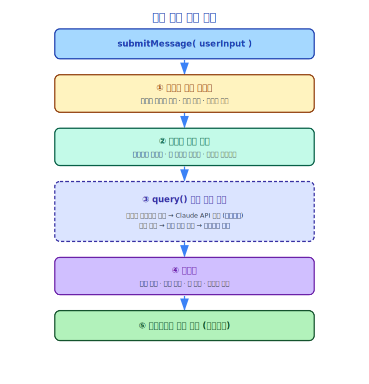
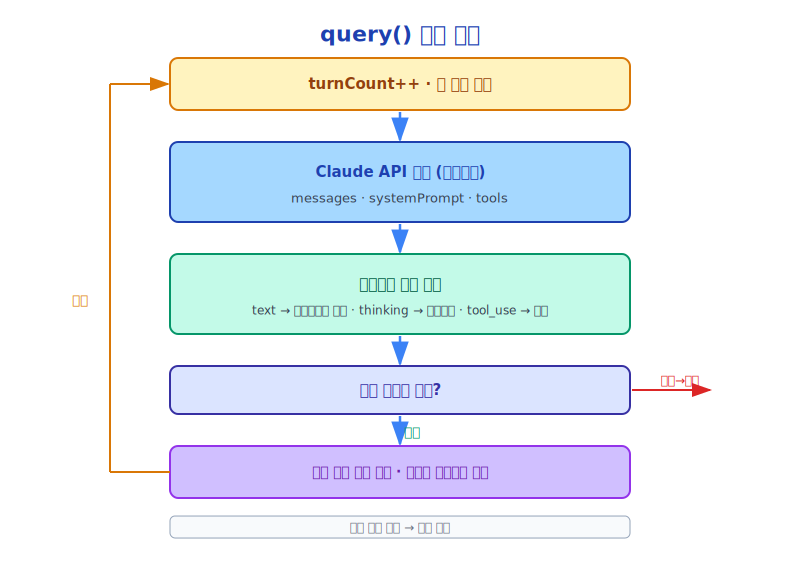

# 제6장: 쿼리 엔진(Query Engine) — 대화의 심장

> Claude Code가 기계라면, QueryEngine은 그 엔진입니다.

---

## 6.1 쿼리 엔진(QueryEngine)의 책임

`QueryEngine` (`src/QueryEngine.ts`, 1295줄)은 Claude Code에서 가장 핵심적인 클래스입니다. 대화의 전체 생명주기를 관리합니다:

- 메시지 히스토리 유지
- Claude API 호출
- 도구 호출(Tool Call) 실행
- 토큰 예산 관리
- 오류 처리 및 재시도
- 컨텍스트 압축(Context Compression) 트리거

한 문장으로 요약하면: **모든 사용자 입력은 최종 출력에 이르기까지 쿼리 엔진(QueryEngine)의 오케스트레이션을 거칩니다**.

---

## 6.2 쿼리 엔진(QueryEngine) 설정

```typescript
// src/QueryEngine.ts
export type QueryEngineConfig = {
  cwd: string                          // 작업 디렉터리
  tools: Tools                         // 사용 가능한 도구 세트
  commands: Command[]                  // 사용 가능한 슬래시 명령어
  mcpClients: MCPServerConnection[]    // MCP(Model Context Protocol) 서버 연결
  agents: AgentDefinition[]            // 에이전트 정의
  canUseTool: CanUseToolFn             // 권한 확인 함수
  getAppState: () => AppState          // 전역 상태 읽기
  setAppState: (f) => void             // 전역 상태 업데이트
  initialMessages?: Message[]          // 초기 메시지 (세션 복원용)
  readFileCache: FileStateCache        // 파일 읽기 캐시
  customSystemPrompt?: string          // 커스텀 시스템 프롬프트
  appendSystemPrompt?: string          // 시스템 프롬프트 추가
  userSpecifiedModel?: string          // 사용자 지정 모델
  maxTurns?: number                    // 최대 턴 수 제한
  maxBudgetUsd?: number                // 최대 비용 제한 (USD)
  taskBudget?: { total: number }       // 토큰 예산
  jsonSchema?: Record<string, unknown> // 구조화 출력 스키마
  handleElicitation?: ...              // MCP(Model Context Protocol) 권한 요청 처리
}
```

이 설정은 쿼리 엔진(QueryEngine)의 설계 철학을 드러냅니다: **무상태(stateless)이며 설정 주도(configuration-driven) 방식**입니다. 모든 동작은 설정으로 결정되며, 쿼리 엔진(QueryEngine) 자체는 비즈니스 로직을 보유하지 않고 오케스트레이션만 담당합니다.

---

## 6.3 쿼리 엔진(QueryEngine)의 내부 상태

```typescript
class QueryEngine {
  private config: QueryEngineConfig
  private mutableMessages: Message[]           // 메시지 히스토리 (가변)
  private abortController: AbortController     // 중단 컨트롤러
  private permissionDenials: SDKPermissionDenial[]  // 권한 거부 기록
  private totalUsage: NonNullableUsage         // 누적 토큰 사용량
  private discoveredSkillNames = new Set<string>()  // 발견된 스킬(Skills)
  private loadedNestedMemoryPaths = new Set<string>() // 로드된 메모리 경로
}
```

`mutableMessages`에 주목하십시오. 이것은 전체 대화의 메시지 목록입니다. 모든 도구 호출(Tool Call) 결과가 여기에 추가됩니다. 이 목록은 Claude의 "메모리" — Claude가 볼 수 있는 모든 히스토리입니다.

---

## 6.4 submitMessage: 대화 턴의 완전한 흐름



`submitMessage`는 쿼리 엔진(QueryEngine)의 핵심 메서드로, 하나의 사용자 입력을 처리합니다:

---

## 6.5 query(): 실제 실행 루프

`query()` 함수 (`src/query.ts`, 1729줄)는 실제 에이전트 루프입니다:



단순화한 의사코드:

```typescript
// 핵심 로직을 보여주는 단순화된 의사코드
async function* query(params: QueryParams) {
  let messages = params.messages
  let turnCount = 0

  while (true) {
    turnCount++

    // 턴 수 제한 확인
    if (turnCount > maxTurns) break

    // Claude API 호출 (스트리밍)
    const stream = await callClaudeAPI({
      messages,
      systemPrompt,
      tools,
      model,
    })

    // 스트리밍 응답 파싱
    const toolCalls = []
    for await (const chunk of stream) {
      if (chunk.type === 'text') {
        yield { type: 'text', content: chunk.text }
      } else if (chunk.type === 'thinking') {
        // 씽킹 블록, 내부적으로 처리
      } else if (chunk.type === 'tool_use') {
        toolCalls.push(chunk)
      }
    }

    // 도구 호출이 없으면 대화 종료
    if (toolCalls.length === 0) break

    // 도구 호출 실행 (병렬 가능)
    const toolResults = await runTools(toolCalls, context)

    // 도구 결과를 메시지 목록에 추가
    messages = [...messages, assistantMessage, ...toolResults]

    // 토큰 예산 확인
    if (tokenBudgetExceeded(messages)) {
      yield { type: 'budget_exceeded' }
      break
    }
  }
}
```
