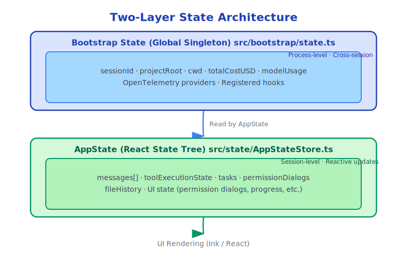

# Chapter 7: State Management Design

> State is both the root of complexity and a necessity in complex systems.

---

## 7.1 Why State Management is Hard

In AI Agent systems, state management faces unique challenges:

- **Concurrency**: Multiple tools may execute simultaneously, all needing to read and write state
- **Asynchrony**: Tool execution is asynchronous, requiring thread-safe state updates
- **Persistence**: State needs to be restored after session interruptions
- **Observability**: UI needs to reflect state changes in real-time
- **Consistency**: State changes need atomicity to prevent partial updates

Claude Code solves these problems with a carefully designed state system.

---

## 7.2 Two-Layer State Architecture



**Bootstrap State** is a process-level global singleton that stores persistent information across sessions.

**AppState** is a session-level React state tree that stores all dynamic information for the current session.

---

## 7.3 Bootstrap State: Global Singleton

`src/bootstrap/state.ts` is the "foundation" of the entire system, with a clear comment:

```typescript
// DO NOT ADD MORE STATE HERE - BE JUDICIOUS WITH GLOBAL STATE
```

This warning is important. Global state is a source of complexity and should be used sparingly.

Bootstrap State stores:

```typescript
type State = {
  // Path information
  originalCwd: string          // Working directory at startup
  projectRoot: string          // Project root (stable, doesn't change with worktree)
  cwd: string                  // Current working directory (mutable)

  // Cost tracking
  totalCostUSD: number
  totalAPIDuration: number
  totalAPIDurationWithoutRetries: number
  totalToolDuration: number

  // Per-turn statistics
  turnHookDurationMs: number
  turnToolDurationMs: number
  turnClassifierDurationMs: number
  turnToolCount: number
  turnHookCount: number

  // Model information
  modelUsage: { [modelName: string]: ModelUsage }
  mainLoopModelOverride: ModelSetting | undefined
  initialMainLoopModel: ModelSetting

  // Session information
  isInteractive: boolean
  clientType: string
  sessionId: SessionId

  // OpenTelemetry (observability)
  tracerProvider: BasicTracerProvider | null
  meterProvider: MeterProvider | null
  loggerProvider: LoggerProvider | null

  // Hooks registry
  registeredHooks: RegisteredHookMatcher[]
}
```

Note the comment on `projectRoot`:
```typescript
// Stable project root - set once at startup (including by --worktree flag),
// never updated by mid-session EnterWorktreeTool.
// Use for project identity (history, skills, sessions) not file operations.
```

This design decision is subtle: `projectRoot` is set at startup, and even if the user switches worktrees during the session, `projectRoot` remains unchanged. This ensures stability of project identity (history, skills, sessions).

---

## 7.4 AppState: React State Tree

AppState is a large React state object managed by `AppStateStore`:

```typescript
// src/state/AppStateStore.ts (simplified)
export type AppState = {
  // Conversation state
  messages: Message[]
  isLoading: boolean
  currentStreamingMessage: string | null

  // Tool execution state
  inProgressToolUseIDs: Set<string>
  hasInterruptibleToolInProgress: boolean

  // Task system
  tasks: TaskStateBase[]

  // Permission system
  toolPermissionContext: ToolPermissionContext
  pendingPermissionRequests: PermissionRequest[]

  // UI state
  showCostThresholdDialog: boolean
  showBypassPermissionsDialog: boolean
  notifications: Notification[]

  // File history
  fileHistoryState: FileHistoryState
  attributionState: AttributionState

  // Model state
  mainLoopModel: ModelSetting
  thinkingConfig: ThinkingConfig

  // Speculative execution state
  speculationState: SpeculationState
}
```

---

## 7.5 Store Pattern: Functional Updates

AppState uses a functional update pattern, similar to Redux:

```typescript
// src/state/store.ts
export function createStore(initialState: AppState, onChange?) {
  let state = initialState

  return {
    getState(): AppState {
      return state
    },

    setState(updater: (prev: AppState) => AppState): void {
      const newState = updater(state)
      const oldState = state
      state = newState
      onChange?.({ newState, oldState })
      // Notify all subscribers
      subscribers.forEach(sub => sub())
    },

    subscribe(listener: () => void): () => void {
      subscribers.add(listener)
      return () => subscribers.delete(listener)
    }
  }
}
```

Benefits of functional updates:
- **Immutability**: Each update returns a new object, old state is not modified
- **Predictability**: State changes are pure functions, easy to test
- **Time travel**: Can save historical states, supporting undo

---

## 7.6 React Integration: useSyncExternalStore

AppState integrates with UI through React's `useSyncExternalStore`:

```typescript
// src/state/AppState.tsx
export function AppStateProvider({ children, initialState, onChangeAppState }) {
  const [store] = useState(() =>
    createStore(initialState ?? getDefaultAppState(), onChangeAppState)
  )

  return (
    <AppStoreContext.Provider value={store}>
      <VoiceProvider>
        <MailboxProvider>
          {children}
        </MailboxProvider>
      </VoiceProvider>
    </AppStoreContext.Provider>
  )
}

// Usage in components
function MyComponent() {
  const store = useContext(AppStoreContext)
  const messages = useSyncExternalStore(
    store.subscribe,
    () => store.getState().messages
  )
  // Automatically re-renders when messages change
}
```

`useSyncExternalStore` is an API introduced in React 18, specifically for subscribing to external state sources, ensuring state consistency in concurrent mode.

---

## 7.7 Concurrency Safety in State Updates

When tools execute in parallel, multiple tools may update state simultaneously. Claude Code ensures safety through functional updates:

```typescript
// Unsafe approach (race condition)
const current = getAppState()
setAppState({ ...current, tasks: [...current.tasks, newTask] })

// Safe approach (functional update)
setAppState(prev => ({
  ...prev,
  tasks: [...prev.tasks, newTask]
}))
```

Functional updates ensure each update is based on the latest state, preventing data loss even when multiple updates execute concurrently.

---

## 7.8 Selectors: Fine-Grained Subscriptions

`src/state/selectors.ts` provides state selectors, allowing components to subscribe only to the state slices they care about:

```typescript
// Re-render only when tasks change
const tasks = useSelector(state => state.tasks)

// Re-render only when specific task changes
const task = useSelector(state =>
  state.tasks.find(t => t.id === taskId)
)
```

This is key to performance optimization: avoiding unnecessary re-renders.

---

## 7.9 Side Effects of State Changes: onChangeAppState

`src/state/onChangeAppState.ts` handles side effects of state changes:

```typescript
export function onChangeAppState({ newState, oldState }) {
  // Send OS notification when task completes
  if (newState.tasks !== oldState.tasks) {
    const completedTasks = newState.tasks.filter(
      t => isTerminalTaskStatus(t.status) &&
           !oldState.tasks.find(ot => ot.id === t.id && isTerminalTaskStatus(ot.status))
    )
    completedTasks.forEach(task => sendOSNotification(task))
  }

  // Show warning when cost exceeds threshold
  if (newState.totalCostUSD > COST_THRESHOLD && !oldState.showCostThresholdDialog) {
    // Trigger dialog
  }
}
```

This pattern centralizes side effect management, avoiding scattered logic.

---

## 7.10 Trade-offs in State Design

Claude Code's state design makes several interesting trade-offs:

**Global vs Local**: Bootstrap State is global, AppState is session-local. This boundary is clear: cross-session information goes global, in-session information goes local.

**React vs Custom**: AppState uses React state, but through `useSyncExternalStore` rather than `useState`/`useReducer`. This allows state to be accessed outside the React component tree (tools need to read/write state during execution, but tools are not React components).

**Immutable vs Mutable**: Message history (`mutableMessages`) is mutable inside QueryEngine, but becomes immutable when updated to AppState via `setAppState`. This design balances performance (avoiding frequent copying of large arrays) and safety (external code cannot directly modify).

---

## 7.11 Summary

Claude Code's state management design:

- **Two-layer architecture**: Bootstrap State (global) + AppState (session)
- **Functional updates**: Ensure concurrency safety and predictability
- **React integration**: Connect UI through `useSyncExternalStore`
- **Selectors**: Fine-grained subscriptions to avoid unnecessary re-renders
- **Centralized side effects**: `onChangeAppState` handles side effects of state changes uniformly

This design maintains state consistency and observability in complex concurrent scenarios.

---

*Next chapter: [Message Loop and Streaming](./08-message-loop.md)*
