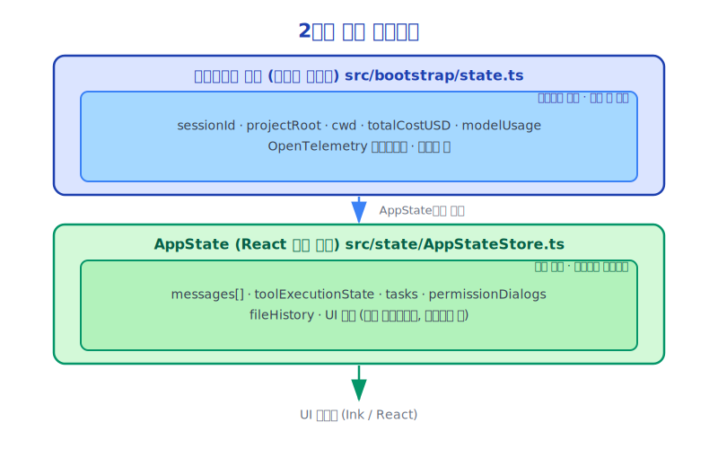

# 제7장: 상태 관리(State Management) 설계

> 상태는 복잡성의 근원인 동시에 복잡한 시스템에서 필수적인 요소입니다.

---

## 7.1 상태 관리(State Management)가 어려운 이유

AI 에이전트 시스템에서 상태 관리(State Management)는 고유한 도전 과제에 직면합니다:

- **동시성**: 여러 도구가 동시에 실행될 수 있으며, 모두 상태를 읽고 써야 합니다
- **비동기성**: 도구 실행은 비동기적이므로 스레드 안전한 상태 업데이트가 필요합니다
- **지속성**: 세션 중단 후에도 상태를 복원해야 합니다
- **관찰 가능성**: UI가 실시간으로 상태 변화를 반영해야 합니다
- **일관성**: 부분 업데이트를 방지하기 위해 상태 변경에 원자성이 필요합니다

Claude Code는 신중하게 설계된 상태 시스템으로 이 문제들을 해결합니다.

---

## 7.2 이중 레이어 상태 아키텍처



**부트스트랩 상태(Bootstrap State)**는 프로세스 수준의 전역 싱글톤으로, 세션에 걸쳐 지속되는 정보를 저장합니다.

**AppState**는 세션 수준의 React 상태 트리로, 현재 세션의 모든 동적 정보를 저장합니다.

---

## 7.3 부트스트랩 상태(Bootstrap State): 전역 싱글톤

`src/bootstrap/state.ts`는 전체 시스템의 "기반"으로, 명확한 주석이 있습니다:

```typescript
// DO NOT ADD MORE STATE HERE - BE JUDICIOUS WITH GLOBAL STATE
```

이 경고는 중요합니다. 전역 상태는 복잡성의 원천이므로 신중하게 사용해야 합니다.

부트스트랩 상태(Bootstrap State)가 저장하는 내용:

```typescript
type State = {
  // 경로 정보
  originalCwd: string          // 시작 시 작업 디렉터리
  projectRoot: string          // 프로젝트 루트 (안정적, 워크트리 변경에도 유지)
  cwd: string                  // 현재 작업 디렉터리 (가변)

  // 비용 추적
  totalCostUSD: number
  totalAPIDuration: number
  totalAPIDurationWithoutRetries: number
  totalToolDuration: number

  // 턴별 통계
  turnHookDurationMs: number
  turnToolDurationMs: number
  turnClassifierDurationMs: number
  turnToolCount: number
  turnHookCount: number

  // 모델 정보
  modelUsage: { [modelName: string]: ModelUsage }
  mainLoopModelOverride: ModelSetting | undefined
  initialMainLoopModel: ModelSetting

  // 세션 정보
  isInteractive: boolean
  clientType: string
  sessionId: SessionId

  // OpenTelemetry (관찰 가능성)
  tracerProvider: BasicTracerProvider | null
  meterProvider: MeterProvider | null
  loggerProvider: LoggerProvider | null

  // 훅(Hooks) 레지스트리
  registeredHooks: RegisteredHookMatcher[]
}
```

`projectRoot`의 주석에 주목하십시오:
```typescript
// Stable project root - set once at startup (including by --worktree flag),
// never updated by mid-session EnterWorktreeTool.
// Use for project identity (history, skills, sessions) not file operations.
```

이 설계 결정은 미묘합니다: `projectRoot`는 시작 시 설정되며, 세션 중 사용자가 워크트리를 전환하더라도 `projectRoot`는 변경되지 않습니다. 이를 통해 프로젝트 정체성(히스토리, 스킬(Skills), 세션)의 안정성을 보장합니다.

---

## 7.4 AppState: React 상태 트리

AppState는 `AppStateStore`가 관리하는 대형 React 상태 객체입니다:

```typescript
// src/state/AppStateStore.ts (단순화)
export type AppState = {
  // 대화 상태
  messages: Message[]
  isLoading: boolean
  currentStreamingMessage: string | null

  // 도구 실행 상태
  inProgressToolUseIDs: Set<string>
  hasInterruptibleToolInProgress: boolean

  // 태스크 시스템
  tasks: TaskStateBase[]

  // 권한 시스템
  toolPermissionContext: ToolPermissionContext
  pendingPermissionRequests: PermissionRequest[]

  // UI 상태
  showCostThresholdDialog: boolean
  showBypassPermissionsDialog: boolean
  notifications: Notification[]

  // 파일 히스토리
  fileHistoryState: FileHistoryState
  attributionState: AttributionState

  // 모델 상태
  mainLoopModel: ModelSetting
  thinkingConfig: ThinkingConfig

  // 투기적 실행 상태
  speculationState: SpeculationState
}
```

---

## 7.5 스토어 패턴: 함수형 업데이트

AppState는 Redux와 유사한 함수형 업데이트 패턴을 사용합니다:

```typescript
// src/state/store.ts
export function createStore(initialState: AppState, onChange?) {
  let state = initialState

  return {
    getState(): AppState {
      return state
    },

    setState(updater: (prev: AppState) => AppState): void {
      const newState = updater(state)
      const oldState = state
      state = newState
      onChange?.({ newState, oldState })
      // 모든 구독자에게 알림
      subscribers.forEach(sub => sub())
    },

    subscribe(listener: () => void): () => void {
      subscribers.add(listener)
      return () => subscribers.delete(listener)
    }
  }
}
```

함수형 업데이트의 장점:
- **불변성**: 각 업데이트는 새 객체를 반환하며 기존 상태를 수정하지 않습니다
- **예측 가능성**: 상태 변경이 순수 함수이므로 테스트가 용이합니다
- **타임 트래블**: 히스토리 상태를 저장할 수 있어 실행 취소를 지원합니다

---

## 7.6 React 통합: useSyncExternalStore

AppState는 React의 `useSyncExternalStore`를 통해 UI와 통합됩니다:

```typescript
// src/state/AppState.tsx
export function AppStateProvider({ children, initialState, onChangeAppState }) {
  const [store] = useState(() =>
    createStore(initialState ?? getDefaultAppState(), onChangeAppState)
  )

  return (
    <AppStoreContext.Provider value={store}>
      <VoiceProvider>
        <MailboxProvider>
          {children}
        </MailboxProvider>
      </VoiceProvider>
    </AppStoreContext.Provider>
  )
}

// 컴포넌트에서의 사용
function MyComponent() {
  const store = useContext(AppStoreContext)
  const messages = useSyncExternalStore(
    store.subscribe,
    () => store.getState().messages
  )
  // messages가 변경되면 자동으로 리렌더링
}
```

`useSyncExternalStore`는 React 18에서 도입된 API로, 외부 상태 소스를 구독하기 위해 특별히 설계되었으며 동시성 모드에서 상태 일관성을 보장합니다.

---

## 7.7 상태 업데이트의 동시성 안전성

도구가 병렬로 실행될 때, 여러 도구가 상태를 동시에 업데이트할 수 있습니다. Claude Code는 함수형 업데이트를 통해 안전성을 보장합니다:

```typescript
// 안전하지 않은 방식 (경쟁 조건)
const current = getAppState()
setAppState({ ...current, tasks: [...current.tasks, newTask] })

// 안전한 방식 (함수형 업데이트)
setAppState(prev => ({
  ...prev,
  tasks: [...prev.tasks, newTask]
}))
```

함수형 업데이트는 각 업데이트가 최신 상태를 기반으로 함을 보장하여, 여러 업데이트가 동시에 실행되더라도 데이터 손실을 방지합니다.

---

## 7.8 셀렉터(Selectors): 세밀한 구독

`src/state/selectors.ts`는 상태 셀렉터를 제공하여 컴포넌트가 관심 있는 상태 슬라이스만 구독할 수 있게 합니다:

```typescript
// tasks가 변경될 때만 리렌더링
const tasks = useSelector(state => state.tasks)

// 특정 태스크가 변경될 때만 리렌더링
const task = useSelector(state =>
  state.tasks.find(t => t.id === taskId)
)
```

이것은 성능 최적화의 핵심입니다: 불필요한 리렌더링을 방지합니다.

---

## 7.9 상태 변경의 사이드 이펙트: onChangeAppState

`src/state/onChangeAppState.ts`는 상태 변경의 사이드 이펙트를 처리합니다:

```typescript
export function onChangeAppState({ newState, oldState }) {
  // 태스크 완료 시 OS 알림 전송
  if (newState.tasks !== oldState.tasks) {
    const completedTasks = newState.tasks.filter(
      t => isTerminalTaskStatus(t.status) &&
           !oldState.tasks.find(ot => ot.id === t.id && isTerminalTaskStatus(ot.status))
    )
    completedTasks.forEach(task => sendOSNotification(task))
  }

  // 비용이 임계값을 초과하면 경고 표시
  if (newState.totalCostUSD > COST_THRESHOLD && !oldState.showCostThresholdDialog) {
    // 다이얼로그 트리거
  }
}
```

이 패턴은 사이드 이펙트 관리를 중앙화하여 분산된 로직을 방지합니다.

---

## 7.10 상태 설계의 트레이드오프

Claude Code의 상태 설계는 몇 가지 흥미로운 트레이드오프를 만들어냅니다:

**전역 vs 로컬**: 부트스트랩 상태(Bootstrap State)는 전역이고, AppState는 세션 로컬입니다. 이 경계는 명확합니다: 세션 간 정보는 전역으로, 세션 내 정보는 로컬로 갑니다.

**React vs 커스텀**: AppState는 React 상태를 사용하지만, `useState`/`useReducer` 대신 `useSyncExternalStore`를 통해 사용합니다. 이를 통해 React 컴포넌트 트리 외부에서도 상태에 접근할 수 있습니다 (도구는 실행 중 상태를 읽고 써야 하지만, 도구는 React 컴포넌트가 아닙니다).

**불변 vs 가변**: 메시지 히스토리(`mutableMessages`)는 쿼리 엔진(QueryEngine) 내부에서 가변이지만, `setAppState`를 통해 AppState로 업데이트될 때는 불변이 됩니다. 이 설계는 성능(큰 배열의 잦은 복사 방지)과 안전성(외부 코드가 직접 수정 불가) 사이의 균형을 맞춥니다.

---

## 7.11 요약

Claude Code의 상태 관리(State Management) 설계:

- **이중 레이어 아키텍처**: 부트스트랩 상태(Bootstrap State)(전역) + AppState(세션)
- **함수형 업데이트**: 동시성 안전성과 예측 가능성 보장
- **React 통합**: `useSyncExternalStore`를 통한 UI 연결
- **셀렉터(Selectors)**: 불필요한 리렌더링을 방지하는 세밀한 구독
- **중앙화된 사이드 이펙트**: `onChangeAppState`가 상태 변경의 사이드 이펙트를 일괄 처리

이 설계는 복잡한 동시성 시나리오에서도 상태 일관성과 관찰 가능성을 유지합니다.

---

*다음 장: [메시지 루프(Message Loop)와 스트리밍(Streaming)](./08-message-loop_ko.md)*
