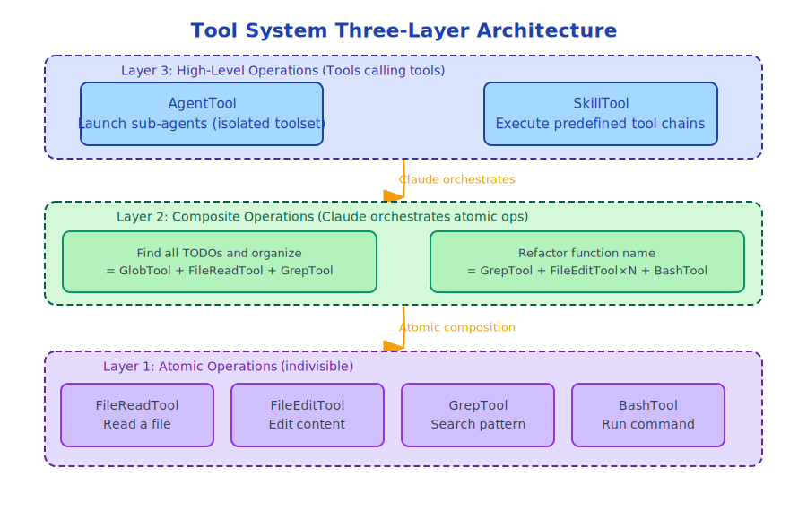

# Chapter 9: Tool System Design Philosophy

> Tools are the hands of an Agent; designing good tools means designing the capability boundaries of the Agent.

---

## 9.1 Core Questions of Tool Systems

Designing a tool system requires answering several fundamental questions:

1. **What is the tool interface?** How are inputs and outputs defined?
2. **How are tools discovered?** How does Claude know which tools are available?
3. **How are tools selected?** How does Claude decide which tool to use?
4. **How are tools executed?** What context is needed during execution?
5. **How are tool permissions controlled?** Which tools require user confirmation?
6. **How are tools extended?** How to add new tools?

Claude Code's tool system has clear answers to all six questions.

---

## 9.2 Unified Tool Interface

Every tool implements the same interface (`src/Tool.ts`):

```typescript
export type Tool<
  D extends AnyToolDef = AnyToolDef,
  I = D extends AnyToolDef ? D['input'] : never,
  O = D extends AnyToolDef ? D['output'] : never,
> = {
  // Tool name (Claude uses this name to call the tool)
  name: string

  // Tool description (Claude uses this to decide when to use the tool)
  description: string

  // Input schema (JSON Schema format, for parameter validation and Claude's understanding)
  inputSchema: ToolInputJSONSchema

  // Execute function
  execute(input: I, context: ToolUseContext): Promise<ToolResult<O>>

  // Optional: whether user confirmation is needed
  needsPermission?: (input: I) => boolean

  // Optional: JSX rendering of tool (display tool execution status in UI)
  renderToolUse?: (input: I, context: RenderContext) => React.ReactNode
}
```

The elegance of this interface design:

**`description` is for Claude**, not for users. Claude understands the tool's purpose through the description and decides when to call it. A good description directly affects the quality of Claude's tool selection.

**`inputSchema` has dual purposes**: on one hand for parameter validation (preventing Claude from passing incorrect parameters), on the other as documentation for Claude to understand tool parameters.

**`execute` is asynchronous**: All tool executions are asynchronous, supporting I/O operations, network requests, etc.

---

## 9.3 The Art of Tool Descriptions

Tool descriptions are the most underestimated part of tool systems. A good description enables Claude to accurately select tools, while a poor description leads to tool misuse or neglect.

Take `FileEditTool` as an example, its description roughly is:

```
Performs precise string replacement in files.
- Use case: Modify specific content in existing files
- Not for: Creating new files (use FileWriteTool), viewing files (use FileReadTool)
- Important: old_string must exist uniquely in the file, otherwise it will fail
- Important: Must first use FileReadTool to read the file and confirm the exact content of old_string
```

Notice what this description does:
1. Explains **applicable scenarios**
2. Explains **inapplicable scenarios** (guides Claude to choose the right tool)
3. Explains **important constraints** (prevents common errors)
4. Explains **preconditions** (read before write)

This description style is an important pattern in Claude Code's tool design.

---

## 9.4 ToolUseContext: Tool Execution Environment

`ToolUseContext` is the complete context during tool execution, containing 30+ fields:

```typescript
export type ToolUseContext = {
  // Configuration
  options: {
    commands: Command[]
    tools: Tools
    verbose: boolean
    mainLoopModel: string
    mcpClients: MCPServerConnection[]
    isNonInteractiveSession: boolean
    // ...
  }

  // Interruption control
  abortController: AbortController

  // State read/write
  getAppState(): AppState
  setAppState(f: (prev: AppState) => AppState): void

  // UI interaction
  setToolJSX?: SetToolJSXFn          // Set tool's UI rendering
  addNotification?: (n: Notification) => void
  sendOSNotification?: (opts) => void

  // File system
  readFileState: FileStateCache       // File read cache
  updateFileHistoryState: (updater) => void

  // Message system
  messages: Message[]                 // Current conversation history
  appendSystemMessage?: (msg) => void

  // Permissions
  setInProgressToolUseIDs: (f) => void
  setHasInterruptibleToolInProgress?: (v: boolean) => void

  // Performance tracking
  setResponseLength: (f) => void
  pushApiMetricsEntry?: (ttftMs: number) => void
  setStreamMode?: (mode: SpinnerMode) => void

  // Memory system
  nestedMemoryAttachmentTriggers?: Set<string>
  loadedNestedMemoryPaths?: Set<string>

  // Skills system
  dynamicSkillDirTriggers?: Set<string>
  discoveredSkillNames?: Set<string>

  // Tool decision tracking
  toolDecisions?: Map<string, {
    source: string
    decision: 'accept' | 'reject'
    timestamp: number
  }>
}
```

This context design embodies an important principle: **Tools should not have global side effects; all side effects are explicitly passed through context**.

Tool needs to update UI? Through `setToolJSX`.
Tool needs to read state? Through `getAppState`.
Tool needs to send notifications? Through `addNotification`.

This makes tool behavior completely predictable and testable.

---

## 9.5 Tool Registration and Discovery

Tools are registered in `src/tools.ts`:

```typescript
// src/tools.ts (simplified)
export function getTools(options: GetToolsOptions): Tools {
  const tools: Tool[] = [
    // File operations
    new FileReadTool(),
    new FileEditTool(),
    new FileWriteTool(),
    new GlobTool(),
    new GrepTool(),

    // Shell
    new BashTool(),

    // Agent
    new AgentTool(),

    // ... other tools
  ]

  // Filter tools based on configuration
  return tools.filter(tool => isToolEnabled(tool, options))
}
```

The tool list is built at the start of each session and passed to Claude through the API's `tools` parameter. Claude sees the tool's `name`, `description`, and `inputSchema`, not the implementation code.

---

## 9.6 Layered Tool Design



Claude Code's tools are layered by responsibility:

The benefit of this layered design: **Atomic tools are simple and reliable, complex tasks are orchestrated by Claude's reasoning ability**, rather than hardcoded in tools.

---

## 9.7 Tool Result Format

After tool execution, it returns `ToolResult`:

```typescript
type ToolResult<O> = {
  type: 'tool_result'
  content: string | ContentBlock[]  // Result content
  is_error?: boolean                // Whether it's an error
  metadata?: {
    tokenCount?: number             // Token count of result
    truncated?: boolean             // Whether it was truncated
  }
}
```

Tool results are appended to the message list, and Claude can see these results in the next turn and make decisions accordingly.

**Result truncation** is an important design consideration: files can be large, tool results may exceed token limits. Claude Code automatically truncates oversized results and notes the truncation in the result, letting Claude know the result is incomplete.

---

## 9.8 Tool Idempotency Design

Good tools should be as idempotent as possible (same result when executed multiple times):

- `FileReadTool`: Naturally idempotent (read operations don't change state)
- `GrepTool`: Naturally idempotent
- `FileEditTool`: **Not idempotent**, but has protection mechanisms (`old_string` must exist uniquely)
- `BashTool`: **Not idempotent**, requires user confirmation

For non-idempotent tools, Claude Code requires user confirmation through the permission system to prevent accidental repeated execution.

---

## 9.9 Tool Testing Strategy

The `src/tools/testing/` directory contains infrastructure for tool testing:

```typescript
// Typical pattern for tool testing
describe('FileEditTool', () => {
  it('should edit file content', async () => {
    // Create test file
    const testFile = createTempFile('hello world')

    // Execute tool
    const result = await FileEditTool.execute({
      file_path: testFile,
      old_string: 'hello',
      new_string: 'goodbye'
    }, mockContext)

    // Verify result
    expect(result.is_error).toBe(false)
    expect(readFile(testFile)).toBe('goodbye world')
  })
})
```

The key to tool testing is `mockContext`: by mocking `ToolUseContext`, individual tools can be tested without starting the complete system.

---

## 9.10 Tool Design Anti-Patterns

When designing tools, there are several common anti-patterns to avoid:

**Anti-pattern 1: Tool does too much**
```
// Wrong: one tool does read, analyze, and write
AnalyzeAndRefactorTool

// Right: split into three tools, orchestrated by Claude
FileReadTool + (Claude analyzes) + FileEditTool
```

**Anti-pattern 2: Tool has implicit dependencies**
```
// Wrong: tool depends on global state
execute(input) {
  const config = globalConfig  // Implicit dependency
}

// Right: explicitly pass through context
execute(input, context) {
  const config = context.options.config  // Explicit dependency
}
```

**Anti-pattern 3: Tool description is imprecise**
```
// Wrong: description too vague
description: "Edit files"

// Right: description precise, includes constraints and use cases
description: "Performs precise string replacement in files. Must first read file to confirm content..."
```

---

## 9.11 Summary

Claude Code tool system design philosophy:

1. **Unified interface**: All tools implement the same `Tool` interface
2. **Description as documentation**: Tool descriptions are usage instructions for Claude
3. **Explicit context**: All side effects explicitly passed through `ToolUseContext`
4. **Atomicity**: Tools do one thing, complex tasks orchestrated by Claude
5. **Testability**: Test each tool independently through mock context
6. **Permission awareness**: Non-idempotent tools need permission control

These principles together form a reliable, extensible, and testable tool system.

---

*Next chapter: [Overview of 43 Built-in Tools](./10-builtin-tools.md)*

