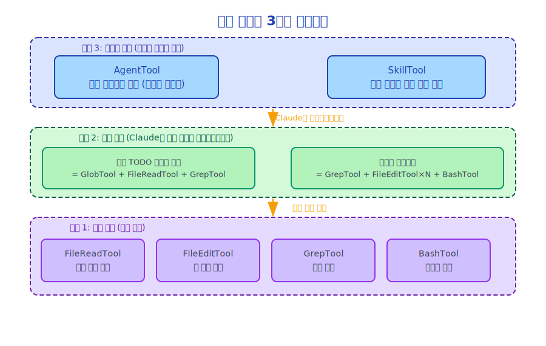

# 제9장: 도구 시스템(Tool System) 설계 철학

> 도구(Tool)는 에이전트(Agent)의 손이며, 좋은 도구를 설계한다는 것은 에이전트의 능력 경계를 설계하는 것입니다.

---

## 9.1 도구 시스템(Tool System)의 핵심 질문

도구 시스템을 설계하려면 몇 가지 근본적인 질문에 답해야 합니다.

1. **도구 인터페이스란 무엇인가?** 입력과 출력을 어떻게 정의하는가?
2. **도구는 어떻게 탐색되는가?** Claude는 어떤 도구가 사용 가능한지 어떻게 알 수 있는가?
3. **도구는 어떻게 선택되는가?** Claude는 어떤 도구를 사용할지 어떻게 결정하는가?
4. **도구는 어떻게 실행되는가?** 실행 중 어떤 컨텍스트(Context)가 필요한가?
5. **도구 권한(Permission)은 어떻게 제어되는가?** 어떤 도구에 사용자 확인이 필요한가?
6. **도구는 어떻게 확장되는가?** 새로운 도구를 어떻게 추가하는가?

Claude Code의 도구 시스템(Tool System)은 이 여섯 가지 질문 모두에 명확한 답을 가지고 있습니다.

---

## 9.2 통합 도구 인터페이스

모든 도구는 동일한 인터페이스(`src/Tool.ts`)를 구현합니다.

```typescript
export type Tool<
  D extends AnyToolDef = AnyToolDef,
  I = D extends AnyToolDef ? D['input'] : never,
  O = D extends AnyToolDef ? D['output'] : never,
> = {
  // 도구 이름 (Claude가 이 이름으로 도구를 호출)
  name: string

  // 도구 설명 (Claude가 언제 이 도구를 사용할지 결정하는 데 활용)
  description: string

  // 입력 스키마 (JSON Schema 형식, 파라미터 검증 및 Claude의 이해를 위해 사용)
  inputSchema: ToolInputJSONSchema

  // 실행 함수
  execute(input: I, context: ToolUseContext): Promise<ToolResult<O>>

  // 선택 사항: 사용자 확인이 필요한지 여부
  needsPermission?: (input: I) => boolean

  // 선택 사항: 도구의 JSX 렌더링 (UI에서 도구 실행 상태 표시)
  renderToolUse?: (input: I, context: RenderContext) => React.ReactNode
}
```

이 인터페이스 설계의 우아함:

**`description`은 Claude를 위한 것**이며, 사용자를 위한 것이 아닙니다. Claude는 설명을 통해 도구의 목적을 이해하고 언제 호출할지 결정합니다. 좋은 설명은 Claude의 도구 선택 품질에 직접적인 영향을 미칩니다.

**`inputSchema`는 이중 목적**을 가집니다. 한편으로는 파라미터 검증(Claude가 잘못된 파라미터를 전달하는 것을 방지)을 위한 것이고, 다른 한편으로는 Claude가 도구 파라미터를 이해하기 위한 문서 역할을 합니다.

**`execute`는 비동기**입니다. 모든 도구 실행은 비동기로 처리되어 I/O 작업, 네트워크 요청 등을 지원합니다.

---

## 9.3 도구 설명의 기술

도구 설명은 도구 시스템(Tool System)에서 가장 과소평가되는 부분입니다. 좋은 설명은 Claude가 도구를 정확하게 선택할 수 있게 하고, 나쁜 설명은 도구의 오용이나 방치를 초래합니다.

`FileEditTool`을 예로 들면, 그 설명은 대략 다음과 같습니다.

```
파일에서 정밀한 문자열 교체를 수행합니다.
- 사용 사례: 기존 파일의 특정 내용 수정
- 사용 불가: 새 파일 생성(FileWriteTool 사용), 파일 보기(FileReadTool 사용)
- 중요: old_string은 파일에서 고유하게 존재해야 하며, 그렇지 않으면 실패합니다
- 중요: 먼저 FileReadTool을 사용해 파일을 읽고 old_string의 정확한 내용을 확인해야 합니다
```

이 설명이 하는 일을 주목하세요.
1. **적용 가능한 시나리오** 설명
2. **적용 불가능한 시나리오** 설명 (Claude가 올바른 도구를 선택하도록 유도)
3. **중요한 제약 조건** 설명 (일반적인 오류 방지)
4. **전제 조건** 설명 (쓰기 전에 읽기)

이 설명 스타일은 Claude Code의 도구 설계에서 중요한 패턴입니다.

---

## 9.4 ToolUseContext: 도구 실행 환경

`ToolUseContext`는 도구 실행 중의 완전한 컨텍스트(Context)로, 30개 이상의 필드를 포함합니다.

```typescript
export type ToolUseContext = {
  // 설정
  options: {
    commands: Command[]
    tools: Tools
    verbose: boolean
    mainLoopModel: string
    mcpClients: MCPServerConnection[]
    isNonInteractiveSession: boolean
    // ...
  }

  // 중단 제어
  abortController: AbortController

  // 상태 읽기/쓰기
  getAppState(): AppState
  setAppState(f: (prev: AppState) => AppState): void

  // UI 상호작용
  setToolJSX?: SetToolJSXFn          // 도구의 UI 렌더링 설정
  addNotification?: (n: Notification) => void
  sendOSNotification?: (opts) => void

  // 파일 시스템
  readFileState: FileStateCache       // 파일 읽기 캐시
  updateFileHistoryState: (updater) => void

  // 메시지 시스템
  messages: Message[]                 // 현재 대화 기록
  appendSystemMessage?: (msg) => void

  // 권한(Permission)
  setInProgressToolUseIDs: (f) => void
  setHasInterruptibleToolInProgress?: (v: boolean) => void

  // 성능 추적
  setResponseLength: (f) => void
  pushApiMetricsEntry?: (ttftMs: number) => void
  setStreamMode?: (mode: SpinnerMode) => void

  // 메모리 시스템
  nestedMemoryAttachmentTriggers?: Set<string>
  loadedNestedMemoryPaths?: Set<string>

  // 스킬(Skills) 시스템
  dynamicSkillDirTriggers?: Set<string>
  discoveredSkillNames?: Set<string>

  // 도구 결정 추적
  toolDecisions?: Map<string, {
    source: string
    decision: 'accept' | 'reject'
    timestamp: number
  }>
}
```

이 컨텍스트 설계는 중요한 원칙을 구현합니다. **도구는 전역 부작용을 가져서는 안 되며, 모든 부작용은 컨텍스트를 통해 명시적으로 전달됩니다.**

도구가 UI를 업데이트해야 하는가? `setToolJSX`를 통해서 합니다.
도구가 상태를 읽어야 하는가? `getAppState`를 통해서 합니다.
도구가 알림을 보내야 하는가? `addNotification`을 통해서 합니다.

이로써 도구 동작이 완전히 예측 가능하고 테스트 가능해집니다.

---

## 9.5 도구 등록과 탐색

도구는 `src/tools.ts`에 등록됩니다.

```typescript
// src/tools.ts (간략화)
export function getTools(options: GetToolsOptions): Tools {
  const tools: Tool[] = [
    // 파일 작업
    new FileReadTool(),
    new FileEditTool(),
    new FileWriteTool(),
    new GlobTool(),
    new GrepTool(),

    // 셸(Shell)
    new BashTool(),

    // 에이전트(Agent)
    new AgentTool(),

    // ... 기타 도구
  ]

  // 설정에 따라 도구 필터링
  return tools.filter(tool => isToolEnabled(tool, options))
}
```

도구 목록은 각 세션 시작 시 구성되어 API의 `tools` 파라미터를 통해 Claude에게 전달됩니다. Claude는 도구의 `name`, `description`, `inputSchema`를 볼 수 있으며, 구현 코드는 볼 수 없습니다.

---

## 9.6 계층적 도구 설계



Claude Code의 도구는 책임에 따라 계층화되어 있습니다.

이 계층적 설계의 이점: **원자적 도구는 단순하고 신뢰할 수 있으며, 복잡한 작업은 하드코딩이 아닌 Claude의 추론 능력으로 조율됩니다.**

---

## 9.7 도구 결과 형식

도구 실행 후 `ToolResult`를 반환합니다.

```typescript
type ToolResult<O> = {
  type: 'tool_result'
  content: string | ContentBlock[]  // 결과 내용
  is_error?: boolean                // 오류 여부
  metadata?: {
    tokenCount?: number             // 결과의 토큰 수
    truncated?: boolean             // 잘렸는지 여부
  }
}
```

도구 결과는 메시지 목록에 추가되며, Claude는 다음 턴에서 이 결과를 보고 그에 따라 결정을 내릴 수 있습니다.

**결과 잘라내기(Truncation)**는 중요한 설계 고려사항입니다. 파일이 클 수 있고 도구 결과가 토큰 한도를 초과할 수 있습니다. Claude Code는 너무 큰 결과를 자동으로 잘라내고 결과에 잘라냈음을 명시하여 Claude가 결과가 불완전하다는 것을 알 수 있게 합니다.

---

## 9.8 도구 멱등성(Idempotency) 설계

좋은 도구는 가능한 한 멱등적이어야 합니다(여러 번 실행해도 동일한 결과).

- `FileReadTool`: 자연적으로 멱등적 (읽기 작업은 상태를 변경하지 않음)
- `GrepTool`: 자연적으로 멱등적
- `FileEditTool`: **멱등적이지 않음**, 하지만 보호 메커니즘 존재 (`old_string`은 고유하게 존재해야 함)
- `BashTool`: **멱등적이지 않음**, 사용자 확인 필요

멱등적이지 않은 도구의 경우, Claude Code는 권한 시스템(Permission System)을 통해 사용자 확인을 요구하여 의도치 않은 반복 실행을 방지합니다.

---

## 9.9 도구 테스트 전략

`src/tools/testing/` 디렉터리에는 도구 테스트를 위한 인프라가 포함되어 있습니다.

```typescript
// 도구 테스트의 일반적인 패턴
describe('FileEditTool', () => {
  it('should edit file content', async () => {
    // 테스트 파일 생성
    const testFile = createTempFile('hello world')

    // 도구 실행
    const result = await FileEditTool.execute({
      file_path: testFile,
      old_string: 'hello',
      new_string: 'goodbye'
    }, mockContext)

    // 결과 검증
    expect(result.is_error).toBe(false)
    expect(readFile(testFile)).toBe('goodbye world')
  })
})
```

도구 테스트의 핵심은 `mockContext`입니다. `ToolUseContext`를 모킹(Mocking)함으로써 전체 시스템을 시작하지 않고도 개별 도구를 테스트할 수 있습니다.

---

## 9.10 도구 설계 안티패턴(Anti-Pattern)

도구를 설계할 때 피해야 할 몇 가지 일반적인 안티패턴이 있습니다.

**안티패턴 1: 도구가 너무 많은 일을 함**
```
// 잘못된 방식: 하나의 도구가 읽기, 분석, 쓰기를 모두 수행
AnalyzeAndRefactorTool

// 올바른 방식: 세 가지 도구로 분리하고 Claude가 조율
FileReadTool + (Claude가 분석) + FileEditTool
```

**안티패턴 2: 도구에 암묵적 의존성이 있음**
```
// 잘못된 방식: 도구가 전역 상태에 의존
execute(input) {
  const config = globalConfig  // 암묵적 의존성
}

// 올바른 방식: 컨텍스트를 통해 명시적으로 전달
execute(input, context) {
  const config = context.options.config  // 명시적 의존성
}
```

**안티패턴 3: 도구 설명이 부정확함**
```
// 잘못된 방식: 설명이 너무 모호함
description: "Edit files"

// 올바른 방식: 설명이 정밀하고 제약 조건과 사용 사례 포함
description: "파일에서 정밀한 문자열 교체를 수행합니다. 먼저 파일을 읽어 내용을 확인해야 합니다..."
```

---

## 9.11 요약

Claude Code 도구 시스템(Tool System) 설계 철학:

1. **통합 인터페이스**: 모든 도구가 동일한 `Tool` 인터페이스를 구현합니다
2. **설명이 곧 문서**: 도구 설명은 Claude를 위한 사용 지침입니다
3. **명시적 컨텍스트**: 모든 부작용이 `ToolUseContext`를 통해 명시적으로 전달됩니다
4. **원자성**: 도구는 하나의 일을 하고, 복잡한 작업은 Claude가 조율합니다
5. **테스트 가능성**: 모의 컨텍스트(Mock Context)를 통해 각 도구를 독립적으로 테스트합니다
6. **권한 인식**: 멱등적이지 않은 도구에는 권한 제어(Permission Control)가 필요합니다

이 원칙들이 함께 신뢰할 수 있고, 확장 가능하며, 테스트 가능한 도구 시스템을 형성합니다.

---

*다음 장: [43개 내장 도구(Built-in Tools) 개요](./10-builtin-tools_ko.md)*
