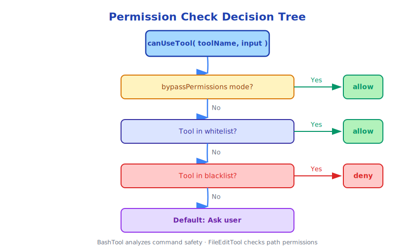

# Chapter 11: Tool Permission Model

> With great power comes great responsibility. The tool permission model is the core of Claude Code's security.

---

## 11.1 Why a Permission Model is Needed

Claude Code can execute shell commands, modify files, and access the network. Without control, these capabilities could cause serious consequences:

- Accidentally deleting important files
- Executing malicious scripts
- Leaking sensitive information
- Accidentally modifying production databases

The goal of the permission model is: **Prevent accidental or malicious destructive operations while maintaining Claude's capabilities**.

---

## 11.2 Permission Modes

Claude Code has four permission modes:

```typescript
// src/utils/permissions/PermissionMode.ts
type PermissionMode =
  | 'default'                    // Default: ask before dangerous operations
  | 'acceptEdits'                // Auto-accept file edits, ask for other operations
  | 'bypassPermissions'          // Skip all permission checks (dangerous!)
  | 'plan'                       // Plan mode: can only generate plans, not execute
```

**Default mode** is the safest, suitable for daily use.

**acceptEdits mode** is suitable when trusting Claude's file modifications, but still cautious about shell commands.

**bypassPermissions mode** is suitable for fully trusted automation scenarios (like CI/CD), should not be used in interactive sessions.

**Plan mode** is a special security mode where Claude can only describe plans, not execute any tools.

---

## 11.3 Tool-Level Permission Checks

Every tool call goes through the `canUseTool()` function check:

```typescript
// src/hooks/useCanUseTool.tsx (simplified)
export type CanUseToolFn = (
  toolName: string,
  toolInput: unknown,
  context: PermissionContext
) => CanUseToolResult

type CanUseToolResult =
  | { behavior: 'allow' }                    // Allow
  | { behavior: 'deny'; message: string }    // Deny
  | { behavior: 'ask'; message: string }     // Ask user
```

Permission check decision tree:



---

## 11.4 Command Safety Analysis

BashTool has a dedicated command safety analysis module (`src/utils/bash/`):

```typescript
// Dangerous command detection
const DANGEROUS_PATTERNS = [
  /rm\s+-rf?\s+[\/~]/,          // rm -rf /
  />\s*\/dev\/sd[a-z]/,         // Overwrite disk
  /mkfs\./,                      // Format filesystem
  /dd\s+.*of=\/dev\//,          // dd write to device
  /chmod\s+-R\s+777/,           // Dangerous permissions
  /curl.*\|\s*bash/,            // Pipe execute remote script
  /wget.*\|\s*sh/,              // Same as above
]

function analyzeCommandSafety(command: string): SafetyAnalysis {
  for (const pattern of DANGEROUS_PATTERNS) {
    if (pattern.test(command)) {
      return {
        safe: false,
        reason: `Detected dangerous pattern: ${pattern}`,
        requiresConfirmation: true
      }
    }
  }
  return { safe: true }
}
```

This analysis is not foolproof (regex cannot cover all cases), but it catches the most common dangerous operations.

---

## 11.5 Path Permission Control

File operation tools have path-level permission control:

```typescript
// Allowed path scope
type PathPermission = {
  allowedPaths: string[]    // Allowed access paths
  blockedPaths: string[]    // Blocked access paths
}

// Check if path is within allowed scope
function isPathAllowed(filePath: string, permission: PathPermission): boolean {
  const resolved = path.resolve(filePath)

  // Check if in blocked paths
  for (const blocked of permission.blockedPaths) {
    if (resolved.startsWith(path.resolve(blocked))) {
      return false
    }
  }

  // Check if in allowed paths
  for (const allowed of permission.allowedPaths) {
    if (resolved.startsWith(path.resolve(allowed))) {
      return true
    }
  }

  return false
}
```

By default, Claude Code can only access the current working directory and its subdirectories.

---

## 11.6 User Confirmation Flow

When a tool requires user confirmation, Claude Code displays a confirmation dialog:

```
Claude wants to execute the following command:

  rm -rf node_modules/

This operation is irreversible. Allow?

[Allow Once]  [Always Allow]  [Deny]  [Deny and Explain]
```

The design of four options is elegant:

- **Allow Once**: Only allow this time, same operation next time still requires confirmation
- **Always Allow**: Add this operation to whitelist, automatically allow in the future
- **Deny**: Deny this operation, Claude will try other approaches
- **Deny and Explain**: Deny and tell Claude why, Claude can adjust strategy

---

## 11.7 Persisting Permission Decisions

User permission decisions can be persisted:

```typescript
// Tool decision tracking
toolDecisions?: Map<string, {
  source: string           // Decision source (user, config file, etc.)
  decision: 'accept' | 'reject'
  timestamp: number
}>
```

This prevents users from repeatedly confirming the same operations. Meanwhile, decision records also provide audit capability—can view which operations were allowed or denied.

---

## 11.8 Sandbox Mode

Claude Code supports sandbox mode, running in a restricted environment:

```typescript
// src/entrypoints/sandboxTypes.ts
type SandboxConfig = {
  allowedCommands: string[]    // Whitelist commands
  allowedPaths: string[]       // Whitelist paths
  networkAccess: boolean       // Whether to allow network access
  maxExecutionTime: number     // Maximum execution time
}
```

Sandbox mode is suitable for:
- Automated tasks in CI/CD environments
- Analyzing untrusted codebases
- Educational scenarios (limiting student operation scope)

---

## 11.9 Permission Model Design Trade-offs

The permission model faces a fundamental trade-off: **Security vs Convenience**.

Too strict permissions make Claude Code hard to use—every operation requires confirmation, users get frustrated.

Too loose permissions bring security risks—Claude may execute unexpected destructive operations.

Claude Code's solution is **layered permissions**:

```
Layer 1: Mode level (bypassPermissions / default / plan)
    ↓
Layer 2: Tool level (some tools allowed by default, some ask by default)
    ↓
Layer 3: Operation level (different operations of same tool have different permissions)
    ↓
Layer 4: Path level (path scope restrictions for file operations)
    ↓
Layer 5: Command level (safety analysis of shell commands)
```

Users can adjust permissions at any layer, achieving fine-grained control.

---

## 11.10 Handling Permission Denials

When a tool is denied, Claude doesn't simply stop, but tries to adjust strategy:

```
Claude wants to execute: rm -rf dist/
User: Deny

Claude: Okay, I'll use rimraf dist/ command instead, it's safer.
User: Allow

Claude: Executing rimraf dist/...
```

This "adjust after denial" capability comes from Claude's reasoning ability, not the tool system itself. The tool system only performs permission checks, Claude adjusts strategy based on results.

---

## 11.11 Summary

Claude Code's permission model is a multi-layered security system:

- **Mode level**: Four permission modes, from fully restricted to fully open
- **Tool level**: Each tool has default permission requirements
- **Operation level**: Different operations of same tool have different risk levels
- **Path level**: Path scope restrictions for file operations
- **Command level**: Safety analysis of shell commands

The design goal of this system is: **Make security the default, make convenience optional**.

---

*Next chapter: [What is Context Engineering](../part5/12-context-what.md)*

