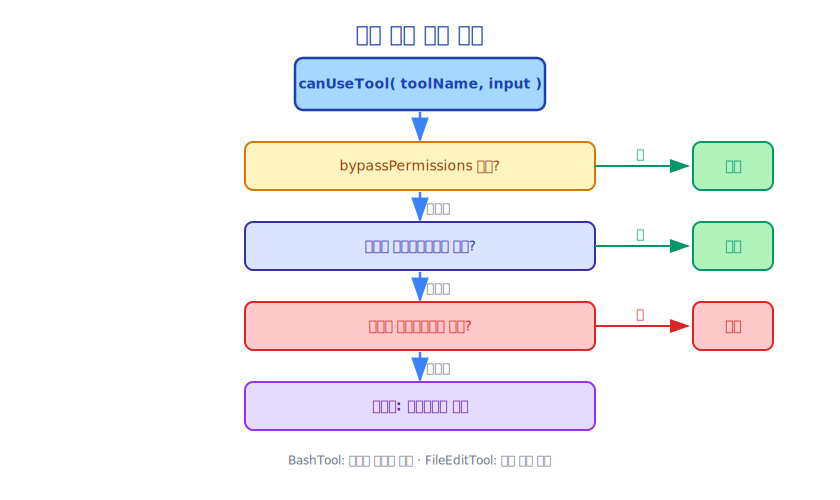

# 제11장: 도구 권한 모델(Tool Permission Model)

> 큰 힘에는 큰 책임이 따릅니다. 도구 권한 모델(Tool Permission Model)은 Claude Code 보안의 핵심입니다.

---

## 11.1 권한 모델(Permission Model)이 필요한 이유

Claude Code는 셸(Shell) 명령어를 실행하고, 파일을 수정하며, 네트워크에 접근할 수 있습니다. 제어 없이는 이러한 능력이 심각한 결과를 초래할 수 있습니다.

- 중요한 파일을 실수로 삭제
- 악의적인 스크립트 실행
- 민감한 정보 유출
- 운영 데이터베이스를 실수로 수정

권한 모델(Permission Model)의 목표: **Claude의 능력을 유지하면서 우발적이거나 악의적인 파괴적 작업을 방지합니다.**

---

## 11.2 권한 모드(Permission Mode)

Claude Code에는 네 가지 권한 모드(Permission Mode)가 있습니다.

```typescript
// src/utils/permissions/PermissionMode.ts
type PermissionMode =
  | 'default'                    // 기본값: 위험한 작업 전 확인
  | 'acceptEdits'                // 파일 편집 자동 수락, 기타 작업은 확인
  | 'bypassPermissions'          // 모든 권한 검사 건너뜀 (위험!)
  | 'plan'                       // 플랜 모드: 계획 생성만 가능, 실행 불가
```

**기본(Default) 모드**는 가장 안전하며 일상적인 사용에 적합합니다.

**acceptEdits 모드**는 Claude의 파일 수정을 신뢰하지만 셸(Shell) 명령어에는 여전히 주의가 필요할 때 적합합니다.

**bypassPermissions 모드**는 완전히 신뢰할 수 있는 자동화 시나리오(예: CI/CD)에 적합하며, 대화형 세션에서는 사용하면 안 됩니다.

**플랜 모드(Plan Mode)**는 Claude가 계획만 설명할 수 있고 어떤 도구도 실행할 수 없는 특수 보안 모드입니다.

---

## 11.3 도구 수준 권한 검사

모든 도구 호출(Tool Call)은 `canUseTool()` 함수 검사를 거칩니다.

```typescript
// src/hooks/useCanUseTool.tsx (간략화)
export type CanUseToolFn = (
  toolName: string,
  toolInput: unknown,
  context: PermissionContext
) => CanUseToolResult

type CanUseToolResult =
  | { behavior: 'allow' }                    // 허용
  | { behavior: 'deny'; message: string }    // 거부
  | { behavior: 'ask'; message: string }     // 사용자에게 확인
```

권한 검사 결정 트리:



---

## 11.4 명령어 안전성 분석

BashTool에는 전용 명령어 안전성 분석 모듈(`src/utils/bash/`)이 있습니다.

```typescript
// 위험한 명령어 감지
const DANGEROUS_PATTERNS = [
  /rm\s+-rf?\s+[\/~]/,          // rm -rf /
  />\s*\/dev\/sd[a-z]/,         // 디스크 덮어쓰기
  /mkfs\./,                      // 파일 시스템 포맷
  /dd\s+.*of=\/dev\//,          // dd로 장치에 쓰기
  /chmod\s+-R\s+777/,           // 위험한 권한
  /curl.*\|\s*bash/,            // 원격 스크립트 파이프 실행
  /wget.*\|\s*sh/,              // 위와 동일
]

function analyzeCommandSafety(command: string): SafetyAnalysis {
  for (const pattern of DANGEROUS_PATTERNS) {
    if (pattern.test(command)) {
      return {
        safe: false,
        reason: `위험한 패턴 감지: ${pattern}`,
        requiresConfirmation: true
      }
    }
  }
  return { safe: true }
}
```

이 분석은 완벽하지 않지만(정규식이 모든 경우를 커버할 수 없음), 가장 일반적인 위험한 작업을 감지합니다.

---

## 11.5 경로 권한(Path Permission) 제어

파일 작업 도구에는 경로 수준의 권한 제어가 있습니다.

```typescript
// 허용된 경로 범위
type PathPermission = {
  allowedPaths: string[]    // 접근 허용 경로
  blockedPaths: string[]    // 접근 차단 경로
}

// 경로가 허용 범위 내에 있는지 확인
function isPathAllowed(filePath: string, permission: PathPermission): boolean {
  const resolved = path.resolve(filePath)

  // 차단된 경로에 있는지 확인
  for (const blocked of permission.blockedPaths) {
    if (resolved.startsWith(path.resolve(blocked))) {
      return false
    }
  }

  // 허용된 경로에 있는지 확인
  for (const allowed of permission.allowedPaths) {
    if (resolved.startsWith(path.resolve(allowed))) {
      return true
    }
  }

  return false
}
```

기본적으로 Claude Code는 현재 작업 디렉터리와 그 하위 디렉터리에만 접근할 수 있습니다.

---

## 11.6 사용자 확인 흐름

도구에 사용자 확인이 필요할 때 Claude Code는 확인 다이얼로그를 표시합니다.

```
Claude가 다음 명령어를 실행하려고 합니다:

  rm -rf node_modules/

이 작업은 되돌릴 수 없습니다. 허용하시겠습니까?

[한 번 허용]  [항상 허용]  [거부]  [거부 및 설명]
```

네 가지 옵션의 설계가 우아합니다.

- **한 번 허용**: 이번에만 허용하며, 동일한 작업을 다음에 수행할 때는 여전히 확인이 필요합니다
- **항상 허용**: 이 작업을 화이트리스트에 추가하여 향후 자동으로 허용합니다
- **거부**: 이 작업을 거부하며, Claude는 다른 방법을 시도합니다
- **거부 및 설명**: 거부하고 Claude에게 이유를 알려주며, Claude는 전략을 조정할 수 있습니다

---

## 11.7 권한 결정 지속

사용자 권한 결정은 지속될 수 있습니다.

```typescript
// 도구 결정 추적
toolDecisions?: Map<string, {
  source: string           // 결정 출처 (사용자, 설정 파일 등)
  decision: 'accept' | 'reject'
  timestamp: number
}>
```

이는 사용자가 동일한 작업을 반복적으로 확인하는 것을 방지합니다. 동시에 결정 기록은 감사(Audit) 기능도 제공하여 어떤 작업이 허용되거나 거부되었는지 확인할 수 있습니다.

---

## 11.8 샌드박스(Sandbox) 모드

Claude Code는 제한된 환경에서 실행되는 샌드박스(Sandbox) 모드를 지원합니다.

```typescript
// src/entrypoints/sandboxTypes.ts
type SandboxConfig = {
  allowedCommands: string[]    // 화이트리스트 명령어
  allowedPaths: string[]       // 화이트리스트 경로
  networkAccess: boolean       // 네트워크 접근 허용 여부
  maxExecutionTime: number     // 최대 실행 시간
}
```

샌드박스(Sandbox) 모드는 다음 경우에 적합합니다.
- CI/CD 환경의 자동화 작업
- 신뢰할 수 없는 코드베이스 분석
- 교육 시나리오 (학생 작업 범위 제한)

---

## 11.9 권한 모델(Permission Model) 설계 트레이드오프

권한 모델(Permission Model)은 근본적인 트레이드오프에 직면합니다. **보안 대 편의성**.

너무 엄격한 권한은 Claude Code를 사용하기 어렵게 만듭니다. 모든 작업에 확인이 필요하면 사용자가 불편을 느낍니다.

너무 느슨한 권한은 보안 위험을 초래합니다. Claude가 예상치 못한 파괴적인 작업을 실행할 수 있습니다.

Claude Code의 해결책은 **계층적 권한(Layered Permissions)**입니다.

```
레이어 1: 모드 수준 (bypassPermissions / default / plan)
    ↓
레이어 2: 도구 수준 (일부 도구는 기본적으로 허용, 일부는 기본적으로 확인)
    ↓
레이어 3: 작업 수준 (동일한 도구의 다른 작업은 다른 권한 보유)
    ↓
레이어 4: 경로 수준 (파일 작업의 경로 범위 제한)
    ↓
레이어 5: 명령어 수준 (셸 명령어의 안전성 분석)
```

사용자는 모든 레이어에서 권한을 조정하여 세밀한 제어를 달성할 수 있습니다.

---

## 11.10 권한 거부 처리

도구가 거부되면 Claude는 단순히 멈추지 않고 전략을 조정하려고 시도합니다.

```
Claude가 실행하려 함: rm -rf dist/
사용자: 거부

Claude: 알겠습니다. 대신 rimraf dist/ 명령어를 사용하겠습니다. 더 안전합니다.
사용자: 허용

Claude: rimraf dist/ 실행 중...
```

이 "거부 후 조정" 능력은 도구 시스템(Tool System) 자체가 아닌 Claude의 추론 능력에서 비롯됩니다. 도구 시스템은 권한 검사만 수행하고, Claude는 결과에 따라 전략을 조정합니다.

---

## 11.11 요약

Claude Code의 권한 모델(Permission Model)은 다층적 보안 시스템입니다.

- **모드 수준**: 완전 제한부터 완전 개방까지 네 가지 권한 모드(Permission Mode)
- **도구 수준**: 각 도구에는 기본 권한 요구 사항이 있습니다
- **작업 수준**: 동일한 도구의 다른 작업은 위험 수준이 다릅니다
- **경로 수준**: 파일 작업의 경로 범위 제한
- **명령어 수준**: 셸(Shell) 명령어의 안전성 분석

이 시스템의 설계 목표: **보안을 기본값으로, 편의성을 선택 사항으로 만듭니다.**

---

*다음 장: [컨텍스트 엔지니어링(Context Engineering)이란 무엇인가](../part5/12-context-what_ko.md)*
