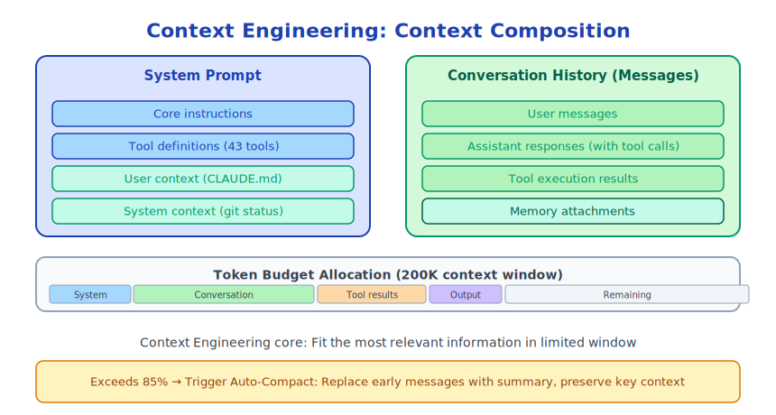

# Chapter 12: What is Context Engineering

> "Context is everything. Without context, words and actions have no meaning at all."
> —— Gregory Bateson

---

## 12.1 A Thought Experiment

Imagine you hire a new employee and on their first day, you throw them into a complex project without any explanation:

- Don't tell them the project background
- Don't tell them the coding standards
- Don't tell them the team conventions
- Don't tell them the current state

Can they work? Yes, but with extremely low efficiency and many errors.

Now try a different approach: give them a detailed onboarding document containing project background, tech stack, coding standards, common issues, and current task status.

Same person, same abilities, but with context, the work quality is vastly different.

**This is the core idea of Context Engineering: providing AI with the right context is the key factor determining AI output quality.**

---

## 12.2 What is Context Engineering

Context Engineering refers to **systematically designing, building, and managing the input context for AI models** to maximize model output quality.

It encompasses three dimensions:

**Content Dimension**: What information to give AI?
- Project background (CLAUDE.md)
- Current state (git status, file contents)
- Historical records (conversation history)
- External knowledge (documentation, search results)

**Structure Dimension**: How to organize this information?
- System prompt vs user messages
- Information order and priority
- Format (plain text, Markdown, XML)

**Management Dimension**: How to manage information within the limited token window?
- Compress history (auto-compact)
- Filter irrelevant information
- Dynamically inject relevant information

---

## 12.3 Why Context Engineering is So Important

LLM capabilities are fixed (determined by training), but output quality is variable (determined by context).

A simple experiment:

```
# Without context
User: Fix this bug

Claude: I need more information...
```

```
# With context
System prompt: You are a TypeScript expert maintaining a React application.
          Code standards: Use functional components, avoid any type.
User: Fix this bug
[Attach error message and relevant code]

Claude: [Directly provides precise fix]
```

Same model, same question, but with context, output quality is completely different.

---

## 12.4 Claude Code's Context Architecture

Claude Code's context consists of multiple layers:



Each layer serves its purpose, and missing any layer reduces output quality.

---

## 12.5 Token Economics of Context

Claude's context window is limited (currently max ~200K tokens). Every token is a precious resource.

**Token allocation**:

```
Total token budget (200K)
├── System prompt: ~5K (tool definitions + core instructions)
├── User context (CLAUDE.md): ~2K (depends on file size)
├── System context (git status etc): ~1K
├── Conversation history: ~100K (grows with conversation)
├── Current tool results: ~50K (can be large)
└── Output budget: ~40K (Claude's response)
```

When conversation history grows close to the limit, compression (compact) is needed. This is one of the most complex problems in Context Engineering.

---

## 12.6 Four Dimensions of Context Quality

**Relevance**: Is the context relevant to the current task?
- Good: Current file contents, relevant error messages
- Bad: Irrelevant historical conversations, unrelated file contents

**Accuracy**: Does the context accurately reflect the current state?
- Good: Latest git status, real-time file contents
- Bad: Outdated information, cached old state

**Completeness**: Does the context contain necessary information?
- Good: Contains all relevant code, configuration, constraints
- Bad: Missing key information, causing Claude to make wrong assumptions

**Conciseness**: Is the context concise without redundancy?
- Good: Refined project description, summary of key information
- Bad: Verbose documentation, repeated information

---

## 12.7 Claude Code's Context Engineering Practices

Claude Code has done extensive engineering work on Context Engineering:

**Auto-inject git status** (`src/context.ts`):
```typescript
// Automatically get git status at the start of each conversation
const gitStatus = await getGitStatus()
// Includes: current branch, main branch, last 5 commits, working tree status
```

**CLAUDE.md auto-discovery**:
```typescript
// Search upward from current directory for CLAUDE.md
// Supports multi-level directories (project level, subdirectory level)
const claudeMds = getClaudeMds(await getMemoryFiles())
```

**Auto-compact**:
```typescript
// Automatically compress when token usage exceeds threshold
if (isAutoCompactEnabled() && tokenUsage > threshold) {
  await compactConversation(messages)
}
```

**Dynamic Memory injection**:
```typescript
// Dynamically load relevant Memory files based on current task
const relevantMemories = await findRelevantMemories(currentTask)
```

---

## 12.8 Context Engineering vs Prompt Engineering

Many people confuse Context Engineering with Prompt Engineering. Their differences:

| Dimension | Prompt Engineering | Context Engineering |
|------|-------------------|---------------------|
| Focus | How to write good prompts | How to manage entire context |
| Scope | Single interaction | Entire session lifecycle |
| Dynamics | Static (pre-written) | Dynamic (runtime construction) |
| Engineering complexity | Low | High |
| Impact scope | Single response quality | Overall system capability |

Prompt Engineering is a subset of Context Engineering. Claude Code's engineering focus is on Context Engineering, not just writing good system prompts.

---

## 12.9 Summary

Context Engineering is one of the core challenges in AI Agent system engineering.

Key insights:
- **Context determines output quality**, not just model capability
- **Context is a limited resource**, requiring careful management
- **Context needs dynamic construction**, not static configuration
- **Context Engineering is system engineering**, not just writing prompts

In the next three chapters, we'll dive into Claude Code's specific implementations: system prompt construction, CLAUDE.md design, and auto-compact mechanism.

---

*Next chapter: [The Art of System Prompt Construction](./13-system-prompt_en.md)*
