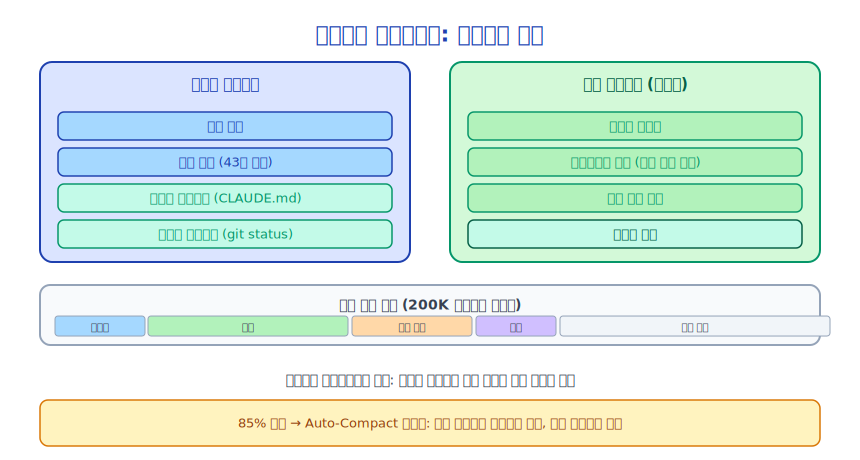

# 제12장: 컨텍스트 엔지니어링(Context Engineering)이란 무엇인가

> "컨텍스트가 전부입니다. 컨텍스트 없이는 말과 행동이 아무런 의미를 갖지 못합니다."
> —— Gregory Bateson

---

## 12.1 사고 실험

새로운 직원을 채용했다고 가정해 봅시다. 첫날부터 아무런 설명 없이 복잡한 프로젝트에 투입한다면 어떨까요?

- 프로젝트 배경을 알려주지 않음
- 코딩 표준을 알려주지 않음
- 팀 컨벤션을 알려주지 않음
- 현재 상태를 알려주지 않음

일은 할 수 있겠지만, 효율은 극히 낮고 오류도 많이 발생할 것입니다.

이제 다른 접근 방식을 시도해 봅시다. 프로젝트 배경, 기술 스택, 코딩 표준, 자주 발생하는 문제, 현재 작업 현황이 담긴 상세한 온보딩 문서를 제공한다면 어떨까요?

같은 사람, 같은 능력이지만 컨텍스트가 있으면 업무 품질이 크게 달라집니다.

**이것이 컨텍스트 엔지니어링(Context Engineering)의 핵심 아이디어입니다. AI에게 올바른 컨텍스트를 제공하는 것이 AI 출력 품질을 결정하는 핵심 요소입니다.**

---

## 12.2 컨텍스트 엔지니어링(Context Engineering)이란

컨텍스트 엔지니어링(Context Engineering)이란 **AI 모델의 입력 컨텍스트를 체계적으로 설계, 구성, 관리하여** 모델 출력 품질을 극대화하는 것을 의미합니다.

세 가지 차원을 포함합니다.

**콘텐츠 차원**: AI에게 어떤 정보를 줄 것인가?
- 프로젝트 배경 (CLAUDE.md)
- 현재 상태 (git status, 파일 내용)
- 이력 기록 (대화 히스토리)
- 외부 지식 (문서, 검색 결과)

**구조 차원**: 이 정보를 어떻게 구성할 것인가?
- 시스템 프롬프트(System Prompt) vs 사용자 메시지
- 정보 순서와 우선순위
- 형식 (일반 텍스트, Markdown, XML)

**관리 차원**: 제한된 토큰(Token) 윈도우 내에서 정보를 어떻게 관리할 것인가?
- 히스토리 압축 (자동 컴팩트(Auto-Compact))
- 관련 없는 정보 필터링
- 관련 정보 동적 주입

---

## 12.3 컨텍스트 엔지니어링(Context Engineering)이 중요한 이유

LLM의 능력은 고정되어 있지만(학습에 의해 결정됨), 출력 품질은 가변적입니다(컨텍스트에 의해 결정됨).

간단한 실험을 해봅시다.

```
# 컨텍스트 없음
사용자: 이 버그를 수정해 주세요

Claude: 더 많은 정보가 필요합니다...
```

```
# 컨텍스트 있음
시스템 프롬프트: 당신은 React 애플리케이션을 유지 관리하는 TypeScript 전문가입니다.
          코드 표준: 함수형 컴포넌트를 사용하고, any 타입을 피하세요.
사용자: 이 버그를 수정해 주세요
[오류 메시지와 관련 코드 첨부]

Claude: [정확한 수정 방법을 직접 제시]
```

같은 모델, 같은 질문이지만 컨텍스트가 있으면 출력 품질이 완전히 달라집니다.

---

## 12.4 Claude Code의 컨텍스트 아키텍처

Claude Code의 컨텍스트는 여러 레이어로 구성됩니다.



각 레이어는 고유한 역할을 담당하며, 어느 레이어 하나라도 빠지면 출력 품질이 저하됩니다.

---

## 12.5 컨텍스트의 토큰(Token) 경제학

Claude의 컨텍스트 윈도우(Context Window)는 제한되어 있습니다(현재 최대 약 200K 토큰(Token)). 모든 토큰(Token)은 소중한 자원입니다.

**토큰(Token) 할당**:

```
전체 토큰(Token) 예산 (200K)
├── 시스템 프롬프트(System Prompt): ~5K (도구 정의 + 핵심 지침)
├── 사용자 컨텍스트 (CLAUDE.md): ~2K (파일 크기에 따라 다름)
├── 시스템 컨텍스트 (git status 등): ~1K
├── 대화 히스토리: ~100K (대화가 진행될수록 증가)
├── 현재 도구 결과: ~50K (크기가 클 수 있음)
└── 출력 예산: ~40K (Claude의 응답)
```

대화 히스토리가 한계에 가까워지면 압축(컴팩트(Compact))이 필요합니다. 이것이 컨텍스트 엔지니어링(Context Engineering)에서 가장 복잡한 문제 중 하나입니다.

---

## 12.6 컨텍스트 품질의 네 가지 차원

**관련성**: 컨텍스트가 현재 작업과 관련이 있는가?
- 좋음: 현재 파일 내용, 관련 오류 메시지
- 나쁨: 관련 없는 대화 히스토리, 무관한 파일 내용

**정확성**: 컨텍스트가 현재 상태를 정확하게 반영하는가?
- 좋음: 최신 git status, 실시간 파일 내용
- 나쁨: 오래된 정보, 캐시된 이전 상태

**완전성**: 컨텍스트에 필요한 정보가 모두 포함되어 있는가?
- 좋음: 관련 코드, 설정, 제약 조건을 모두 포함
- 나쁨: 핵심 정보 누락으로 Claude가 잘못된 가정을 하게 됨

**간결성**: 컨텍스트가 중복 없이 간결한가?
- 좋음: 정제된 프로젝트 설명, 핵심 정보 요약
- 나쁨: 장황한 문서, 반복되는 정보

---

## 12.7 Claude Code의 컨텍스트 엔지니어링(Context Engineering) 실천

Claude Code는 컨텍스트 엔지니어링(Context Engineering)에 대한 광범위한 엔지니어링 작업을 수행했습니다.

**git status 자동 주입** (`src/context.ts`):
```typescript
// 각 대화 시작 시 git status를 자동으로 가져옴
const gitStatus = await getGitStatus()
// 포함 내용: 현재 브랜치, 메인 브랜치, 최근 5개 커밋, 작업 트리 상태
```

**CLAUDE.md 자동 검색**:
```typescript
// 현재 디렉터리에서 위로 올라가며 CLAUDE.md 검색
// 다중 레벨 디렉터리 지원 (프로젝트 레벨, 하위 디렉터리 레벨)
const claudeMds = getClaudeMds(await getMemoryFiles())
```

**자동 컴팩트(Auto-Compact)**:
```typescript
// 토큰(Token) 사용량이 임계값을 초과하면 자동으로 압축
if (isAutoCompactEnabled() && tokenUsage > threshold) {
  await compactConversation(messages)
}
```

**동적 메모리(Memory) 주입**:
```typescript
// 현재 작업을 기반으로 관련 메모리(Memory) 파일을 동적으로 로드
const relevantMemories = await findRelevantMemories(currentTask)
```

---

## 12.8 컨텍스트 엔지니어링(Context Engineering) vs 프롬프트 엔지니어링

많은 사람들이 컨텍스트 엔지니어링(Context Engineering)과 프롬프트 엔지니어링을 혼동합니다. 두 가지의 차이점은 다음과 같습니다.

| 차원 | 프롬프트 엔지니어링 | 컨텍스트 엔지니어링(Context Engineering) |
|------|-------------------|---------------------|
| 초점 | 좋은 프롬프트 작성 방법 | 전체 컨텍스트 관리 방법 |
| 범위 | 단일 상호작용 | 전체 세션 생명주기 |
| 동적성 | 정적 (사전 작성) | 동적 (런타임 구성) |
| 엔지니어링 복잡도 | 낮음 | 높음 |
| 영향 범위 | 단일 응답 품질 | 전체 시스템 능력 |

프롬프트 엔지니어링은 컨텍스트 엔지니어링(Context Engineering)의 하위 집합입니다. Claude Code의 엔지니어링 초점은 단순히 좋은 시스템 프롬프트(System Prompt)를 작성하는 것이 아니라 컨텍스트 엔지니어링(Context Engineering)에 있습니다.

---

## 12.9 요약

컨텍스트 엔지니어링(Context Engineering)은 AI 에이전트 시스템 엔지니어링의 핵심 과제 중 하나입니다.

핵심 인사이트:
- **컨텍스트가 출력 품질을 결정합니다**, 모델 능력만이 아닙니다
- **컨텍스트는 제한된 자원입니다**, 신중한 관리가 필요합니다
- **컨텍스트는 동적으로 구성되어야 합니다**, 정적 설정이 아닙니다
- **컨텍스트 엔지니어링(Context Engineering)은 시스템 엔지니어링입니다**, 단순히 프롬프트 작성이 아닙니다

다음 세 챕터에서는 Claude Code의 구체적인 구현 방식인 시스템 프롬프트(System Prompt) 구성, CLAUDE.md 설계, 자동 컴팩트(Auto-Compact) 메커니즘을 자세히 살펴보겠습니다.

---

*다음 챕터: [시스템 프롬프트(System Prompt) 구성의 기술](./13-system-prompt_ko.md)*
