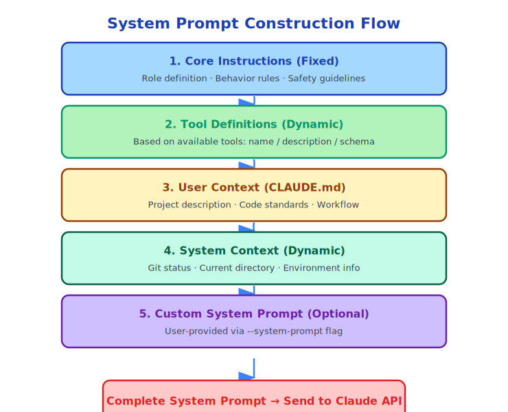

# Chapter 13: The Art of System Prompt Construction

> The system prompt is AI's "constitution" — it defines AI's role, capabilities, and boundaries.

---

## 13.1 The Role of System Prompts

The system prompt is the "background setting" passed to Claude with every API call. It tells Claude:

- Who it is (role)
- What it can do (capabilities)
- What it cannot do (limitations)
- How it should act (behavioral guidelines)

The quality of the system prompt directly determines Claude's behavioral quality. A good system prompt enables Claude to understand tasks more accurately, use tools more reasonably, and execute operations more safely.

---

## 13.2 Claude Code's System Prompt Construction Process

The system prompt is not static but dynamically constructed at the start of each conversation:



Code implementation (simplified):

```typescript
// Simplified system prompt construction process
async function fetchSystemPromptParts(config) {
  const parts = []

  // 1. Core instructions (fixed part)
  parts.push(getCoreInstructions())

  // 2. Tool definitions (dynamically generated based on available tools)
  parts.push(getToolDefinitions(config.tools))

  // 3. User context (CLAUDE.md content)
  const userContext = await getUserContext()
  if (userContext.claudeMd) {
    parts.push(formatClaudeMd(userContext.claudeMd))
  }

  // 4. System context (git status etc)
  const systemContext = await getSystemContext()
  if (systemContext.gitStatus) {
    parts.push(formatGitStatus(systemContext.gitStatus))
  }

  // 5. Custom system prompt (passed via --system-prompt)
  if (config.customSystemPrompt) {
    parts.push(config.customSystemPrompt)
  }

  // 6. Append system prompt (passed via --append-system-prompt)
  if (config.appendSystemPrompt) {
    parts.push(config.appendSystemPrompt)
  }

  return parts.join('\n\n')
}
```

---

## 13.3 Core Instructions Design

Claude Code's core instructions define Claude's basic behavioral guidelines as a programming assistant. While the complete system prompt is private, several key principles can be inferred from the source code:

**Safety First**:
```
Before executing any potentially destructive operation, user confirmation must be obtained.
Do not execute operations that may cause data loss unless explicitly requested by the user.
```

**Transparent Operations**:
```
When executing tool calls, clearly explain what you're doing and why.
If uncertain, ask first rather than guess.
```

**Code Quality**:
```
Follow the project's coding standards (read from CLAUDE.md).
Prioritize modifying the minimum necessary code, avoid unnecessary refactoring.
```

**Error Handling**:
```
When tool execution fails, analyze the error cause and try alternative approaches.
Don't blindly retry without understanding the error.
```

---

## 13.4 The Role of Tool Definitions in System Prompts

Tool definitions are the largest part of the system prompt. Each tool's `name`, `description`, and `inputSchema` are serialized into the system prompt:

```json
{
  "name": "FileEditTool",
  "description": "Perform precise string replacement in files...",
  "input_schema": {
    "type": "object",
    "properties": {
      "file_path": {
        "type": "string",
        "description": "Path to the file to edit"
      },
      "old_string": {
        "type": "string",
        "description": "Content to replace (must exist uniquely in file)"
      },
      "new_string": {
        "type": "string",
        "description": "Replacement content"
      }
    },
    "required": ["file_path", "old_string", "new_string"]
  }
}
```

Claude understands each tool's purpose and parameter format through these definitions. The quality of tool descriptions directly affects Claude's tool selection accuracy.

---

## 13.5 System Prompt Caching Strategy

Claude API supports prompt caching: if the system prompt hasn't changed, the API caches it, reducing token consumption and latency.

Claude Code leverages this feature:

```typescript
// Stable part of system prompt (cacheable)
const stableSystemPrompt = [
  coreInstructions,    // Almost never changes
  toolDefinitions,     // Doesn't change when toolset is stable
]

// Dynamic part of system prompt (not cached)
const dynamicSystemPrompt = [
  gitStatus,           // May differ each conversation
  claudeMdContent,     // Changes when file is modified
]
```

By placing the stable part first and dynamic part last, cache hit rate is maximized.

---

## 13.6 System Prompt Injection (Cache Busting)

There's an interesting feature in `src/context.ts`:

```typescript
// System prompt injection (ant-only, for debugging)
let systemPromptInjection: string | null = null

export function setSystemPromptInjection(value: string | null): void {
  systemPromptInjection = value
  // Clear context cache, force rebuild
  getUserContext.cache.clear?.()
  getSystemContext.cache.clear?.()
}
```

This feature allows Anthropic internal engineers to modify the system prompt without restarting, for debugging and experimentation. The comment clearly marks it as `ant-only` (Anthropic internal use only) and `ephemeral debugging state` (temporary debugging state).

This is good engineering practice: **debugging features should be clearly marked to prevent misuse**.

---

## 13.7 Multi-layer System Prompt Priority

When there are multiple system prompt sources, the priority is:

```
Priority (high to low):
1. --append-system-prompt (user append, highest priority)
2. --system-prompt (user custom, completely replaces default prompt)
3. CLAUDE.md (project-level configuration)
4. Default system prompt (Claude Code built-in)
```

Note the difference between `--system-prompt` and `--append-system-prompt`:
- `--system-prompt`: **Replaces** default system prompt (for complete customization)
- `--append-system-prompt`: **Appends** to default system prompt (for extending defaults)

---

## 13.8 System Prompt Length Trade-offs

The longer the system prompt, the more complete Claude's understanding, but it also consumes more tokens.

Claude Code's trade-off strategy:

**Core instructions**: Keep concise, include only the most important behavioral guidelines.

**Tool definitions**: Cannot be compressed (Claude needs complete schema), but can reduce length by registering only currently needed tools.

**CLAUDE.md**: User-controlled, recommended to keep under 2000 words.

**git status**: Has a 2000 character truncation limit:
```typescript
const MAX_STATUS_CHARS = 2000
const truncatedStatus = status.length > MAX_STATUS_CHARS
  ? status.substring(0, MAX_STATUS_CHARS) +
    '\n... (truncated. Run "git status" for full output)'
  : status
```

---

## 13.9 Testing System Prompts

How to test system prompt quality? Claude Code uses several methods:

**Behavioral testing**: Given specific input, verify Claude's behavior meets expectations.

**Tool selection testing**: Given specific tasks, verify Claude selects the correct tools.

**Safety testing**: Try to make Claude execute dangerous operations, verify it correctly refuses.

**Regression testing**: After modifying system prompt, run complete test suite to ensure no existing behavior is broken.

---

## 13.10 Summary

System prompt construction is both an art and engineering:

- **Dynamic construction**: Dynamically generated based on current state, not static configuration
- **Layered design**: Core instructions + tool definitions + user context + system context
- **Cache optimization**: Stable parts first, maximize cache hits
- **Length trade-offs**: Balance between completeness and token consumption
- **Extensible**: Supports user customization and appending

A good system prompt is the foundation of Claude Code's high-quality output.

---

*Next chapter: [Memory and CLAUDE.md](./14-memory-claudemd_en.md)*
