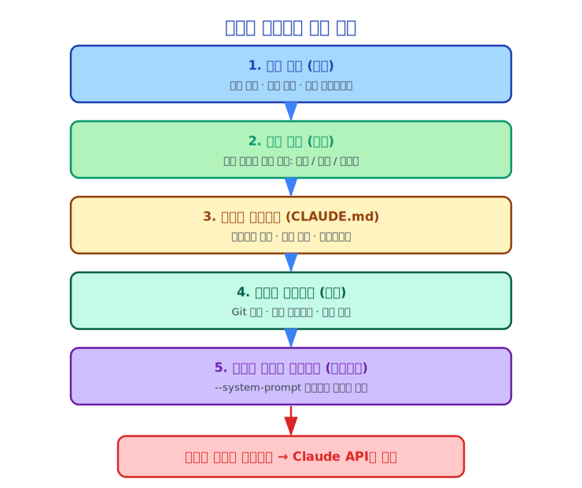

# 제13장: 시스템 프롬프트(System Prompt) 구성의 기술

> 시스템 프롬프트(System Prompt)는 AI의 "헌법"입니다 — AI의 역할, 능력, 경계를 정의합니다.

---

## 13.1 시스템 프롬프트(System Prompt)의 역할

시스템 프롬프트(System Prompt)는 매 API 호출 시 Claude에게 전달되는 "배경 설정"입니다. Claude에게 다음을 알려줍니다.

- 자신이 누구인지 (역할)
- 무엇을 할 수 있는지 (능력)
- 무엇을 할 수 없는지 (제한)
- 어떻게 행동해야 하는지 (행동 지침)

시스템 프롬프트(System Prompt)의 품질이 Claude의 행동 품질을 직접적으로 결정합니다. 좋은 시스템 프롬프트(System Prompt)는 Claude가 작업을 더 정확하게 이해하고, 도구를 더 합리적으로 사용하며, 작업을 더 안전하게 수행할 수 있게 합니다.

---

## 13.2 Claude Code의 시스템 프롬프트(System Prompt) 구성 과정

시스템 프롬프트(System Prompt)는 정적이지 않고 매 대화 시작 시 동적으로 구성됩니다.



코드 구현 (단순화):

```typescript
// 단순화된 시스템 프롬프트(System Prompt) 구성 과정
async function fetchSystemPromptParts(config) {
  const parts = []

  // 1. 핵심 지침 (고정 부분)
  parts.push(getCoreInstructions())

  // 2. 도구 정의 (사용 가능한 도구에 따라 동적 생성)
  parts.push(getToolDefinitions(config.tools))

  // 3. 사용자 컨텍스트 (CLAUDE.md 내용)
  const userContext = await getUserContext()
  if (userContext.claudeMd) {
    parts.push(formatClaudeMd(userContext.claudeMd))
  }

  // 4. 시스템 컨텍스트 (git status 등)
  const systemContext = await getSystemContext()
  if (systemContext.gitStatus) {
    parts.push(formatGitStatus(systemContext.gitStatus))
  }

  // 5. 커스텀 시스템 프롬프트(System Prompt) (--system-prompt로 전달)
  if (config.customSystemPrompt) {
    parts.push(config.customSystemPrompt)
  }

  // 6. 추가 시스템 프롬프트(System Prompt) (--append-system-prompt로 전달)
  if (config.appendSystemPrompt) {
    parts.push(config.appendSystemPrompt)
  }

  return parts.join('\n\n')
}
```

---

## 13.3 핵심 지침 설계

Claude Code의 핵심 지침은 프로그래밍 어시스턴트로서 Claude의 기본적인 행동 지침을 정의합니다. 전체 시스템 프롬프트(System Prompt)는 비공개이지만, 소스 코드에서 여러 핵심 원칙을 유추할 수 있습니다.

**안전 최우선**:
```
잠재적으로 파괴적인 작업을 실행하기 전에 반드시 사용자 확인을 받아야 합니다.
사용자가 명시적으로 요청하지 않는 한 데이터 손실을 유발할 수 있는 작업을 실행하지 않습니다.
```

**투명한 작업**:
```
도구 호출을 실행할 때 무엇을 하고 있는지, 왜 하는지 명확하게 설명합니다.
불확실한 경우 추측하기보다 먼저 질문합니다.
```

**코드 품질**:
```
프로젝트의 코딩 표준을 따릅니다 (CLAUDE.md에서 읽음).
최소한의 필요한 코드만 수정하는 것을 우선시하고, 불필요한 리팩토링을 피합니다.
```

**오류 처리**:
```
도구 실행이 실패하면 오류 원인을 분석하고 대안적인 접근 방식을 시도합니다.
오류를 이해하지 못한 채 맹목적으로 재시도하지 않습니다.
```

---

## 13.4 시스템 프롬프트(System Prompt)에서 도구 정의의 역할

도구 정의는 시스템 프롬프트(System Prompt)에서 가장 큰 부분을 차지합니다. 각 도구의 `name`, `description`, `inputSchema`가 시스템 프롬프트(System Prompt)에 직렬화됩니다.

```json
{
  "name": "FileEditTool",
  "description": "파일에서 정확한 문자열 교체를 수행합니다...",
  "input_schema": {
    "type": "object",
    "properties": {
      "file_path": {
        "type": "string",
        "description": "편집할 파일 경로"
      },
      "old_string": {
        "type": "string",
        "description": "교체할 내용 (파일 내에 고유하게 존재해야 함)"
      },
      "new_string": {
        "type": "string",
        "description": "교체될 내용"
      }
    },
    "required": ["file_path", "old_string", "new_string"]
  }
}
```

Claude는 이러한 정의를 통해 각 도구의 목적과 파라미터 형식을 이해합니다. 도구 설명의 품질이 Claude의 도구 선택 정확도에 직접적인 영향을 미칩니다.

---

## 13.5 시스템 프롬프트(System Prompt) 캐싱 전략

Claude API는 프롬프트 캐싱을 지원합니다. 시스템 프롬프트(System Prompt)가 변경되지 않으면 API가 이를 캐시하여 토큰(Token) 소비와 지연 시간을 줄입니다.

Claude Code는 이 기능을 활용합니다.

```typescript
// 시스템 프롬프트(System Prompt)의 안정적인 부분 (캐시 가능)
const stableSystemPrompt = [
  coreInstructions,    // 거의 변경되지 않음
  toolDefinitions,     // 도구 세트가 안정적이면 변경되지 않음
]

// 시스템 프롬프트(System Prompt)의 동적 부분 (캐시 불가)
const dynamicSystemPrompt = [
  gitStatus,           // 매 대화마다 다를 수 있음
  claudeMdContent,     // 파일이 수정되면 변경됨
]
```

안정적인 부분을 앞에, 동적 부분을 뒤에 배치함으로써 캐시 적중률을 극대화합니다.

---

## 13.6 시스템 프롬프트(System Prompt) 주입 (캐시 무효화)

`src/context.ts`에는 흥미로운 기능이 있습니다.

```typescript
// 시스템 프롬프트(System Prompt) 주입 (Anthropic 내부용, 디버깅 목적)
let systemPromptInjection: string | null = null

export function setSystemPromptInjection(value: string | null): void {
  systemPromptInjection = value
  // 컨텍스트 캐시를 초기화하고 강제 재구성
  getUserContext.cache.clear?.()
  getSystemContext.cache.clear?.()
}
```

이 기능은 Anthropic 내부 엔지니어들이 재시작 없이 시스템 프롬프트(System Prompt)를 수정할 수 있도록 하여 디버깅과 실험에 활용됩니다. 주석에 `ant-only` (Anthropic 내부 전용) 및 `ephemeral debugging state` (임시 디버깅 상태)로 명확하게 표시되어 있습니다.

이것은 좋은 엔지니어링 관행입니다. **디버깅 기능은 오용을 방지하기 위해 명확하게 표시되어야 합니다.**

---

## 13.7 다중 레이어 시스템 프롬프트(System Prompt) 우선순위

여러 시스템 프롬프트(System Prompt) 소스가 있을 경우 우선순위는 다음과 같습니다.

```
우선순위 (높음에서 낮음):
1. --append-system-prompt (사용자 추가, 최고 우선순위)
2. --system-prompt (사용자 커스텀, 기본 프롬프트를 완전히 대체)
3. CLAUDE.md (프로젝트 레벨 설정)
4. 기본 시스템 프롬프트(System Prompt) (Claude Code 내장)
```

`--system-prompt`와 `--append-system-prompt`의 차이에 주의하십시오.
- `--system-prompt`: 기본 시스템 프롬프트(System Prompt)를 **대체**합니다 (완전한 커스터마이징용)
- `--append-system-prompt`: 기본 시스템 프롬프트(System Prompt)에 **추가**합니다 (기본값 확장용)

---

## 13.8 시스템 프롬프트(System Prompt) 길이 트레이드오프

시스템 프롬프트(System Prompt)가 길수록 Claude의 이해도는 높아지지만, 토큰(Token) 소비도 많아집니다.

Claude Code의 트레이드오프 전략:

**핵심 지침**: 간결하게 유지하고, 가장 중요한 행동 지침만 포함합니다.

**도구 정의**: 압축할 수 없습니다 (Claude에게 완전한 스키마가 필요함). 하지만 현재 필요한 도구만 등록하여 길이를 줄일 수 있습니다.

**CLAUDE.md**: 사용자가 제어하며, 2000단어 이하로 유지하는 것을 권장합니다.

**git status**: 2000자 잘라내기 제한이 있습니다.
```typescript
const MAX_STATUS_CHARS = 2000
const truncatedStatus = status.length > MAX_STATUS_CHARS
  ? status.substring(0, MAX_STATUS_CHARS) +
    '\n... (잘림. 전체 출력은 "git status"를 실행하세요)'
  : status
```

---

## 13.9 시스템 프롬프트(System Prompt) 테스트

시스템 프롬프트(System Prompt) 품질을 어떻게 테스트할까요? Claude Code는 여러 방법을 사용합니다.

**행동 테스트**: 특정 입력이 주어졌을 때 Claude의 행동이 기대를 충족하는지 검증합니다.

**도구 선택 테스트**: 특정 작업이 주어졌을 때 Claude가 올바른 도구를 선택하는지 검증합니다.

**안전 테스트**: Claude가 위험한 작업을 실행하도록 유도하고, 올바르게 거부하는지 검증합니다.

**회귀 테스트**: 시스템 프롬프트(System Prompt) 수정 후 전체 테스트 스위트를 실행하여 기존 동작이 깨지지 않았는지 확인합니다.

---

## 13.10 요약

시스템 프롬프트(System Prompt) 구성은 예술이자 엔지니어링입니다.

- **동적 구성**: 정적 설정이 아닌 현재 상태에 따라 동적으로 생성됨
- **레이어드 설계**: 핵심 지침 + 도구 정의 + 사용자 컨텍스트 + 시스템 컨텍스트
- **캐시 최적화**: 안정적인 부분을 앞에 배치하여 캐시 적중률 극대화
- **길이 트레이드오프**: 완전성과 토큰(Token) 소비 사이의 균형
- **확장 가능**: 사용자 커스터마이징 및 추가 지원

좋은 시스템 프롬프트(System Prompt)는 Claude Code 고품질 출력의 기반입니다.

---

*다음 챕터: [메모리(Memory)와 CLAUDE.md](./14-memory-claudemd_ko.md)*
