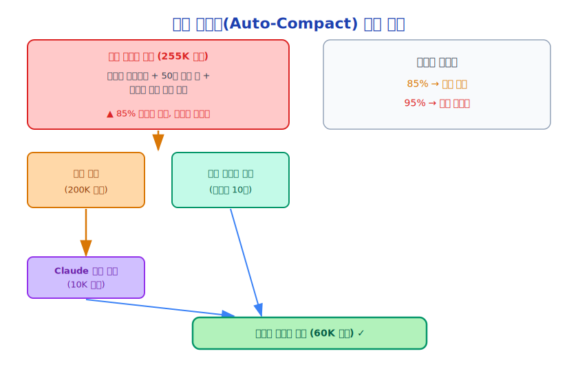

# 제15장: 컨텍스트 압축(Context Compression) (자동 컴팩트(Auto-Compact))

> 망각은 지능의 일부입니다. 무엇을 기억하고 무엇을 잊을지 아는 것이 컨텍스트 관리의 핵심입니다.

---

## 15.1 컨텍스트 윈도우(Context Window)의 한계

Claude의 컨텍스트 윈도우(Context Window)는 제한되어 있습니다. 대화가 진행될수록 메시지 목록이 계속 증가합니다.

```
대화 시작:
[시스템 프롬프트(System Prompt) 5K] + [사용자 메시지 0.1K] = 5.1K 토큰(Token)

10회 대화 후:
[시스템 프롬프트(System Prompt) 5K] + [10회 × 평균 5K] = 55K 토큰(Token)

50회 대화 후 (다수의 도구 호출 포함):
[시스템 프롬프트(System Prompt) 5K] + [50회 × 평균 5K] = 255K 토큰(Token) → 한계 초과!
```

컨텍스트가 한계에 근접하면 두 가지 선택지가 있습니다.
1. **잘라내기**: 초기 메시지를 삭제 (단순하지만 중요한 정보를 잃음)
2. **압축**: 상세한 히스토리를 요약으로 대체 (복잡하지만 핵심 정보를 유지)

Claude Code는 압축을 선택합니다.

---

## 15.2 자동 컴팩트(Auto-Compact) 트리거 메커니즘

`src/services/compact/autoCompact.ts`는 자동 컴팩트(Auto-Compact) 트리거 로직을 구현합니다.

```typescript
export function calculateTokenWarningState(
  messages: Message[],
  maxTokens: number
): TokenWarningState {
  const currentTokens = estimateTokenCount(messages)
  const ratio = currentTokens / maxTokens

  if (ratio > 0.95) {
    return 'critical'   // 즉시 압축 필요
  } else if (ratio > 0.85) {
    return 'warning'    // 압축 권장
  } else {
    return 'normal'
  }
}

export function isAutoCompactEnabled(): boolean {
  // 사용자 설정 및 환경 변수 확인
  return !isEnvTruthy(process.env.CLAUDE_CODE_DISABLE_AUTO_COMPACT)
}
```

토큰(Token) 사용량이 85%를 초과하면 경고가 표시되고, 95%를 초과하면 강제 압축됩니다.

---

## 15.3 핵심 압축 알고리즘

압축의 핵심 아이디어: **Claude 자신을 사용하여 대화 히스토리를 요약합니다.**



코드 구현:

```typescript
// src/services/compact/compact.ts (단순화)
async function compactConversation(
  messages: Message[],
  systemPrompt: SystemPrompt
): Promise<Message[]> {

  // 1. 압축 경계 찾기 (최근 N개 메시지는 압축하지 않고 유지)
  const { toCompress, toKeep } = splitAtCompactBoundary(messages)

  // 2. Claude를 사용하여 요약 생성
  const summary = await generateSummary(toCompress, systemPrompt)

  // 3. 압축된 메시지 목록 구성
  return [
    // 첫 번째 사용자 메시지로 요약 삽입
    createUserMessage({
      content: `[대화 히스토리 요약]\n${summary}`
    }),
    // 최근 메시지 유지 (완전한 형태로)
    ...toKeep
  ]
}
```

---

## 15.4 요약 생성 전략

요약을 생성할 때 Claude Code는 Claude에게 어떤 정보를 유지해야 하는지 지시합니다.

```
다음 대화 히스토리를 요약해 주세요. 다음 내용을 유지하세요:
1. 완료된 작업과 결과
2. 중요한 결정과 이유
3. 현재 진행 중인 작업 상태
4. 핵심 코드 변경사항 (파일명과 변경 요약)
5. 사용자의 중요한 선호도와 제약

유지할 필요 없는 내용:
- 상세한 도구 호출 출력 (결과만 유지)
- 중간 단계의 상세 과정
- 해결된 오류의 상세 정보
```

이 전략은 요약에 "작업을 계속하는 데 필요한 최소한의 정보"가 포함되도록 보장합니다.

---

## 15.5 압축 경계 선택

모든 메시지를 압축할 수는 없습니다. 일부 메시지는 완전한 형태로 유지되어야 합니다.

```typescript
function splitAtCompactBoundary(messages: Message[]) {
  // 규칙 1: 최근 N개 메시지 유지 (기본값 10개)
  // 규칙 2: 도구 호출 중간에서 압축하지 않음 (도구 호출과 결과는 쌍으로 있어야 함)
  // 규칙 3: thinking 블록이 포함된 메시지를 압축하지 않음 (thinking 블록은 엄격한 위치 규칙이 있음)
  // 규칙 4: 사용자의 최근 명시적 지침 유지

  const KEEP_RECENT = 10
  const boundary = findSafeBoundary(messages, KEEP_RECENT)

  return {
    toCompress: messages.slice(0, boundary),
    toKeep: messages.slice(boundary)
  }
}
```

---

## 15.6 반응형 컴팩트(Reactive Compact): 응답형 압축

토큰(Token) 기반 자동 컴팩트(Auto-Compact) 외에도, Claude Code에는 반응형 컴팩트(Reactive Compact) (`REACTIVE_COMPACT` 기능 플래그)가 있습니다.

```typescript
// API가 prompt_too_long 오류를 반환하면 자동으로 압축 트리거
const reactiveCompact = feature('REACTIVE_COMPACT')
  ? require('./services/compact/reactiveCompact.js')
  : null

// query.ts에서
if (error.type === 'prompt_too_long') {
  if (reactiveCompact) {
    // 압축 후 재시도
    messages = await reactiveCompact.compact(messages)
    continue  // 요청 재시도
  }
}
```

이것은 "방어적" 메커니즘입니다. 자동 컴팩트(Auto-Compact)가 제때 트리거되지 않더라도 API 오류 발생 시 자동으로 복구할 수 있습니다.

---

## 15.7 스닙 컴팩트(Snip Compact): 세밀한 압축

`HISTORY_SNIP` 기능 플래그는 더 세밀한 압축 전략을 활성화합니다.

```typescript
// 전체 히스토리를 압축하는 대신 특정 구간을 "스닙"
// 예시: 완료된 하위 작업의 상세 과정은 스닙하고 결과만 유지
const snipModule = feature('HISTORY_SNIP')
  ? require('./services/compact/snipCompact.js')
  : null
```

스닙 컴팩트(Snip Compact)의 장점:
- 더 많은 유용한 컨텍스트 유지
- 실제로 불필요한 부분만 압축
- 압축된 히스토리가 더 일관성 있음

---

## 15.8 컨텍스트 붕괴(Context Collapse): 극단적 압축

컨텍스트가 극도로 빡빡한 경우 `CONTEXT_COLLAPSE` 기능 플래그가 극단적 압축을 활성화합니다.

```typescript
const contextCollapse = feature('CONTEXT_COLLAPSE')
  ? require('./services/contextCollapse/index.js')
  : null
```

컨텍스트 붕괴(Context Collapse)는 히스토리를 더 공격적으로 압축하여 일부 컨텍스트 완전성을 희생하면서 더 많은 작업 공간을 확보합니다.

---

## 15.9 압축 UI 피드백

압축은 중요한 작업이므로 Claude Code는 사용자에게 명확한 피드백을 제공합니다.

```
⠸ 대화 히스토리 압축 중...

✓ 대화 압축 완료
  원본: 127,432 토큰(Token)
  압축 후: 23,891 토큰(Token)
  절약: 81%

  요약 내용:
  - 완료: UserService 리팩토링 (파일 3개)
  - 완료: 로그인 버그 수정
  - 진행 중: 사용자 권한 시스템 추가
```

이를 통해 사용자는 무슨 일이 있었는지, 압축이 어떤 핵심 정보를 유지했는지 알 수 있습니다.

---

## 15.10 수동 압축: /compact 명령어

사용자가 수동으로 압축을 트리거할 수도 있습니다.

```bash
> /compact
```

수동 압축 사용 사례:
- 큰 작업을 완료한 후 히스토리를 정리하고 새 작업 시작
- 컨텍스트에 더 이상 필요하지 않은 도구 호출 결과가 많을 때
- 컨텍스트를 "리셋"하되 핵심 정보는 유지하고 싶을 때

---

## 15.11 압축의 한계

압축은 만능이 아닙니다. 몇 가지 한계가 있습니다.

**정보 손실**: 요약은 항상 일부 세부 사항을 잃습니다. 후속 작업에 이러한 세부 사항이 필요한 경우 Claude가 파일을 다시 읽어야 할 수 있습니다.

**요약 품질**: 요약 품질은 Claude의 판단에 따라 다릅니다. 때로는 Claude가 중요한 정보를 압축하거나 중요하지 않은 정보를 유지할 수 있습니다.

**압축 비용**: 요약 생성에는 API 호출이 필요하며, 시간과 비용이 발생합니다.

**비가역성**: 압축된 히스토리는 복구할 수 없습니다 (백업하지 않는 한).

---

## 15.12 설계 인사이트: 망각의 기술

자동 컴팩트(Auto-Compact)는 심오한 설계 원칙을 드러냅니다. **지능 시스템은 선택적으로 망각해야 합니다.**

인간의 기억도 이렇게 작동합니다. 우리는 모든 세부 사항을 기억하지 않지만 중요한 것은 기억합니다. 이 선택적 망각을 통해 오래된 정보에 압도되지 않고 새로운 정보를 처리할 수 있습니다.

AI 에이전트 시스템에서 컨텍스트 관리는 핵심 엔지니어링 문제입니다. 자동 컴팩트(Auto-Compact)는 이 문제에 대한 Claude Code의 엔지니어링적 답입니다. **AI를 사용하여 AI의 메모리(Memory)를 관리합니다.**

---

## 15.13 요약

자동 컴팩트(Auto-Compact)는 Claude Code 컨텍스트 엔지니어링(Context Engineering)의 핵심 구성 요소입니다.

- **트리거 메커니즘**: 토큰(Token) 사용량 기반 (85% 경고, 95% 강제)
- **압축 알고리즘**: Claude를 사용하여 요약 생성, 상세 히스토리 대체
- **경계 보호**: 도구 호출 중간에서 압축하지 않음, 최근 메시지 유지
- **다양한 전략**: 자동 컴팩트(Auto-Compact), 반응형 컴팩트(Reactive Compact), 스닙 컴팩트(Snip Compact), 컨텍스트 붕괴(Context Collapse)
- **사용자 가시성**: 압축 과정과 결과가 사용자에게 투명하게 공개됨

---

*다음 챕터: [태스크 시스템 설계](../part6/16-task-system_ko.md)*
