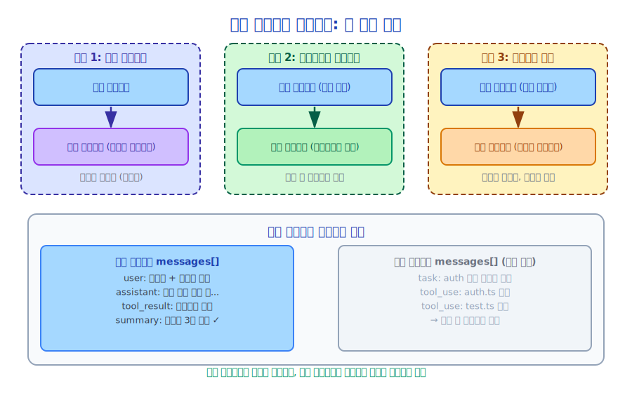

# 제17장: 멀티 에이전트(Multi-Agent) 아키텍처

> Claude 하나도 많은 일을 할 수 있지만, 여러 Claude는 훨씬 더 많은 일을 할 수 있습니다.

---

## 17.1 멀티 에이전트(Multi-Agent)가 필요한 이유

단일 에이전트에는 몇 가지 본질적인 한계가 있습니다.

**컨텍스트 한계**: 에이전트의 컨텍스트 윈도우는 제한되어 있습니다. 극히 큰 태스크(전체 코드베이스 분석, 다수의 파일 처리)는 단일 에이전트가 하나의 컨텍스트에서 완료할 수 없습니다.

**병렬성 한계**: 단일 에이전트는 직렬로 동작하며 한 번에 하나의 작업만 수행할 수 있습니다. 병렬화 가능한 태스크(여러 모듈을 동시에 분석, 여러 테스트 실행)에서는 단일 에이전트가 비효율적입니다.

**전문화 한계**: 태스크마다 다른 전문 지식과 도구 세트가 필요합니다. 범용 에이전트 하나보다 전문화된 에이전트의 조합이 더 효과적입니다.

멀티 에이전트(Multi-Agent) 아키텍처는 이 세 가지 문제를 해결합니다.

---

## 17.2 Claude Code의 세 가지 에이전트 모드



### 모드 1: 서브 에이전트(Sub-Agent) (AgentTool)

부모 에이전트가 자체 컨텍스트와 도구 세트를 가진 독립적인 서브 에이전트(Sub-Agent)를 시작합니다.

```typescript
// 부모 에이전트가 AgentTool 호출
await AgentTool.execute({
  description: 'src/auth/ 모듈 분석',
  prompt: '인증 모듈의 코드 구조, 보안, 잠재적 문제를 상세히 분석',
  subagent_type: 'Explore',  // 코드 탐색에 특화된 에이전트 유형
  model: 'claude-opus-4-6',  // 서브 에이전트에 다른 모델을 지정할 수 있음
}, context)
```

서브 에이전트(Sub-Agent) 특성:
- **독립적 컨텍스트**: 서브 에이전트는 자체 메시지 히스토리를 가지며 부모의 컨텍스트를 소비하지 않음
- **독립적 도구 세트**: 서브 에이전트에 다른 도구를 구성할 수 있음
- **결과 보고**: 서브 에이전트 완료 후 결과가 부모 에이전트에 반환됨

### 모드 2: 백그라운드 에이전트 (run_in_background)

서브 에이전트(Sub-Agent)가 백그라운드에서 실행되며 부모 에이전트는 결과를 기다리지 않습니다.

```typescript
await AgentTool.execute({
  description: '백그라운드 보안 취약점 분석',
  prompt: '...',
  run_in_background: true,  // 백그라운드에서 실행
}, context)
// 즉시 반환되며 서브 에이전트 완료를 기다리지 않음
```

### 모드 3: 워크트리 격리 에이전트

서브 에이전트(Sub-Agent)가 독립적인 Git 워크트리에서 실행되어 완전히 격리됩니다.

```typescript
await AgentTool.execute({
  description: '격리된 브랜치에서 새 기능 실험',
  prompt: '...',
  isolation: 'worktree',  // 독립적인 워크트리 생성
}, context)
```

---

## 17.3 에이전트 유형 시스템

Claude Code는 여러 전문화된 에이전트 유형을 정의합니다.

```typescript
// src/tools/AgentTool/loadAgentsDir.ts
type AgentDefinition = {
  name: string
  description: string
  systemPrompt: string
  tools: string[]        // 이 에이전트가 사용할 수 있는 도구 목록
  model?: string         // 기본 모델
}
```

내장 에이전트 유형:
- **general-purpose**: 완전한 도구 세트를 갖춘 범용 에이전트
- **Explore**: 코드 탐색 전용, 읽기 전용 도구 (쓰기 권한 없음)
- **Plan**: 계획 수립 전용, 계획만 생성하고 실행 불가

사용자는 `.claude/agents/` 디렉토리에 커스텀 에이전트 유형을 정의할 수도 있습니다.

---

## 17.4 팀 협업 모드

`TeamCreateTool`과 `SendMessageTool`은 더 복잡한 멀티 에이전트(Multi-Agent) 협업을 구현합니다.

```typescript
// 에이전트 팀 생성
await TeamCreateTool.execute({
  members: [
    { name: 'architect', role: '시스템 아키텍트, 설계 담당' },
    { name: 'developer', role: '개발자, 구현 담당' },
    { name: 'reviewer', role: '코드 리뷰어, 품질 관리 담당' },
  ]
}, context)

// 에이전트 간 통신
await SendMessageTool.execute({
  to: 'developer',
  message: '아키텍처 계획이 확정되었습니다. UserService 구현을 시작해주세요'
}, context)
```

팀 모드는 다중 역할 협업이 필요한 복잡한 태스크에 적합합니다.
- 아키텍트가 설계하고, 개발자가 구현하고, 리뷰어가 검토
- 프론트엔드와 백엔드 에이전트가 병렬 개발
- 테스트 에이전트와 개발 에이전트가 협업

---

## 17.5 에이전트 간 컨텍스트 공유

멀티 에이전트(Multi-Agent) 시스템은 핵심 문제에 직면합니다. **에이전트들이 어떻게 정보를 공유하는가?**

Claude Code는 여러 메커니즘을 사용합니다.

**파일 시스템 공유**: 가장 단순한 방법으로, 에이전트들이 파일을 읽고 씀으로써 정보를 교환합니다.

```
에이전트 A 쓰기: /tmp/analysis_result.md
에이전트 B 읽기: /tmp/analysis_result.md
```

**메시지 전달**: `SendMessageTool`을 통한 직접 메시지 전달.

**태스크 출력**: 부모 에이전트가 `TaskOutputTool`을 통해 서브 에이전트(Sub-Agent) 출력을 읽음.

**공유 상태**: `in_process_teammate` 유형 에이전트는 동일한 AppState를 공유함.

---

## 17.6 에이전트 컬러 시스템

Claude Code에는 흥미로운 설계가 있습니다. 각 에이전트는 색상 식별자를 가집니다 (`src/tools/AgentTool/agentColorManager.ts`).

```typescript
type AgentColorName =
  | 'blue' | 'green' | 'yellow' | 'red'
  | 'cyan' | 'magenta' | 'white'
```

UI에서 서로 다른 에이전트의 출력은 다른 색상으로 표시되어 사용자가 어느 에이전트가 말하는지 즉시 구분할 수 있습니다.

```
[파랑] 메인 에이전트: 이 프로젝트를 분석하겠습니다...
[초록] 서브 에이전트(Sub-Agent) (Explore): TypeScript 파일 47개 발견...
[노랑] 서브 에이전트(Sub-Agent) (Plan): 권장 리팩토링 접근 방식은...
```

이는 작은 세부 사항이지만 멀티 에이전트(Multi-Agent) 관측 가능성에 중요합니다.

---

## 17.7 에이전트 리소스 한계

에이전트가 통제 불능으로 실행되는 것을 방지하기 위해 Claude Code에는 리소스 한계가 있습니다.

```typescript
type QueryEngineConfig = {
  maxTurns?: number        // 최대 턴 수 (무한 루프 방지)
  maxBudgetUsd?: number    // 최대 비용 (예상치 못한 고액 청구 방지)
  taskBudget?: { total: number }  // 토큰 예산
}
```

부모 에이전트는 서브 에이전트(Sub-Agent)에 더 엄격한 한계를 설정할 수 있습니다.

```typescript
// 서브 에이전트는 10턴만 허용, 최대 비용 $0.5
await AgentTool.execute({
  prompt: '...',
  maxTurns: 10,
  maxBudgetUsd: 0.5,
}, context)
```

---

## 17.8 멀티 에이전트(Multi-Agent) 디버깅 과제

멀티 에이전트(Multi-Agent) 시스템 디버깅은 단일 에이전트보다 훨씬 복잡합니다.

**문제 1: 어느 에이전트에 문제가 있는가?**
해결책: 각 에이전트는 고유한 ID와 색상을 가지며, 로그에 에이전트 출처가 표시됩니다.

**문제 2: 에이전트 간 통신이 올바른가?**
해결책: `SendMessageTool` 도구 호출(Tool Call)이 대화 히스토리에 기록되어 추적 가능합니다.

**문제 3: 서브 에이전트(Sub-Agent)의 컨텍스트는 무엇인가?**
해결책: 서브 에이전트의 전체 대화 히스토리가 태스크 출력 파일에 저장됩니다.

**문제 4: 에이전트가 루핑하고 있는가?**
해결책: `maxTurns` 한계가 무한 루프를 방지하며, 초과 시 자동으로 종료됩니다.

---

## 17.9 멀티 에이전트(Multi-Agent) 적합 사례

멀티 에이전트(Multi-Agent)는 만능 해결책이 아니며 적합한 사용 사례가 있습니다.

**멀티 에이전트(Multi-Agent)에 적합한 경우**:
- 태스크를 독립적인 서브태스크로 명확하게 분해할 수 있는 경우
- 서브태스크가 병렬로 실행 가능한 경우
- 서로 다른 서브태스크에 다른 전문 지식이 필요한 경우
- 태스크가 단일 컨텍스트 윈도우를 초과하는 경우

**멀티 에이전트(Multi-Agent)에 적합하지 않은 경우**:
- 태스크가 순차 실행에 크게 의존하는 경우
- 서브태스크 간 복잡한 의존성이 있는 경우
- 태스크가 단순하여 멀티 에이전트 조율 오버헤드가 이점을 초과하는 경우

---

## 17.10 요약

Claude Code의 멀티 에이전트(Multi-Agent) 아키텍처는 세 가지 협업 모드를 제공합니다.

- **서브 에이전트(Sub-Agent)**: 독립적 컨텍스트, 결과를 부모 에이전트에 보고
- **백그라운드 에이전트**: 비동기 실행, 부모 에이전트를 블로킹하지 않음
- **팀 협업**: 메시지 전달을 통한 멀티 에이전트 협업

핵심 설계: 컬러 시스템(관측 가능성), 리소스 한계(안전성), 다양한 공유 메커니즘(유연성).

---

*다음 장: [코디네이터(Coordinator) 패턴](./18-coordinator_ko.md)*
