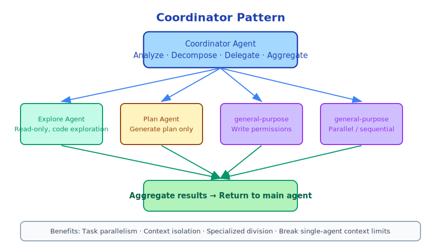

# Chapter 18: Coordinator Pattern

> The coordinator is the "conductor" of multi-agent systems — it doesn't play, but decides who plays what.

---

## 18.1 What is the Coordinator Pattern

The Coordinator Pattern is an architectural pattern in multi-agent systems:



The coordinator itself doesn't execute specific work, but is responsible for **task decomposition, agent scheduling, and result integration**.

---

## 18.2 Claude Code's Coordinator Implementation

`src/coordinator/coordinatorMode.ts` implements the coordinator pattern:

```typescript
// Coordinator's user context
export function getCoordinatorUserContext(
  mcpClients: ReadonlyArray<{ name: string }>,
  scratchpadDir?: string,
): { [k: string]: string } {
  return {
    coordinatorInstructions: buildCoordinatorInstructions(mcpClients, scratchpadDir),
  }
}
```

Coordinator mode is activated through special system prompts, telling Claude its role is coordinator rather than executor.

---

## 18.3 Core Responsibilities of Coordinator

**Task analysis**: Understand user's high-level goals, identify parallelizable subtasks.

```
User: Refactor entire authentication system, including frontend and backend

Coordinator analysis:
- Subtask 1: Analyze existing auth code (can start immediately)
- Subtask 2: Design new auth interface (depends on subtask 1)
- Subtask 3: Implement backend auth (depends on subtask 2)
- Subtask 4: Implement frontend auth (depends on subtask 2, can parallel with subtask 3)
- Subtask 5: Write tests (depends on subtasks 3 and 4)
```

**Agent scheduling**: Select appropriate agent types based on task characteristics.

```
Subtask 1 → Explore agent (read-only, safe)
Subtask 2 → Plan agent (only generates plans)
Subtask 3 → general-purpose agent (has write permission)
Subtask 4 → general-purpose agent (parallel execution)
Subtask 5 → general-purpose agent (depends on previous results)
```

**Result integration**: Collect outputs from various agents, integrate into final result.

---

## 18.4 Scratchpad: Coordinator's Workspace

The coordinator uses a dedicated scratchpad directory to store intermediate results:

```typescript
// Coordinator's scratchpad directory
const scratchpadDir = getScratchpadDir()
// Usually ~/.claude/scratchpad/<session-id>/
```

Scratchpad purposes:
- Store subtask analysis results
- Record task dependencies
- Save intermediate state (prevent losing progress when coordinator context exceeds limit)

---

## 18.5 Coordinator vs Regular Agent

| Dimension | Regular Agent | Coordinator |
|------|---------|--------|
| Main work | Execute specific tasks | Decompose and schedule tasks |
| Tool usage | File operations, Shell, etc. | Mainly AgentTool |
| Context content | Code, file contents | Task plans, agent status |
| Output | Code changes, analysis results | Integrated final report |
| Use cases | Specific coding tasks | Complex multi-step projects |

---

## 18.6 Coordinator Limitations

The coordinator pattern is not a silver bullet:

**Coordination overhead**: The coordinator itself consumes tokens and time. For simple tasks, coordination overhead may exceed benefits.

**Information transfer loss**: Sub-agent results need to be passed to coordinator through files or messages, may lose details.

**Error propagation**: If a sub-agent fails, coordinator needs to handle failure cases, increasing complexity.

**Debugging difficulty**: Multi-layer agent debugging is much more complex than single agent.

---

## 18.7 When to Use Coordinator Pattern

**Suitable for use**:
- Task can be clearly decomposed into independent subtasks
- Subtasks can execute in parallel, saving time
- Task scale exceeds single agent's context window
- Subtasks requiring different expertise

**Not suitable for use**:
- Task is simple, one agent can complete it
- Subtasks are highly coupled, cannot execute independently
- High real-time requirements (coordinator adds latency)

---

## 18.8 Summary

The coordinator pattern is an advanced use of Claude Code's multi-agent architecture:

- **Separation of concerns**: Coordinator handles scheduling, specialized agents handle execution
- **Scratchpad**: Coordinator's workspace, stores intermediate state
- **Use cases**: Complex, decomposable, parallelizable large tasks

The coordinator pattern embodies an important engineering principle: **managing complex systems itself requires specialized roles**.

---

*Next chapter: [MCP Protocol — The Internet of Tools](../part7/19-mcp_en.md)*
