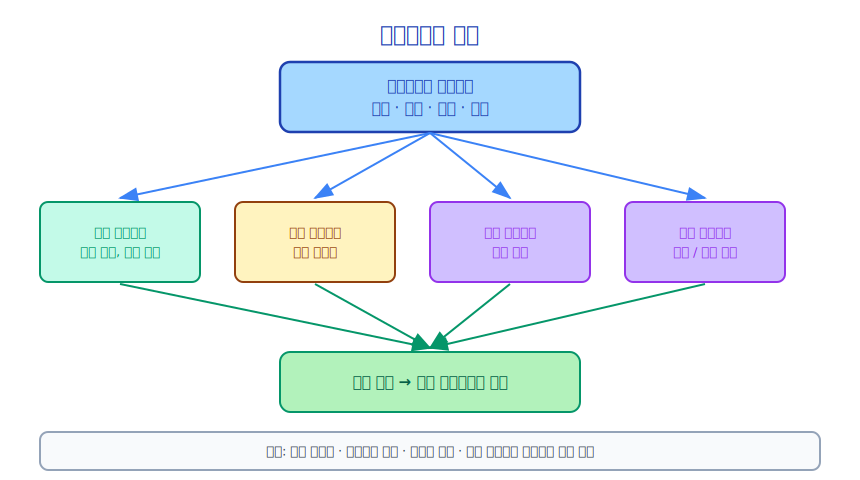

# 제18장: 코디네이터(Coordinator) 패턴

> 코디네이터(Coordinator)는 멀티 에이전트(Multi-Agent) 시스템의 "지휘자"입니다. 직접 연주하지 않고, 누가 무엇을 연주할지 결정합니다.

---

## 18.1 코디네이터(Coordinator) 패턴이란

코디네이터(Coordinator) 패턴은 멀티 에이전트(Multi-Agent) 시스템의 아키텍처 패턴입니다.



코디네이터(Coordinator) 자체는 구체적인 작업을 실행하지 않고 **태스크 분해, 에이전트 스케줄링, 결과 통합**을 담당합니다.

---

## 18.2 Claude Code의 코디네이터(Coordinator) 구현

`src/coordinator/coordinatorMode.ts`는 코디네이터(Coordinator) 패턴을 구현합니다.

```typescript
// 코디네이터의 사용자 컨텍스트
export function getCoordinatorUserContext(
  mcpClients: ReadonlyArray<{ name: string }>,
  scratchpadDir?: string,
): { [k: string]: string } {
  return {
    coordinatorInstructions: buildCoordinatorInstructions(mcpClients, scratchpadDir),
  }
}
```

코디네이터(Coordinator) 모드는 특수한 시스템 프롬프트를 통해 활성화되며, Claude에게 자신의 역할이 실행자가 아닌 코디네이터(Coordinator)임을 알립니다.

---

## 18.3 코디네이터(Coordinator)의 핵심 책임

**태스크 분석**: 사용자의 고수준 목표를 이해하고 병렬화 가능한 서브태스크를 식별합니다.

```
사용자: 프론트엔드와 백엔드를 포함한 전체 인증 시스템을 리팩토링해줘

코디네이터 분석:
- 서브태스크 1: 기존 인증 코드 분석 (즉시 시작 가능)
- 서브태스크 2: 새 인증 인터페이스 설계 (서브태스크 1에 의존)
- 서브태스크 3: 백엔드 인증 구현 (서브태스크 2에 의존)
- 서브태스크 4: 프론트엔드 인증 구현 (서브태스크 2에 의존, 서브태스크 3과 병렬 가능)
- 서브태스크 5: 테스트 작성 (서브태스크 3과 4에 의존)
```

**에이전트 스케줄링**: 태스크 특성에 따라 적절한 에이전트 유형을 선택합니다.

```
서브태스크 1 → Explore 에이전트 (읽기 전용, 안전)
서브태스크 2 → Plan 에이전트 (계획만 생성)
서브태스크 3 → general-purpose 에이전트 (쓰기 권한 있음)
서브태스크 4 → general-purpose 에이전트 (병렬 실행)
서브태스크 5 → general-purpose 에이전트 (이전 결과에 의존)
```

**결과 통합**: 여러 에이전트의 출력을 수집하여 최종 결과로 통합합니다.

---

## 18.4 스크래치패드: 코디네이터(Coordinator)의 작업 공간

코디네이터(Coordinator)는 중간 결과를 저장하기 위해 전용 스크래치패드 디렉토리를 사용합니다.

```typescript
// 코디네이터의 스크래치패드 디렉토리
const scratchpadDir = getScratchpadDir()
// 일반적으로 ~/.claude/scratchpad/<session-id>/
```

스크래치패드 용도:
- 서브태스크 분석 결과 저장
- 태스크 의존성 기록
- 중간 상태 저장 (코디네이터 컨텍스트가 한계를 초과할 때 진행 상황 유실 방지)

---

## 18.5 코디네이터(Coordinator)와 일반 에이전트 비교

| 차원 | 일반 에이전트 | 코디네이터(Coordinator) |
|------|---------|--------|
| 주요 작업 | 구체적인 태스크 실행 | 태스크 분해 및 스케줄링 |
| 도구 사용 | 파일 작업, Shell 등 | 주로 AgentTool |
| 컨텍스트 내용 | 코드, 파일 내용 | 태스크 계획, 에이전트 상태 |
| 출력 | 코드 변경, 분석 결과 | 통합된 최종 보고서 |
| 사용 사례 | 구체적인 코딩 태스크 | 복잡한 다단계 프로젝트 |

---

## 18.6 코디네이터(Coordinator) 패턴의 한계

코디네이터(Coordinator) 패턴은 만능 해결책이 아닙니다.

**조율 오버헤드**: 코디네이터(Coordinator) 자체도 토큰과 시간을 소비합니다. 단순한 태스크에서는 조율 오버헤드가 이점을 초과할 수 있습니다.

**정보 전달 손실**: 서브 에이전트(Sub-Agent) 결과를 파일이나 메시지를 통해 코디네이터(Coordinator)에 전달해야 하므로 세부 사항이 유실될 수 있습니다.

**오류 전파**: 서브 에이전트(Sub-Agent)가 실패하면 코디네이터(Coordinator)가 실패 사례를 처리해야 하므로 복잡성이 증가합니다.

**디버깅 난이도**: 다층 에이전트 디버깅은 단일 에이전트보다 훨씬 복잡합니다.

---

## 18.7 코디네이터(Coordinator) 패턴 사용 시점

**사용에 적합한 경우**:
- 태스크를 독립적인 서브태스크로 명확하게 분해할 수 있는 경우
- 서브태스크를 병렬로 실행하여 시간을 절약할 수 있는 경우
- 태스크 규모가 단일 에이전트의 컨텍스트 윈도우를 초과하는 경우
- 서로 다른 전문 지식이 필요한 서브태스크가 있는 경우

**사용에 적합하지 않은 경우**:
- 태스크가 단순하여 하나의 에이전트로 완료 가능한 경우
- 서브태스크가 강하게 결합되어 독립적으로 실행할 수 없는 경우
- 실시간 요구 사항이 높은 경우 (코디네이터가 지연을 추가함)

---

## 18.8 요약

코디네이터(Coordinator) 패턴은 Claude Code 멀티 에이전트(Multi-Agent) 아키텍처의 고급 활용입니다.

- **관심사 분리**: 코디네이터(Coordinator)는 스케줄링을 담당하고, 전문화된 에이전트는 실행을 담당
- **스크래치패드**: 코디네이터(Coordinator)의 작업 공간으로 중간 상태를 저장
- **사용 사례**: 복잡하고, 분해 가능하며, 병렬화 가능한 대형 태스크

코디네이터(Coordinator) 패턴은 중요한 엔지니어링 원칙을 구현합니다. **복잡한 시스템을 관리하는 것 자체에도 전문화된 역할이 필요합니다**.

---

*다음 장: [MCP(Model Context Protocol) — 도구의 인터넷](../part7/19-mcp_ko.md)*
