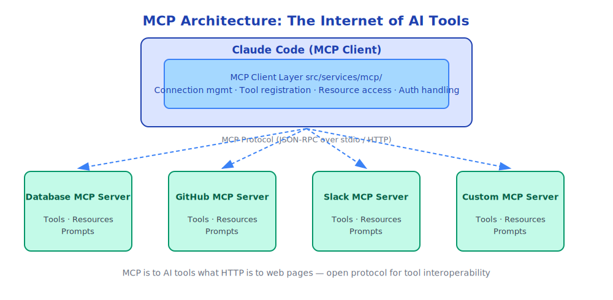
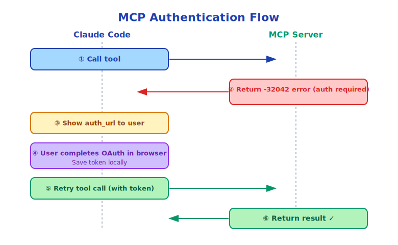

# Chapter 19: MCP Protocol — The Internet of Tools

> MCP is to AI tools what HTTP is to web pages — an open protocol that enables tools to interconnect.

---

## 19.1 What is MCP

MCP (Model Context Protocol) is an open protocol proposed by Anthropic in 2024, defining standard communication methods between AI models and external tools/resources.

Before MCP, each AI tool had its own integration method:
- GitHub Copilot has its own API
- Cursor has its own plugin system
- Claude Code has its own tool definitions

This led to fragmentation: integrations developed for one AI tool couldn't be directly used by another.

MCP's goal: **allow any tool to be used by any MCP-supporting AI**.

---

## 19.2 MCP Architecture



MCP servers can provide three types of resources:
- **Tools**: Functions that can be called by Claude
- **Resources**: Data that can be read by Claude (files, database records, etc.)
- **Prompts**: Predefined prompt templates

---

## 19.3 Claude Code's MCP Client

`src/services/mcp/` implements a complete MCP client:

```typescript
// MCP server connection
type MCPServerConnection = {
  name: string              // Server name
  transport: MCPTransport   // Transport method (stdio or HTTP)
  tools: MCPTool[]          // Tools provided by server
  resources: MCPResource[]  // Resources provided by server
  prompts: MCPPrompt[]      // Prompts provided by server
}

// Connect to MCP server
async function connectMCPServer(config: MCPServerConfig): Promise<MCPServerConnection> {
  const transport = config.type === 'stdio'
    ? new StdioTransport(config.command, config.args)
    : new HTTPTransport(config.url)

  const client = new MCPClient(transport)
  await client.connect()

  return {
    name: config.name,
    transport,
    tools: await client.listTools(),
    resources: await client.listResources(),
    prompts: await client.listPrompts(),
  }
}
```

---

## 19.4 Dynamic Registration of MCP Tools

Tools provided by MCP servers are dynamically registered into Claude Code's tool system:

```typescript
// Wrap MCP tool as Claude Code tool
function wrapMCPTool(mcpTool: MCPTool, server: MCPServerConnection): Tool {
  return {
    name: `mcp__${server.name}__${mcpTool.name}`,  // Namespace to avoid conflicts
    description: mcpTool.description,
    inputSchema: mcpTool.inputSchema,

    async execute(input, context) {
      // Call tool through MCP protocol
      const result = await server.callTool(mcpTool.name, input)
      return { type: 'tool_result', content: result }
    }
  }
}
```

Note the tool name namespace: `mcp__<server-name>__<tool-name>`. This prevents tool name conflicts from different MCP servers.

---

## 19.5 Accessing MCP Resources

MCP resources are accessed through `ListMcpResourcesTool` and `ReadMcpResourceTool`:

```typescript
// List all MCP resources
await ListMcpResourcesTool.execute({
  server_name: 'github'  // Optional, lists all servers' resources if not specified
}, context)
// Returns: [{ uri: 'github://repos/myorg/myrepo', name: 'myrepo', ... }]

// Read specific resource
await ReadMcpResourceTool.execute({
  uri: 'github://repos/myorg/myrepo/issues/123'
}, context)
// Returns: Detailed content of Issue #123
```

---

## 19.6 MCP Authentication

MCP servers may require authentication. Authentication flow:



`McpAuthTool` handles authentication flow:

```typescript
// When MCP tool call returns -32042 error (authentication required)
// McpAuthTool triggers authentication flow
await McpAuthTool.execute({
  server_name: 'github',
  auth_url: 'https://github.com/login/oauth/authorize?...'
}, context)
```

---

## 19.7 Configuring MCP Servers

Users add MCP servers through configuration file:

```json
// ~/.claude/settings.json
{
  "mcpServers": {
    "github": {
      "type": "stdio",
      "command": "npx",
      "args": ["-y", "@modelcontextprotocol/server-github"],
      "env": {
        "GITHUB_TOKEN": "ghp_..."
      }
    },
    "postgres": {
      "type": "stdio",
      "command": "npx",
      "args": ["-y", "@modelcontextprotocol/server-postgres"],
      "env": {
        "DATABASE_URL": "postgresql://..."
      }
    },
    "custom-api": {
      "type": "http",
      "url": "http://localhost:3000/mcp"
    }
  }
}
```

---

## 19.8 Developing Your Own MCP Server

The MCP protocol is open, anyone can develop MCP servers. A simple MCP server:

```typescript
import { Server } from '@modelcontextprotocol/sdk/server/index.js'
import { StdioServerTransport } from '@modelcontextprotocol/sdk/server/stdio.js'

const server = new Server({
  name: 'my-tools',
  version: '1.0.0',
})

// Register tools
server.setRequestHandler('tools/list', async () => ({
  tools: [{
    name: 'get_weather',
    description: 'Get weather for specified city',
    inputSchema: {
      type: 'object',
      properties: {
        city: { type: 'string', description: 'City name' }
      },
      required: ['city']
    }
  }]
}))

// Handle tool calls
server.setRequestHandler('tools/call', async (request) => {
  if (request.params.name === 'get_weather') {
    const { city } = request.params.arguments
    const weather = await fetchWeather(city)
    return { content: [{ type: 'text', text: JSON.stringify(weather) }] }
  }
})

// Start server
const transport = new StdioServerTransport()
await server.connect(transport)
```

---

## 19.9 MCP Ecosystem

Since MCP protocol's release, there are already many MCP servers:

| Server | Capabilities Provided |
|--------|-----------|
| GitHub MCP | Read/write Issues, PRs, code |
| PostgreSQL MCP | Query database |
| Filesystem MCP | Access filesystem (sandboxed) |
| Brave Search MCP | Web search |
| Slack MCP | Read/write Slack messages |
| Google Drive MCP | Access Google Drive |
| Puppeteer MCP | Control browser |

This ecosystem is still growing rapidly.

---

## 19.10 MCP Design Philosophy

MCP's design embodies several important principles:

**Open standard**: MCP is an open protocol, not Anthropic's private API. Any AI tool can implement MCP client, any service can implement MCP server.

**Separation of concerns**: AI models don't need to know tool implementation details, only need to know tool interfaces (name, description, schema).

**Security boundaries**: MCP servers run in separate processes, isolated from AI models. Server permissions are configured by users, not decided by AI.

**Composability**: Multiple MCP servers can connect simultaneously, Claude can compose tools across servers.

---

## 19.11 Summary

MCP is the core mechanism for Claude Code's capability extension:

- **Open protocol**: Any service can become an MCP server
- **Dynamic registration**: MCP tools automatically register into Claude Code's tool system
- **Three resource types**: Tools (callable), Resources (readable), Prompts (templates)
- **Authentication support**: Built-in OAuth authentication flow
- **Ecosystem**: Many ready-made MCP servers available

MCP extends Claude Code's capability boundaries from "built-in tools" to "services across the entire internet".

---

*Next chapter: [Skills System](./20-skills_en.md)*
